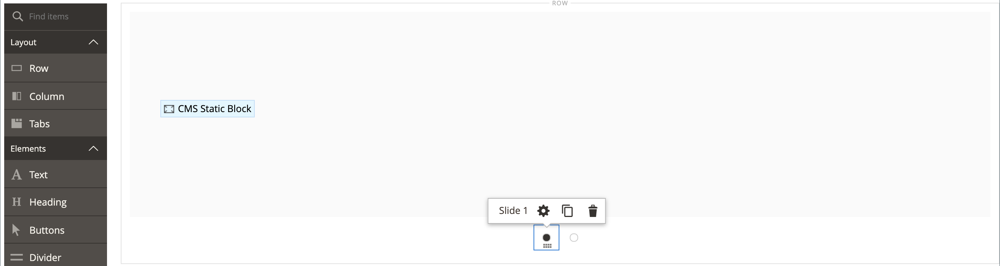

# 媒体 — 滑块

使用&#x200B;_Slider_&#x200B;内容类型向[[!DNL Page Builder] 舞台](workspace.md#stage)中添加图像幻灯片。 您可以上传新图像或从库或产品目录中选择现有图像。 可以将滑块设置为自动播放或使用导航按钮手动控制。 要将滑块与特定促销活动关联，请参阅[动态块](dynamic-block.md)。

店面上的{width="700" zoomable="yes"}

{{$include /help/_includes/page-builder-save-timeout.md}}

## 工具箱

在使用Slider内容类型时，可以添加和编辑单个幻灯片以及包含一个或多个幻灯片的滑块容器。 每张幻灯片都有自己的工具箱，用于在[!DNL Page Builder]舞台上设计幻灯片。

## 单个幻灯片工具箱

{width="500" zoomable="yes"}

| 工具 | 图标 | 描述 |
|--- |--- |--- |
| 移动 | {width="25"} | 将滑块移动到滑块上的另一个位置。 |
| （标签） | 幻灯片编号 | 标识当前幻灯片的编号。 |
| 设置 | {width="25"} | 打开&#x200B;_[!UICONTROL Edit Slide]_页面，您可以在其中更改当前幻灯片的属性。 |
| 复制 | {width="25"} | 制作当前幻灯片的副本。 |
| 移除 | {width="25"} | 从滑块中删除当前幻灯片。 |

{style="table-layout:auto"}

## 滑块工具箱

| 工具 | 图标 | 描述 |
|--- |--- |--- |
| 移动 | {width="25"} | 将滑块移动到舞台上的另一个位置。 |
| （标签） | [!UICONTROL Slider] | 标识滑块容器。 |
| 设置 | {width="25"} | 打开&#x200B;_[!UICONTROL Edit Slider]_页面，您可以在其中更改视频和容器的属性。 |
| 隐藏 | {width="25"} | 隐藏当前滑块。 |
| 显示 | {width="25"} | 显示隐藏的滑块。 |
| 复制 | {width="25"} | 制作滑块副本。 |
| 移除 | {width="25"} | 从舞台上删除滑块。 |

{style="table-layout:auto"}

{{$include /help/_includes/page-builder-hidden-element-note.md}}

## 添加单个幻灯片

1. 打开要放置滑块的页面、块或动态块，并展开&#x200B;**[!UICONTROL Content]**&#x200B;部分。

1. 在[!DNL Page Builder]面板中，展开&#x200B;**[!UICONTROL Media]**&#x200B;并将&#x200B;**[!UICONTROL Slider]**&#x200B;占位符拖到舞台上的行、列或选项卡中。

   在以下示例中，行的背景颜色为黄色(`#fffd16`)。

   {width="600" zoomable="yes"}

   滑块容器显示在舞台上，只有一张空幻灯片。

1. 单击滑块容器以显示[文本编辑器](../content-design/editor.md)并输入第一张幻灯片的内容。

   您还可以使用[Content](#content)设置包含更复杂的横幅内容。

1. 单击滑块底部的导航点以显示单个幻灯片的工具箱，然后选择&#x200B;_设置_ （{width="20"} ）图标。

   滑块有两个工具箱。 确保您使用的是底部的幻灯片工具箱。

1. 根据需要按照以下部分完成设置：

   - [[!UICONTROL Appearance]](#appearance)
   - [[!UICONTROL Background]](#background)
   - [[!UICONTROL Content]](#content)
   - [[!UICONTROL Search Engine Optimization]](#seo)
   - [[!UICONTROL Advanced]](#advanced)

1. 完成后，单击&#x200B;**[!UICONTROL Save]**&#x200B;以应用设置并返回到[!DNL Page Builder]工作区。

## 添加更多幻灯片

以下部分介绍了从单个幻灯片开始并创建具有特定产品功能和链接的响应式滑块的一系列步骤。 如果您还没有单独的幻灯片，请按照之前的说明将单独的幻灯片添加到舞台。

要添加幻灯片，请使用以下方法之一或组合：

### 方法1：复制现有幻灯片

通过复制已使用所需设置配置的幻灯片，可以节省时间。

1. 单击幻灯片下方的导航点以显示工具箱，然后选择&#x200B;_复制_ （{width="20"} ）图标。

   {width="500" zoomable="yes"}

1. 单击新幻灯片的导航点并显示工具箱，然后选择&#x200B;_设置_ （{width="20"} ）图标。

1. 根据以下部分根据需要修改设置：

   - [[!UICONTROL Appearance]](#appearance)
   - [[!UICONTROL Background]](#background)
   - [[!UICONTROL Content]](#content)
   - [[!UICONTROL Advanced]](#advanced)

1. 完成后，单击&#x200B;**[!UICONTROL Save]**&#x200B;以应用设置并返回到[!DNL Page Builder]工作区。

### 方法2：添加新的空白幻灯片

1. 将鼠标悬停在顶部的滑块容器上以显示工具箱，然后选择&#x200B;_添加_ （{width="20"} ）图标。

   {width="500" zoomable="yes"}

   带有自己的导航点和工具箱的新空白幻灯片将添加到滑块中，并显示在舞台上。

   {width="500" zoomable="yes"}

1. 单击新幻灯片的导航点并显示工具箱，然后选择&#x200B;_设置_ （{width="20"} ）图标。

1. 根据以下部分根据需要修改设置：

   - [[!UICONTROL Appearance]](#appearance)
   - [[!UICONTROL Background]](#background)
   - [[!UICONTROL Content]](#content)
   - [[!UICONTROL Advanced]](#advanced)

1. 完成后，单击右上角的&#x200B;**[!UICONTROL Save]**&#x200B;以关闭&#x200B;_[!UICONTROL Edit Slide]_页面。

### 在幻灯片上添加构件

您可以使用以下步骤将任何[小组件类型](../content-design/widgets.md#widget-types)添加到[!DNL Page Builder]阶段的幻灯片中：

1. [创建要在幻灯片上看到的构件](../content-design/widget-create.md)。

1. 打开要放置滑块的页面、块或动态块，并展开&#x200B;**[!UICONTROL Content]**&#x200B;部分。

1. 在[!DNL Page Builder]面板中，展开&#x200B;**[!UICONTROL Media]**&#x200B;并将&#x200B;**[!UICONTROL Slider]**&#x200B;占位符拖到舞台上的行、列或选项卡中。

1. 单击滑块容器以显示[文本编辑器](../content-design/editor.md)工具栏，然后单击&#x200B;_插入构件_ （{width="20"} ）图标。

1. 选择所需的&#x200B;**[!UICONTROL Widget Type]**。

1. 指定根据构件类型而不同的设置

   {width="600" zoomable="yes"}

1. 完成后，单击右上角的&#x200B;**[!UICONTROL Insert Widget]**。

1. 根据需要修改其他设置。

1. 完成后，单击右上角的&#x200B;**[!UICONTROL Save]**。

   {width="600" zoomable="yes"}

### 查看每张幻灯片

要在舞台上显示每张幻灯片，请单击当前显示幻灯片下方的下一个点。

{width="500" zoomable="yes"}

上例中的幻灯片有一个背景图像、一个透明的移动图像和一个从文本编辑器添加的内嵌图像。 此技术通过关闭背景图像并仅显示较小的内嵌图像在移动设备上运行良好。 本示例中的产品幻灯片具有以下附加设置：

| 选项 | 示例设置 |
|--- |--- |
| [!UICONTROL Appearance] | `Collage Right` |
| [!UICONTROL Background Color] | `#ffffff` （白色） |
| [!UICONTROL Background Image] | 此幻灯片上的图像已从产品页面中保存，并已上传到图片库。 |
| [!UICONTROL Mobile Background Image] | 移动设备背景图像是面积为10像素的透明图像。 使用空白图像进行移动可以有效地将标准背景图像替换为不可见图像。 |
| [!UICONTROL Background Size] | `Auto` |
| [!UICONTROL Message Text] | `Minerva LumaTech&trade; V-Tee` （居中对齐）插入的图像缩放为40% （居中对齐） |
| [!UICONTROL Link] | `Product` |
| [!UICONTROL Show Button] | `Always` |
| [!UICONTROL Button Text] | `Buy Now` |
| [!UICONTROL Show Overlay] | `Never Show` |
| [!UICONTROL Alignment] | `Center` （对齐按钮） |
| [!UICONTROL Border] | `Solid` |
| [!UICONTROL Border Color] | `#000000` （黑色） |
| [!UICONTROL Border Width] | `1 px` |

{style="table-layout:auto"}

## 更改单个幻灯片设置

1. 更改舞台上的滑块显示并查看要更改的幻灯片。

1. 在单个幻灯片工具箱中，选择&#x200B;_设置_ （{width="20"} ）图标，并根据需要完成设置，具体步骤如下：

1. 单击右上角的&#x200B;**[!UICONTROL Save]**&#x200B;以应用设置并返回到[!DNL Page Builder]工作区。

### [!UICONTROL Appearance]

1. 选择以下幻灯片放置类型之一：

   | 类型 | 描述 |
   | ---- | ----------- |
   | `Poster` | 将滑块容器中的幻灯片内容居中。 如果使用叠加，则会扩展滑块的完整宽度。 |
   | `Collage Left` | 将幻灯片内容放置在滑块容器左侧的已定义区域中。 如果使用叠加，则仅覆盖定义的区域。 |
   | `Collage Center` | 将幻灯片内容放置在已定义的区域中（位于滑块容器中央）。 如果使用叠加，则仅覆盖定义的区域。 |
   | `Collage Right` | 将幻灯片内容放置在滑块容器右侧的已定义区域中。 如果使用叠加，则仅覆盖定义的区域。 |

   {style="table-layout:auto"}

   {width="600" zoomable="yes"}

1. 输入&#x200B;**[!UICONTROL Slide Name]**。

   在编辑模式下工作时，幻灯片名称将作为工具提示显示在导航点上方。 从店面看不到幻灯片名称。

   导航中的{width="500" zoomable="yes"}

1. 输入幻灯片的&#x200B;**[!UICONTROL Minimum Height]**。

   最小高度可以是具有任何有效CSS单位（如`100px`、`50%`、`50em`、`100vh`）的数字，也可以是计算（如`100vh - 237px`）。

   例如，您可以设置幻灯片的最小高度以覆盖页面的整个高度，然后将背景图像和视频用于引人注目的设计选项。

   >[!NOTE]
   >
   >当将幻灯片设置为页面的整个高度(100vh)时，包含幻灯片的滑块也延伸页面的整个高度以适应幻灯片的高度。

## [!UICONTROL Background]

定义幻灯片的背景显示有许多选项。 您可以应用简单的颜色或背景图像，并管理更复杂的效果。

### [!UICONTROL Background Color]

通过选择色板、单击拾色器或输入有效的颜色名称或等效的十六进制值来指定背景颜色。 此设置确定行的背景颜色。 您还可以调整颜色的不透明度。

{width="200"}

可以通过以下三种方式之一设置值：

- 预定义的颜色名称，如`White`
- 颜色的十六进制颜色值，如`#ffffff`
- 颜色的rgba值，具有不透明度百分比，如`rgba(255, 255, 255, 0.75)`

如果要选择颜色，请单击&#x200B;_无颜色_&#x200B;框左侧的色板。

{width="600" zoomable="yes"}

如果单击颜色框再次打开拾色器，则滑块下方的框显示当前的红色、绿色、蓝色和Alpha值(rgba)。 最后一个数字以小数表示当前的不透明度百分比。 可以使用滑块调整不透明度，或输入所需的小数值。

{width="600" zoomable="yes"}

>[!NOTE]
>
>[!DNL Page Builder]还支持背景图像中的透明层，即&#x200B;_Alpha通道_，这些背景图像可用于创建具有不同不透明度的背景。

### [!UICONTROL Background Type]

背景类型可以是图像或视频。 [!DNL Page Builder]默认为`Image`并显示各种图像设置。 如果选择`Video`，[!DNL Page Builder]会将图像设置与视频设置进行交换。 以下各节将介绍两种背景类型设置。

{width="400"}

### 图像类型设置

如果将&#x200B;_[!UICONTROL Background Type]_设置为`Image`，请使用以下设置来定义背景图像显示。

带有背景图像的{width="600" zoomable="yes"}

- **[!UICONTROL Background Image]** — 如果需要，请使用提供的工具选择要应用于横幅的背景图像：

  | 工具 | 描述 |
  | ---- | ----------- |
  | [!UICONTROL Upload] | 将图像文件从本地计算机上载到图片库，然后将其应用为横幅的背景图像。 |
  | [!UICONTROL Select from Gallery] | 提示您从图库中选择现有图像作为横幅的背景图像。 |
  | {width="25"} | 允许您将图像拖到相机图块或浏览到本地文件系统中的图像。 |

  {style="table-layout:auto"}

- **[!UICONTROL Background Mobile Image]** — 如果需要，请使用相同的工具选择不同的背景图像以在移动设备上显示。

- **[!UICONTROL Background Size]** — 选择背景图像相对于横幅宽度的缩放方式：

  | 选项 | 描述 |
  | ------ | ----------- |
  | `Cover` | 背景图像覆盖横幅的全部宽度。 |
  | `Contain` | 背景图像被限制为内容区域的宽度。 |
  | `Auto` | 应用当前样式表中的大小。 |

  {style="table-layout:auto"}

  {width="400"}

- **[!UICONTROL Background Position]** — 选择背景图像相对于横幅的锚定方式：

  | 锚点 | 位置 |
  | ------------ | -------- |
  | `Top` | 左/中/右 |
  | `Center` | 左/中/右 |
  | `Bottom` | 左/中/右 |

  {style="table-layout:auto"}

  锚点类似于将图像附加到指定背景位置的横幅上的推针。

- **[!UICONTROL Background Repeat]** — 如果要重复背景图像以填充空间，请更改此设置`Yes`。

### 视频类型设置

如果将&#x200B;_背景类型_&#x200B;设置为`Video`，请使用以下设置来定义背景图像显示。

- **[!UICONTROL Video URL]** — 输入有效的视频URL。 有效的视频URL可以是指向的链接：

   - YouTube视频： `https://youtu.be/CoDhMRUUjeI`
   - Vimeo视频： `https://vimeo.com/190156113`
   - 有效的视频文件（建议使用`.mp4`）： `https://myvideos.com/spiral.mp4`

  {width="500"}

- **[!UICONTROL Overlay Color]** — 选择要将透明色调应用于视频的颜色。

- **[!UICONTROL Infinite Loop]** — 设置为`No`可使视频播放一次并停止。 当此选项设置为`Yes`（默认）时，视频将无限循环重复。

- **[!UICONTROL Lazy Load]** — 设置为`No`以使视频随页面加载，即使不可见也是如此。 当此选项设置为`Yes`（默认）时，仅当在屏幕上可见时，才会从源加载视频。

- **[!UICONTROL Play Only When Visible]** — 设置为`No`可让视频在加载后立即开始播放，无论视频是否可见。 当此选项设置为`Yes`（默认）时，视频仅在可见时开始播放。

- **[!UICONTROL Fallback Image]** — 如果需要，请指定在视频加载之前以及由于某个原因视频未加载时要在屏幕上显示的图像。

## [!UICONTROL Content]

您可以在舞台上直接修改幻灯片内容，或者在更改设置时进行修改。 这些设置提供了更复杂的内容功能，如幻灯片链接和按钮以及叠加图。 内容的位置反映了[外观](#appearance)版面设置。

### 舞台上的简单内容

1. 单击占位符或现有文本，然后输入要显示在幻灯片上的新文本。

   编辑器工具栏显示在文本框上方。

1. 使用编辑器工具栏输入文本和设置文本格式，以及插入元素，例如链接、图像和小组件。

   {width="500" zoomable="yes"}

### 设置中的复杂内容

1. 单击滑块底部的导航点以显示单个幻灯片的工具箱，然后选择&#x200B;_设置_ （{width="20"} ）图标。

1. 在&#x200B;_[!UICONTROL Content]_部分中，输入要与幻灯片一起显示的&#x200B;**[!UICONTROL Message Text]**。

1. 向下滚动到&#x200B;_[!UICONTROL Content]_部分，并使用&#x200B;**[!UICONTROL Message Text]**编辑器输入横幅文本并设置其格式。

   您还可以插入元素，如文本链接、图像和小组件。

1. 使用编辑器工具栏根据需要设置文本格式。

   此示例中的第一张幻灯片具有背景图像，但没有消息文本。 滑块上方的`Buy 3 Get 1 Free`文本位于文本容器中（稍后添加）。

1. 如果需要，请为幻灯片指定&#x200B;**[!UICONTROL Link]**。

   该链接是客户单击幻灯片区域时显示的目标页面。 您可以使用以下三种链接类型之一：

   - **[!UICONTROL URL]** — 链接到相对或完全限定的URL。

   - **[!UICONTROL Product]** — 根据产品名称或SKU标识目标页面。 根据部分名称或全名按名称搜索产品。 从搜索结果列表中选择产品。

     {width="600" zoomable="yes"}

   - **[!UICONTROL Category]** — 将目标页面标识为类别树中的特定类别或子类别。 根据部分名称或全名搜索类别。 从所显示树的展开部分中选择类别。

     {width="600" zoomable="yes"}

   - **[!UICONTROL Page]** — 将目标页面标识为特定内容页面。 根据部分名称或全名搜索页面。 从搜索结果列表中选择页面。

     {width="600" zoomable="yes"}

   

   从2.4.1版本开始，由于店面显示时出现问题，[!DNL Page Builder]不再支持链接幻灯片以及嵌套文本中的链接。 如果您在_[!UICONTROL Message Text]_中使用链接，则无法配置_[!UICONTROL Link]_选项。 如果您希望在整个幻灯片中使用单个链接，则可以从文本中删除所有链接。

   {width="300"}
   

   如果要阻止访客离开您的商店，请选中&#x200B;**[!UICONTROL Open in new tab]**&#x200B;复选框。 取消选中复选框后，链接的目标将在同一浏览器选项卡中打开，这可以有效地将访客导航到您商店之外的位置。

1. 如果需要，可添加按钮以提示客户关注该链接。

   幻灯片&#x200B;_外观_&#x200B;位置在文本下方放置单个链接或按钮。 完成要添加链接或按钮的属性。

   {width="600" zoomable="yes"}

   >[!NOTE]
   >
   >您还可以通过将[块](block.md)添加到横幅来使用多个按钮或链接。 为避免冲突，请将所有链接或按钮保留在单独的块中，并且不要将链接或按钮直接添加到横幅中。

   - 将&#x200B;**[!UICONTROL Show Button]**&#x200B;设置为以下项之一：

     | 选项 | 描述 |
     | ------ | ----------- |
     | `Always` | 幻灯片上始终会显示一个按钮。 |
     | `On Hover` | 仅当将鼠标悬停在幻灯片上时，才会显示一个按钮。 |
     | `Never Show` | 幻灯片上从不显示按钮。 |

     {style="table-layout:auto"}

   - 输入要显示在按钮上的&#x200B;**[!UICONTROL Button Text]**。

   - 将&#x200B;**[!UICONTROL Button Type]**&#x200B;设置为以下项之一：

     | 选项 | 描述 |
     | ------ | ----------- |
     | `Primary` | 从当前样式表中应用主按钮样式。 |
     | `Secondary` | 应用当前样式表中的辅助按钮样式（如果适用）。 |
     | `Link` | 创建超链接而不是按钮。 |

     {style="table-layout:auto"}

     当前主题中的按钮样式决定了按钮格式。 通常，主按钮的背景颜色比辅助按钮更突出。

1. 将&#x200B;**[!UICONTROL Show Overlay]**&#x200B;设置为以下项之一：

   | 选项 | 描述 |
   | ------ | ----------- |
   | `Always` | 该叠加始终可见。 |
   | `On Hover` | 叠加仅在悬停时显示。 |
   | `Never Show` | 叠加不可见。 |

   {style="table-layout:auto"}

   您可以使用叠加将背景颜色应用到由“外观”设置定义的活动内容区域。 幻灯片背景图像在幻灯片的整个宽度内保持可见。

   {width="600" zoomable="yes"}

   如果选择显示叠加，请设置&#x200B;**[!UICONTROL Overlay Color]**：

   - 单击&#x200B;_无颜色_&#x200B;样本，然后选择样本。
   - 在&#x200B;**[!UICONTROL Color]**&#x200B;字段中，输入有效的颜色名称或十六进制值。

   {width="600" zoomable="yes"}

## [!UICONTROL Search Engine Optimization] {#seo}

这些设置的文本对搜索引擎可见，并改进了为页面编制索引的方式。

- 对于&#x200B;**[!UICONTROL Alternative Text]**，输入要显示的数字辅助工具的&#x200B;_alt_&#x200B;文本说明。

  替代文本的使用是辅助功能的最佳实践，在某些区域是法律所要求的。 在HTML中，`alt`属性是`image`标记的子集： `<image title="tooltip" alt="description" src="image.jpg">`。

- 对于&#x200B;**[!UICONTROL Title Attribute]**，输入要作为鼠标悬停时的工具提示显示的文本。

  作为最佳实践，请选择一个描述性且关键词丰富的标题，以改进搜索引擎为图像编制索引的方式。 在HTML中，`title`属性是`image`标记的子集： `<image title="tooltip" alt="description" src="image.jpg">`。

## [!UICONTROL Advanced]

1. 要控制添加到幻灯片的内容的水平位置，请选择&#x200B;**[!UICONTROL Alignment]**：

   | 选项 | 描述 |
   | ------ | ----------- |
   | `Default` | 应用在当前主题的样式表中指定的对齐默认设置。 |
   | `Left` | 将内容沿幻灯片的左边框对齐，并允许指定的任何边距。 |
   | `Center` | 将内容对齐幻灯片的中心，并允许指定的任何边距。 |
   | `Right` | 将内容沿幻灯片的右边框对齐，并允许指定的任何边距。 |

   {style="table-layout:auto"}

1. 设置应用于幻灯片所有四面的&#x200B;**[!UICONTROL Border]**&#x200B;样式：

   | 选项 | 描述 |
   | ------ | ----------- |
   | `Default` | 应用关联样式表指定的默认边框样式。 |
   | `None` | 不提供幻灯片边框的任何可见指示。 |
   | `Dotted` | 容器边框显示为虚线。 |
   | `Dashed` | 容器边框显示为虚线。 |
   | `Solid` | 容器边框显示为实线。 |
   | `Double` | 容器边框显示为双线。 |
   | `Groove` | 容器边框显示为一条开槽线。 |
   | `Ridge` | 容器边框显示为脊线。 |
   | `Inset` | 容器边框显示为内嵌行。 |
   | `Outset` | 容器边框显示为外线。 |

   {style="table-layout:auto"}

1. 如果设置了除`None`之外的边框样式，请完成边框显示选项：

   {width="600" zoomable="yes"}

   | 选项 | 描述 |
   | ------ |------------ |
   | [!UICONTROL Border Color] | 通过选择色板、单击拾色器或输入有效的颜色名称或等效的十六进制值来指定颜色。 |
   | [!UICONTROL Border Width] | 输入边框线条宽度的像素数。 |
   | [!UICONTROL Border Radius] | 输入像素数，以定义用于使边框每个角倒圆角的半径大小。 |

   {style="table-layout:auto"}

1. （可选）从当前样式表中指定要应用于幻灯片的&#x200B;**[!UICONTROL CSS classes]**&#x200B;的名称。

   用空格分隔多个类名。

1. 输入&#x200B;**[!UICONTROL Margins and Padding]**&#x200B;的值（以像素为单位）以指定幻灯片的外部边距和内边距。

   在幻灯片中输入每个相应的值。

   | 容器区域 | 描述 |
   | -------------- | ----------- |
   | [!UICONTROL Margins] | 应用于幻灯片所有侧边外部边缘的空白空间量。 |
   | [!UICONTROL Padding] | 应用于幻灯片所有侧的内边缘的空白空间量。 |

   {style="table-layout:auto"}

## 添加滑块标题

如果要在滑块上方添加标题，只需在滑块上方添加[文本内容类型]即可。 然后，根据需要设置文本格式。

1. 在[!DNL Page Builder]面板中，展开&#x200B;**[!UICONTROL Elements]**&#x200B;并将&#x200B;**Text**&#x200B;占位符拖到舞台上的行、列或选项卡集中。

   拖动时，红色基准线将插入点标记在滑块上方。

   {width="600" zoomable="yes"}

1. 根据需要使用编辑器设置文本格式。

   {width="500" zoomable="yes"}

## 更改滑块设置

1. 将鼠标悬停在滑块容器上以显示主工具箱，然后选择&#x200B;_设置_ （{width="20"} ）图标。

   {width="500" zoomable="yes"}

1. 输入幻灯片的&#x200B;**[!UICONTROL Minimum Height]**。

   最小高度可以是具有任何有效CSS单位（如`100px`、`50%`、`50em`、`100vh`）的数字，也可以是计算（如`100vh - 237px`）。

   例如，您可以设置滑块的最小高度来拉伸页面的完整高度，从而为全页背景图像和视频提供引人注目的选项。

   {width="400"}

1. 如果希望滑块在页面加载时开始，请将&#x200B;**[!UICONTROL Autoplay]**&#x200B;设置为`Yes`并将&#x200B;**[!UICONTROL Autoplay Speed]**&#x200B;设置为幻灯片之间延迟的毫秒数。

   默认情况下，速度设置为4000毫秒，即4秒。 如果将自动播放设置为`No`，则默认情况下将显示第一张幻灯片，客户必须单击幻灯片导航（点或箭头）以按顺序显示下一张幻灯片。

   {width="600" zoomable="yes"}

1. 若要平滑从一张幻灯片到下一张幻灯片的过渡，请将&#x200B;**[!UICONTROL Fade]**&#x200B;设置为`Yes`。

   渐隐后，幻灯片似乎保持不变，但内容会从一个幻灯片平滑更改为另一个幻灯片。 如果没有淡化，您会看到从一张幻灯片到下一张幻灯片的水平移动。

   {width="600" zoomable="yes"}

1. 要在页面打开时无限期地重复幻灯片放映，请将&#x200B;**[!UICONTROL Infinite Loop]**&#x200B;设置为`Yes`。

1. 要选择滑块的导航控件类型，请执行以下操作：

   - 要在每张幻灯片的左右两侧包含&#x200B;_下一个_&#x200B;和&#x200B;_上一个_&#x200B;箭头，请将&#x200B;**[!UICONTROL Show Arrows]**&#x200B;设置为`Yes`。

   - 若要在滑块下方包含一组导航点，请将&#x200B;**[!UICONTROL Show Dots]**&#x200B;设置为`Yes`。

   {width="600" zoomable="yes"}

1. 根据需要完成[高级](#slider-advanced)滑块设置。

1. 完成后，单击&#x200B;**[!UICONTROL Save]**&#x200B;以应用设置并返回到[!DNL Page Builder]工作区。

### 高级 — 滑块 {#slider-advanced}

1. 若要控制幻灯片在父滑块容器中的位置，请选择&#x200B;**[!UICONTROL Alignment]**：

   | 选项 | 描述 |
   | ------ | ----------- |
   | `Default` | 应用在当前主题的样式表中指定的对齐默认设置。 |
   | `Left` | 沿滑块容器的左边框对齐幻灯片，并允许指定的任何边距。 |
   | `Center` | 将幻灯片对齐滑块容器的中心，并允许指定的任何边距。 |
   | `Right` | 沿滑块容器的右边框对齐幻灯片，并允许指定的任何边距。 |

   {style="table-layout:auto"}

1. 设置应用于滑块容器所有四个侧面的&#x200B;**[!UICONTROL Border]**&#x200B;样式：

   | 选项 | 描述 |
   | ------ | ----------- |
   | `Default` | 应用关联样式表指定的默认边框样式。 |
   | `None` | 不提供任何容器边框的可见指示。 |
   | `Dotted` | 容器边框显示为虚线。 |
   | `Dashed` | 容器边框显示为虚线。 |
   | `Solid` | 容器边框显示为实线。 |
   | `Double` | 容器边框显示为双线。 |
   | `Groove` | 容器边框显示为一条开槽线。 |
   | `Ridge` | 容器边框显示为脊线。 |
   | `Inset` | 容器边框显示为内嵌行。 |
   | `Outset` | 容器边框显示为外线。 |

   {style="table-layout:auto"}

1. 如果设置了除`None`之外的边框样式，请完成边框显示选项：

   | 选项 | 描述 |
   | ------ |------------ |
   | [!UICONTROL Border Color] | 通过选择色板、单击拾色器或输入有效的颜色名称或等效的十六进制值来指定颜色。 |
   | [!UICONTROL Border Width] | 输入边框线条宽度的像素数。 |
   | [!UICONTROL Border Radius] | 输入像素数，以定义用于使边框每个角倒圆角的半径大小。 |

   {style="table-layout:auto"}

1. （可选）从当前样式表中指定要应用于滑块容器的&#x200B;**[!UICONTROL CSS classes]**&#x200B;的名称。

   用空格分隔多个类名。

1. 输入&#x200B;**[!UICONTROL Margins and Padding]**&#x200B;的值（以像素为单位）以确定滑块容器的外边距和内边距。

   在图表中输入相应的值。

   | 容器区域 | 描述 |
   | -------------- | ----------- |
   | [!UICONTROL Margins] | 应用于容器所有边的外边缘的空白空间量。 |
   | [!UICONTROL Padding] | 应用于容器所有边的内边缘的空白空间量。 |

   {style="table-layout:auto"}

## 测试滑块

1. 打开已包含滑块的页面，将&#x200B;**[!UICONTROL Enable Page]**&#x200B;设置为`Yes`。

1. 单击右上角的&#x200B;**[!UICONTROL Save]**&#x200B;箭头并选择&#x200B;**[!UICONTROL Save & Close]**。

1. 在&#x200B;_页面_&#x200B;网格中查找该页面，并在&#x200B;**[!UICONTROL View]**&#x200B;列中选择&#x200B;_[!UICONTROL Action]_。

   {width="600" zoomable="yes"}

   预览滑块时，请调整窗口大小，以便查看它在移动设备上的显示方式。

   {width="400" zoomable="yes"}

<!-- Last updated from includes: 2023-09-11 14:30:19 -->
