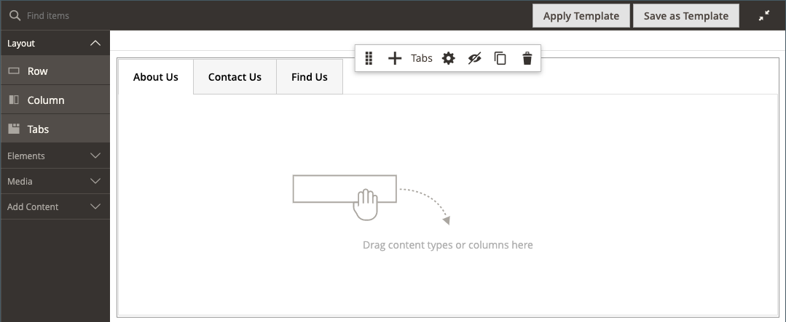
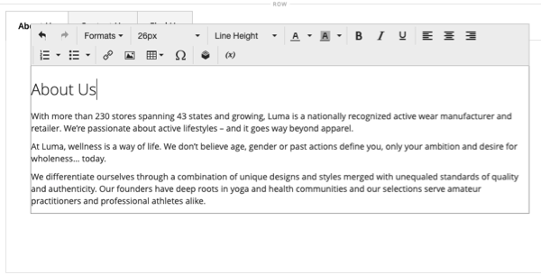
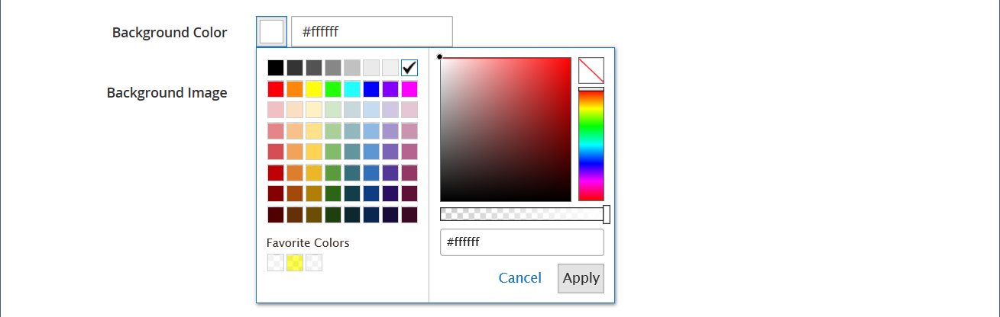

# 布局 — 选项卡

使用&#x200B;_选项卡_&#x200B;内容类型在[[!DNL Page Builder] 阶段](workspace.md#stage)中添加一组选项卡。 将制表符占位符从面板拖到舞台时，最初会显示一个默认制表符。 您可以添加更多选项卡以创建完整集合。 选项卡集的宽度由其父容器的宽度和填充设置决定。

{width="500" zoomable="yes"}

{{$include /help/_includes/page-builder-save-timeout.md}}

## 工具箱

在使用&#x200B;_选项卡_&#x200B;内容类型时，您可以添加和编辑单个选项卡以及包含一个或多个选项卡的选项卡容器。 每个选项卡都有自己的工具箱，用于在[!DNL Page Builder]阶段设计选项卡。

### 单个选项卡工具箱

{width="500" zoomable="yes"}

| 工具 | 图标 | 描述 |
|--- |--- |--- |
| 移动 | {width="25"} | 选项卡标签旁边的此控件用于将单个选项卡移动到选项卡集中的另一个位置。 |
| 设置 | {width="25"} | 打开“编辑选项卡”页面，您可以在该页面中更改各个选项卡的属性。 |
| 复制 | {width="25"} | 制作选项卡的副本。 |
| 移除 | {width="25"} | 从选项卡集中删除选项卡。 |

{style="table-layout:auto"}

### 选项卡容器工具箱

{width="500" zoomable="yes"}

| 工具 | 图标 | 描述 |
|--- |--- |--- |
| 移动 | {width="25"} | 将这组选项卡移至父容器中网格上的另一个位置。 |
| 添加 | {width="25"} | 向选项卡集添加选项卡。 |
| （标签） | [!UICONTROL Tabs] | 将当前容器标识为选项卡集。 将鼠标悬停在容器的顶部边框上可查看工具箱。 |
| 设置 | {width="25"} | 打开“编辑”选项卡页面，您可以在该页面更改容器的属性。 |
| 隐藏 | {width="25"} | 隐藏选项卡容器。 |
| 显示 | {width="25"} | 显示隐藏的选项卡容器。 |
| 复制 | {width="25"} | 复制当前选项卡。 |
| 移除 | {width="25"} | 从舞台中删除当前选项卡集。 |

{style="table-layout:auto"}

{{$include /help/_includes/page-builder-hidden-element-note.md}}

## 添加单个选项卡

1. 在&#x200B;_[!UICONTROL Layout]_下的[!DNL Page Builder]面板中，将&#x200B;**[!UICONTROL Tabs]**占位符直接拖到舞台上，或拖到舞台上的行或列上。

   {width="600" zoomable="yes"}

1. 单击&#x200B;**[!UICONTROL Tab 1]**&#x200B;标签以显示单个选项卡工具箱，然后选择&#x200B;_设置_ （{width="20"} ）图标。

1. 输入要用作标签的&#x200B;**[!UICONTROL Tab Name]**。

   {width="600" zoomable="yes"}

1. 如果需要，请输入选项卡的&#x200B;**[!UICONTROL Minimum Height]**。

   此值可以是具有任何有效CSS单位（如`100px`、`50%`、`50em`、`100vh`）的数字，也可以是计算（如`100vh - 237px`）。

1. 选择&#x200B;**[!UICONTROL Vertical Alignment]**&#x200B;设置以对齐添加到选项卡的任何内容容器（“顶部”、“中心”或“底部”）。

1. 如果需要，请按照以下部分设置其他选项：

   - [[!UICONTROL Background]][background]
   - [[!UICONTROL Advanced]][advanced]

1. 单击右上角的&#x200B;**[!UICONTROL Save]**&#x200B;以应用设置并返回到[!DNL Page Builder]工作区。

## 添加一组选项卡

以下步骤从单个选项卡开始，并在选项卡容器中创建一组三个选项卡。 如果您还没有单独的选项卡，请按照之前的说明将单个选项卡添加到舞台。

1. 将鼠标悬停在选项卡容器上以显示工具箱，然后选择&#x200B;_添加_ （{width="20"} ）图标。

1. 单击&#x200B;**[!UICONTROL Tab 2]**&#x200B;标签以显示光标，并为选项卡输入您自己的标签。

1. 再次单击舞台上的第二个选项卡，然后选择&#x200B;_复制_ （{width="20"} ）图标。

1. 单击YourName **[!UICONTROL Copy]**&#x200B;标签以显示光标，并为第三个选项卡输入您自己的标签。

{width="600" zoomable="yes"}

## 在集中移动选项卡

1. 单击要移动的选项卡。

1. 选择选项卡标签文本前显示的&#x200B;_移动_ （{width="20"} ）图标，并将其拖动到选项卡集内的新位置。

## 将内容添加到选项卡

您可以像对行一样对选项卡使用任何内容类型。 使用以下步骤添加文本内容类型作为示例。

1. 单击要在其中添加内容的选项卡。

1. 在[!DNL Page Builder]面板中，展开&#x200B;**[!UICONTROL Elements]**&#x200B;并将&#x200B;**Text**&#x200B;占位符拖到选项卡中。

1. 在编辑器中输入或粘贴一些文本，并根据需要使用编辑器工具栏设置格式。

   有关使用文本内容类型的详细信息，请参阅[元素 — 文本](text.md)。

   {width="500" zoomable="yes"}

1. 单击右上角的&#x200B;**[!UICONTROL Save]**。

## 更改单个选项卡设置

1. 将鼠标悬停在单个选项卡上以显示工具箱，然后选择&#x200B;_设置_ （ {width="20"} ）图标。

1. 如果需要，请更改选项卡的任何基本设置：

   - **[!UICONTROL Tab Name]** — 输入选项卡标签的修订文本。 您还可以直接在舞台上修改标签。

   - **[!UICONTROL Minimum Height]** — 如果要覆盖自动高度，请输入像素。 例如，您可以设置与背景图像高度匹配的最小高度，以确保完整图像可见。

   - **[!UICONTROL Vertical Alignment]** — 选择添加到选项卡的内容容器的垂直位置。

1. 使用以下部分根据需要更改其他设置，以了解详细信息。

1. 完成后，单击&#x200B;**[!UICONTROL Save]**&#x200B;以应用设置并返回到[!DNL Page Builder]工作区。

### 背景

- **[!UICONTROL Background Color]** — 通过选择色板、单击拾色器或输入有效的颜色名称或等效的十六进制值来指定背景颜色。 此设置确定行的背景颜色。 您还可以调整颜色的不透明度。

  {width="200"}

  您可以通过三种方式输入值：

   - 预定义的颜色名称，如`White`

   - 颜色的十六进制颜色值，如`#ffffff`

   - 颜色的rgba值，具有不透明度百分比，如`rgba(255, 255, 255, 0.75)`

  如果要选择颜色，请单击&#x200B;_无颜色_&#x200B;框左侧的色板。

  {width="600" zoomable="yes"}

  如果单击颜色框再次打开拾色器，则滑块下方的框显示当前的红色、绿色、蓝色和Alpha值(rgba)。 最后一个数字以小数表示当前的不透明度百分比。 可以使用滑块调整不透明度，或输入所需的小数值。

  {width="600" zoomable="yes"}

  >[!NOTE]
  >
  >[!DNL Page Builder]还支持背景图像中的透明层，即&#x200B;_Alpha通道_，这些背景图像可用于创建具有不同不透明度的背景。

- **[!UICONTROL Background Image]** — 如果需要，请使用提供的工具选择要应用于选项卡的背景图像：

  | 工具 | 描述 |
  |--- |--- |
  | [!UICONTROL Upload] | 将图像文件从本地计算机上载到图片库，然后将其作为选项卡的背景图像应用。 |
  | [!UICONTROL Select from Gallery] | 提示您从图库中选择现有图像作为选项卡的背景图像。 |
  | {width="25"} | 允许您将图像拖到相机图块或浏览到本地文件系统中的图像。 |

  {style="table-layout:auto"}

- **[!UICONTROL Background Mobile Image]** — 如果需要，请使用相同的工具选择不同的背景图像以在移动设备上显示。

- **[!UICONTROL Background Size]** — 选择相对于选项卡宽度的背景图像缩放方式：

  | 选项 | 描述 |
  |--- |--- |
  | `Cover` | 背景图像覆盖选项卡的全部宽度。 |
  | `Contain` | 背景图像仅限于选项卡区域的宽度。 |
  | `Auto` | 应用当前样式表中的大小。 |

  {style="table-layout:auto"}

- **[!UICONTROL Background Position]** — 选择与选项卡相关的背景图像锚定方式： `Top Left` / `Top Center` / `Top Right` / `Center Left` / `Center` / `Center Right` / `Bottom Left` / `Bottom Center` / `Bottom Right`

- **[!UICONTROL Background Attachment]** — 选择附件类型以确定背景图像相对于滚动页面的移动方式：

  | 选项 | 描述 |
  | --- | --- |
  | `Scroll` | 当页面滚动时，将同步附加的背景图像以向下移动。 |
  | `Fixed` | （不适用于移动设备）当容器在图像上滚动并且固定在指定的背景位置时，背景图像不会移动。 |

  {style="table-layout:auto"}

- **[!UICONTROL Background Repeat]** — 设置为`Yes`可重复背景图像以填充选项卡中的可用空间。

### 高级

- 要控制添加到选项卡的内容容器的水平对齐方式，请选择&#x200B;**[!UICONTROL Alignment]** 。

  | 选项 | 描述 |
  | --- | --- |
  | `Default` | 应用在当前主题的样式表中指定的对齐默认设置。 |
  | `Left` | 将内容容器沿选项卡的左边框对齐，并允许使用指定的任何边距。 |
  | `Center` | 将内容容器对齐选项卡的中央，并允许使用指定的任何边距。 |
  | `Right` | 将内容容器沿选项卡的右边框对齐，并允许使用指定的任何边距。 |

  {style="table-layout:auto"}

- 设置应用于选项卡容器所有四个侧面的&#x200B;**[!UICONTROL Border]**&#x200B;样式：

  | 选项 | 描述 |
  | --- | --- |
  | `Default` | 应用关联样式表指定的默认边框样式。 |
  | `None` | 不提供任何容器边框的可见指示。 |
  | `Dotted` | 容器边框显示为虚线。 |
  | `Dashed` | 容器边框显示为虚线。 |
  | `Solid` | 容器边框显示为实线。 |
  | `Double` | 容器边框显示为双线。 |
  | `Groove` | 容器边框显示为一条开槽线。 |
  | `Ridge` | 容器边框显示为脊线。 |
  | `Inset` | 容器边框显示为内嵌行。 |
  | `Outset` | 容器边框显示为外线。 |

  {style="table-layout:auto"}

- 如果设置了除`None`之外的边框样式，请完成边框显示选项：

  {width="600" zoomable="yes"}

  | 选项 | 描述 |
  | ------ |------------ |
  | [!UICONTROL Border Color] | 通过选择色板、单击拾色器或输入有效的颜色名称或等效的十六进制值来指定颜色。 |
  | [!UICONTROL Border Width] | 输入边框线条宽度的像素数。 |
  | [!UICONTROL Border Radius] | 输入像素数，以定义用于使边框每个角倒圆角的半径大小。 |

  {style="table-layout:auto"}

  以下示例中的行的边框半径为15。

  边框半径为15](./assets/pb-settings-border-radius-15.png){width="500"}的![行

- （可选）从当前样式表中指定要应用于列容器的&#x200B;**[!UICONTROL CSS classes]**&#x200B;的名称。

  用空格分隔多个类名。

- 输入&#x200B;**[!UICONTROL Margins and Padding]**&#x200B;的值（以像素为单位）以指定列的外部边距和内边距。

  在选项卡容器图表中输入每个相应的值。

  | 容器区域 | 描述 |
  | -------------- | ---------- |
  | [!UICONTROL Margins] | 应用于容器所有边的外边缘的空白空间量。 选项： `Top` / `Right` / `Bottom` / `Left` |
  | [!UICONTROL Padding] | 应用于容器所有边的内边缘的空白空间量。 选项： `Top` / `Right` / `Bottom` / `Left` |

  {style="table-layout:auto"}

## 更改选项卡集设置

1. 将鼠标悬停在选项卡集容器的顶部边框上以显示工具箱，然后选择&#x200B;_设置_ （ {width="20"} ）图标。

1. 如果需要，请更改&#x200B;**[!UICONTROL Default Active Tab]**。

   在集中选择加载页面时要处于活动状态的选项卡。

1. 如果要覆盖选项卡集的自动高度，请输入&#x200B;**[!UICONTROL Minimum Height]**（以像素为单位）。

1. 若要沿选项卡集顶部定位导航选项卡，请选择&#x200B;**[!UICONTROL Tab Navigation Alignment]** （`Left`、`Center`或`Right`）。

   {width="500" zoomable="yes"}

1. 为选项卡集设置高级选项：

   - 若要控制标签集在父容器中的位置，请选择&#x200B;**[!UICONTROL Alignment]**：

     | 选项 | 描述 |
     | ------ | ---------- |
     | `Default` | 应用在当前主题的样式表中指定的对齐默认设置。 |
     | `Left` | 沿父容器的左边框对齐选项卡集，并允许指定的任何边距。 |
     | `Center` | 将选项卡集对齐父容器的中心，并允许指定的任何边距。 |
     | `Right` | 沿父容器的右边框对齐选项卡集，并允许指定的任何边距。 |

     {style="table-layout:auto"}

   - 设置应用于选项卡容器所有四个侧面的&#x200B;**[!UICONTROL Border]**&#x200B;样式：

     | 选项 | 描述 |
     | ------ | ---------- |
     | `Default` | 应用关联样式表指定的默认边框样式。 |
     | `None` | 不提供任何容器边框的可见指示。 |
     | `Dotted` | 容器边框显示为虚线。 |
     | `Dashed` | 容器边框显示为虚线。 |
     | `Solid` | 容器边框显示为实线。 |
     | `Double` | 容器边框显示为双线。 |
     | `Groove` | 容器边框显示为一条开槽线。 |
     | `Ridge` | 容器边框显示为脊线。 |
     | `Inset` | 容器边框显示为内嵌行。 |
     | `Outset` | 容器边框显示为外线。 |

     {style="table-layout:auto"}

   - 如果设置了除`None`之外的边框样式，请完成边框显示选项：

     | 选项 | 描述 |
     | ------ |------------ |
     | [!UICONTROL Border Color] | 通过选择色板、单击拾色器或输入有效的颜色名称或等效的十六进制值来指定颜色。 |
     | [!UICONTROL Border Width] | 输入边框线条宽度的像素数。 |
     | [!UICONTROL Border Radius] | 输入像素数，以定义用于使边框每个角倒圆角的半径大小。 |

     {style="table-layout:auto"}

   - （可选）从当前样式表中指定要应用于选项卡容器的&#x200B;**[!UICONTROL CSS classes]**&#x200B;的名称。

     用空格分隔多个类名。

   - 输入&#x200B;**[!UICONTROL Margins and Padding]**&#x200B;的值（以像素为单位）以确定制表符容器的外边距和内边距。

     在选项卡容器图表中输入相应的值。

     | 容器区域 | 描述 |
     | -------------- | ---------- |
     | [!UICONTROL Margins] | 应用于容器所有边的外边缘的空白空间量。 选项： `Top` / `Right` / `Bottom` / `Left` |
     | [!UICONTROL Padding] | 应用于容器所有边的内边缘的空白空间量。 选项： `Top` / `Right` / `Bottom` / `Left` |

     {style="table-layout:auto"}

1. 完成后，单击&#x200B;**[!UICONTROL Save]**&#x200B;以应用设置并返回到[!DNL Page Builder]工作区。

[background]: #background
[advanced]: #advanced
