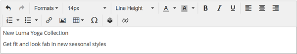

# 元素 — 文本

使用&#x200B;_文本_&#x200B;内容类型在[[!DNL Page Builder] 阶段](workspace.md#stage)中添加包含WYSIWYG (“What You See Is What You Get”)编辑器的文本容器。 此外，您还可以从编辑器工具栏向文本添加链接、图像、[变量](../systems/variables-predefined.md)和小部件。

{width="700"}

{{$include /help/_includes/page-builder-save-timeout.md}}

## 文本编辑器工具

您可以直接从舞台或设置页面访问文本编辑器。 直接对舞台所做的更改会自动保存。 有关详细信息，请参阅[使用编辑器](../content-design/editor.md)。

{width="600"}

## 文本容器工具箱

{width="600"}

| 工具 | 图标 | 描述 |
| --------- | --------------------- | -------------- |
| 移动 | {width="25"} | 将文本容器移至页面上的另一个有效位置。 |
| （标签） | 文本 | 将当前容器标识为文本元素。 |
| 设置 | {width="25"} | 在编辑模式下打开文本容器属性。 |
| 隐藏 | {width="25"} | 隐藏文本容器。 |
| 显示 | {width="25"} | 显示隐藏的文本容器。 |
| 复制 | {width="25"} | 复制文本容器。 |
| 移除 | {width="25"} | 从舞台中删除文本容器及其内容。 |

{style="table-layout:auto"}

{{$include /help/_includes/page-builder-hidden-element-note.md}}

## 添加文本

1. 在[!DNL Page Builder]面板中，展开&#x200B;**[!UICONTROL Elements]**&#x200B;并将&#x200B;**[!UICONTROL Text]**&#x200B;占位符拖到舞台上的行、列或选项卡集中。

   {width="600" zoomable="yes"}

1. 根据需要使用编辑器输入文本并设置其格式。

   有关详细信息，请参阅[使用编辑器](../content-design/editor.md)。

   包含内容的{width="600"}

## 创建链接

通过编辑器中的“插入链接”按钮，可以轻松添加指向图库中图像的超链接。 但是，如果您提前设置了URL，则它也可用于在文本中创建内联链接。 与“小组件”按钮不同，“插入/编辑”链接按钮未与应用商店中的页面、产品或类别集成。

要为电话号码或电子邮件创建链接，请参阅[添加自定义变量](../systems/variables-custom.md)。

1. 在店面中，导航到将成为链接的目标目标的页面，并复制链接信息。

   您可以使用完全限定的URL或省略对商店域的引用的相对URL。

   完整URL - `https://mystore.com/women/tops-women/tees-women.html`

   相对URL - `../women/tops-women/tees-women.html`

1. 选择编辑器空间中的文本，然后单击编辑器工具栏上的&#x200B;_插入/编辑链接_ （{width="20"} ）。

   {width="500" zoomable="yes"}

1. 对于&#x200B;**[!UICONTROL URL]**，输入您准备的相对链接。

1. 将&#x200B;**[!UICONTROL Target]**&#x200B;设置为`None`。

   此设置将在同一浏览器窗口中打开页面，而不是打开新选项卡。

1. 对于&#x200B;**[!UICONTROL Title]**，输入`Shop Tees`。

   `Title`链接属性被某些浏览器用作工具提示。

1. 要保存链接并返回[!DNL Page Builder]工作区，请单击&#x200B;**[!UICONTROL OK]**。

   {width="500" zoomable="yes"}

## 插入图像

1. 将光标置于要插入图像的文本中。

1. 单击编辑器工具栏上的&#x200B;_插入/编辑图像_ （{width="20"} ）。

1. 对于&#x200B;**[!UICONTROL Source]**，单击搜索图标以使用媒体存储来查找和选择图像。

1. 对于&#x200B;**[!UICONTROL Image Description]**，输入图像的描述性文本。

   此文本填充图像的`alt`链接属性，并被某些浏览器用于辅助功能。

1. 输入宽度和高度&#x200B;**[!UICONTROL Dimensions]**（以像素为单位），以便在页面上呈现图像。

   保持选中&#x200B;**[!UICONTROL Constrain proportions]**&#x200B;复选框以自动保持图像的纵横比。

1. 要插入图像并返回[!DNL Page Builder]工作区，请单击&#x200B;**[!UICONTROL OK]**。

## 更改文本设置

1. 将鼠标悬停在文本容器上以显示工具箱，然后选择&#x200B;_设置_ （ {width="20"} ）图标。

   >[!NOTE]
   >
   >由于文本容器紧密嵌套在另一个容器中，因此请确保您具有正确的工具箱。

1. 根据需要更新内容。

1. 根据需要更新&#x200B;_[!UICONTROL Advanced]_设置。

   - 若要控制文本在父容器中的位置，请选择&#x200B;**[!UICONTROL Alignment]**：

     | 选项 | 描述 |
     | ------ |------------ |
     | `Default` | 应用在当前主题的样式表中指定的对齐默认设置。 |
     | `Left` | 将列表沿父容器的左边框对齐，并允许使用指定的任何边距。 |
     | `Center` | 将列表与父容器的中心对齐，并允许使用指定的任何边距。 |
     | `Right` | 沿父容器的右边框对齐块，并允许指定的任何边距。 |

     {style="table-layout:auto"}

   - 设置应用于文本容器所有四边的&#x200B;**[!UICONTROL Border]**&#x200B;样式：

     | 选项 | 描述 |
     | ------ |------------ |
     | `Default` | 应用关联样式表指定的默认边框样式。 |
     | `None` | 不提供任何容器边框的可见指示。 |
     | `Dotted` | 容器边框显示为虚线。 |
     | `Dashed` | 容器边框显示为虚线。 |
     | `Solid` | 容器边框显示为实线。 |
     | `Double` | 容器边框显示为双线。 |
     | `Groove` | 容器边框显示为一条开槽线。 |
     | `Ridge` | 容器边框显示为脊线。 |
     | `Inset` | 容器边框显示为内嵌行。 |
     | `Outset` | 容器边框显示为外线。 |

     {style="table-layout:auto"}

   - 如果设置了除`None`之外的边框样式，请完成边框显示选项：

     | 选项 | 描述 |
     | ------ |------------ |
     | [!UICONTROL Border Color] | 通过选择色板、单击拾色器或输入有效的颜色名称或等效的十六进制值来指定颜色。 |
     | [!UICONTROL Border Width] | 输入边框线条宽度的像素数。 |
     | [!UICONTROL Border Radius] | 输入像素数，以定义用于使边框每个角倒圆角的半径大小。 |

     {style="table-layout:auto"}

   - （可选）从当前样式表中指定要应用于容器的&#x200B;**[!UICONTROL CSS classes]**&#x200B;的名称。

     用空格分隔多个类名。

   - 输入&#x200B;**[!UICONTROL Margins and Padding]**&#x200B;的值（以像素为单位）以确定文本容器的外边距和内边距。

     在图表中输入相应的值。

     | 容器区域 | 描述 |
     | -------------- |------------ |
     | [!UICONTROL Margins] | 应用于容器所有边的外边缘的空白空间量。 选项： `Top` / `Right` / `Bottom` / `Left` |
     | [!UICONTROL Padding] | 应用于容器所有边的内边缘的空白空间量。 选项： `Top` / `Right` / `Bottom` / `Left` |

     {style="table-layout:auto"}

1. 完成后，单击&#x200B;**[!UICONTROL Save]**&#x200B;以应用设置并返回到[!DNL Page Builder]工作区。

<!-- Last updated from includes: 2023-09-11 14:30:19 -->
