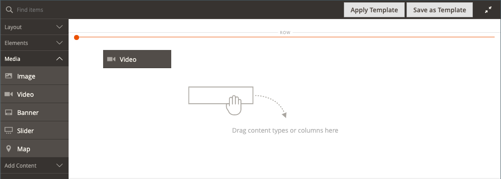

# 媒体 — 视频

使用&#x200B;_视频_&#x200B;内容类型将托管在[YouTube][1]或[Vimeo][2]上的视频添加到[[!DNL Page Builder] 阶段](workspace.md#stage)。 将视频嵌入到页面或块或者产品和类别描述中很容易。

店面主页上的{width="700" zoomable="yes"}

{{$include /help/_includes/page-builder-save-timeout.md}}

## 视频工具箱

{width="600" zoomable="yes"}

| 工具 | 图标 | 描述 |
|--- |--- |--- |
| 移动 | {width="25"} | 将视频移动到舞台上的另一个位置。 |
| （标签） | [!UICONTROL Video] | 将当前内容容器标识为视频。 将鼠标悬停在图像容器上可查看工具箱。 |
| 设置 | {width="25"} | 打开&#x200B;_[!UICONTROL Edit Video]_&#x200B;页面，您可以在其中更改视频和容器的属性。 |
| 隐藏 | {width="25"} | 隐藏当前视频。 |
| 显示 | {width="25"} | 显示隐藏的视频。 |
| 复制 | {width="25"} | 制作视频的副本。 |
| 移除 | {width="25"} | 从舞台上删除视频。 |

{style="table-layout:auto"}

{{$include /help/_includes/page-builder-hidden-element-note.md}}

## 添加视频

1. 在开始之前，请导航到要嵌入的[YouTube][1]或[Vimeo][2]视频，并复制链接。

   作为替代方法，您还可以将直接链接复制到有效的视频文件。 有关有效链接，请参阅[基本视频设置](#basic-video-settings)。

1. 在[!DNL Commerce]管理员中，返回到要添加视频的[!DNL Page Builder]工作区。

1. 在[!DNL Page Builder]面板中，展开&#x200B;**[!UICONTROL Media]**&#x200B;并将&#x200B;**[!UICONTROL Video]**&#x200B;占位符拖到舞台上。

   {width="600" zoomable="yes"}

1. 将鼠标悬停在视频容器上以显示工具箱，然后选择&#x200B;_设置_ （ {width="20"} ）图标。

1. 对于&#x200B;**[!UICONTROL Video URL]**，粘贴您复制的视频的URL。

   此示例中使用的[!DNL Page Builder]视频的URL是： `https://www.youtube.com/watch?v=Y0KNS7C5dZA`。

1. 要限制视频的&#x200B;**[!UICONTROL Maximum Width]**，请输入最大宽度（以像素为单位）。

   如果留为空白，则视频宽度与容器允许的宽度一样宽，允许使用边距和边距。

1. 单击右上角的&#x200B;**[!UICONTROL Save]**&#x200B;以应用设置并返回到[!DNL Page Builder]工作区。

## 更改视频设置

1. 将鼠标悬停在视频容器上以显示工具箱，然后选择&#x200B;_设置_ （ {width="20"} ）图标。

1. 根据以下部分修改设置：

   - [基本](#basic-video-settings)
   - [高级](#advanced)

1. 单击右上角的&#x200B;**[!UICONTROL Save]**&#x200B;以应用设置并返回到[!DNL Page Builder]工作区。

### 基本视频设置

1. 若要更改当前视频，请更新&#x200B;**[!UICONTROL Video URL]**。

   请输入有效的视频URL。 有效的视频URL可以是指向的链接：

   - YouTube视频： `https://youtu.be/CoDhMRUUjeI`
   - Vimeo视频： `https://vimeo.com/190156113`
   - 有效的视频文件（建议使用`.mp4`）： `https://myvideos.com/spiral.mp4`

1. 要更改店面中视频允许的宽度，请输入新的&#x200B;**[!UICONTROL Maximum Width]**&#x200B;像素。

   如果留为空白，视频会扩展容器的完整宽度，并减小边距和边距的容差。

1. 要在页面加载后自动启动视频，请将&#x200B;**[!UICONTROL Autoplay]**&#x200B;设置为`Yes`。

   如果自动播放设置为`Yes`，则根据策略在播放时将视频静音。 但是，即使使用此设置，移动设备也无法自动播放您的视频。 有关这些策略的更多信息，请参阅以下开发人员资源：

   - 来自Vimeo的[自动播放策略](https://vimeo.zendesk.com/hc/en-us/articles/115004485728-Autoplaying-and-looping-embedded-videos)
   - 来自Google (Chrome/YouTube)的[自动播放策略](https://developer.chrome.com/blog/autoplay/)
   - [本地视频的自动播放策略](https://developer.mozilla.org/en-US/docs/Web/Media/Autoplay_guide)

   如果自动播放设置为`No`，则视频仅按用户要求播放。

### [!UICONTROL Advanced]

1. 要控制视频在容器中的水平位置，请选择&#x200B;**[!UICONTROL Alignment]**：

   | 选项 | 描述 |
   | ------ | ----------- |
   | `Default` | 应用在当前主题的样式表中指定的对齐默认设置。 |
   | `Left` | 沿视频容器的左边框对齐内容，并允许使用指定的任何边距。 |
   | `Center` | 将内容与视频容器的中心对齐，并允许指定的任何边距。 |
   | `Right` | 沿视频容器的右边框对齐内容，并允许指定的任何边距。 |

   {style="table-layout:auto"}

- 设置应用于视频容器所有四个侧面的&#x200B;**[!UICONTROL Border]**&#x200B;样式：

  | 选项 | 描述 |
  | ------ | ----------- |
  | `Default` | 应用关联样式表指定的默认边框样式。 |
  | `None` | 不提供任何容器边框的可见指示。 |
  | `Dotted` | 容器边框显示为虚线。 |
  | `Dashed` | 容器边框显示为虚线。 |
  | `Solid` | 容器边框显示为实线。 |
  | `Double` | 容器边框显示为双线。 |
  | `Groove` | 容器边框显示为一条开槽线。 |
  | `Ridge` | 容器边框显示为脊线。 |
  | `Inset` | 容器边框显示为内嵌行。 |
  | `Outset` | 容器边框显示为外线。 |

  {style="table-layout:auto"}

- 如果设置了除`None`之外的边框样式，请完成边框显示选项：

  {width="600" zoomable="yes"}

  | 选项 | 描述 |
  | ------ |------------ |
  | [!UICONTROL Border Color] | 通过选择色板、单击拾色器或输入有效的颜色名称或等效的十六进制值来指定颜色。 |
  | [!UICONTROL Border Width] | 输入边框线条宽度的像素数。 |
  | [!UICONTROL Border Radius] | 输入像素数，以定义用于使边框每个角倒圆角的半径大小。 |

  {style="table-layout:auto"}

- （可选）从当前样式表中指定要应用于视频容器的&#x200B;**[!UICONTROL CSS classes]**&#x200B;的名称。

  用空格分隔多个类名。

- 输入&#x200B;**[!UICONTROL Margins and Padding]**&#x200B;的值（以像素为单位）以指定视频容器的外边距和内边距。

  在视频容器图表中输入每个相应的值。

  | 容器区域 | 描述 |
  | -------------- | ----------- |
  | [!UICONTROL Margins] | 应用于容器所有边的外边缘的空白空间量。 |
  | [!UICONTROL Padding] | 应用于容器所有边的内边缘的空白空间量。 |

  {style="table-layout:auto"}

## 移动视频

1. 将鼠标悬停在视频容器上以显示工具箱，然后选择&#x200B;_移动_ （{width="20"} ）图标。

   {width="500" zoomable="yes"}

1. 选择视频并将其拖动到新位置，它正好位于红色指南的下方。

   {width="500" zoomable="yes"}

## 从舞台上删除视频

1. 将鼠标悬停在视频容器上以显示工具箱，然后选择&#x200B;_删除_ （）图标。

1. 提示确认时，单击&#x200B;**[!UICONTROL OK]**。

[1]: https://www.youtube.com/
[2]: https://vimeo.com/

<!-- Last updated from includes: 2023-09-11 14:30:19 -->
