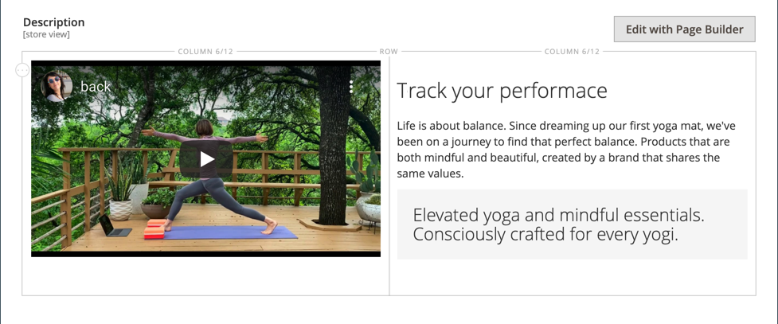
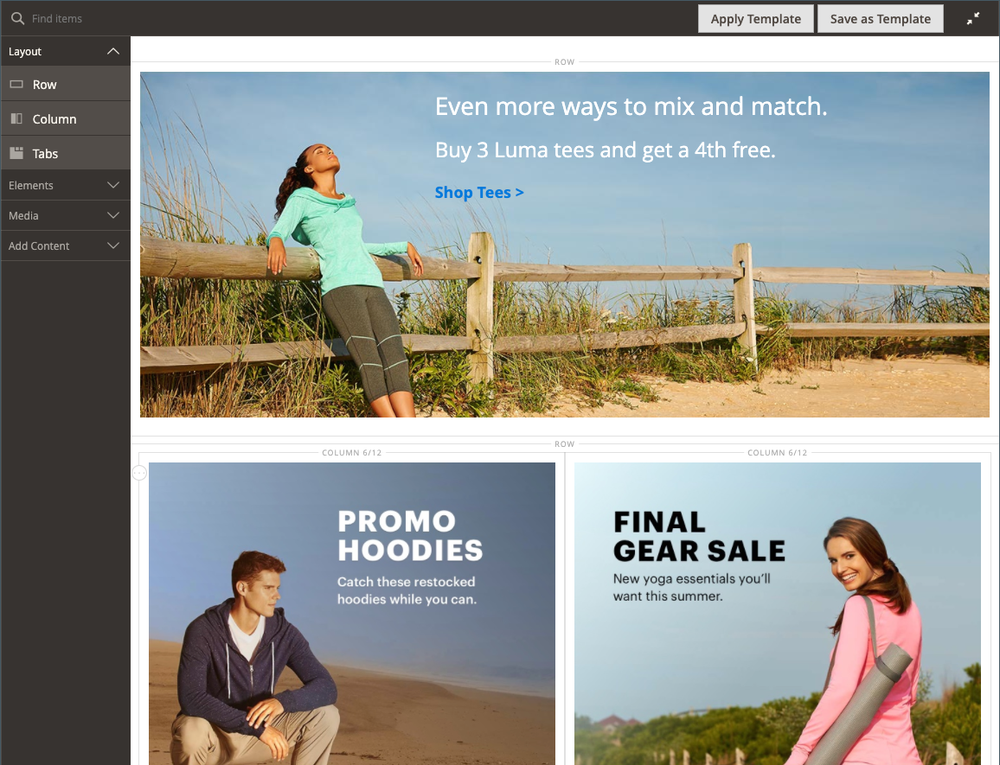

# [!DNL Page Builder] 工作区

时间 [[!DNL Page Builder] 已启用](setup.md)， _[!UICONTROL Content]_修改了部分和内容创建过程以利用高级 [!DNL Page Builder] CMS工具 [页面](../content-design/page-add.md)， [产品](../catalog/product-content.md) 和 [类别](../catalog/categories-content-settings.md) 页面， [个块](../content-design/block-add.md)、和 [动态块](../content-design/dynamic-blocks.md). 本部分包括_&#x200B;内容标题&#x200B;_字段、内容预览和轻松访问全屏 [!DNL Page Builder] 工作区。

![包含的内容部分 [!DNL Page Builder] 预览](./assets/pb-content-preview.png){width="700" zoomable="yes"}

## 内容标题

由于搜索引擎会查找第一级(H1)标题，因此添加第一级标题是一种确保页面正确编制索引的简单方法。

>[!NOTE]
>
>此 _[!UICONTROL Content Heading]_显示在页面顶部的字段是旧版字段，它支持使用之前创建的内容 [!DNL Commerce] 版本发布。 然而，它并不是的一部分 [!DNL Page Builder]. 此 [!UICONTROL Content Heading] 根据与当前主题关联的样式表格式化为H1标题。 它位于由定义的活动内容区域正上方 [!DNL Page Builder] 暂存。

为了更好地控制所有级别标题的位置和格式，建议您将 _[!UICONTROL Content Heading]_字段为空，请使用 [!DNL Page Builder] [标题](heading.md) 内容类型。

{width="700" zoomable="yes"}

## 预览

当您展开 _[!UICONTROL Content]_部分，并且存在使用以下内容创建的现有内容： [!DNL Page Builder]，它将显示内容在页面中的预览。 单击&#x200B;**[!UICONTROL Edit with Page Builder]**或在内容预览区域内打开 [!DNL Page Builder] 工作区，您可以在其中进行任何所需的更新。

{width="500" zoomable="yes"}

>[!NOTE]
>
>对于产品和类别表单，默认情况下将启用此内容预览，但可以禁用它。 如果性能因加载预览而受到影响，您可以在中禁用预览 [内容管理配置](../configuration-reference/general/content-management.md#advanced-content-tools) 设置。

## Stage

当您打开 [!DNL Page Builder] 在预览工作区中，舞台是主要工作区，您可以在其中创建和设置内容格式，甚至快速编辑实时内容。 舞台最初是空的，它提供了设计界面，您可以在其中从左侧面板拖动行、列和选项卡。

>[!NOTE]
>
>从2.4.1版本开始，内容编辑现在仅对由控制的所有区域进行全屏编辑 [!DNL Page Builder]—CMS页面、产品和类别页面、块和动态块。 全屏编辑将焦点放在您的内容上，并提供与店面用户体验更匹配的视图。

{width="600" zoomable="yes"}

{{$include /help/_includes/page-builder-save-timeout.md}}

## 视区

A _视区_ 是用户查看的网页的可见区域。 在全屏设计模式下，视区按钮将显示在 [!DNL Page Builder] 阶段，当站点用户在店面中看到内容时向您显示该内容。

{width="500" zoomable="yes"}

[!DNL Page Builder] 还定义视区的断点。 断点定义应用特定样式的最小和最大宽度。 此 [!DNL Page Builder] 视区提供以下内容断点：

- **桌面断点**—`min-width: 1024px`. 此断点将应用为测量1024像素和更宽的视区宽度定义的样式。
- **移动断点**—`max-width: 768px, min-width: 640px`. 这些断点应用为视区宽度定义的样式（介于768像素和640像素之间）。

[!DNL Page Builder] 视区提供两种功能： **_内容预览_** 和 **_断点设置_**.

### 内容预览

默认情况下， [!DNL Page Builder] 提供了两个视区预览：

- **桌面**  — 显示没有预定义宽度的内容预览。 桌面定义的样式（使用断点最小宽度1024像素）仍会应用于页面。 但是，桌面视区宽度由容器内容类型（如行）的设置来定义。 选择桌面视区会显示当浏览器页面宽度为1024像素或更宽时，内容在店面上的样式设置。

  {width="500" zoomable="yes"}

- **移动设备**  — 以预定义的宽度768像素显示内容预览。 与桌面视区不同，移动设备视区的显示页面内容宽度为768像素，包括为断点宽度定义的样式宽度为768像素（最大值）和640像素（最小值）。

  {width="500" zoomable="yes"}

### 断点设置

视区按钮还提供了根据所选视区将不同的断点样式应用于内容类型的选项。 默认情况下， [!DNL Page Builder] 为提供断点设置 _[!UICONTROL Minimum Height]_行、列、选项卡、选项卡项、横幅、滑块和幻灯片的字段。 当选择移动设备视区，然后打开其中一个内容类型的编辑器时，您可以输入特定于移动设备视区断点的字段值。 允许特定断点设置的内容类型字段在字段右侧显示一个图标，类似于以下行示例：

{width="400"}

## 面板

此 [!DNL Page Builder] 面板位于舞台的左侧，包含可拖到舞台的内容类型。 随即会显示一个特定于内容类型的容器，其中包含选项工具箱。 内容类型在面板中组织如下：

### 布局

此 _[!UICONTROL Layout]_的部分 [!DNL Page Builder] 面板用于将行、列或选项卡添加到舞台中。 将内容类型从面板拖到舞台上时，会显示一个容器，其中包含特定于内容类型的选项工具箱。

默认情况下， [!DNL Page Builder] 舞台是空的。 将布局内容类型从面板拖到舞台时，可以将它们放置在页面上的其他布局容器的上面、下面或内部。 只能将行直接添加到阶段。

![[!DNL Page Builder] 包含布局内容类型和舞台的面板](./assets/pb-stage-toolbox.png){width="600" zoomable="yes"}

| 布局内容类型 | 描述 |
| ------------------- |------------ |
| [行](row.md) | 新行只能从面板拖到舞台上，并位于其他行、选项卡或列组的上方或下方。 您还可以使用“复制”选项来复制现有行。 |
| [列](column.md) | 可以将列从面板拖到舞台上，或者拖到行和选项卡上。 可添加的最大列数由中指定的网格分区数决定。 [配置](setup.md). |
| [选项卡](tabs.md) | 单个选项卡可以从面板拖到舞台上，或者拖到行和列上。 可以从工具箱中添加其他选项卡。 |

{style="table-layout:auto"}

### 元素

使用 _[!UICONTROL Elements]_的部分 [!DNL Page Builder] 面板，用于将文本、标题、按钮、分隔符和HTML添加到上的任何布局容器 [[!DNL Page Builder] 阶段](workspace.md#stage). 将内容类型从面板拖到行或列，或者拖到舞台上的选项卡集时，会显示一个容器。 使用内容类型工具箱访问特定于类型的设置。

![[!DNL Page Builder] 具有元素内容类型的面板](./assets/pb-elements.png){width="600" zoomable="yes"}

| 元素内容类型 | 描述 |
| -------------------- | ----------- |
| [文本](text.md) | 向阶段中添加文本容器和编辑器。 |
| [标题](heading.md) | 向阶段添加标题容器。 |
| [按钮](buttons.md) | 将单个按钮或一组按钮的容器添加到舞台中。 |
| [分隔条](divider.md) | 将分隔符的容器添加到舞台中。 |
| [HTML代码](html-code.md) | 向阶段中添加用于HTML代码的容器。 |

{style="table-layout:auto"}

### 媒体

使用 _[!UICONTROL Media]_的部分 [!DNL Page Builder] 用于添加图像、视频、横幅、滑块和 [!DNL Google Maps] 到上的任何布局容器 [[!DNL Page Builder] 阶段](workspace.md#stage). 将媒体内容类型从面板拖到舞台时，会显示一个容器，其中包含特定于内容类型的选项工具箱。

![[!DNL Page Builder] 包含媒体内容类型的面板](./assets/pb-media-content-types.png){width="600" zoomable="yes"}

| 媒体内容类型 | 描述 |
| ------------------- | ------------------------------------------ |
| [图像](image.md) | 向舞台添加图像容器。 |
| [视频](video.md) | 向舞台添加视频容器。 |
| [横幅](banner.md) | 向阶段添加横幅容器。 |
| [滑块](slider.md) | 向舞台添加滑块容器。 |
| [地图](map.md) | 添加 [!DNL Google Maps] 容器到舞台。 |

{style="table-layout:auto"}

### 添加内容

使用 _[!UICONTROL Add Content]_的部分 [!DNL Page Builder] 面板以将现有内容添加到 [[!DNL Page Builder] 阶段](workspace.md#stage). 将媒体内容类型从面板拖到舞台时，会显示一个容器。 使用内容类型工具箱访问_&#x200B;设置&#x200B;_特定于此类型的属性。

![[!DNL Page Builder] 包含添加内容类型的面板](./assets/pb-add-content.png){width="600" zoomable="yes"}

| 内容类型 | 描述 |
| ---------------------------------------------------------------- | -------------------------------------------- |
| [块](block.md) | 向阶段中添加现有块。 |
| [动态块](dynamic-block.md) | 向阶段中添加现有动态块。 |
| [产品](products.md) | 向阶段中添加产品列表。 |
|  [产品Recommendations](recommendations.md) | 向阶段添加推荐单位。 |

{style="table-layout:auto"}

## Toolbox

舞台上的每个内容容器都有一个选项工具箱。 这些选项因内容类型而异，但通常包括“移动”、“设置”、“隐藏/显示”、“复制”和“删除”。

### 显示工具箱

将鼠标悬停在容器上以显示工具箱，然后选择一个选项。

{width="600" zoomable="yes"}

### 工具箱选项

| 选项 | 图标 | 描述 |
| --------- | ---------------------------------------- | ------------ |
| 移动 | {width="25"} | 将当前内容容器移动到舞台上的另一个位置。 |
| 添加 | {width="25"} | 添加子元素，例如按钮、幻灯片或制表符。 |
| （标签） |           | 标识容器内容类型。 |
| 设置 | {width="25"} | 在编辑模式下打开内容容器属性。 |
| 隐藏 | {width="25"} | 隐藏当前内容容器。 |
| 显示 | {width="25"} | 显示当前内容容器。 |
| 复制 | {width="25"} | 制作当前内容容器的副本。 |
| 移除 | {width="25"} | 从舞台中删除当前内容容器。 |

{style="table-layout:auto"}

{{$include /help/_includes/page-builder-hidden-element-note.md}}
