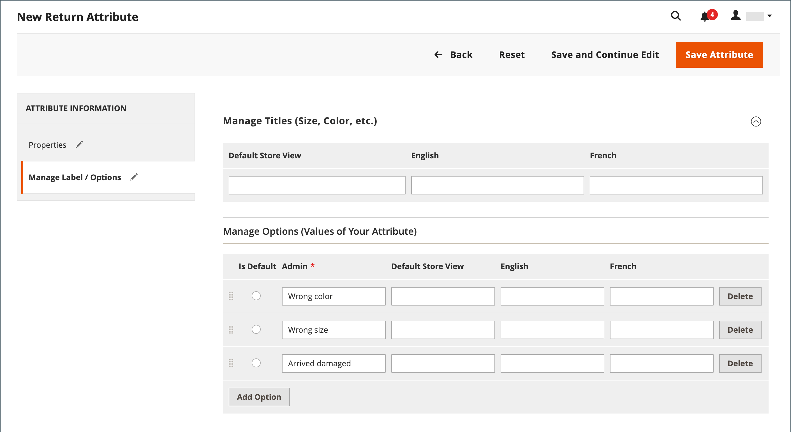

# 返回属性

{{ee-feature}}

退货属性用于存储产品退货过程中所需的信息。 默认属性包括返回产品的条件、返回原因以及指示如何解决返回的字段。 创建退货属性的过程与创建[客户属性](../customers/attribute-properties.md)类似。

{width="700" zoomable="yes"}

## 创建退货属性

1. 在&#x200B;_管理员_&#x200B;侧边栏上，转到&#x200B;**[!UICONTROL Stores]** > _[!UICONTROL Attributes]_>**[!UICONTROL Returns]**。

1. 单击右上角的&#x200B;**[!UICONTROL Add New Attribute]**。

   {width="600" zoomable="yes"}

### 定义属性

1. 若要在数据输入期间标识属性，请设置&#x200B;**[!UICONTROL Default Label]**。

1. 对于&#x200B;**[!UICONTROL Attribute Code]**，输入在系统中标识属性的代码。

1. 要确定用于数据输入的输入控件的类型，请将&#x200B;**[!UICONTROL Input Type]**&#x200B;设置为以下项之一：

   - `Text Field`
   - `Text Area`
   - `Dropdown`
   - `Yes/No`
   - `File`
   - `Image File`

1. 若要使该字段成为必填项，请将&#x200B;**[!UICONTROL Values Required]**&#x200B;设置为`Yes`。

1. 要为字段分配初始值，请输入&#x200B;**[!UICONTROL Default Value]**。

1. 要在保存记录之前验证输入到字段中的数据是否准确，请将&#x200B;**[!UICONTROL Input Validation]**&#x200B;设置为以下任一项：

   - `None`
   - `Alphanumeric`
   - `Alphanumeric with Space`
   - `Numeric Only`
   - `Alpha Only`
   - `URL`
   - `Email`

1. 对于`Text Field`和`Text Area`输入类型，请输入&#x200B;**[!UICONTROL Minimum Text Length]**&#x200B;和&#x200B;**[!UICONTROL Maximum Text Length]**。

1. 要应用预处理筛选器，请将&#x200B;**[!UICONTROL Input/Output Filter]**&#x200B;设置为以下项之一：

   - `None`
   - `Strip HTML Tags`
   - `Escape  HTML Entities`

1. 若要使该属性对客户可见，请在&#x200B;_[!UICONTROL Storefront Properties]_&#x200B;部分中将&#x200B;**[!UICONTROL Show on Storefront]**&#x200B;设置为`Yes`。

1. （可选）为&#x200B;**[!UICONTROL Sort Order]**&#x200B;输入一个数字，以确定该属性在页面的同一部分中相对于其他属性的显示位置。 （`0` =第一，`1` =第二，`2` =第三，依此类推。）

### 管理标签/选项

1. 在左侧面板中，选择&#x200B;**[!UICONTROL Manage Labels/Options]**。

1. 在&#x200B;**[!UICONTROL Manage Titles (Size, Color, etc.)]**&#x200B;部分中，输入每个商店视图的标签。

   {width="600" zoomable="yes"}

1. 如果属性的&#x200B;**[!UICONTROL Input Type]**&#x200B;是`Dropdown`，请管理&#x200B;**[!UICONTROL Manage Options (Values of Your Attribute)]**&#x200B;部分中的选项。

   - 要添加选项，请单击&#x200B;**[!UICONTROL Add Option]**&#x200B;并输入管理员和每个商店视图的标签。
   - 若要将某个选项设为默认选项，请选择&#x200B;**[!UICONTROL Is Default]**。
   - 要删除选项，请单击&#x200B;**[!UICONTROL Delete]**。

1. 要保存更改，请单击&#x200B;**[!UICONTROL Save Attribute]**。
