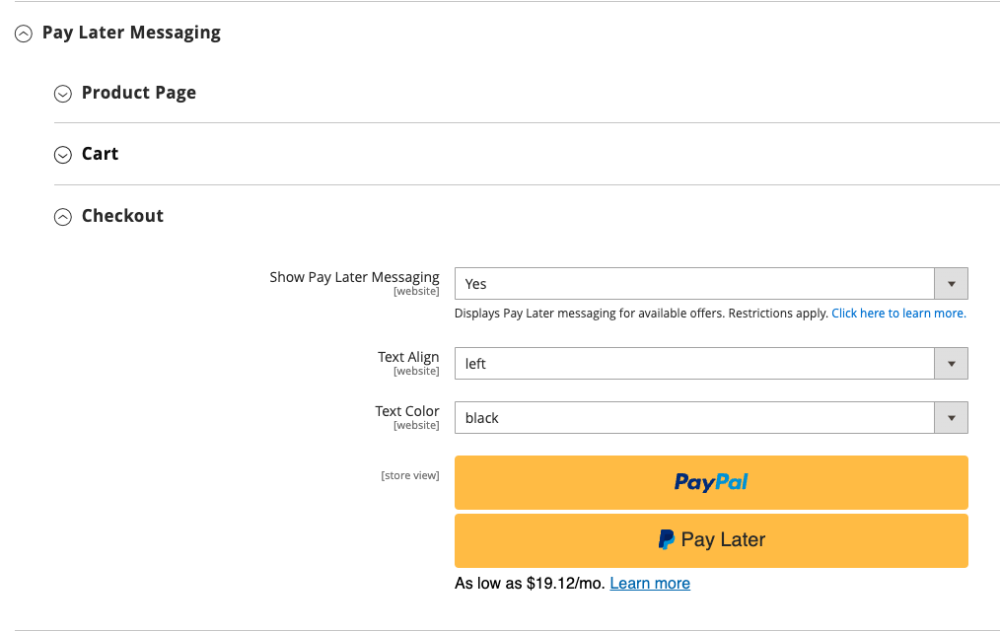

# Braintree

>[!IMPORTANT]
>
>如果您需要有关卡上意外费用的帮助，请访问[取消订阅](https://helpx.adobe.com/manage-account/using/cancel-subscription.html)页面以获得帮助。

Braintree通过欺诈检测和PayPal集成提供完全可自定义的结账体验。 它支持[!DNL Apple Pay]、[!DNL Google Pay]、ACH、Venmo和本地支付方式。 Braintree减轻了商家的PCI合规性负担，因为交易发生在Braintree系统上。 Braintree Payments集成由[GENE Commerce](https://www.gene.co.uk/gene-braintree-payments/)开发。

>[!NOTE]
>
>如果您从早期版本的Adobe Commerce或Magento Open Source升级到2.4.x，并且安装了来自Commerce Marketplace的Braintree扩展，请参阅本页末尾的[2.4升级说明](#24-upgrade-notes)。

## 步骤1：获取Braintree凭据

转到[Braintree Payments](https://www.braintreepayments.com/)并注册帐户。

## 第2步：完成基本设置

1. 在&#x200B;_管理员_&#x200B;侧边栏上，转到&#x200B;**[!UICONTROL Stores]** > _[!UICONTROL Settings]_>**[!UICONTROL Configuration]**。

1. 在左侧面板中，展开&#x200B;**[!UICONTROL Sales]**&#x200B;并选择&#x200B;**[!UICONTROL Payment Methods]**。

   - 如果您的Commerce安装有多个网站、商店或视图，请在左上角选择应用配置的&#x200B;**[!UICONTROL Store View]**。

   - 在&#x200B;_[!UICONTROL Merchant Location]_&#x200B;部分中，验证&#x200B;**[!UICONTROL Merchant Country]**&#x200B;是否设置为您公司的位置。

1. 在&#x200B;_[!UICONTROL Recommended Solutions]_&#x200B;下，在_[!UICONTROL Braintree Payments] (由[GENE Commerce](https://www.gene.co.uk/gene-braintree-payments/) v4.7.0 - [发行说明](https://support.gene.co.uk/support/solutions/articles/35000278668)_部分中，单击&#x200B;**[!UICONTROL Configure]**。

   {width="600" zoomable="yes"}

1. 对于&#x200B;**[!UICONTROL Title]**，请输入在结账期间将Braintree标识为付款选项的标题。

1. 将Braintree交易记录的当前操作&#x200B;**[!UICONTROL Environment]**&#x200B;设置为`Sandbox`或`Production`

   在沙盒中测试配置时，请仅使用Braintree推荐的[信用卡号](https://developers.braintreepayments.com/reference/general/testing/php)。 当您准备好使用Braintree进入生产阶段时，将&#x200B;**[!UICONTROL Environment]**&#x200B;设置为`Production`。

   {width="600" zoomable="yes"}

1. 将&#x200B;**[!UICONTROL Payment Action]**&#x200B;设置为以下项之一：

   - `Authorize Only` — 批准购买并暂停资金。 在商户捕获&#x200B;__&#x200B;销售之前，不会从客户的银行帐户提取此金额。|
   - `Intent Sale` — 已授权并立即从客户帐户中收回购买金额。 **_Note:_**&#x200B;在2.3.x及更早版本中，此值为&#x200B;_Authorize and Capture_。|

1. 输入您的Braintree帐户中的&#x200B;**[!UICONTROL Sandbox Merchant ID / Merchant ID]**。

1. 从您的Braintree帐户输入以下凭据：

   - **[!UICONTROL Sandbox Public Key / Public Key]**
   - **[!UICONTROL Sandbox Private Key / Private Key]**

   >[!NOTE]
   >
   >**（沙盒和生产）**&#x200B;环境都有单独的字段，而其他字段则根据所选择的环境进行渲染。

1. 在保存配置之前，单击&#x200B;**[!UICONTROL Validate Credentials]**&#x200B;验证您的凭据。

1. 将&#x200B;**[!UICONTROL Enable Card Payments]**&#x200B;设置为`Yes`。

1. 如果您希望能够安全地存储客户信息，以便客户不必在每次购买时都重新输入该信息，请将&#x200B;**[!UICONTROL Enable Vault for Card Payments]**&#x200B;设置为`Yes`。

1. 如果您希望客户在每次购买时验证其保险存储卡的CVV号码，请将&#x200B;**[!UICONTROL Enable Vault CVV Re-verification]**&#x200B;设置为`Yes`。

## 步骤3：完成高级设置

1. 展开扩展选择器&#x200B;**[!UICONTROL Advanced Braintree Settings]**。

   {width="550" zoomable="yes"}

1. 对于&#x200B;**[!UICONTROL Vault Title]**，请输入参考的描述性标题，以标识存储客户卡信息的保管库。

1. 输入您的Braintree帐户中的&#x200B;**[!UICONTROL Merchant Account ID]**。

   如果您没有指定要使用的商家帐户，Braintree将使用您的默认商家帐户处理此交易记录。

1. 要在结账流程开始时使用“快速付款”选项(包括PayPal、PayLater、Apple Pay和Google Pay)提供更快的结账体验，请将&#x200B;**[!UICONTROL Enable Checkout Express Payments]**&#x200B;设置为`Yes`。

1. 如果您希望阻止在高级欺诈工具检查过程中发送交易以进行评估，请将&#x200B;**[!UICONTROL Skip Fraud Checks on Admin Orders]**&#x200B;设置为`Yes`。

1. 设置&#x200B;**[!UICONTROL Bypass Fraud Protection Threshold]**，以便在达到或超过阈值时绕过`Advanced Fraud Protection`检查。

   将此字段留空将禁用此选项。

1. 如果希望系统保存商店与Braintree之间交互的日志文件，请将&#x200B;**[!UICONTROL Debug]**&#x200B;设置为`Yes`。

1. 若要要求客户从信用卡背面提供三位数的安全代码，请将&#x200B;**[!UICONTROL CVV Verification]**&#x200B;设置为`Yes`。

   如果使用CVV验证，请确保在Braintree帐户的&#x200B;_设置/处理_&#x200B;部分中启用AVS和/或CVV。

1. 若要发送所有付款方法的购物车行项目，请将&#x200B;**[!UICONTROL Send Card Line Items]**&#x200B;设置为`Yes`。

1. 对于&#x200B;**[!UICONTROL Credit Card Types]**，请选择您的商店接受通过Braintree付款的每个信用卡。

   要选择多种卡类型，请按住Ctrl键(PC)或Command键(Mac)并单击每个选项。

1. 对于&#x200B;**[!UICONTROL Sort Order]**，请输入数字以确定Braintree在结账过程中与其他付款方法一起列出时的显示顺序。

## 步骤4：完成Braintree webhook设置

{width="600" zoomable="yes"}

1. 将&#x200B;**[!UICONTROL Enable Webhook]**&#x200B;设置为`Yes`以启用webhook功能以防止欺诈、ACH付款和本地付款方法。

1. 复制&#x200B;**[!UICONTROL Fraud Protection URL]**&#x200B;字段中的URL，并将其作为&#x200B;_[!UICONTROL Webhook Destination URL]_&#x200B;添加到您的Braintree帐户。

   >[!IMPORTANT]
   >
   >此URL必须安全且可公开访问。

1. 设置&#x200B;**[!UICONTROL Fraud Protection Approve Order Status]**&#x200B;字段以确定Braintree何时批准欺诈防护。

   选定的订单状态将分配给Commerce订单。

1. 设置&#x200B;**[!UICONTROL Fraud Protection Reject Order Status]**&#x200B;字段以确定Braintree何时拒绝欺诈防护。

   选定的订单状态将分配给Commerce订单。

## 步骤5：完成特定于国家/地区的设置

1. 将&#x200B;**[!UICONTROL Payment from Applicable Countries]**&#x200B;设置为以下项之一：

   - `All Allowed Countries` — 来自您商店配置中指定的所有[国家/地区](../getting-started/store-details.md#country-options)的客户都可以使用此付款方式。
   - `Specific Countries` — 选择此选项后，将显示&#x200B;_[!UICONTROL Payment from Specific Countries]_&#x200B;列表。 按住Ctrl键(PC)或Command键(Mac)，然后选择客户可在您的商店中购买产品的每个国家/地区。

   {width="600" zoomable="yes"}

1. 要设置&#x200B;**[!UICONTROL Country Specific Credit Card Types]**：

   - 单击&#x200B;**[!UICONTROL Add]**。

   - 设置&#x200B;**[!UICONTROL Country]**&#x200B;并选择每个&#x200B;**[!UICONTROL Allowed Credit Card Type]**。

   - 重复以上步骤以标识从每个国家/地区接受的信用卡。

## 步骤6：通过Braintree设置完成自动清算行

通过Braintree进行{width="600" zoomable="yes"}

1. 要将ACH作为付款选项包含在Braintree中，请将&#x200B;**[!UICONTROL Enable ACH Direct Debit]**&#x200B;设置为`Yes`。

1. 客户可以保存其单次使用的ACH直接借记支付方法并将其存储以供将来使用。 保险存储完成后，如果将&#x200B;**[!UICONTROL Enable Vault for ACH Direct Debit]**&#x200B;设置为`Yes`，客户可以重用ACH直接借记，而无需重新输入或验证其付款信息。

1. 对于&#x200B;**[!UICONTROL Sort Order]**，请输入一个数字以确定在结账过程中与其他付款选项一起列出时Braintree ACH付款选项出现的顺序。

## 步骤7：通过Braintree设置完成[!UICONTROL Apple Pay]

通过Braintree设置{width="600" zoomable="yes"}

1. 要将[!DNL Apple Pay]作为付款选项包含在Braintree中，请将&#x200B;**[!UICONTROL Enable ApplePay through Braintree]**&#x200B;设置为`Yes`。

   确保首先[在您的Braintree帐户中验证您的域名](https://developer.paypal.com/braintree/docs/guides/apple-pay/configuration/javascript/v3)。

1. 如果您希望能够安全地存储客户信息，以便客户在每次使用Apple Pay购买时都不需要重新输入该信息，请将&#x200B;**[!UICONTROL Enable Vault for ApplePay]**&#x200B;设置为`Yes`。

1. 将&#x200B;**[!UICONTROL Payment Action]**&#x200B;设置为以下项之一：

   - `Authorize Only` — 批准购买并暂停资金。 在商户捕获&#x200B;_销售额_&#x200B;之前，不会从客户的银行帐户提取此金额。
   - `Intent Sale` — 已授权并立即从客户帐户中收回购买金额。

1. 对于&#x200B;**[!UICONTROL Merchant Name]**，输入指定在Apple支付对话框中向客户显示的标签的文本。

1. 对于&#x200B;**[!UICONTROL Sort Order]**，输入一个数字以确定在结帐期间与其他付款选项一起列出[!DNL Apple Pay]付款选项时显示的顺序。

## 步骤8：完成本地支付方法的设置

1. 要将本地付款方式作为付款选项包含在Braintree中，请将&#x200B;**[!UICONTROL Enable Local Payment Methods]**&#x200B;设置为`Yes`。

1. 对于&#x200B;**[!UICONTROL Title]**，输入要用于显示在结帐付款方式部分上的标签的文本（默认值： `Local Payments`）。

1. 对于&#x200B;**[!UICONTROL Fallback Button Text]**，输入要用于Braintree回退页面上显示的按钮的文本，以将客户带回网站（例如，`Complete Checkout`）。

1. 对于&#x200B;**[!UICONTROL Redirect on Fail]**，输入URL，当本地付款方式交易被取消、失败或遇到错误时，应将客户重定向到该位置。 它应该是结帐付款页面（例如，`https://www.domain.com/checkout#payment`）。

1. 对于&#x200B;**[!UICONTROL Allowed Payment Methods]**，选择要启用的本地付款方式。

   选项： `Bancontact` / `EPS` / `giropay` / `iDeal` / `Klarna Pay Now` / `SOFORT` / `MyBank` / `P24` / `SEPA/ELV Direct Debit` （尚未支持）

   {width="600" zoomable="yes"}

   >[!NOTE]
   >
   >捆绑的Braintree扩展不支持[Braintree开发人员文档](https://developer.paypal.com/braintree/docs/guides/local-payment-methods/overview)中列出的所有本地付款方法。 其他本地支付方法正在开发中，将在未来版本中提供支持。

1. 对于&#x200B;**[!UICONTROL Sort Order]**，请输入一个数字以确定在结帐期间与其他付款选项一起列出时本地付款方法的显示顺序。

## 步骤9：通过Braintree设置完成[!DNL Google Pay]

{width="600" zoomable="yes"}

1. 要将[!DNL Google Pay]作为付款选项包含在Braintree中，请将&#x200B;**[!UICONTROL Enable GooglePay Through Braintree]**&#x200B;设置为`Yes`。

1. 如果您希望能够安全地存储客户信息，以便客户在每次使用Google Pay购买时都不需要重新输入该信息，请将&#x200B;**[!UICONTROL Enable Vault for GooglePay]**&#x200B;设置为`Yes`。

1. 将&#x200B;**[!UICONTROL Payment Action]**&#x200B;设置为以下项之一：

   - `Authorize Only` — 批准购买并暂停资金。 在商户捕获&#x200B;_销售额_&#x200B;之前，不会从客户的银行帐户提取此金额。
   - `Intent Sale` — 已授权并立即从客户帐户中收回购买金额。

1. 设置&#x200B;**[!UICONTROL Button Color]**&#x200B;以确定[!DNL Google Pay]按钮的颜色： `White`或`Black`

1. 对于&#x200B;**[!UICONTROL Merchant ID]**，输入您的商家ID(由Google提供)。

1. 对于&#x200B;**[!UICONTROL Accepted Cards]**，使用[!DNL Google Pay]选择客户可用于下订单的卡片类型。

   选项： `Visa` / `MasterCard` / `AMEX` / `Discover` / `JCB`

1. 对于&#x200B;**[!UICONTROL Sort Order]**，请输入数字以确定在结帐期间与其他付款选项一起列出[!DNL Google Pay]时显示的顺序。

## 步骤10：通过Braintree设置完成Venmo

1. 要将Venmo作为付款选项包含在Braintree中，请将&#x200B;**[!UICONTROL Enable Venmo through Braintree]**&#x200B;设置为`Yes`。

1. 将&#x200B;**[!UICONTROL Enable Vault for Venmo]**&#x200B;设置为`Yes`可允许使用安全保管库存储客户的Venmo帐户，这样客户就无需再次登录到其Venmo帐户即可进行将来交易。

   通过Braintree进行{width="600" zoomable="yes"}

1. 将&#x200B;**[!UICONTROL Payment Action]**&#x200B;设置为以下项之一：

   - `Authorize Only` — 批准购买并暂停资金。 在商户捕获&#x200B;_销售额_&#x200B;之前，不会从客户的银行帐户提取此金额。
   - `Intent Sale` — 已授权并立即从客户帐户中收回购买金额。

1. 对于&#x200B;**[!UICONTROL Sort Order]**，请输入一个数字以确定在结帐过程中与其他付款选项一起列出Venmo时显示的顺序。

## 步骤11：通过Braintree设置完成PayPal

通过Braintree设置{width="550" zoomable="yes"}

1. 若要将PayPal作为付款选项包含在Braintree中，请将&#x200B;**[!UICONTROL Enable PayPal through Braintree]**&#x200B;设置为`Yes`。

1. 通过Braintree支付方式指定您的PayPal：

   >[!NOTE]
   >
   >可以启用&#x200B;**[!DNL PayPal Credit]**&#x200B;或&#x200B;**[!DNL PayPal PayLater]**。 无法同时启用这两种方法。

   - 要将[!DNL PayPal Credit]作为付款选项包含在Braintree中，请将&#x200B;**[!UICONTROL Enable PayPal Credit through Braintree]**&#x200B;设置为`Yes`。

     当&#x200B;**通过Braintree启用PayPal**&#x200B;设置为`Yes`时，仅显示此字段。

     >[!NOTE]
     >
     >PayPal信用仅在美国和英国可用。 如果&#x200B;_[!UICONTROL Merchant Country]_&#x200B;字段的选定值不是`US`或`UK`，则PayPal点数已禁用。

   - 要将[!DNL PayPal PayLater]作为付款选项包含在Braintree中，请将&#x200B;**[!UICONTROL Enable PayPal PayLater through Braintree]**&#x200B;设置为`Yes`。

     当&#x200B;**[!UICONTROL Enable PayPal PayLater through Braintree]**&#x200B;设置为`Yes`时，仅出现此字段。

     您可以在您的网站上显示PayLater消息以提供各种优惠，例如&#x200B;_在3_&#x200B;内付款，客户可按月支付三笔免息款项。 Braintree集成可以在您的网站上显示消息以推广此功能。 您不能将PayLater选件与任何其他内容、营销或材料一起促销。

1. 对于&#x200B;**[!UICONTROL Title]**，请输入一个标题，以在结账期间标识按PayPal选项进行的Braintree付款。

1. 将&#x200B;**[!UICONTROL Vault Enabled]**&#x200B;设置为`Yes`以允许使用安全保管库存储客户的PayPal帐户。 保管式PayPal帐户可用于未来交易，从而减少客户的步骤数。

1. 将&#x200B;**[!UICONTROL Send Cart Line Items for PayPal]**&#x200B;设置为`Yes`以将行项目（订单项目）与礼品卡、项目礼品包装、订单礼品包装、商店退款、配送和税作为行项目发送到PayPal。

1. 对于&#x200B;**[!UICONTROL Sort Order]**，请输入一个数字以确定在结帐期间与其他付款选项一起列出时Braintree PayPal付款选项出现的顺序。

1. 要以不同于[存储配置](../getting-started/store-details.md#store-information)中定义的形式显示商家名称，请在&#x200B;**[!UICONTROL Override Merchant Name]**&#x200B;字段中输入您希望其显示的名称。

1. 将&#x200B;**[!UICONTROL Payment Action]**&#x200B;设置为以下项之一：

   - `Authorize Only` — 批准购买并暂停资金。 在商户捕获&#x200B;_销售额_&#x200B;之前，不会从客户的银行帐户提取此金额。
   - `Authorize and Capture` — 已授权并立即从客户帐户中收回购买金额。

1. 对于PayPal处理的Braintree事务，将&#x200B;**[!UICONTROL Payment from Applicable Countries]**&#x200B;设置为以下项之一：

   - `All Allowed Countries` — 来自您商店配置中指定的所有[国家/地区](../getting-started/store-details.md#country-options)的客户都可以使用此付款方式。
   - `Specific Countries` — 选择此选项后，将显示&#x200B;_[!UICONTROL Payment from Specific Countries]_&#x200B;列表。 按住Ctrl键(PC)或Command键(Mac)，然后选择客户可在您的商店中购买产品的每个国家/地区。

   通过Braintree设置{width="550" zoomable="yes"}

1. 若要要求客户提供帐单地址，请将&#x200B;**[!UICONTROL Require Customer's Billing Address]**&#x200B;设置为`Yes`。

   >[!NOTE]
   >
   >必须由PayPal技术支持为您的帐户启用此功能。

1. 要跳过PayPal Express的订单审核页面，请将&#x200B;**[!UICONTROL Skip Order Review Step]**&#x200B;设置为`Yes`。

   对于使用PayPal Express付款的客户：如果您希望客户在完成付款之前重定向到审核页面，请将此参数设置为`No`。 如果您希望客户跳过审阅页面，请将其设置为`Yes`。

1. 要通过Braintree保存商店与PayPal之间交互的日志文件，请将&#x200B;**[!UICONTROL Debug]**&#x200B;设置为`Yes`。

1. 要在迷你购物车和购物车页面上同时显示PayPal按钮，请将&#x200B;**[!UICONTROL Display on Shopping Cart]**&#x200B;设置为`Yes`。

1. 若要将包跟踪信息发送到PayPal，请将&#x200B;**[!UICONTROL Send Package Tracking]**&#x200B;设置为`Yes`。

   包跟踪信息将仅针对PayPal交易/订单发送到PayPal。 必须启用[!UICONTROL Send Cart Line Items for PayPal]配置字段才能使[!UICONTROL Package Tracking]功能正常工作。

1. 若要通过PayPal通知购买者或付款者有关包跟踪更新，请将&#x200B;**[!UICONTROL Use PayPal's "Notify Payer" functionality]**&#x200B;设置为`Yes`。

## 步骤12：设置样式设置

1. 对于&#x200B;**[!UICONTROL Location]**，选择呈现PayPal按钮和邮件的位置： `Mini-Cart and Cart Page`、`Checkout Page`或`Product Page`

   {width="600" zoomable="yes"}

### [!UICONTROL Mini-Cart and Cart Page]

此部分中的选项和设置因&#x200B;_[!UICONTROL Location]_&#x200B;字段中的设置而异。

1. 将&#x200B;**[!UICONTROL PayPal Button Type]**&#x200B;设置为三种按钮类型之一： `PayPal Button` / `PayPal Pay Later Button` / `PayPal Credit Button`

**[!UICONTROL PayPal Button]**

此部分中的选项和设置因在&#x200B;_[!UICONTROL PayPal Button Type]_&#x200B;字段中选择的按钮类型而异。

1. 要在所选位置的店面上显示PayPal按钮，请将&#x200B;**[!UICONTROL Show PayPal Button]**&#x200B;设置为`Yes`。

1. 对于&#x200B;**[!UICONTROL Button Label]**，选择PayPal按钮标签： `Paypal`、`Checkout`、`Buynow`或`Pay`

1. 对于&#x200B;**[!UICONTROL Color]**，选择PayPal按钮颜色： `Blue`、`Black`、`Gold`或`Silver`

1. 对于&#x200B;**[!UICONTROL Shape]**，选择PayPal按钮形状： `Pill`或`Rectangle`

1. 对于&#x200B;**[!UICONTROL Size (Deprecated)]**，选择PayPal按钮大小： `Medium`、`Large`或`Responsive`

>[!NOTE]
>
>**[!DNL Size(Deprecated)]**&#x200B;配置字段已弃用，未用于设置PayPal按钮的样式。

设置这些选项后，您可以看到PayPal按钮的预览。 可以使用以下控件来应用设置或重置值：

- 要存储按钮和PayLater消息传递的选定样式设置并将它们应用到当前位置和当前按钮类型，请单击&#x200B;**[!UICONTROL Apply]**。

- 要存储按钮和PayLater消息值的选定样式设置并将它们应用于所有按钮类型和位置，请单击&#x200B;**[!UICONTROL Apply to All Buttons]**。

- 要将样式设置返回到按钮和PayLater消息传递的推荐默认值，并将它们应用于所有按钮类型和位置，请单击&#x200B;**[!UICONTROL Reset to Recommended Defaults]**。

## 步骤13：稍后付款消息传送

**[!UICONTROL Product Page]**

{width="600" zoomable="yes"}

1. 若要在产品页面的店面上显示[!DNL Pay Later]消息，请将&#x200B;**[!UICONTROL Show PayLater Messaging]**&#x200B;设置为`Yes`。

   显示可用优惠的稍后付费消息。 限制适用。 请参阅[PayPal的文档](https://developer.paypal.com/studio/checkout/pay-later/us)。

1. 对于&#x200B;**[!UICONTROL Message Layout]**，选择[!DNL Pay Later]消息布局： `Text`或`Flex`

1. 对于&#x200B;**[!UICONTROL Logo]**，选择PayPal徽标类型： `Inline`、`Primary`、`Alternative`或`None`

1. 对于&#x200B;**[!UICONTROL Logo Position]**，选择PayPal徽标位置： `Left`、`Right`或`Top`

1. 对于&#x200B;**[!UICONTROL Text Color]**，选择[!DNL PayLater]消息文本颜色： `Black`、`White`、`Monochrome`或`Grayscale`

**[!UICONTROL Cart]**

{width="600" zoomable="yes"}

1. 要在迷你购物车或购物车页面的店面上显示[!DNL Pay Later]消息，请将&#x200B;**[!UICONTROL Show PayLater Messaging]**&#x200B;设置为`Yes`。

   显示可用优惠的稍后付费消息。 限制适用。 请参阅[PayPal的文档](https://developer.paypal.com/studio/checkout/pay-later/us)。

1. 对于&#x200B;**[!UICONTROL Message Layout]**，选择[!DNL Pay Later]消息布局： `Text`或`Flex`

1. 对于&#x200B;**[!UICONTROL Logo]**，选择PayPal徽标类型： `Inline`、`Primary`、`Alternative`或`None`

1. 对于&#x200B;**[!UICONTROL Logo Position]**，选择PayPal徽标位置： `Left`、`Right`或`Top`

1. 对于&#x200B;**[!UICONTROL Text Color]**，选择[!DNL PayLater]消息文本颜色： `Black`、`White`、`Monochrome`或`Grayscale`

**[!UICONTROL Checkout]**

{width="600" zoomable="yes"}

1. 要在结帐时在店面显示[!DNL Pay Later]消息，请将&#x200B;**[!UICONTROL Show PayLater Messaging]**&#x200B;设置为`Yes`。

   显示可用优惠的稍后付费消息。 限制适用。 请参阅[PayPal的文档](https://developer.paypal.com/studio/checkout/pay-later/us)。

1. 对于&#x200B;**[!UICONTROL Text Align]**，为[!DNL Pay Later]消息选择文本对齐： `Text`、`Center`或`Right`

1. 对于&#x200B;**[!UICONTROL Text Color]**，选择[!DNL Pay Later]消息文本颜色： `Black`，`White`

## 步骤14：完成3D验证设置

1. 如果要为使用已注册验证计划（如&#x200B;_由VISA验证_）的信用卡的客户添加验证步骤，请将&#x200B;**[!UICONTROL 3D Secure Verification]**&#x200B;设置为`Yes`。

   在此过程中，提交进行核实的交易金额会与发送进行授权的金额进行核对。

2. 若要始终质询所有事务的3D安全请求，请将&#x200B;**[!UICONTROL Always request 3DS]**&#x200B;设置为`Yes`。

3. 对于&#x200B;**[!UICONTROL Threshold Amount]**，输入触发3D验证所需的最小订单金额。

4. 将&#x200B;**[!UICONTROL Verify for Applicable Countries]**&#x200B;设置为以下项之一：

   - `All Allowed Countries` — 来自您商店配置中指定的所有[国家/地区](../getting-started/store-details.md#country-options)的客户都可以使用此付款方式。
   - `Specific Countries` — 选择此选项后，将显示&#x200B;_[!UICONTROL Verify for Specific Countries]_&#x200B;列表。 按住Ctrl键(PC)或Command键(Mac)，然后选择客户可在您的商店中购买产品的每个国家/地区。

   {width="600" zoomable="yes"}

## 步骤15：设置Braintree动态描述符

以下描述符用于识别客户信用卡对账单上的购买情况。 您可以通过明确识别与每次购买关联的公司来减少回扣次数。 如果您的帐户未启用动态描述符，请联系Braintree支持部门。

{width="600" zoomable="yes"}

1. 根据以下准则输入&#x200B;**[!UICONTROL Name]**、**[!UICONTROL Phone]**&#x200B;和&#x200B;**[!UICONTROL URL]**&#x200B;的动态描述符：

   - **[!UICONTROL Name]** — 名称描述符由两部分组成，它们之间用星号(*)分隔。 例如：

     `company*myproduct`

     描述符的第一部分标识公司或DBA，第二部分标识产品。 描述符的`company`和`product`部分的长度可以通过以下方式进行分配，组合长度最多为22个字符。

     名称描述符中有&#x200B;**_个字符_**

     选项1 :_`Company`必须为三个字符，`Product`最多可包含18个字符(_O)

     选项2 :_`Company`必须为7个字符，`Product`最多可包含14个字符(_O)

     _选项3_： `Company`必须为12个字符，`Product`最多可为9个字符

   - **[!UICONTROL Phone]** — 电话描述符的长度必须为10 - 14个字符，并且只能包含数字、破折号、圆括号和句点。 例如：

     `9999999999`

     `(999) 999-9999`

     `999.999.9999`

   - **[!UICONTROL URL]** - URL描述符表示您的域名，最长可为13个字符。 例如：

     `company.com`

1. Braintree配置完成后，单击&#x200B;**[!UICONTROL Save Config]**。

## 2.4升级说明

从Adobe Commerce和Magento Open Source 2.4.0开始，此版本中包含了Braintree扩展。 如果您从安装了Marketplace Braintree扩展的2.4.0之前的版本迁移到Commerce 2.4.x，则必须卸载该扩展（`paypal/module-braintree`或`gene/module-braintree`），并更新任何代码自定义以使用`PayPal_Braintree`命名空间而不是`Magento_Braintree`。 会保留核心Commerce Braintree Payments捆绑扩展和Commerce Marketplace上分发的扩展中的配置设置，并且仍可以正常捕获、撤消或退款与这些先前版本一起进行的支付。
