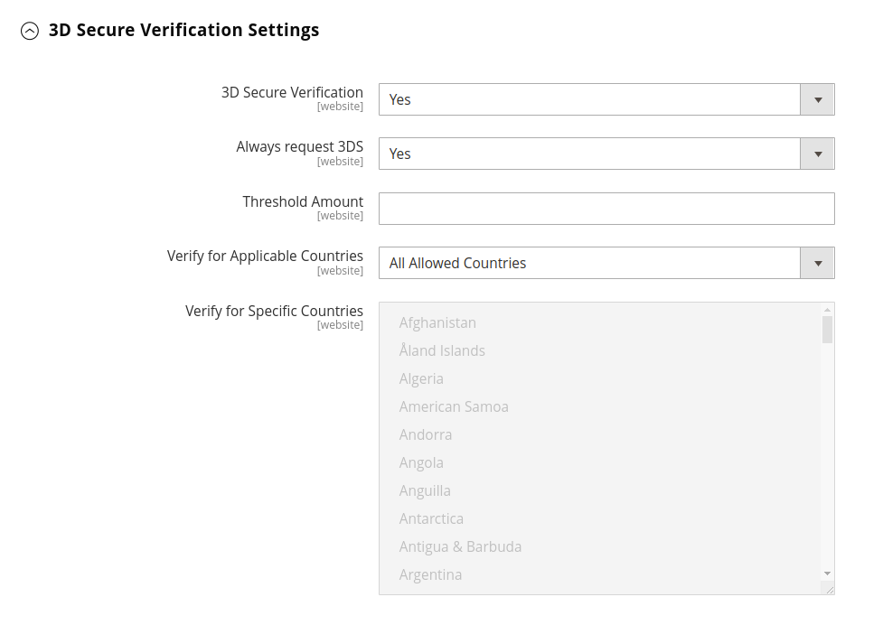

# Braintree

Braintree通过欺诈检测和PayPal集成，提供完全可自定义的结账体验。 它支持 [!DNL Apple Pay]， [!DNL Google Pay]、ACH、Venmo和本地支付方式。 Braintree减轻了商家的PCI合规负担，因为交易发生在Braintree系统上。 Braintree支付集成由以下人员开发 [GENE Commerce](https://www.gene.co.uk/gene-braintree-payments/).

>[!NOTE]
>
>如果您从早期版本的Adobe Commerce升级到2.4.x，或者从安装了Braintree扩展的Commerce Marketplace升级到Magento Open Source，请参阅 [2.4升级说明](#24-upgrade-notes) 在本页末尾。

## 步骤1：获取Braintree凭据

转到 [Braintree支付][1] 并注册一个帐户。

## 第2步：完成基本设置

1. 在 _管理员_ 侧栏，转到 **[!UICONTROL Stores]** > _[!UICONTROL Settings]_>**[!UICONTROL Configuration]**.

1. 在左侧面板中，展开 **[!UICONTROL Sales]** 并选择 **[!UICONTROL Payment Methods]**.

   - 如果您的Commerce安装有多个网站、商店或视图，请在左上角选择 **[!UICONTROL Store View]** 配置适用的位置。

   - 在 _[!UICONTROL Merchant Location]_部分，验证&#x200B;**[!UICONTROL Merchant Country]**设置为您公司的位置。

1. 下 _[!UICONTROL Recommended Solutions]_，在_[!UICONTROL Braintree Payments] (按 [GENE Commerce](https://www.gene.co.uk/gene-braintree-payments/) v4.6.1 - [发行说明](https://support.gene.co.uk/support/solutions/articles/35000228529)_部分，单击&#x200B;**[!UICONTROL Configure]**.

   {width="600" zoomable="yes"}

1. 对象 **[!UICONTROL Title]**，输入在结账期间将Braintree标识为付款选项的标题。

1. 设置当前操作 **[!UICONTROL Environment]** 用于Braintree交易记录 `Sandbox` 或 `Production`

   在沙盒中测试配置时，仅使用 [信用卡号码][2] 由Braintree推荐。 当您准备好使用Braintree进入生产阶段时，请设置 **[!UICONTROL Environment]** 到 `Production`.

   {width="600" zoomable="yes"}

1. 设置 **[!UICONTROL Payment Action]** 更改为以下任一项：

   - `Authorize Only`  — 批准购买并暂停资金。 在销售完成之前，不会从客户的银行账户提取该金额 _已捕获_ 由商家提供。|
   - `Intent Sale`   — 采购金额已获授权并立即从客户账户中提取。 **_注意：_** 此值是  _授权和捕获_ （在2.3.x及更早版本中）。|

1. 输入 **[!UICONTROL Sandbox Merchant ID / Merchant ID]** 从您的Braintree帐户删除。

1. 从您的Braintree帐户输入以下凭据：

   - **[!UICONTROL Sandbox Public Key / Public Key]**
   - **[!UICONTROL Sandbox Private Key / Private Key]**

   >[!NOTE]
   >
   >这两个字段均是独立的 **（沙盒和生产）** 环境和其他字段根据选择的环境进行渲染。

1. 在保存配置之前，单击 **[!UICONTROL Validate Credentials]** 以验证您的凭据。

1. 设置 **[!UICONTROL Enable Card Payments]** 到 `Yes`.

   {width="600" zoomable="yes"}

   如果您希望能够安全地存储客户信息，这样客户就不必在每次购买时都重新输入该信息，请设置 **[!UICONTROL Enable Vault for Card Payments]** 到 `Yes`.

## 步骤3：完成高级设置

1. 展开  该 **[!UICONTROL Advanced Braintree Settings]** 部分。

   {width="550" zoomable="yes"}

1. 对象 **[!UICONTROL Vault Title]**，请输入描述性标题作为参考，以标识存储了客户卡信息的存储库。

1. 输入 **[!UICONTROL Merchant Account ID]** 从您的Braintree帐户删除。

   如果未指定要使用的贸易商帐户，则Braintree将使用默认贸易商帐户处理事务处理。

1. 为了在结账流程开始时使用“快速付款”选项(包括PayPal、PayLater、Apple Pay和Google Pay)提供更快的结账体验，请设置 **[!UICONTROL Enable Checkout Express Payments]** 到 `Yes`.

1. 如果您要阻止将交易作为高级欺诈工具检查的一部分发送进行评估，请设置 **[!UICONTROL Skip Fraud Checks on Admin Orders]** 到 `Yes`.

1. 设置 **[!UICONTROL Bypass Fraud Protection Threshold]** 这样， `Advanced Fraud Protection` 当达到或超过阈值时，将绕过检查。

   将此字段留空将禁用此选项。

1. 如果希望系统保存商店与Braintree之间交互的日志文件，请设置 **[!UICONTROL Debug]** 到 `Yes`.

1. 要要求客户从信用卡背面提供三位数的安全代码，请设置 **[!UICONTROL CVV Verification]** 到 `Yes`.

   如果使用CVV验证，请确保启用 _设置/处理_ Braintree部分。

1. 要发送所有付款方法的购物车行项目，请设置 **[!UICONTROL Send Card Line Items]** 到 `Yes`.

1. 对象 **[!UICONTROL Credit Card Types]**，选择您的商店接受的通过Braintree付款的每个信用卡。

   要选择多种卡类型，请按住Ctrl键(PC)或Command键(Mac)并单击每个选项。

1. 对象 **[!UICONTROL Sort Order]**，请输入数字以确定在结账期间与其他支付方式一起列出Braintree时显示的顺序。

## 步骤4：完成Braintreewebhook设置

{width="600" zoomable="yes"}

1. 设置 **[!UICONTROL Enable Webhook]** 到 `Yes` 启用webhook功能以进行欺诈防护、ACH支付和本地支付方法。

1. 将URL复制到 **[!UICONTROL Fraud Protection URL]** 字段并将其添加到您的Braintree帐户，作为 _[!UICONTROL Webhook Destination URL]_.

   >[!IMPORTANT]
   >
   >此URL必须安全且可公开访问。

1. 设置 **[!UICONTROL Fraud Protection Approve Order Status]** 用于确定欺诈防护何时获得Braintree批准的字段。

   选定的订单状态已分配给商务订单。

1. 设置 **[!UICONTROL Fraud Protection Reject Order Status]** 用于确定欺诈保护何时被Braintree拒绝的字段。

   选定的订单状态已分配给商务订单。

## 步骤5：完成特定于国家/地区的设置

1. 设置 **[!UICONTROL Payment from Applicable Countries]** 更改为以下任一项：

   - `All Allowed Countries`  — 来自所有客户的客户 [国家/地区](../getting-started/store-details.md#country-options) 在商店配置中指定的可使用此付款方式。
   - `Specific Countries`  — 选择此选项后， _[!UICONTROL Payment from Specific Countries]_列表出现。 按住Ctrl键(PC)或Command键(Mac)，然后选择客户可在您的商店中购买产品的每个国家/地区。

   {width="600" zoomable="yes"}

1. 设置 **[!UICONTROL Country Specific Credit Card Types]**：

   - 单击 **[!UICONTROL Add]**.

   - 设置 **[!UICONTROL Country]** 并选择每个 **[!UICONTROL Allowed Credit Card Type]**.

   - 重复以上步骤以标识从每个国家/地区接受的信用卡。

## 步骤6：通过Braintree设置完成ACH

{width="600" zoomable="yes"}

1. 要将ACH包括在Braintree中，请设置 **[!UICONTROL Enable ACH Direct Debit]** 到 `Yes`.

1. 客户可以保存其单次使用的ACH直接借记支付方法并将其存储以供将来使用。 一旦保险存储，客户就可以重复使用ACH直接借记，而无需重新输入或验证其支付信息（如果设置） **[!UICONTROL Enable Vault for ACH Direct Debit]** 到 `Yes`.

1. 对象 **[!UICONTROL Sort Order]**，输入数字以确定BraintreeACH支付选项在结账过程中与其他支付选项一起列出时的显示顺序。

## 步骤7：完成 [!UICONTROL Apple Pay] 通过Braintree设置

{width="600" zoomable="yes"}

1. 要包含 [!DNL Apple Pay] 作为Braintree的付款选项，设置 **[!UICONTROL Enable ApplePay through Braintree]** 到 `Yes`.

   确保 [验证您的域名](https://developer.paypal.com/braintree/docs/guides/apple-pay/configuration/javascript/v3) 在您的Braintree帐户中。

1. 如果您希望能够安全地存储客户信息，这样客户就不必在每次使用Apple Pay购买时都重新输入该信息，请设置 **[!UICONTROL Enable Vault for ApplePay]** 到 `Yes`.

1. 设置 **[!UICONTROL Payment Action]** 更改为以下任一项：

   - `Authorize Only`  — 批准购买并暂停资金。 在销售完成之前，不会从客户的银行账户提取该金额 _已捕获_ 是商贩送的。
   - `Intent Sale`  — 采购金额已获授权并立即从客户账户中提取。

1. 对象 **[!UICONTROL Merchant Name]**，输入指定在Apple支付对话框中向客户显示的标签的文本。

1. 对象 **[!UICONTROL Sort Order]**，输入数字以确定其顺序 [!DNL Apple Pay] 在结账过程中与其他付款选项一起列出时，将显示付款选项。

## 步骤8：完成本地支付方法的设置

1. 要将本地支付方式包括为Braintree的支付选项，请设置 **[!UICONTROL Enable Local Payment Methods]** 到 `Yes`.

1. 对象 **[!UICONTROL Title]**，输入用于在“结帐付款方式”部分显示的标签的文本(默认值： `Local Payments`)。

1. 对象 **[!UICONTROL Fallback Button Text]**，输入用于后备Braintree页面上显示的按钮的文本，以将客户带回网站(例如， `Complete Checkout`)。

1. 对象 **[!UICONTROL Redirect on Fail]**，输入当本地支付方式交易取消、失败或遇到错误时客户应重定向到的URL。 它应该是结账支付页面(例如， `https://www.domain.com/checkout#payment`)。

1. 对象 **[!UICONTROL Allowed Payment Methods]**，选择要启用的本地支付方式。

   选项： `Bancontact` / `EPS` / `giropay` / `iDeal` / `Klarna Pay Now` / `SOFORT` / `MyBank` / `P24` / `SEPA/ELV Direct Debit` （尚未支持）

   {width="600" zoomable="yes"}

   >[!NOTE]
   >
   >捆绑的Braintree扩展不支持 [Braintree开发人员文档](https://developer.paypal.com/braintree/docs/guides/local-payment-methods/overview). 其他本地支付方法正在开发中，将在未来版本中提供支持。

1. 对象 **[!UICONTROL Sort Order]**，输入数字以确定在结账期间与其他支付选项一起列出本地支付方法的显示顺序。

## 步骤9：完成 [!DNL Google Pay] 通过Braintree设置

{width="600" zoomable="yes"}

1. 要包含 [!DNL Google Pay] 作为Braintree的付款选项，设置 **[!UICONTROL Enable GooglePay Through Braintree]** 到 `Yes`.

1. 如果您希望能够安全地存储客户信息，这样客户就不必在每次使用Google Pay购买时都重新输入该信息，请设置 **[!UICONTROL Enable Vault for GooglePay]** 到 `Yes`.

1. 设置 **[!UICONTROL Payment Action]** 更改为以下任一项：

   - `Authorize Only`  — 批准购买并暂停资金。 在销售完成之前，不会从客户的银行账户提取该金额 _已捕获_ 是商贩送的。
   - `Intent Sale`   — 采购金额已获授权并立即从客户账户中提取。

1. 设置 **[!UICONTROL Button Color]** 确定 [!DNL Google Pay] 按钮： `White` 或 `Black`

1. 对象 **[!UICONTROL Merchant ID]**，输入您的商家ID(由Google提供)。

1. 对象 **[!UICONTROL Accepted Cards]**，选择客户可用于下达订单的卡片类型 [!DNL Google Pay].

   选项： `Visa` / `MasterCard` / `AMEX` / `Discover` / `JCB`

1. 对象 **[!UICONTROL Sort Order]**，输入数字以确定其顺序 [!DNL Google Pay] 在结帐期间与其他付款选项一起列出时显示。

## 步骤10：通过Braintree设置完成Venmo

1. 要将Venmo作为付款选项包括在Braintree中，请设置 **[!UICONTROL Enable Venmo through Braintree]** 到 `Yes`.

1. 设置 **[!UICONTROL Enable Vault for Venmo]** 到 `Yes` 允许使用安全保险库存储客户的Venmo帐户，这样客户就无需再次登录到其Venmo帐户即可进行将来交易。

   {width="600" zoomable="yes"}

1. 设置 **[!UICONTROL Payment Action]** 更改为以下任一项：

   - `Authorize Only`  — 批准购买并暂停资金。 在销售完成之前，不会从客户的银行账户提取该金额 _已捕获_ 是商贩送的。
   - `Intent Sale`   — 采购金额已获授权并立即从客户账户中提取。

1. 对象 **[!UICONTROL Sort Order]**，输入数字以确定在结账过程中与其他付款选项一起列出Venmo时显示的顺序。

## 步骤11：通过Braintree设置完成PayPal

{width="550" zoomable="yes"}

1. 要将PayPal作为付款选项包含在Braintree中，请设置 **[!UICONTROL Enable PayPal through Braintree]** 到 `Yes`.

1. 通过Braintree付款方式指定您的PayPal：

   >[!NOTE]
   >
   >或者 **[!DNL PayPal Credit]** 或 **[!DNL PayPal PayLater]** 可以启用。 无法同时启用这两种方法。

   - 要包含 [!DNL PayPal Credit] 作为Braintree的付款选项，设置 **[!UICONTROL Enable PayPal Credit through Braintree]** 到 `Yes`.

     时间 **通过Braintree启用PayPal** 设置为 `Yes`，则仅显示此字段。

     >[!NOTE]
     >
     >PayPal信用仅在美国和英国可用。 如果为以下项选择的值，则将禁用PayPal点数 _[!UICONTROL Merchant Country]_字段不是 `US` 或 `UK`.

   - 要包含 [!DNL PayPal PayLater] 作为Braintree的付款选项，设置 **[!UICONTROL Enable PayPal PayLater through Braintree]** 到 `Yes`.

     时间 **[!UICONTROL Enable PayPal PayLater through Braintree]** 设置为 `Yes`，则仅显示此字段。

     您可以在网站上显示优惠的PayLater消息，例如 _在3内付费_，客户可按月支付三笔免息款项。 Braintree集成可以在您的网站上显示消息以推广此功能。 您不能将PayLater选件与任何其他内容、营销或材料一起促销。

1. 对象 **[!UICONTROL Title]**，输入用于在结账期间标识按PayPal选项Braintree付款的标题。

1. 设置 **[!UICONTROL Vault Enabled]** 到 `Yes` 允许使用安全保险库存储客户的PayPal帐户。 保管式PayPal帐户可用于未来交易，从而减少客户的步骤数。

1. 设置 **[!UICONTROL Send Cart Line Items for PayPal]** 到 `Yes` 将行项目（订单项目）与礼品卡、项目礼品包装、订单礼品包装、商店贷项、配送和税作为行项目发送到PayPal。

1. 对象 **[!UICONTROL Sort Order]**，请输入数字以确定BraintreePayPal支付选项在结账期间与其他支付选项一起列出时的显示顺序。

1. 以不同的方式显示商家名称，不同于在中定义 [存储配置](../getting-started/store-details.md#store-information)，在中输入名称 **[!UICONTROL Override Merchant Name]** 您希望它显示的字段。

1. 设置 **[!UICONTROL Payment Action]** 更改为以下任一项：

   - `Authorize Only`  — 批准购买并暂停资金。 在销售完成之前，不会从客户的银行账户提取该金额 _已捕获_ 是商贩送的。
   - `Authorize and Capture`  — 采购金额已获授权并立即从客户账户中提取。

1. 设置 **[!UICONTROL Payment from Applicable Countries]** 对于PayPal处理的Braintree交易记录，更改为以下项之一：

   - `All Allowed Countries`  — 来自所有客户的客户 [国家/地区](../getting-started/store-details.md#country-options) 在商店配置中指定的可使用此付款方式。
   - `Specific Countries`  — 选择此选项后， _[!UICONTROL Payment from Specific Countries]_列表出现。 按住Ctrl键(PC)或Command键(Mac)，然后选择客户可在您的商店中购买产品的每个国家/地区。

1. 要要求客户提供帐单地址，请设置 **[!UICONTROL Require Customer's Billing Address]** 到 `Yes`.

   >[!NOTE]
   >
   >必须由PayPal技术支持为您的帐户启用此功能。

1. 要通过Braintree保存商店与PayPal之间交互的日志文件，请设置 **[!UICONTROL Debug]** 到 `Yes`.

1. 要在迷你购物车和购物车页面上显示PayPal按钮，请设置 **[!UICONTROL Display on Shopping Cart]** 到 `Yes`.

## 步骤12：设置样式设置

1. 对象 **[!UICONTROL Location]**，选择呈现PayPal按钮和消息的位置： `Mini-Cart and Cart Page`， `Checkout Page`，或 `Product Page`

   {width="600" zoomable="yes"}

### [!UICONTROL Mini-Cart and Cart Page]

此部分中的选项和设置因 _[!UICONTROL Location]_字段。

1. 设置 **[!UICONTROL PayPal Button Type]** 三种按钮类型之一： `PayPal Button` / `PayPal Pay Later Button` / `PayPal Credit Button`

**[!UICONTROL PayPal Button]**

此部分中的选项和设置因在 _[!UICONTROL PayPal Button Type]_字段。

1. 要在所选位置的店面上显示PayPal按钮，请设置 **[!UICONTROL Show PayPal Button]** 到 `Yes`.

1. 对象 **[!UICONTROL Button Label]**，选择PayPal按钮标签： `Paypal`， `Checkout`， `Buynow`，或 `Pay`

1. 对象 **[!UICONTROL Color]**，选择PayPal按钮颜色： `Blue`， `Black`， `Gold`，或 `Silver`

1. 对象 **[!UICONTROL Shape]**，选择PayPal按钮形状： `Pill` 或 `Rectangle`

1. 对象 **[!UICONTROL Size (Deprecated)]**，选择PayPal按钮大小： `Medium`， `Large`，或 `Responsive`

>[!NOTE]
>
>此 **[!DNL Size(Deprecated)]** 配置字段已弃用，不用于设置PayPal按钮的样式。

**[!UICONTROL PayLater Messaging]**

1. 显示 [!DNL PayLater] 在所选位置的店面进行消息传递，设置 **[!UICONTROL Show PayLater Messaging]** 到 `Yes`.

   此消息传递包括 [!DNL PayLater] 可用优惠的消息传递([限制适用](https://developer.paypal.com/docs/checkout/pay-later/us/))。

1. 对象 **[!UICONTROL Message Layout]**，选择 [!DNL PayLater] 消息布局： `Text` 或 `Flex`

1. 对象 **[!UICONTROL Logo]**，选择PayPal徽标类型： `Inline`， `Primary`， `Alternative`，或 `None`

1. 对象 **[!UICONTROL Logo Position]**，选择PayPal徽标位置： `Left`， `Right`，或 `Top`

1. 对象 **[!UICONTROL Text Color]**，选择 [!DNL PayLater] 消息文本颜色： `Black`， `White`， `Monochrome`，或 `Grayscale`

设置这些选项后，您可以看到PayPal按钮和PayLater消息的预览。 可以使用以下控件来应用设置或重置值：

- 要存储按钮和PayLater消息传递的选定样式设置并将它们应用到当前位置和当前按钮类型，请单击 **[!UICONTROL Apply]**.

- 要存储按钮和PayLater消息值的选定样式设置并将它们应用于所有按钮类型和位置，请单击 **[!UICONTROL Apply to All Buttons]**.

- 要将样式设置返回到按钮和PayLater消息传递的推荐默认值，并将它们应用于所有按钮类型和位置，请单击 **[!UICONTROL Reset to Recommended Defaults]**.

## 步骤13：完成3D验证设置

1. 如果您要为使用已注册验证计划(例如 _通过VISA验证_)，设置 **[!UICONTROL 3D Secure Verification]** 到 `Yes`.

   在此过程中，提交进行核实的交易金额会与发送进行授权的金额进行核对。

2. 要始终对所有事务的3D安全请求提出质询，请设置 **[!UICONTROL Always request 3DS]** 到 `Yes`.

3. 对象 **[!UICONTROL Threshold Amount]**，输入触发3D验证所需的最小订购量。

4. 设置 **[!UICONTROL Verify for Applicable Countries]** 更改为以下任一项：

   - `All Allowed Countries`  — 来自所有客户的客户 [国家/地区](../getting-started/store-details.md#country-options) 在商店配置中指定的可使用此付款方式。
   - `Specific Countries`  — 选择此选项后， _[!UICONTROL Verify for Specific Countries]_列表出现。 按住Ctrl键(PC)或Command键(Mac)，然后选择客户可在您的商店中购买产品的每个国家/地区。

   {width="600" zoomable="yes"}

## 步骤14：设置Braintree动态描述符

以下描述符用于识别客户信用卡对账单上的购买情况。 您可以通过明确识别与每次购买关联的公司来减少回扣次数。 如果没有为您的帐户启用动态描述符，请联系Braintree支持部门。

{width="600" zoomable="yes"}

1. 输入以下对象的动态描述符： **[!UICONTROL Name]**， **[!UICONTROL Phone]**、和 **[!UICONTROL URL]** 根据以下准则：

   - **[!UICONTROL Name]**  — 名称描述符由两部分组成，它们之间用星号(*)分隔。 例如：

     `company*myproduct`

     描述符的第一部分标识公司或DBA，第二部分标识产品。 的长度 `company` 和 `product` 部分描述符可以通过以下方式进行分配，组合长度最多为22个字符。

     **_名称描述符中的字符_**

     _选项1：_ `Company` 必须为三个字符， `Product` 最长可为18个字符

     _选项2：_ `Company` 必须为七个字符， `Product` 最长可为14个字符

     _选项3_： `Company` 必须为12个字符， `Product` 最多可包含9个字符

   - **[!UICONTROL Phone]**  — 电话描述符的长度必须为10 - 14个字符，并且只能包含数字、破折号、圆括号和句点。 例如：

     `9999999999`

     `(999) 999-9999`

     `999.999.9999`

   - **[!UICONTROL URL]** - URL描述符表示您的域名，最长可为13个字符。 例如：

     `company.com`

1. Braintree配置完成后，单击 **[!UICONTROL Save Config]**.

## 2.4升级说明

从Adobe Commerce和Magento Open Source2.4.0开始，此版本中包含了Braintree扩展。 如果您要从安装了MarketplaceBraintree扩展的2.4.0之前的版本迁移到Commerce 2.4.x，则必须卸载该扩展(`paypal/module-braintree` 或 `gene/module-braintree`)并更新任何代码自定义设置，以使用 `PayPal_Braintree` 命名空间而不是 `Magento_Braintree`. 保留核心商务Braintree支付捆绑扩展和分发到Commerce Marketplace的扩展中的配置设置，并且仍可以正常捕获、撤消或退款与这些先前版本一起进行的支付。

[1]: https://www.braintreepayments.com/
[2]: https://developers.braintreepayments.com/reference/general/testing/php
