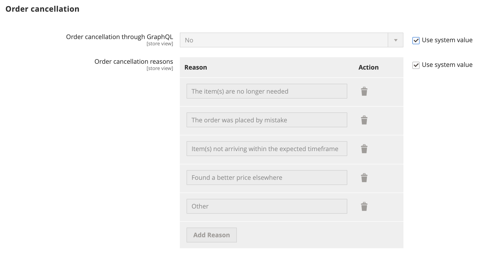

# 允许取消订单

启用后，您可以直接从客户帐户取消订单。 默认情况下禁用取消。

## 为订单启用的取消条件

- 此 _允许取消订单_ 必须启用配置选项。

- 如果订单已到 `Hold`， `Canceled`， `Complete`，或 `Closed` 状态，店面上的“取消”选项被禁用。

- 如果订单中的任何项目已发运，则店面将禁用取消选项。

- 如果存在已付款的项目，则会启用取消选项，并为该项目创建退款。

- 如果订单已到 `Pending` 或 `Processing` 状态，店面已启用取消选项。

## 配置以允许客户取消并自定义取消原因

1. 在 _管理员_ 侧栏，转到 **[!UICONTROL Stores]** > _[!UICONTROL Settings]_>**[!UICONTROL Configuration]**.

1. 在左侧面板中，展开 **[!UICONTROL Sales]** 并选择 **[!UICONTROL Sales]**.

1. 展开  该 **[!UICONTROL Order cancellation]** 部分。

   {width="600" zoomable="yes"}

1. 设置 **[!UICONTROL Order cancellation through GraphQL]** 到 `Yes`.

   此设置从店面的客户帐户启用取消功能。

1. 在 **[!UICONTROL Order Order cancellation reasons]** 您可以添加、删除或修改任何取消原因。

   使用此设置，当客户取消订单时，取消原因会显示在店面中。
请确保您至少指定了一个原因。

1. 单击 **[!UICONTROL Save Config]**.

## 从店面取消

客户可以从以下三个页面为特定订单启动取消功能：

- _我的订单_ 页面

- _订单视图_ 页面

- _我的帐户_ 页面

### 我的订单

此 _取消订单_ 如果可以取消订单，则按钮会显示在“我的订单”页中。

{width="700" zoomable="yes"}

### 订单查看页面

此 _取消订单_ 如果可以取消订单，则按钮将显示在“查看订单”页中。

{width="700" zoomable="yes"}

### 我的帐户

此 _取消订单_ 如果可以取消订单，按钮将显示在“我的帐户”页的“最近订单”部分。

{width="700" zoomable="yes"}

