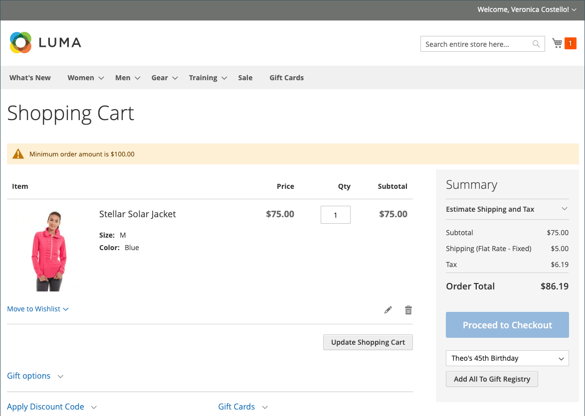

# 购物车配置

购物车配置决定了购物车如何为商店客户运行，包括何时将客户重定向到购物车页面以及哪些图像用于产品缩略图。 您还可以要求订单在结帐流程开始之前达到最小数量，指定报价保持有效的天数，并在&#x200B;_订单合计_&#x200B;部分中指定项目的顺序。

[**迷你购物车**](#mini-cart) — 配置此选项以确定购物车链接/图标是显示购物车中不同产品（或SKU）的数量，还是显示所有商品的总数量。

[**迷你购物车链接**](#configure-the-cart-link) — 配置此选项，以确定当客户单击商店页面顶部购物车图标中的项目数时，是否会显示迷你购物车。

[**重定向到购物车**](#redirect-to-cart) — 配置此选项，以确定每次将项目添加到购物车时，还是仅当客户选择转到购物车页面时才会显示购物车页面。

[**报价生命周期**](#quote-lifetime) — 配置此选项以指定价格的有效时间。

[**最小订单金额**](#minimum-order-amount) — 配置这些选项，以指定在应用折扣后需要满足订单小计的最小金额，以及购物车中显示的消息。

[**最小订货量**](#minimum-order-quantity) — 配置这些选项以指定下订单所需的最小物料数。

[**购物车缩略图**](#cart-thumbnails) — 配置购物车缩略图选项以确定购物车中显示的已分组或可配置产品的缩略图。

[**礼品选项**](#gift-options) — 配置礼品选项，以确定客户是否可以添加礼品消息或贺卡，以及是否存在可用的礼品包装选项。

>[!NOTE]
>
>有关配置签出过程的信息，请参阅[签出选项](checkout-process.md)。

## 迷你购物车

_迷你购物车_显示购物车中项目的摘要。 默认情况下，该设置处于启用状态，当您单击页面顶部的“购物车”链接时会显示该设置。
可将链接配置为显示购物车中不同产品（或SKU）的数量，或显示所有商品的总数量。

{width="700" zoomable="yes"}

>[!NOTE]
>
>对于&#x200B;_已注册_&#x200B;的客户，可能会出现迷你购物车无法自动跨多个设备和浏览器同步的情况。 在这种情况下，要同步迷你购物车，客户只需在该设备或浏览器上打开[购物车](cart.md)页面即可。

### 配置迷你购物车

1. 在&#x200B;_管理员_&#x200B;侧边栏上，转到&#x200B;**[!UICONTROL Stores]** > _[!UICONTROL Settings]_>**[!UICONTROL Configuration]**。

1. 在左侧面板中，展开&#x200B;**[!UICONTROL Sales]**&#x200B;并选择&#x200B;**[!UICONTROL Checkout]**。

1. 展开&#x200B;_[!UICONTROL Mini Cart]_部分的。

   {width="600" zoomable="yes"}

1. 如果该设置针对特定的存储视图，[请选择应用该配置的存储视图](../configuration-reference/scope-change.md#set-the-scope)。

   出现提示时，单击&#x200B;**[!UICONTROL OK]**&#x200B;继续。

1. 将&#x200B;**[!UICONTROL Display Mini Cart]**&#x200B;设置为以下项之一：

   - `Yes` — 在商店页面上显示迷你购物车。 侧栏的外观取决于主题。
   - `No` — 禁用在商店页面上显示迷你购物车。

1. 如果已启用显示，请更新其他选项以配置显示：

   - 对于&#x200B;**[!UICONTROL Number of Items to Display Scrollbar]**，输入触发滚动条之前可以显示在侧栏中的项目数。
   - 对于&#x200B;**[!UICONTROL Maximum Display Recently Added Item(s)]**，输入您希望在迷你购物车中显示的最近添加的项目的最大数量。

1. 单击&#x200B;**[!UICONTROL Save Config]**。

### 配置购物车链接

1. 在&#x200B;_管理员_&#x200B;侧边栏中，转到&#x200B;**[!UICONTROL Stores]** > _[!UICONTROL Settings]_>**[!UICONTROL Configuration]**。

1. 在左侧面板中，展开&#x200B;**[!UICONTROL Sales]**&#x200B;并选择&#x200B;**[!UICONTROL Checkout]**。

1. 展开&#x200B;**[!UICONTROL My Cart Link]**&#x200B;部分的。

1. 将&#x200B;**[!UICONTROL Display Cart Summary]**&#x200B;设置为以下设置之一：

   - `Display item quantities` — 此设置显示购物车中的产品总数，并添加每个产品的数量。
   - `Display number of items in cart` — 此设置显示购物车中的产品项目数，与数量无关。

   我的购物车链接的{width="600" zoomable="yes"}

1. 单击&#x200B;**[!UICONTROL Save Config]**。

## 重定向到购物车

可将购物车页面配置为在每次将项目添加到购物车时显示，或仅在客户选择转到该页面时显示。 有关购物车中当前商品的基本信息始终在[迷你购物车](#mini-cart)中提供。 该决策是一个平衡问题，即让客户继续购物带来的好处与鼓励客户结账带来的好处。 这可能是个人喜好的一个简单问题。 但是，如果要使用数字对其进行备份，则可以运行A/B测试，以查看哪种方法生成的转化率更高。

**_要配置购物车何时出现：_**

1. 在&#x200B;_管理员_&#x200B;侧边栏上，转到&#x200B;**[!UICONTROL Stores]** > _[!UICONTROL Settings]_>**[!UICONTROL Configuration]**。

1. 在左侧面板中，展开&#x200B;**[!UICONTROL Sales]**&#x200B;并选择&#x200B;**[!UICONTROL Checkout]**。

1. 展开&#x200B;**[!UICONTROL Shopping Cart]**&#x200B;部分的。

   {width="600" zoomable="yes"}

1. 如果该设置针对特定的存储视图，[请选择应用该配置的存储视图](../configuration-reference/scope-change.md#set-the-scope)。

   出现提示时，单击&#x200B;**[!UICONTROL OK]**&#x200B;继续。

1. 将&#x200B;**[!UICONTROL After Adding a Product Redirect to Shopping Cart]**&#x200B;设置为以下项之一：

   - `Yes` — 将产品添加到购物车后，立即显示购物车页面。
   - `No` — 在将产品添加到购物车后禁用重定向到购物车。

1. 单击&#x200B;**[!UICONTROL Save Config]**。

## 引用生命周期

在安装并启用Adobe Commerce B2B后，您可以添加对&#x200B;_报价_&#x200B;功能的支持。 此功能允许授权买方通过从购物车提交请求来启动价格洽谈流程。 _Quotes_&#x200B;网格列出了收到的每个报价，并维护了买卖双方之间的通信历史记录。 有关B2B功能的详细信息，请参阅&#x200B;_Adobe Commerce B2B User Guide_&#x200B;中的[协商报价](../b2b/quotes.md)。

您可以通过设置配置中的购物车报价生命周期来确定价格的有效时间。 例如，如果购物者在几天后离开购物车无人看管，则某些商品的报价可能不再相同。 默认情况下，报价生命周期设置为30天。

**_要配置报价生命周期：_**

1. 在&#x200B;_管理员_&#x200B;侧边栏上，转到&#x200B;**[!UICONTROL Stores]** > _[!UICONTROL Settings]_>**[!UICONTROL Configuration]**。

1. 在左侧面板中，展开&#x200B;**[!UICONTROL Sales]**&#x200B;并选择&#x200B;**[!UICONTROL Checkout]**。

1. 展开&#x200B;**[!UICONTROL Shopping Cart]**&#x200B;部分的。

   {width="600" zoomable="yes"}

1. 如果该设置针对特定的存储视图，[请选择应用该配置的存储视图](../configuration-reference/scope-change.md#set-the-scope)。

   出现提示时，单击&#x200B;**[!UICONTROL OK]**&#x200B;继续。

1. 对于&#x200B;**[!UICONTROL Quote Lifetime (days)]**，输入报价保持有效的天数。

1. 单击&#x200B;**[!UICONTROL Save Config]**。

## 最小订单金额

利用配置，可指定在应用折扣后需要满足订单小计的最小金额。 要达到每个地址的最低订单金额，可能需要向多个地址发运订单。 只有在达到最小订单量后，“结帐”按钮才可用。

{width="700" zoomable="yes"}

**_要配置最小订单金额：_**

1. 在&#x200B;_管理员_&#x200B;侧边栏上，转到&#x200B;**[!UICONTROL Stores]** > _[!UICONTROL Settings]_>**[!UICONTROL Configuration]**。

1. 在左侧面板中，展开&#x200B;**[!UICONTROL Sales]**&#x200B;并在下面选择&#x200B;**[!UICONTROL Sales]**。

1. 展开&#x200B;**[!UICONTROL Minimum Order Amount]**&#x200B;部分的。

   {width="600" zoomable="yes"}

1. 若要要求最小订单金额，请将&#x200B;**[!UICONTROL Enable]**&#x200B;设置为`Yes`。

1. 如果启用了最小订单，请设置以下选项以配置需求：

   - 输入小计在应用折扣后所需的&#x200B;**[!UICONTROL Minimum Amount]**。

   - 将&#x200B;**[!UICONTROL Include Discount Amount]**&#x200B;设置为以下项之一：

      - `Yes` — 要求小计满足包含任何折扣的最小金额。 以$50为最小值的示例，如果购物车中包含$60的上部并应用25%的折扣，则结果小计为$45，并且购物车不符合最小值。
      - `No` — 要求小计在不带任何折扣的情况下达到最小金额。

   - 将&#x200B;**[!UICONTROL Include Tax to Amount]**&#x200B;设置为以下项之一：

      - `Yes` — 要求小计满足含税的最小金额。
      - `No` — 要求小计达到不含税的最小金额。

1. （可选）自定义最小订单金额消息设置：

   - 对于&#x200B;**[!UICONTROL Description Message]**，输入要使用的文本，以自定义小计不符合最小数量时显示在购物车顶部的消息。

   - 对于&#x200B;**[!UICONTROL Error to Show in Shopping Cart]**，输入要用于自定义购物车错误消息的文本。

   将消息描述字段留空以使用默认消息。

1. 如果需要，请配置多地址订单的最小订单金额设置：

   - 若要要求多地址订单中的每个地址均满足最小订单金额，请将&#x200B;**[!UICONTROL Validate Each Address Separately in Multi-address Checkout]**&#x200B;设置为`Yes`。

   - （可选）自定义最小订单金额消息设置：

      - **[!UICONTROL Multi-address Description Message]** — 输入要用于自定义消息内容的文本，该消息会显示在购物车顶部不符合最小值的多个地址订单中。

      - **[!UICONTROL Multi-address Error to Show in Shopping Cart]** — 对于不符合最低要求的多地址订单，输入要用于自定义购物车错误消息的文本，请在框中输入文本。

     将消息描述字段留空以使用默认消息。

1. 单击&#x200B;**[!UICONTROL Save Config]**。

## 最小订货量

您可以设置订单允许的最小数量。 也可以根据每个客户组配置最小数量。

1. 转到&#x200B;**[!UICONTROL Stores]** > _[!UICONTROL Settings]_>**[!UICONTROL Configuration]**。

1. 在左侧面板中，展开&#x200B;**[!UICONTROL Catalog]**&#x200B;并选择&#x200B;**[!UICONTROL Inventory]**。

1. 展开&#x200B;**[!UICONTROL Product Stock Options]**&#x200B;部分的。

   {width="600" zoomable="yes"}

1. 对于&#x200B;**[!UICONTROL Minimum Qty Allowed in Shopping Cart]**，设置订单的最小产品数量。

   如果需要，请清除&#x200B;**[!UICONTROL Use system value]**&#x200B;复选框以修改这些设置。

   - 将&#x200B;**[!UICONTROL Customer Group]**&#x200B;设置更改为特定组，然后为该组输入&#x200B;**[!UICONTROL Minimum Qty]**。 要添加其他组和数量限制，请单击&#x200B;**[!UICONTROL Add Minimum Qty]**。

   - 若要为所有客户设置相同的最低数量限制，请保留`ALL GROUPS`选项并输入&#x200B;**[!UICONTROL Minimum Qty]**。

1. 单击&#x200B;**[!UICONTROL Save Config]**。

   购物车中的{width="700" zoomable="yes"}

## 购物车缩略图

(仅限Adobe Commerce)

购物车中显示的缩略图图像可为客户快速概述他们即将购买的项目。 但是，对于具有多个选项的产品，图像可能与购物车中产品的变体不匹配。 如果客户购买特定颜色的商品，理想情况下，购物车中的缩略图应该相匹配。

分组和可配置产品的缩略图图像均可以设置为显示“父”产品或产品变体的图像。

{width="700" zoomable="yes"}

**_要配置购物车缩略图：_**

1. 在&#x200B;_管理员_&#x200B;侧边栏上，转到&#x200B;**[!UICONTROL Stores]** > _[!UICONTROL Settings]_>**[!UICONTROL Configuration]**。

1. 在左侧面板中，展开&#x200B;**[!UICONTROL Sales]**&#x200B;并选择&#x200B;**[!UICONTROL Checkout]**。

1. 展开&#x200B;**[!UICONTROL Shopping Cart]**&#x200B;部分的。

   {width="600" zoomable="yes"}

1. 设置&#x200B;**[!UICONTROL Grouped Product Image]**&#x200B;以确定购物车中用于[分组产品](../catalog/product-create-grouped.md)的缩略图：

   - `Product Thumbnail Itself` — 使用分配给添加到购物车的产品变体的缩略图。
   - `Parent Product Thumbnail` — 使用分配给父产品的缩略图。

1. 设置&#x200B;**[!UICONTROL Configurable Product Image]**&#x200B;以确定购物车中用于[可配置产品](../catalog/product-create-configurable.md)的缩略图：

   - `Product Thumbnail Itself` — 使用分配给添加到购物车的产品变体的缩略图。
   - `Parent Product Thumbnail` — 使用分配给父产品的缩略图。

1. 单击&#x200B;**[!UICONTROL Save Config]**。

## 赠品选项

在结帐流程开始之前，购物车中会显示可用的礼品选项选项。 礼品选项配置确定客户是否可以添加礼品消息或贺卡，以及礼品包装选项是否可用。 订单中的每件物品都可以有单独的消息和礼品包装。 在对整个订单进行核销时，客户还可以添加礼品收据和贺卡。

{width="700" zoomable="yes"}

礼品选项配置适用于整个网站，但可以在产品级别覆盖。

### 启用礼品选项

1. 在&#x200B;_管理员_&#x200B;侧边栏上，转到&#x200B;**[!UICONTROL Stores]** > _[!UICONTROL Settings]_>**[!UICONTROL Configuration]**。

1. 在左侧面板中，展开&#x200B;**[!UICONTROL Sales]**&#x200B;并在下面选择&#x200B;**[!UICONTROL Sales]**。

1. 展开页面上的 **[!UICONTROL Gift Options]**。

   {width="600" zoomable="yes"}

1. 根据您的喜好设置礼品消息选项：

   - 对于&#x200B;**[!UICONTROL Allow Gift Messages on Order Level]**，选择`Yes`以启用整个订单的单个礼品消息。
   - 对于&#x200B;**[!UICONTROL Allow Gift Messages for Order Items]**，选择`Yes`以启用为客户购物车中的各个项目添加单独的礼品消息。

1. (仅限Adobe Commerce)根据您的偏好设置礼品包装选项：

   - 对于&#x200B;**[!UICONTROL Allow Gift Wrapping on Order Level]**，选择`Yes`以启用整个订单的单个礼品包装。
   - 对于&#x200B;**[!UICONTROL Allow Gift Wrapping for Order Items]**，选择`Yes`以启用将礼品包装单独添加到客户购物车中的每个项目。

   您还可以定义不同的[礼品包装设计](#gift-wrap)，以便客户可以选择包装。

1. (仅限Adobe Commerce)若要为客户提供包含礼品收据的选项，请将&#x200B;**[!UICONTROL Allow Gift Receipt]**&#x200B;设置为`Yes`。

1. (仅限Adobe Commerce)要为客户提供一个包含打印卡的选项，请将&#x200B;**[!UICONTROL Allow Printed Card]**&#x200B;设置为`Yes`。

1. (仅限Adobe Commerce)输入&#x200B;**[!UICONTROL Default Price for Printed Card]**。

1. 单击&#x200B;**[!UICONTROL Save Config]**。

### 礼品包装

(仅限Adobe Commerce)

礼品包装适用于任何可发运的产品，并且可以针对单个项目或整个订单提供。 您可以对每个礼品包装设计单独收费，并为购物车中作为产品选项显示的每个设计上传缩略图。 当客户单击礼品包装缩略图时，会显示全尺寸图像。 在结帐审核期间，礼品包装费用与&#x200B;_订单摘要_&#x200B;部分中的其他[结帐总计](checkout-totals-sort-order.md)一起显示。

礼品包装图像应是显示重复图案的色板，也可以包含要使用的带子示例。 您可以扫描纸张，或者为包装好的包裹拍照。 上传的图像可以是GIF、JPG或PNG图像，并且应为正方形。 在以下示例中，上传的礼品包装图像为230 x 230像素。

购物车中的{width="700" zoomable="yes"}

#### 添加礼品包装设计

1. 在&#x200B;_管理员_&#x200B;侧边栏上，转到&#x200B;**[!UICONTROL Stores]** > _[!UICONTROL Other Settings]_>**[!UICONTROL Gift Wrapping]**。

   {width="700" zoomable="yes"}

1. 单击右上角的&#x200B;**[!UICONTROL Add Gift Wrapping]**。

1. 输入签出期间显示的&#x200B;**[!UICONTROL Gift Wrapping Design]**&#x200B;的名称。

   如果需要，您可以更改&#x200B;**[!UICONTROL Scope]**&#x200B;并为每个存储视图配置不同的名称。

1. 选择可用礼品包装设计的&#x200B;**[!UICONTROL Websites]**。

1. 将&#x200B;**[!UICONTROL Status]**&#x200B;设置为`Enabled`。

   如果您有季节性换行选项，则可以在不希望该选项可用时将它设置为`Disabled`。

1. 输入礼品包装设计的&#x200B;**[!UICONTROL Price]**。

   此设置可以由产品层设置的礼品包装价格覆盖。

   {width="600" zoomable="yes"}

1. 要上传礼品包装的缩略图&#x200B;**[!UICONTROL Image]**，请单击&#x200B;**[!UICONTROL Choose File]**&#x200B;并从目录中选择要上传的文件。

   保存记录后，_[!UICONTROL Gift Wrapping Information]_中将显示该图像的缩略图。

1. 单击&#x200B;**[!UICONTROL Save]**。

#### 编辑礼品包装设计

1. 在&#x200B;_管理员_&#x200B;侧边栏上，转到&#x200B;**[!UICONTROL Stores]** > _[!UICONTROL Other Settings]_>**[!UICONTROL Gift Wrapping]**。

1. 在列表中查找礼品包装记录。

1. 在&#x200B;_操作_&#x200B;列中，单击&#x200B;**[!UICONTROL Edit]**。

   {width="600" zoomable="yes"}

1. 进行必要的更改。

1. 单击&#x200B;**[!UICONTROL Save]**。

#### 删除礼品包装设计

打开&#x200B;_礼品包装_&#x200B;网格后，请使用以下方法之一删除包装设计。

**_方法1：删除单个礼品包装设计_**

1. 在编辑模式下打开礼品包装设计。

1. 在工作区顶部，单击&#x200B;**[!UICONTROL Delete]**。

1. 出现提示时，单击&#x200B;**[!UICONTROL OK]**&#x200B;确认。

**_方法2：删除多个礼品包装设计_**

1. 在&#x200B;_礼品包装_&#x200B;网格中，选中要删除的每个礼品包装设计的复选框。

1. 将&#x200B;**[!UICONTROL Actions]**&#x200B;控件设置为`Delete`。

1. 单击&#x200B;**[!UICONTROL Submit]**。

### 赠品期权税

(仅限Adobe Commerce)

礼品包装和打印的礼品卡价格可以配置为含税或免税，或者同时显示这两个选项。 您还可以在全局或网站级别为这些项目指定税分类。

**_要配置赠品期权税：_**

1. 在&#x200B;_管理员_&#x200B;侧边栏上，转到&#x200B;**[!UICONTROL Stores]** > _[!UICONTROL Settings]_>**[!UICONTROL Configuration]**。

1. 在左侧面板中，展开&#x200B;**[!UICONTROL Sales]**&#x200B;并选择&#x200B;**[!UICONTROL Tax]**。

1. 展开&#x200B;**[!UICONTROL Tax Classes]**&#x200B;部分的。

   {width="600" zoomable="yes"}

1. 将&#x200B;**[!UICONTROL Tax Class for Gift Options]**&#x200B;设置为适用的税类。

1. 展开&#x200B;**[!UICONTROL Orders, Invoices, Credit Memos Display Settings]**&#x200B;部分的。

   {width="600" zoomable="yes"}

1. 将&#x200B;**[!UICONTROL Display Gift Wrapping Prices]**&#x200B;设置为以下项之一：

   - `Excluding Tax`
   - `Including Tax`
   - `Including and Excluding Tax`

1. 将&#x200B;**[!UICONTROL Display Printed Card Prices]**&#x200B;设置为以下项之一：

   - `Excluding Tax`
   - `Including Tax`
   - `Including and Excluding Tax`

1. 单击&#x200B;**[!UICONTROL Save Config]**。
