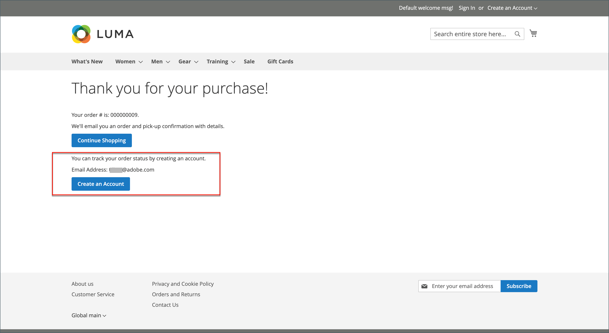

# 来宾结帐

您的商店可以配置为要求购物者在购买之前开立帐户。 默认设置允许来宾进行购买，并允许在来宾完成结账过程后注册帐户。

{width="600" zoomable="yes"}

**_要禁用来宾签出：_**

1. 在&#x200B;_管理员_&#x200B;侧边栏上，转到&#x200B;**[!UICONTROL Stores]** > _[!UICONTROL Settings]_>**[!UICONTROL Configuration]**。

1. 在左侧面板上，展开&#x200B;**[!UICONTROL Sales]**&#x200B;并选择&#x200B;**[!UICONTROL Checkout]**。

1. 展开&#x200B;**[!UICONTROL Checkout Options]**&#x200B;部分的。

   {width="700" zoomable="yes"}

有关每个配置设置的详细说明，请参阅&#x200B;_配置参考指南_&#x200B;中的[签出选项](../configuration-reference/sales/checkout.md#checkout-options)。

1. 如果该设置针对特定的存储视图，[请选择应用该配置的存储视图](../configuration-reference/scope-change.md#set-the-scope)。

   出现提示时，单击&#x200B;**[!UICONTROL OK]**&#x200B;继续。

1. 将&#x200B;**[!UICONTROL Allow Guest Checkout]**&#x200B;设置为`No`。

   如有必要，请清除&#x200B;**[!UICONTROL Use system value]**&#x200B;复选框以启用对此设置的更改。

1. 单击&#x200B;**[!UICONTROL Save Config]**。
