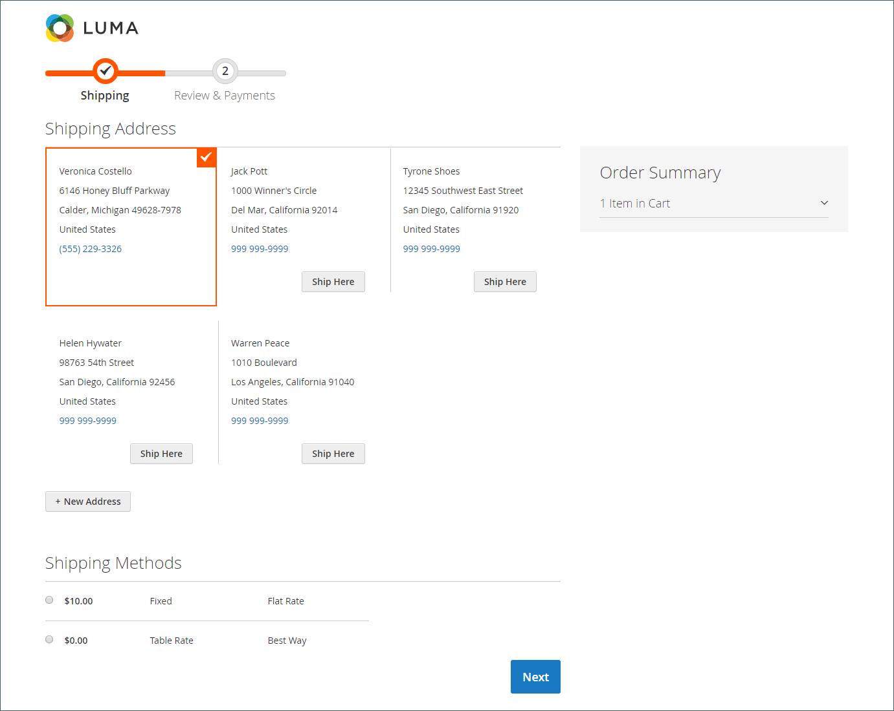
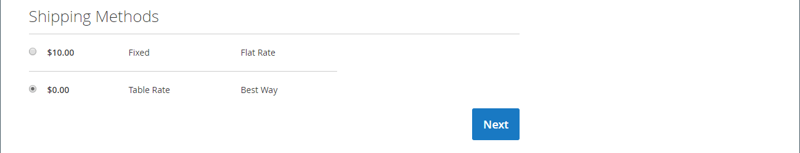
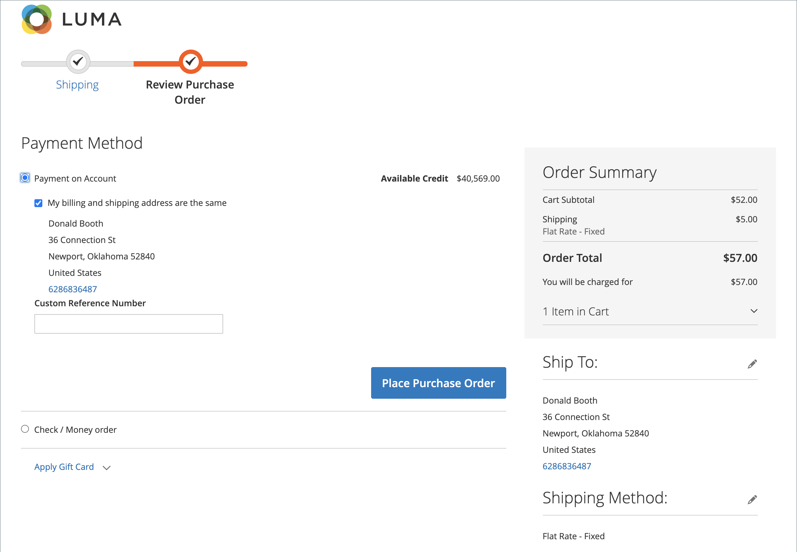
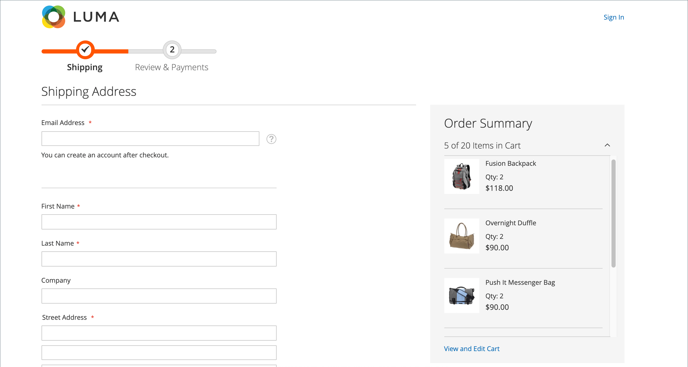

# 结账流程和选项

当结账过程开始时，交易转移到安全、加密的渠道。 浏览器地址栏中出现挂锁符号，且URL从`http`更改为`https`。

## 进程

结帐流程的目标是收集完成事务处理所需的信息。 _结帐_&#x200B;页面将引导客户完成此过程的每个步骤。 登录到其帐户的客户可以快速完成结帐，因为许多信息都已在他们的帐户中。 与使用采购订单的公司帐户关联的客户的工作流略有不同。

### 配送

结账流程的第一步是让客户填写送货地址信息，并选择送货方式。 如果客户有帐户，则系统会自动输入送货地址，但如有需要，可以更改送货地址。

 (仅限Adobe Commerce)收件人和发件人的街道地址的格式由[客户地址属性](../customers/address-attributes.md)的属性决定。 输入验证设置确定可在送货地址中使用的有效字符。

结帐流程的每个步骤均在页面顶部的进度栏后面显示，“订单摘要”会显示目前输入的信息。

在结帐过程中{width="600" zoomable="yes"}

#### 发送到其他地址

1. 如果通讯簿中有附加条目，客户将查找要发运订单的地址。

1. 要选择地址，请单击&#x200B;**[!UICONTROL Ship Here]**。

#### 添加地址

1. 在&#x200B;_[!UICONTROL Shipping Address]_&#x200B;部分的底部，客户单击&#x200B;**[!UICONTROL + New Address]**。

1. 完成&#x200B;_[!UICONTROL Shipping Address]_&#x200B;表单。

   默认情况下，客户的名字和姓氏最初显示在表单中。

   {width="600" zoomable="yes"}

1. 要将新地址保存在通讯簿中，客户将选中表单底部的复选框。

1. 单击&#x200B;**[!UICONTROL Save Address]**。

   新地址现在被选为送货地址。

   {width="600" zoomable="yes"}

#### 选择配送方式

1. 在[发货](delivery.md)方法的列表中，客户选择要使用的选项。

   {width="600" zoomable="yes"}

1. 单击&#x200B;**[!UICONTROL Next]**&#x200B;继续。

### 复查和付款 — 正常订单

在结帐流程的第二步中，客户选择[付款方式](payments.md)，并将任何带有促销代码的优惠券应用到购买中。 所有信息都可以进行审核和编辑（如果需要）。 如果启用，客户必须在下订单前同意销售条款和条件。

>[!NOTE]
>
>虽然Commerce允许配置多个优惠券代码，但客户只能将一个优惠券代码应用于购物车。 （有关详细信息，请参阅[优惠券代码](../merchandising-promotions/price-rules-cart-coupon.md)。）

{width="700" zoomable="yes"}

### 复查和付款 — 采购订单

(仅适用于Adobe Commerce B2B)

当客户与已启用[采购订单](../b2b/purchase-order-flow.md)的公司关联时，所有订单都将作为采购订单处理。 可用的支付方式由公司帐户设置决定。

1. 客户选择付款方式。

   使用&#x200B;_帐户付款_&#x200B;方法时，[!UICONTROL Custom Reference Number]字段可用于引用发票编号。

1. 客户单击&#x200B;**[!UICONTROL Place Purchase Order]**。

   已下达采购订单。

如果公司已设置[审批规则](../b2b/account-dashboard-approval-rules.md)，则采购订单将完成审批流程。 否则，将立即处理它。

{width="700" zoomable="yes"}

### 订单汇总中显示的项目数

管理员用户可以在结账时更改订单摘要中显示的最大项目数，以简化产品的显示。 默认情况下，此值设置为10。

{width="700" zoomable="yes"}

1. 在&#x200B;_管理员_&#x200B;侧边栏上，转到&#x200B;**[!UICONTROL Stores]** > _[!UICONTROL Settings]_>**[!UICONTROL Configuration]**。

1. 在左侧面板中，展开&#x200B;**[!UICONTROL Sales]**&#x200B;并选择&#x200B;**[!UICONTROL Checkout]**。

1. 展开&#x200B;**[!UICONTROL Checkout Options]**&#x200B;部分的。

1. 对于&#x200B;**[!UICONTROL Maximum Number of Items to Display in Order Summary]**，输入要显示的最大项数。

1. 单击&#x200B;**[!UICONTROL Save Config]**。

   通过此更新，结帐期间显示的订单汇总将限制为指定的物料数量。

### 订单确认

订单确认会在下单后显示。 对于已注册的客户，该页面包括订单编号，该编号带有指向客户帐户的链接，以及用于生成收据的链接。 注册客户将收到通过电子邮件发送的订单确认和跟踪信息。 我们鼓励来宾创建帐户来跟踪订单。 注册客户可以通过单击链接来生成收据。

订单确认页面也称为&#x200B;_Success_&#x200B;页面，由分析程序用于跟踪转化。

{width="700" zoomable="yes"}

## 签出选项

签出选项控制签出页面的各种属性，包括布局。 您可以配置一些选项来限制结帐，包括允许访客结帐以及强制实施条款和条件协议。 此外，还有用于在结账过程中控制信息显示的选项。

{width="700" zoomable="yes"}

有关每个配置设置的详细说明，请参阅&#x200B;_配置参考指南_&#x200B;中的[签出选项](../configuration-reference/sales/checkout.md#checkout-options)。

### 更改签出选项

1. 在&#x200B;_管理员_&#x200B;侧边栏上，转到&#x200B;**[!UICONTROL Stores]** > _[!UICONTROL Settings]_>**[!UICONTROL Configuration]**。
1. 在左侧面板上，展开&#x200B;**[!UICONTROL Sales]**&#x200B;并选择&#x200B;**[!UICONTROL Checkout]**。
1. 根据需要设置以下任一选项。
1. 单击&#x200B;**[!UICONTROL Save Config]**。

1. 展开&#x200B;**[!UICONTROL Checkout Options]**&#x200B;部分的。

1. 如果设置针对特定的商店视图，请[选择应用配置的商店视图](../configuration-reference/scope-change.md#set-the-scope)。

   出现提示时，单击&#x200B;**[!UICONTROL OK]**&#x200B;继续。

1. 设置签出选项。

1. 单击&#x200B;**[!UICONTROL Save Config]**。

### 可用的签出选项

| 字段 | [作用域](../getting-started/websites-stores-views.md#scope-settings) | 描述 |
|--- |--- |--- |
| [!UICONTROL Enable Onepage Checkout] | 商店视图 | 确定[单页签出](checkout-one-page.md)是否为默认签出格式。 选项：是/否 |
| [!UICONTROL Allow Guest Checkout] | 商店视图 | 确定访客是否可以在未向应用商店注册[&#128279;](checkout-guest.md)帐户的情况下进行签出。 选项： `Yes` / `No` |
| [!UICONTROL Enable Terms and Conditions] | 商店视图 | 确定客户在购买之前是否需要同意销售的[条款和条件](terms-and-conditions.md)。 选项： `Yes` / `No` |
| [!UICONTROL Display Billing Address On] | 商店视图 | 确定结帐时帐单地址的位置。 选项： `Payment Method` / `Payment Page` |
| [!UICONTROL Maximum Number of Items to Display in Order Summary] | 商店视图 | 确定结帐期间可在“订单摘要”中显示的最大项目数。 默认值为`10`。 |
| [!UICONTROL Enable Address Search] | 网站 | (仅限Adobe Commerce)确定客户是否可以对&#x200B;_送货_&#x200B;和&#x200B;_审核与付款_&#x200B;步骤使用[地址搜索](checkout-address-search.md)功能。 启用此功能后，使用&#x200B;_[!UICONTROL Number of Customer Addresses Limit]_&#x200B;设置签出期间激活此功能所需的已保存地址数。 选项： `Yes` / `No` |
| [!UICONTROL Number of Customer Addresses Limit] | 网站 |  (仅限Adobe Commerce)当地址搜索为&#x200B;**[!UICONTROL Enabled]**&#x200B;时，将确定在签出期间激活此功能所需的已保存地址数。 当客户的已保存地址数达到或超过该数字时，将在&#x200B;_送货_&#x200B;和&#x200B;_审核和付款_&#x200B;步骤中仅呈现默认地址。 客户可以使用搜索功能更改所选地址。 默认值为10。 |

{style="table-layout:auto"}
