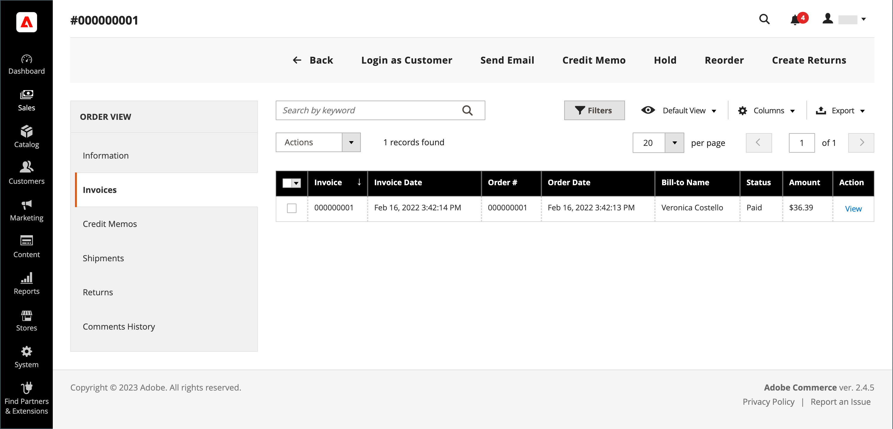
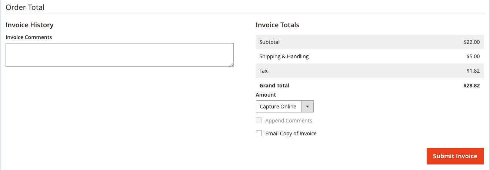
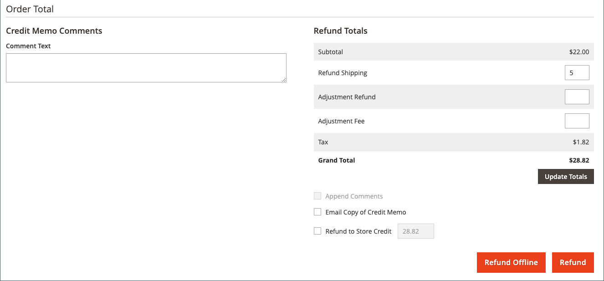
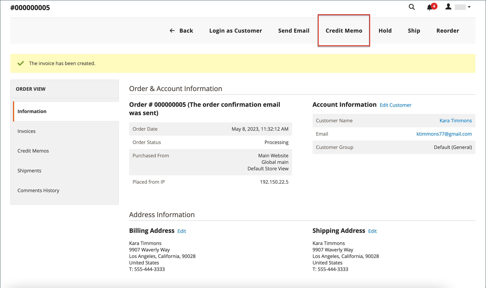
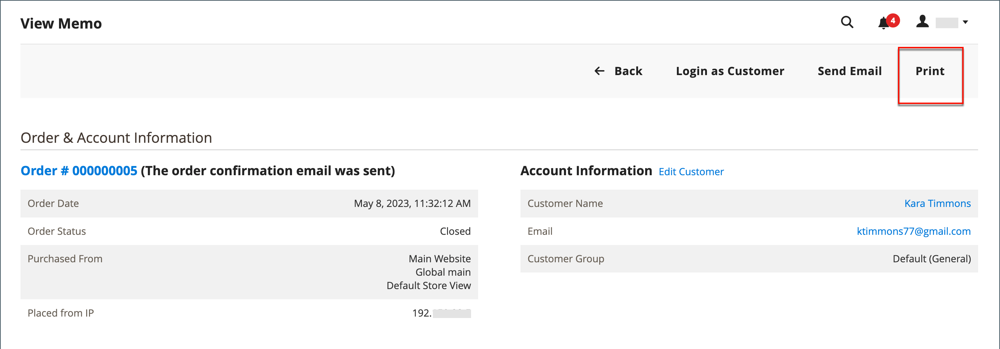

# 发出贷项通知单

必须先为[开票订单](invoices.md#create-an-invoice)生成贷项通知单，然后才能打印贷项通知单。 根据付款方式，您可以从未结贷项通知单中发放联机和脱机退款（部分或全部）。

- (仅限Adobe Commerce)退款可用于存储积分。
- (可与Adobe Commerce B2B配合使用)退款可应用于公司信用。
- 信用卡购物可在线或离线退款。
- 通过支票或汇票进行的购买必须离线退款。

任何状态为[未结状态](order-status.md)的贷项通知单均具有未结的应付退款。

通过贷项通知单，您可以：

- 退回发票的全部金额。
- 退回发票的部分金额。
- 退回发票的多个部分金额。
- 按订单退款多张发票，不得超过订单总额。
- 退回一个行项目的一部分数量，如订单中五件衬衫中的三件。

有关详细信息，请参阅[创建发票](invoices.md#create-an-invoice)。

## 付款活动设置

由信用卡支付的订单的退款工作流由每个可用付款方法的配置中的[付款活动设置](../configuration-reference/sales/payment-methods.md#payment-actions)确定。 在交易结算之前，不能发放退款。

{width="600" zoomable="yes"}

- 如果将您配置的付款方法的付款活动设置为`Authorize`，则必须先从管理员生成发票，然后才能创建贷项通知单。
- 如果将您配置的付款方法的“付款活动”设置为`Authorize and Capture`，则付款处理程序已生成发票，但在结算交易记录之前，资金不可用。 这种短暂的等待时间是许多支付处理商推荐的安全措施，通常可以自动处理。 您也可以通过付款处理员从您的商家帐户中人工结算事务处理。
- (仅限Adobe Commerce)如果您为包含礼品选项的订单创建贷项通知单，则礼品包装和/或打印卡的退款将显示在贷项通知单的“退款合计”部分。 要从要退款的金额中排除这些成本，请将该金额输入为调整费用。 如果为同一订单发放了多个贷项通知单，则礼品选项的退款将仅显示在第一个贷项通知单中。

## 创建贷项通知单

确定要发出的退款类型（对于[信用购买](#issue-a-refund-for-a-credit-purchase)或[支票或汇票](#issue-an-offline-refund-for-check-or-money-order)），并生成贷项通知单和发出退款。

### 为信用购买发出退款

1. 在&#x200B;_管理员_&#x200B;侧边栏上，转到&#x200B;**[!UICONTROL Sales]** > **[!UICONTROL Orders]**。

   {width="700" zoomable="yes"}

1. 在网格中查找顺序，然后单击&#x200B;**[!UICONTROL View]**。

1. 如果&#x200B;_[!UICONTROL Credit Memo]_按钮在按钮栏中可见，请执行以下操作之一：

   - 要发放`offline`退款，请转到第#6步。
   - 要发放`online`退款，请继续执行步骤#4。

   有关离线和在线退款的更多信息，请参阅[贷项通知单](credit-memos.md)。

1. 单击左侧面板中的&#x200B;**[!UICONTROL Invoices]**。

1. 在网格中查找发票，然后单击&#x200B;**[!UICONTROL View]**。

   {width="700" zoomable="yes"}

1. 向下滚动到发票的&#x200B;**[!UICONTROL Invoice Totals]**&#x200B;部分，验证发票是否设置为`Capture Online`，然后单击&#x200B;**[!UICONTROL Submit Invoice]**。

   {width="600" zoomable="yes"}

   如果该选项不可用，则表示已创建发票。 继续执行下一步。

1. 在发票顶部的按钮栏中，单击&#x200B;**[!UICONTROL Credit Memo]**。

1. 验证&#x200B;**[!UICONTROL Items to Refund]**&#x200B;部分中的信息并执行以下操作（如果适用）：

   - 要将产品返回到清单，请选中&#x200B;**[!UICONTROL Return to Stock]**&#x200B;复选框。

     如果&#x200B;_产品股票期权_&#x200B;设置为`Automatically Return Credit Memo Item to Stock`，则产品会自动退货。 启用[Inventory management](../inventory-management/enable.md)后，该项将返回到发送装运的源。

   - 更新&#x200B;**[!UICONTROL Qty to Refund]**，然后单击&#x200B;**[!UICONTROL Update Qty's]**。

     要退款的{width="600" zoomable="yes"}

1. 按如下方式更新&#x200B;**[!UICONTROL Refunds Totals]**&#x200B;部分：

   - 对于&#x200B;**[!UICONTROL Refund Shipping]**，输入任何要从运费中退款的金额。

     此字段最初显示订单中可退款的总发运金额。 它等于订单中的全部运费减去任何已退款的运费金额。 与数量一样，数量可以减少，但不能增加。

   - 对于&#x200B;**[!UICONTROL Adjustment Refund]**，输入要添加至退款总额的值，作为不适用于订单任何特定部分（运费、项目或税）的额外退款。 当管理员希望首先退款非虚拟支付方法时，还可以使用虚拟货币（例如礼品卡）进行部分退款。

     输入的金额不能使总退款高于已付金额。

   - 对于&#x200B;**[!UICONTROL Adjustment Fee]**，输入要从退款总额中减去的值。

     此金额不会从订单的特定部分（如运费、项目或税）中扣除。

1. 要添加评论，请在&#x200B;**[!UICONTROL Credit Memo Comments]**&#x200B;框中输入文本。

   - 若要向客户发送电子邮件通知，请选中&#x200B;**[!UICONTROL Email Copy of Credit Memo]**&#x200B;复选框。

1. 单击&#x200B;**[!UICONTROL Update Totals]**。

1. 根据需要，执行以下操作：

   - (仅限Adobe Commerce)要退回客户商店贷记金额，请选中&#x200B;**[!UICONTROL Refund to Store Credit]**&#x200B;复选框。

   - (与Adobe Commerce B2B一起提供)要退回客户的公司积分金额，请选中&#x200B;**[!UICONTROL Refund to Company Credit]**&#x200B;复选框。

   - 若要发出离线退款，请单击&#x200B;**[!UICONTROL Refund Offline]**。

   - 若要在线退款，请单击&#x200B;**[!UICONTROL Refund]**。

   - (与Adobe Commerce B2B一起提供)如果购买是以公司信用支付的，请单击&#x200B;**[!UICONTROL Refund to Company Credit]**。

   有关离线和在线退款的更多信息，请参阅[贷项通知单](credit-memos.md)。

   {width="600" zoomable="yes"}

### 签发支票或汇票的脱机退款

1. 在&#x200B;_管理员_&#x200B;侧边栏上，转到&#x200B;**[!UICONTROL Sales]** > **[!UICONTROL Orders]**。

1. 在网格中查找已完成的订单，然后单击&#x200B;**[!UICONTROL View]**&#x200B;链接将其打开。

1. 在页面顶部的按钮栏中，单击&#x200B;**[!UICONTROL Invoice]**。

1. 向下滚动到页面底部，然后单击&#x200B;**[!UICONTROL Submit Invoice]**。

1. 在发票顶部的按钮栏中，单击&#x200B;**[!UICONTROL Credit Memo]**。

   {width="600" zoomable="yes"}

1. 验证&#x200B;**[!UICONTROL Items to Refund]**&#x200B;部分中的信息并执行以下操作（如果适用）：

   要退款的{width="600" zoomable="yes"}

   - 如果要将返回的产品返回到清单，请选中&#x200B;**[!UICONTROL Return to Stock]**&#x200B;复选框。

     启用Inventory management后，库存数量将返回到发送发运的来源。 如果[产品股票期权](../inventory-management/enable.md)设置为`Automatically Return Credit Memo Item to Stock`，则产品会自动退货。

   - 更新&#x200B;**[!UICONTROL Qty to Refund]**&#x200B;并单击&#x200B;**[!UICONTROL Update Qty's]**。

     要贷记的金额不能超过可用于退款的最大金额。

1. 更新&#x200B;**[!UICONTROL Refunds Totals]**&#x200B;部分（如果适用）：

   - 对于&#x200B;**[!UICONTROL Refund Shipping]**，输入任何要从运费中退款的金额。

     此字段最初显示订单中可退款的总发运金额。 它等于订单中的全部运费减去任何已退款的运费金额。 与数量一样，数量可以减少，但不能增加。

   - 对于&#x200B;**[!UICONTROL Adjustment Refund]**，输入要添加至退款总额的值，作为不适用于订单任何特定部分（运费、项目或税）的额外退款。 当管理员希望首先退款非虚拟支付方法时，还可以使用虚拟货币（例如礼品卡）进行部分退款。

     输入的金额不能使总退款高于已付金额。

   - 对于&#x200B;**[!UICONTROL Adjustment Fee]**，输入要从退款总额中减去的值。

     此金额不会从订单的特定部分（如运费、项目或税）中扣除。

   - 如果购买是以商店贷记支付的，请选中&#x200B;**[!UICONTROL Refund to Store Credit]**&#x200B;复选框以将金额贷记到客户帐户余额。

1. 要添加评论，请在&#x200B;**[!UICONTROL Credit Memo Comments]**&#x200B;框中输入文本并执行以下操作：

   - 若要向客户发送电子邮件通知，请选中&#x200B;**[!UICONTROL Email Copy of Credit Memo]**&#x200B;复选框。

   - 若要在电子邮件中包含您输入的评论，请选中&#x200B;**[!UICONTROL Append Comments]**&#x200B;复选框。

     贷项通知单的状态将显示在已完成的贷项通知单中，该贷项通知单编号旁边。

     {width="600" zoomable="yes"}

1. 要完成此过程并发出退款，请单击&#x200B;**[!UICONTROL Refund Offline]**。

## 字段描述

### [!UICONTROL Order & Account Information]

| 字段 | 描述 |
|--- |--- |
| [!UICONTROL Order Number] | 订单编号显示在&#x200B;_订单和帐户信息_&#x200B;中，后面是指示是否已发送确认电子邮件的注释。 |
| [!UICONTROL Order Date] | 下订单的日期和时间。 |
| [!UICONTROL Order Status] | 将订单状态指示为`Complete`。 |
| [!UICONTROL Purchased From] | 指示下订单的网站、商店和商店视图。 |
| [!UICONTROL Placed from IP] | 指示下达订单的计算机的IP地址。 |

{style="table-layout:auto"}

### [!UICONTROL Account Information]

| 字段 | 描述 |
|--- |--- |
| [!UICONTROL Customer Name] | 下订单的客户或购买者的名称。 客户名称链接到客户个人资料。 |
| [!UICONTROL Email] | 客户或买方的电子邮件地址。 已链接电子邮件地址以打开新的电子邮件。 |
| [!UICONTROL Customer Group] | 客户分配到的客户组或共享目录的名称。 |
| [!UICONTROL Company Name] | (适用于Adobe Commerce B2B)与买方关联并代表其下达订单的公司名称。 公司名称链接到公司配置文件。 |

{style="table-layout:auto"}

### [!UICONTROL Address Information]

| 字段 | 描述 |
|--- |--- |
| [!UICONTROL Billing Address] | 下订单的客户或购买者的姓名，后跟帐单地址、电话号码和[VAT](vat.md)（如果适用）。 电话号码链接到移动设备上的自动拨号。 |
| [!UICONTROL Shipping Address] | 订单应发送到的人员的姓名，以及发送地址和电话号码。 电话号码链接到移动设备上的自动拨号。 |

{style="table-layout:auto"}

### [!UICONTROL Payment & Shipping Method]

| 字段 | 描述 |
|--- |--- |
| [!UICONTROL Payment Information] | 用于订单的付款方式以及采购订单编号（如果适用），后跟用于下订单的币种。 如果使用[帐户付款](../b2b/enable-basic-features.md#configure-payment-on-account)将订单记入公司贷项，则会显示记入帐户的金额。 |
| [!UICONTROL Shipping & Handling Information] | 要使用的配送方式以及适用的任何手续费。 |

{style="table-layout:auto"}

### [!UICONTROL Items to Refund]

| 字段 | 描述 |
|--- |--- |
| [!UICONTROL Product] | 产品名称、SKU和选项（如果适用）。 |
| [!UICONTROL Price] | 物料的采购价。 对于Adobe Commerce B2B，此值反映从共享目录应用于项目的任何折扣（如果适用）。 |
| [!UICONTROL Qty] | 订购的数量。 |
| [!UICONTROL Return to Stock] | 指示是否将返回的项目退回Stock的复选框。 |
| [!UICONTROL Qty to Refund] | 指示产品返回的单位数。 |
| [!UICONTROL Subtotal] | 小计是采购价格乘以退货的产品件数。 |
| [!UICONTROL Tax Amount] | 以小数值形式应用于返回项目的税额。 |
| [!UICONTROL Tax Percent] | 以百分比形式应用于退货项目的税百分比。 |
| [!UICONTROL Discount Amount] | 适用于退回物料的任何折扣。 |
| [!UICONTROL Row Total] | 行项目合计，包括退货产品层到期的适用税减去折扣。 |
| _订单总计_ |  |

{style="table-layout:auto"}

### [!UICONTROL Credit Memo Comments]

| 字段 | 描述 |
|--- |--- |
| [!UICONTROL Comment Text] | 用于向客户输入有关贷项通知单的注释的文本框。 |

{style="table-layout:auto"}

### [!UICONTROL Refund Totals]

| 字段 | 描述 |
|--- |--- |
| [!UICONTROL Refund Shipping] | 要退款的运输金额。 |
| [!UICONTROL Adjustment Refund] | 在退款总额中添加的金额，作为不适用于订单任何特定部分（例如运费、项目或税）的额外退款。 输入的金额不能使总退款高于已付金额。 |
| [!UICONTROL Adjustment Fee] | 从退款总额中减去的金额，如重新入库费用，或与礼品包装或礼品选项相关的金额。 |
| [!UICONTROL Grand Total] | 要退款的总金额 |
| [!UICONTROL Append Comments] | 确定贷项通知单中是否包括备注的复选框。 |
| [!UICONTROL Email Copy of Credit Memo] | 确定是否已通过电子邮件发送贷项通知单副本的复选框。 |
| [!UICONTROL Refund to Store Credit] |  (仅限Adobe Commerce)确定是否将总计退款给[商店积分](../customers/store-credit-using.md)的复选框。 |
| [!UICONTROL Subtotal] | (与Adobe Commerce B2B一起提供)要退款的所有行项目的总数。 |

{style="table-layout:auto"}

### 退款按钮

用于订单的付款方法确定可用于贷项通知单的退款按钮。

| 按钮 | 描述 |
|--- |--- |
| **[!UICONTROL Refund]** | 如果原始购买是通过支付网关由信用卡支付的，则退款金额由支付处理器管理。 要管理退款，请参阅您的支付提供商提供的文档。 |
| **[!UICONTROL Refund Offline]** | 如果最初购买是支票或汇票支付的，退款将直接支付给客户，如果您有实体店面，则通过签发支票、礼品卡或现金支付。 贷项通知单用作脱机事务处理的记录。 |
| **[!UICONTROL Refund to Company Credit]** | (与Adobe Commerce B2B一起提供)如果购买费用计入公司贷项，则退款将返回到[公司帐户](../b2b/credit-company.md)。 |

{style="table-layout:auto"}

## 打印贷项通知单

要打印或查看已完成的贷项通知单，您必须安装PDF阅读器。 您可以免费下载[Adobe Reader][1]。

1. 在&#x200B;_管理员_&#x200B;侧边栏上，转到&#x200B;**[!UICONTROL Sales]** > _[!UICONTROL Operations]_>**[!UICONTROL Credit Memos]**。

1. 使用以下方法之一打印贷项通知单：

### 方法1：打印当前贷项通知单

1. 在网格中，打开贷项通知单。

1. 单击&#x200B;**[!UICONTROL Print]**。

   {width="600" zoomable="yes"}

### 方法2：打印多个贷项通知单

1. 在列表中，选中要打印的每个贷项通知单的复选框。

1. 将&#x200B;**[!UICONTROL Actions]**&#x200B;控件设置为`PDF Credit Memos`并单击&#x200B;**[!UICONTROL Submit]**。

   {width="600" zoomable="yes"}

1. 出现提示时，请执行下列操作之一：

   - 要保存文档，请单击&#x200B;**[!UICONTROL Save]**&#x200B;并按照提示将文件保存到计算机。 下载完成后，在Adobe Reader中打开PDF并打印文档。

   - 要查看文档，请单击&#x200B;**[!UICONTROL Open]**。 将在Adobe Reader中打开打印就绪的PDF贷项通知单。 在此处，您可以打印贷项通知单或将其保存到您的计算机。

[1]: https://www.adobe.com/acrobat/pdf-reader.html "获取Adobe Reader"
