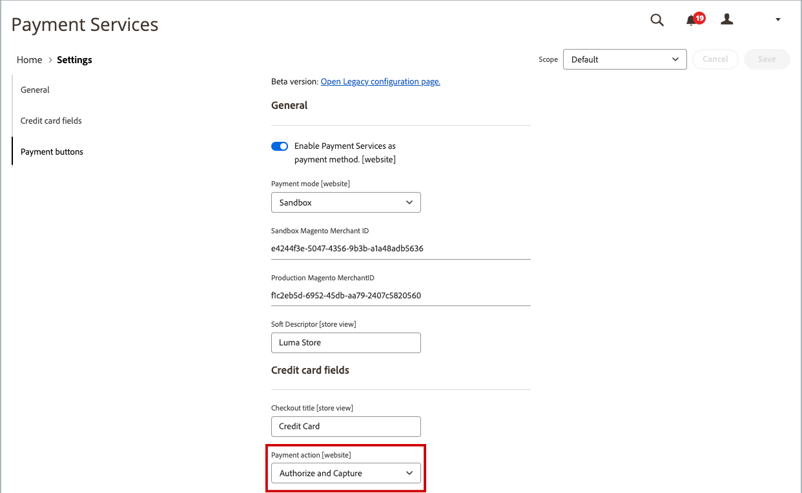

# 发出贷项通知单

必须先为生成贷项通知单，然后才能打印贷项通知单 [已开票订单](invoices.md#create-an-invoice). 根据付款方式，您可以从未结贷项通知单中发放联机和脱机退款（部分或全部）。

-  (仅限Adobe Commerce)退款可用于存储贷项。
-  (在Adobe Commerce B2B中提供)退款可用于公司信贷。
- 信用卡购物可在线或离线退款。
- 通过支票或汇票进行的购买必须离线退款。

任何具有的贷项通知单 [打开状态](order-status.md) 有未清退款。

通过贷项通知单，您可以：

- 退回发票的全部金额。
- 退回发票的部分金额。
- 退回发票的多个部分金额。
- 按订单退款多张发票，不得超过订单总额。
- 退回一个行项目的一部分数量，如订单中五件衬衫中的三件。

请参阅 [创建发票](invoices.md#create-an-invoice) 以了解更多信息。

## 付款活动设置

由信用卡支付的订单的退款工作流由 [付款活动设置](../configuration-reference/sales/payment-methods.md#payment-actions) 在每种可用支付方式的配置中。 在交易结算之前，不能发放退款。

{width="600" zoomable="yes"}

- 如果配置的付款方法的付款活动设置为 `Authorize`，必须先从管理员生成发票，然后才能创建贷项通知单。
- 如果配置的付款方法的付款活动设置为 `Authorize and Capture`，支付处理者已生成发票，但在结算交易之前资金不可用。 这种短暂的等待时间是许多支付处理商推荐的安全措施，通常可以自动处理。 您也可以通过付款处理员从您的商家帐户中人工结算事务处理。
-  (仅限Adobe Commerce)如果您为包含礼品选项的订单创建贷项通知单，则礼品包装和/或打印卡的退款将显示在贷项通知单的“退款合计”部分。 要从要退款的金额中排除这些成本，请将该金额输入为调整费用。 如果为同一订单发放了多个贷项通知单，则礼品选项的退款将仅显示在第一个贷项通知单中。

## 创建贷项通知单

确定要支付的退款类型 — 对于 [信用购买](#issue-a-refund-for-a-credit-purchase) 或 [支票或汇票](#issue-an-offline-refund-for-check-or-money-order) — 并生成贷项通知单并发出退款。

### 为信用购买发出退款

1. 在 _管理员_ 侧栏，转到 **[!UICONTROL Sales]** > **[!UICONTROL Orders]**.

   {width="700" zoomable="yes"}

1. 在网格中查找顺序，然后单击 **[!UICONTROL View]**.

1. 如果 _[!UICONTROL Credit Memo]_按钮在按钮栏中可见，请执行以下操作之一：

   - 要发出 `offline` 退款，转到第#6步。
   - 要发出 `online` 退款，继续执行第#4步。

   请参阅 [贷项通知单](credit-memos.md) 了解更多有关离线和在线退款的信息。

1. 单击 **[!UICONTROL Invoices]** 在左侧面板中。

1. 在网格中查找发票，然后单击 **[!UICONTROL View]**.

   {width="700" zoomable="yes"}

1. 向下滚动到 **[!UICONTROL Invoice Totals]** 部分，验证发票是否已设置为 `Capture Online`，然后单击 **[!UICONTROL Submit Invoice]**.

   {width="600" zoomable="yes"}

   如果该选项不可用，则表示已创建发票。 继续执行下一步。

1. 在发票顶部的按钮栏中，单击 **[!UICONTROL Credit Memo]**.

1. 验证 **[!UICONTROL Items to Refund]** 部分并执行以下操作（如果适用）：

   - 要将产品退回到清单，请选择 **[!UICONTROL Return to Stock]** 复选框。

     如果符合以下条件，则产品会自动退货 _产品股票期权_ 设置为 `Automatically Return Credit Memo Item to Stock`. 替换为 [已启用Inventory management](../inventory-management/enable.md)，则该物料会返回到发送该装运的源。

   - 更新 **[!UICONTROL Qty to Refund]**，然后单击 **[!UICONTROL Update Qty's]**.

     {width="600" zoomable="yes"}

1. 更新 **[!UICONTROL Refunds Totals]** 部分如下所示：

   - 对象 **[!UICONTROL Refund Shipping]**，输入将从运费中退款的任意金额。

     此字段最初显示订单中可退款的总发运金额。 它等于订单中的全部运费减去任何已退款的运费金额。 与数量一样，数量可以减少，但不能增加。

   - 对象 **[!UICONTROL Adjustment Refund]**，输入要添加至退款总额的值，作为不适用于订单任何特定部分（运费、项目或税）的额外退款。 当管理员希望首先退款非虚拟支付方法时，还可以使用虚拟货币（例如礼品卡）进行部分退款。

     输入的金额不能使总退款高于已付金额。

   - 对象 **[!UICONTROL Adjustment Fee]**，输入要从退款总额中减去的值。

     此金额不会从订单的特定部分（如运费、项目或税）中扣除。

1. 要添加注释，请在 **[!UICONTROL Credit Memo Comments]** 盒子。

   - 要向客户发送电子邮件通知，请选择 **[!UICONTROL Email Copy of Credit Memo]** 复选框。

1. 单击 **[!UICONTROL Update Totals]**.

1. 根据需要，执行以下操作：

   -  (仅限Adobe Commerce)要将金额退还给客户的商店积分，请选择 **[!UICONTROL Refund to Store Credit]** 复选框。

   -  (在Adobe Commerce B2B中提供)要退回客户的公司贷项金额，请选择 **[!UICONTROL Refund to Company Credit]** 复选框。

   - 要发出离线退款，请单击 **[!UICONTROL Refund Offline]**.

   - 要发出在线退款，请单击 **[!UICONTROL Refund]**.

   -  (适用于Adobe Commerce B2B)如果购买是以公司信用支付的，请单击 **[!UICONTROL Refund to Company Credit]**.

   请参阅 [贷项通知单](credit-memos.md) 了解更多有关离线和在线退款的信息。

   {width="600" zoomable="yes"}

### 签发支票或汇票的脱机退款

1. 在 _管理员_ 侧栏，转到 **[!UICONTROL Sales]** > **[!UICONTROL Orders]**.

1. 在网格中查找已完成的订单，然后单击 **[!UICONTROL View]** 链接。

1. 在页面顶部的按钮栏中，单击 **[!UICONTROL Invoice]**.

1. 向下滚动到页面底部，然后单击 **[!UICONTROL Submit Invoice]**.

1. 在发票顶部的按钮栏中，单击 **[!UICONTROL Credit Memo]**.

   {width="600" zoomable="yes"}

1. 验证 **[!UICONTROL Items to Refund]** 部分并执行以下操作（如果适用）：

   {width="600" zoomable="yes"}

   - 选择 **[!UICONTROL Return to Stock]** 复选框。

     启用Inventory management后，库存数量将返回到发送发运的来源。 如果符合以下条件，则产品会自动退货 [产品股票期权](../inventory-management/enable.md) 设置为 `Automatically Return Credit Memo Item to Stock`.

   - 更新 **[!UICONTROL Qty to Refund]** 并单击 **[!UICONTROL Update Qty's]**.

     要贷记的金额不能超过可用于退款的最大金额。

1. 更新 **[!UICONTROL Refunds Totals]** 部分（如果适用）：

   - 对象 **[!UICONTROL Refund Shipping]**，输入将从运费中退款的任意金额。

     此字段最初显示订单中可退款的总发运金额。 它等于订单中的全部运费减去任何已退款的运费金额。 与数量一样，数量可以减少，但不能增加。

   - 对象 **[!UICONTROL Adjustment Refund]**，输入要添加至退款总额的值，作为不适用于订单任何特定部分（运费、项目或税）的额外退款。 当管理员希望首先退款非虚拟支付方法时，还可以使用虚拟货币（例如礼品卡）进行部分退款。

     输入的金额不能使总退款高于已付金额。

   - 对象 **[!UICONTROL Adjustment Fee]**，输入要从退款总额中减去的值。

     此金额不会从订单的特定部分（如运费、项目或税）中扣除。

   - 如果购买是使用商店积分支付的，请选择 **[!UICONTROL Refund to Store Credit]** 此复选框用于将金额贷记到客户帐户余额。

1. 要添加注释，请在 **[!UICONTROL Credit Memo Comments]** 框并执行以下操作：

   - 要向客户发送电子邮件通知，请选择 **[!UICONTROL Email Copy of Credit Memo]** 复选框。

   - 要在电子邮件中包含您输入的注释，请选择 **[!UICONTROL Append Comments]** 复选框。

     贷项通知单的状态将显示在已完成的贷项通知单中，该贷项通知单编号旁边。

     {width="600" zoomable="yes"}

1. 要完成该流程并发出退款，请单击 **[!UICONTROL Refund Offline]**.

## 字段描述

### [!UICONTROL Order & Account Information]

| 字段 | 描述 |
|--- |--- |
| [!UICONTROL Order Number] | 订单编号将显示在 _订单和帐户信息_，然后显示一条注释，指示是否发送了确认电子邮件。 |
| [!UICONTROL Order Date] | 下订单的日期和时间。 |
| [!UICONTROL Order Status] | 将订单状态指示为 `Complete`. |
| [!UICONTROL Purchased From] | 指示下订单的网站、商店和商店视图。 |
| [!UICONTROL Placed from IP] | 指示下达订单的计算机的IP地址。 |

{style="table-layout:auto"}

### [!UICONTROL Account Information]

| 字段 | 描述 |
|--- |--- |
| [!UICONTROL Customer Name] | 下订单的客户或购买者的名称。 客户名称链接到客户个人资料。 |
| [!UICONTROL Email] | 客户或买方的电子邮件地址。 已链接电子邮件地址以打开新的电子邮件。 |
| [!UICONTROL Customer Group] | 客户分配到的客户组或共享目录的名称。 |
| [!UICONTROL Company Name] |  (适用于Adobe Commerce B2B)与买方关联并代表其下达订单的公司名称。 公司名称链接到公司配置文件。 |

{style="table-layout:auto"}

### [!UICONTROL Address Information]

| 字段 | 描述 |
|--- |--- |
| [!UICONTROL Billing Address] | 下订单的客户或购买者的姓名，以及帐单地址、电话号码和 [增值税](vat.md)，如果适用。 电话号码链接到移动设备上的自动拨号。 |
| [!UICONTROL Shipping Address] | 订单应发送到的人员的姓名，以及发送地址和电话号码。 电话号码链接到移动设备上的自动拨号。 |

{style="table-layout:auto"}

### [!UICONTROL Payment & Shipping Method]

| 字段 | 描述 |
|--- |--- |
| [!UICONTROL Payment Information] | 用于订单的付款方式以及采购订单编号（如果适用），后跟用于下订单的币种。 如果订单费用计入公司贷项，则使用 [分期付款](../b2b/enable-basic-features.md#configure-payment-on-account)，则会显示从帐户中收取的金额。 |
| [!UICONTROL Shipping & Handling Information] | 要使用的配送方式以及适用的任何手续费。 |

{style="table-layout:auto"}

### [!UICONTROL Items to Refund]

| 字段 | 描述 |
|--- |--- |
| [!UICONTROL Product] | 产品名称、SKU和选项（如果适用）。 |
| [!UICONTROL Price] | 物料的采购价。 对于Adobe Commerce B2B，此值反映从共享目录应用于项目的任何折扣（如果适用）。 |
| [!UICONTROL Qty] | 订购的数量。 |
| [!UICONTROL Return to Stock] | 指示是否将返回的项目退回Stock的复选框。 |
| [!UICONTROL Qty to Refund] | 指示产品返回的单位数。 |
| [!UICONTROL Subtotal] | 小计是采购价格乘以退货的产品件数。 |
| [!UICONTROL Tax Amount] | 以小数值形式应用于返回项目的税额。 |
| [!UICONTROL Tax Percent] | 以百分比形式应用于退货项目的税百分比。 |
| [!UICONTROL Discount Amount] | 适用于退回物料的任何折扣。 |
| [!UICONTROL Row Total] | 行项目合计，包括退货产品层到期的适用税减去折扣。 |
| _订单总计_ |  |

{style="table-layout:auto"}

### [!UICONTROL Credit Memo Comments]

| 字段 | 描述 |
|--- |--- |
| [!UICONTROL Comment Text] | 用于向客户输入有关贷项通知单的注释的文本框。 |

{style="table-layout:auto"}

### [!UICONTROL Refund Totals]

| 字段 | 描述 |
|--- |--- |
| [!UICONTROL Refund Shipping] | 要退款的运输金额。 |
| [!UICONTROL Adjustment Refund] | 在退款总额中添加的金额，作为不适用于订单任何特定部分（例如运费、项目或税）的额外退款。 输入的金额不能使总退款高于已付金额。 |
| [!UICONTROL Adjustment Fee] | 从退款总额中减去的金额，如重新入库费用，或与礼品包装或礼品选项相关的金额。 |
| [!UICONTROL Grand Total] | 要退款的总金额 |
| [!UICONTROL Append Comments] | 确定贷项通知单中是否包括备注的复选框。 |
| [!UICONTROL Email Copy of Credit Memo] | 确定是否已通过电子邮件发送贷项通知单副本的复选框。 |
| [!UICONTROL Refund to Store Credit] |  (仅限Adobe Commerce)确定总计是否退款的复选框 [商店点数](../customers/store-credit-using.md). |
| [!UICONTROL Subtotal] |  (可与Adobe Commerce B2B配合使用)要退款的所有行项目的合计。 |

{style="table-layout:auto"}

### 退款按钮

用于订单的付款方法确定可用于贷项通知单的退款按钮。

| 按钮 | 描述 |
|--- |--- |
| **[!UICONTROL Refund]** | 如果原始购买是通过支付网关由信用卡支付的，则退款金额由支付处理器管理。 要管理退款，请参阅您的支付提供商提供的文档。 |
| **[!UICONTROL Refund Offline]** | 如果最初购买是支票或汇票支付的，退款将直接支付给客户，如果您有实体店面，则通过签发支票、礼品卡或现金支付。 贷项通知单用作脱机事务处理的记录。 |
| **[!UICONTROL Refund to Company Credit]** |  (适用于Adobe Commerce B2B)如果购买费用计入公司贷项，则退款将退还给 [公司帐户](../b2b/credit-company.md). |

{style="table-layout:auto"}

## 打印贷项通知单

要打印或查看已完成的贷项通知单，您必须安装PDF阅读器。 您可以下载 [Adobe Reader][1] 免费。

1. 在 _管理员_ 侧栏，转到 **[!UICONTROL Sales]** > _[!UICONTROL Operations]_>**[!UICONTROL Credit Memos]**.

1. 使用以下方法之一打印贷项通知单：

### 方法1：打印当前贷项通知单

1. 在网格中，打开贷项通知单。

1. 单击 **[!UICONTROL Print]**.

   {width="600" zoomable="yes"}

### 方法2：打印多个贷项通知单

1. 在列表中，选中要打印的每个贷项通知单的复选框。

1. 设置 **[!UICONTROL Actions]** 控制对象 `PDF Credit Memos` 并单击 **[!UICONTROL Submit]**.

   {width="600" zoomable="yes"}

1. 出现提示时，请执行下列操作之一：

   - 要保存文档，请单击 **[!UICONTROL Save]** 并按照提示将文件保存到计算机。 下载完成后，在Adobe Reader中打开PDF并打印文档。

   - 要查看文档，请单击 **[!UICONTROL Open]**. 将在Adobe Reader中打开打印就绪的PDF贷项通知单。 在此处，您可以打印贷项通知单或将其保存到您的计算机。

[1]: https://www.adobe.com/acrobat/pdf-reader.html "获取Adobe Reader"
