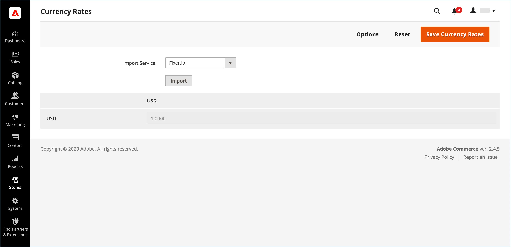
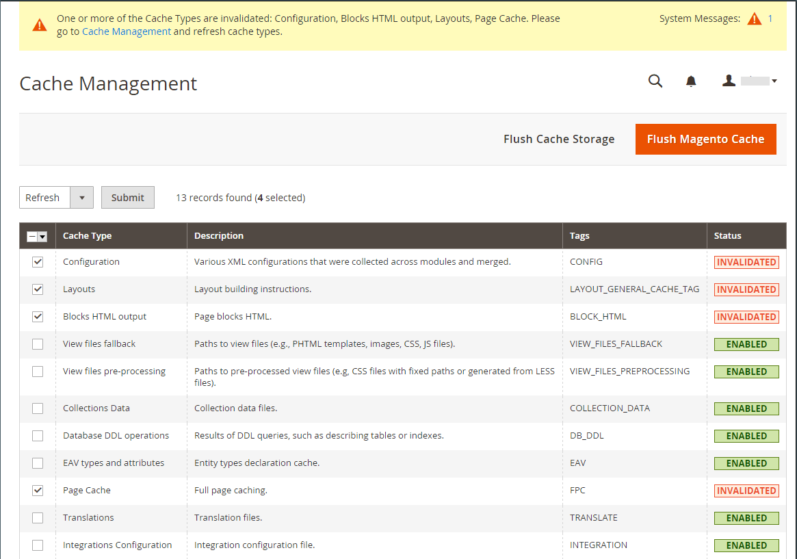

# 更新汇率

可以手动设置汇率，也可以将汇率导入存储中。 为确保您的商店具有最新的汇率，您可以配置要自动计划的汇率。

在导入汇率之前，请填写 [货币汇率设置](currency-configuration.md) 指定您接受的货币，并建立导入连接和计划。

{width="600" zoomable="yes"}

## 手动更新汇率

1. 在 _管理员_ 侧栏，转到 **[!UICONTROL Stores]** > _[!UICONTROL Currency]_>**[!UICONTROL Currency Rates]**.

1. 单击要更改的汇率，并为支持的每种货币输入新值。

1. 完成后，单击 **[!UICONTROL Save Currency Rates]**.

## 导入汇率

1. 在 _管理员_ 侧栏，转到 **[!UICONTROL Stores]** > _[!UICONTROL Currency]_>**[!UICONTROL Currency Rates]**.

1. 设置 **[!UICONTROL Import Service]** 至货币汇率提供方。

   默认提供程序为 `fixer.io (legacy)`.

   >[!IMPORTANT]
   >
   >从2.4.6版本开始， [[!DNL Fixer.io]](https://fixer.io/) 服务已弃用，并替换为 [[!DNL Fixer API] （阿皮耶尔）](https://apilayer.com/marketplace/fixer-api) 服务。 强烈建议您使用APILayer帐户而不是已弃用的帐户 [!DNL Fixer.io] 帐户。

1. 单击 **[!UICONTROL Import]**.

   更新的费率显示在 _[!UICONTROL Currency Rates]_列表。 如果自上次更新以来费率已发生更改，则旧费率将显示在下方以供参考。

1. 完成后，单击 **[!UICONTROL Save Currency Rates]**.

1. 提示更新缓存时，单击 **[!UICONTROL Cache Management]** 链接并刷新无效缓存。

   {width="600" zoomable="yes"}

## 按计划导入汇率

1. 确保 [Cron](../systems/cron.md) 已为您的商店启用。

1. 要指定接受并建立导入连接和计划的货币，请完成 [汇率设置](currency-configuration.md).

1. 要验证费率是否按计划导入，请检查 _[!UICONTROL Currency Rates]_列表。

1. 等待为计划建立的频率设置的时间段，然后再次检查速率。
