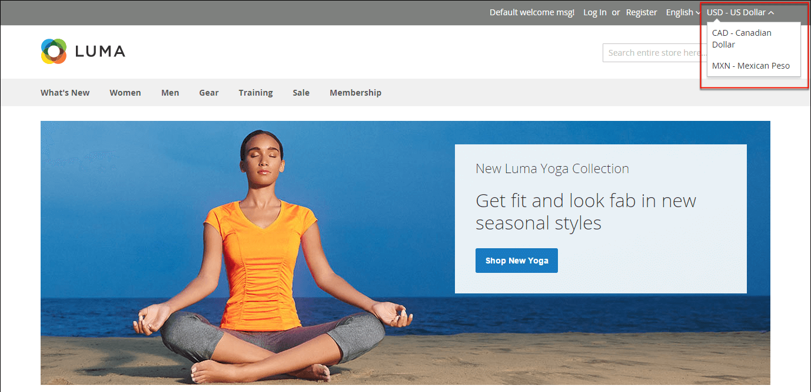

# 货币

Adobe Commerce让您能够接受来自全球200多个国家的货币。 如果商店支持多种货币，则在货币汇率[更新](currency-update.md)后，标题中会显示&#x200B;_货币选择器_。

>[!NOTE]
>
>如果您接受多币种付款，请确保监控币种汇率设置，因为任何波动都会影响您的利润率。

货币符号出现在产品价格和销售文档中，如订单和发票。 您可以根据需要自定义货币符号，还可以为每个商店或视图单独设置价格的显示。

{width="700" zoomable="yes"}
