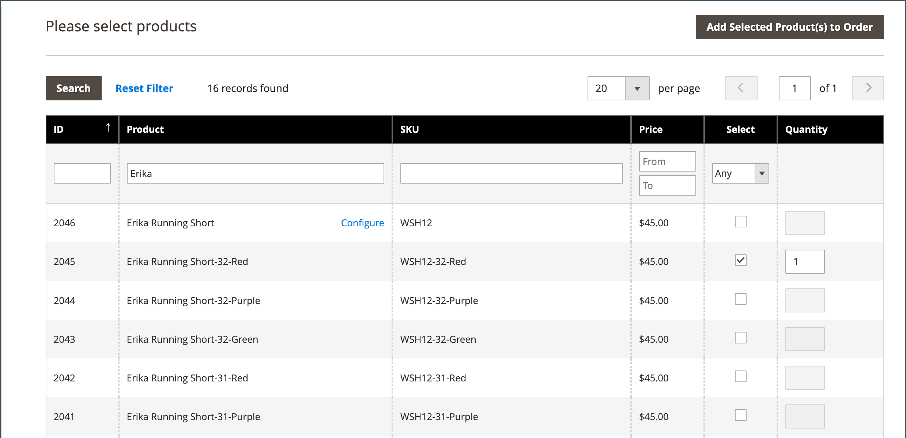

# 创建订单

对于需要帮助的注册客户，您可以直接从管理员创建整个订单。 此 _[!UICONTROL Create New Order]_表单包含正常结账流程所需的所有信息，以及客户帐户仪表板中的活动摘要。

{width="700" zoomable="yes"}

## 第1步：创建订单

1. 在 _管理员_ 侧栏，单击 **[!UICONTROL Customers]**.

1. 在网格中查找客户。

1. 在 _操作_ 列，单击 **[!UICONTROL Edit]**.

1. 在工作区标题中，单击 **[!UICONTROL Create Order]**.

   {width="700" zoomable="yes"}

   您还可以在以下位置创建订单 [订购工作区](orders.md#orders-workspace) 通过单击 **[!UICONTROL Create New Order]**.

## 步骤2：添加产品

如果您的商店有多个视图，请选择将要下订单的商店视图。

### 从添加产品 [!UICONTROL Customer's Activities] 侧栏

您可以将客户的愿望清单或任何最近查看、比较或订购的商品中的商品传输到购物车。

1. 展开  以下部分之一：

   - **[!UICONTROL Wish List]**
   - **[!UICONTROL Last Ordered Items]**
   - **[!UICONTROL Products in Comparison List]**
   - **[!UICONTROL Recently Compared Products]**
   - **[!UICONTROL Recently Viewed Products]**

1. 选中左侧面板中每个产品的复选框。

1. 向下滚动并单击 **[!UICONTROL Update Changes]**.

   项目会显示在订购单中。

   {width="600" zoomable="yes"}

### 从目录添加产品

1. 单击 **[!UICONTROL Add Products]**.

   {width="600" zoomable="yes"}

1. 在网格中，选中要添加到购物车中的每个产品的复选框，然后输入 **[!UICONTROL Qty]** 要购买的项目。

   {width="600" zoomable="yes"}

   >[!NOTE]
   >
   >产品选择网格始终显示产品的常规基本价格，而不提供折扣以及应用的任何购物车或组价格规则。 仅当将产品添加到订单/购物车时，才计算最终产品价格。

1. 配置可用的产品选项：

   - 单击 **[!UICONTROL Configure]**.

   - 根据需要完成选项。

   - 单击 **[!UICONTROL OK]**.

   - 单击 **[!UICONTROL Add Selected Product(s) to Order]** 以更新购物车。

1. 如果产品配置为 [礼品选项](../catalog/product-gift-options.md)，根据需要设置选项。

1. 覆盖物料价格（如有必要）：

   - 选择 **[!UICONTROL Custom Price]** 复选框，然后在下面的框中输入新价格。

   - 要更新购物车总计，请单击 **[!UICONTROL Update Items and Quantities]**.

   {width="600" zoomable="yes"}

1. 根据订单的需要完成以下部分：

   - [!UICONTROL Order Currency]
   - [!UICONTROL Apply Coupon Codes / Gift Card Code]
   - [!UICONTROL Payment Method]
   - [!UICONTROL Shipping Method]
   - [!UICONTROL Order Comments]

>[!NOTE]
>
>请参阅 [支付服务指南](https://experienceleague.adobe.com/docs/commerce-merchant-services/payment-services/create-order.html) 有关在安装和配置Payment Services扩展时支持此功能的支付方法的更多信息。

## 步骤3：提交订单

单击 **[!UICONTROL Submit Order]**.

向客户发送确认，客户可以从其帐户查看订单详细信息。
