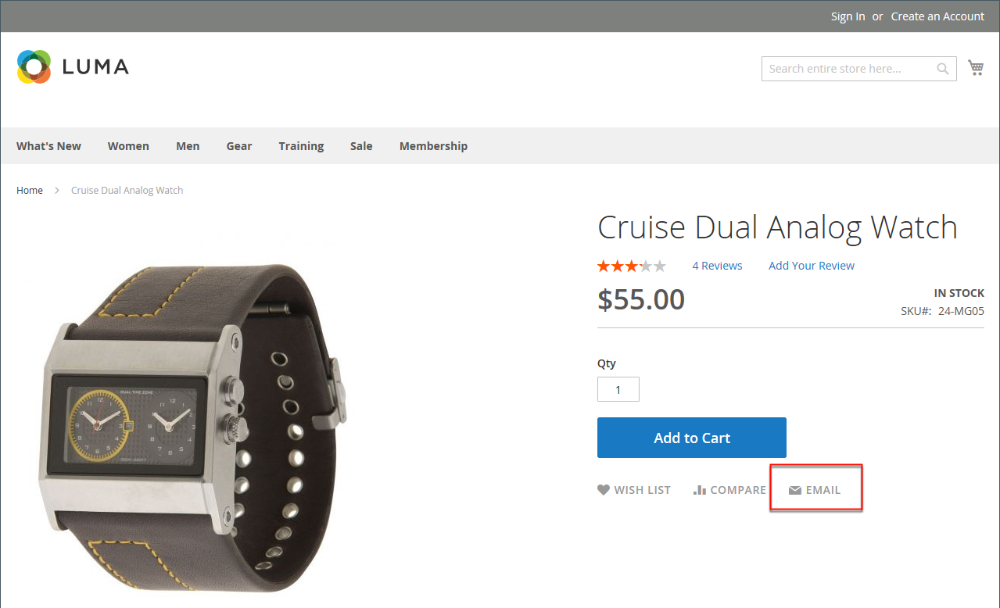

# 向朋友发送电子邮件

电子邮件链接可让您的客户轻松地与朋友共享指向产品的链接。 在演示Luma商店中，电子邮件链接显示为信封图标。 可以根据您的语音和品牌定制消息模板。 要防止发送垃圾邮件，您可以限制每封电子邮件的收件人数量，以及在一小时内可以共享的产品数量。

{width="700" zoomable="yes"}

## 配置朋友电子邮件

1. 在&#x200B;_管理员_&#x200B;侧边栏上，转到&#x200B;**[!UICONTROL Stores]** > _[!UICONTROL Settings]_>**[!UICONTROL Configuration]**。

1. 在左侧面板中，展开&#x200B;**[!UICONTROL Catalog]**&#x200B;并选择&#x200B;**[!UICONTROL Email to a Friend]**。

1. 展开 **[!UICONTROL Email Templates]**&#x200B;部分并设置选项：

   {width="600" zoomable="yes"}

   有关每个配置设置的详细说明，请参阅&#x200B;_配置参考指南_&#x200B;中的[电子邮件模板](../configuration-reference/catalog/email-to-a-friend.md)。

   要更改任何字段的默认设置，请清除&#x200B;**[!UICONTROL Use system value]**&#x200B;复选框以使字段可编辑。

   - 将&#x200B;**[!UICONTROL Enabled]**&#x200B;设置为`Yes`。

   - 将&#x200B;**[!UICONTROL Select Email Template]**&#x200B;设置为要用作消息基础的模板。

   - 如果要要求只有注册客户才能向朋友发送电子邮件，请将&#x200B;**[!UICONTROL Allow for Guests]**&#x200B;设置为`No`。

   - 对于&#x200B;**[!UICONTROL Max Recipients]**，输入单个消息可以加入通讯组列表的最多朋友数。

   - 对于&#x200B;**[!UICONTROL Max Products Sent in 1 Hour]**，输入单个用户在一小时时间内可与好友共享的产品的最大数量。

   - 将&#x200B;**[!UICONTROL Limit Sending By]**&#x200B;设置为以下方法之一以识别电子邮件的发件人：

     `IP Address` - （推荐）通过用于发送电子邮件的计算机的IP地址识别发件人。

     `Cookie (unsafe)` — 通过浏览器Cookie识别发件人。 此方法不太有效，因为发送者可以删除Cookie以绕过限制。

1. 完成后，单击&#x200B;**[!UICONTROL Save Config]**。

## 向店面的朋友发送电子邮件

配置此功能后，商店客户将按照以下步骤与好友共享产品信息。

1. 在目录页面上，客户单击&#x200B;**[!UICONTROL Email]**&#x200B;链接。

1. 如果仅为注册用户配置该功能，则执行以下操作之一：

   - 登录到您的客户帐户。
   - 注册一个新帐户。

1. 完成&#x200B;**[!UICONTROL Message]**&#x200B;并输入收件人&#x200B;**[!UICONTROL Name]**&#x200B;和&#x200B;**[!UICONTROL Email Address]**。

   如果需要，客户可以添加更多收件人：

   - 单击&#x200B;**[!UICONTROL Add Invitee]**。

   - 输入附加人员的&#x200B;**[!UICONTROL Name]**&#x200B;和&#x200B;**[!UICONTROL Email Address]**。

     他们可以向配置允许数量的其他人员发送消息。 他们可以通过单击&#x200B;**[!DNL Remove]**&#x200B;链接来移除添加的被邀请者。

1. 准备发送邮件时，单击&#x200B;**[!UICONTROL Send Email]**。

   {width="700" zoomable="yes"}
