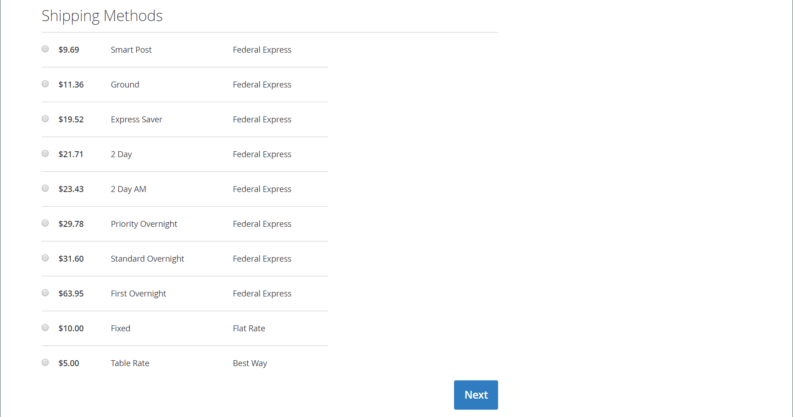

# 联邦快递

联邦快递是世界上最大的航运服务公司之一，提供航空、货运和陆运服务，有几个优先级别。

结帐时{width="700" zoomable="yes"}

>[!NOTE]
>
>联邦快递可以使用[维权重](carriers.md#dimensional-weight)来确定某些运费。 但是，Adobe Commerce和Magento Open Source仅支持基于重量的运输成本计算。

## 步骤1：注册FedEx Web服务生产

需要FedEx商家帐户并注册FedEx Web服务生产访问。 创建FedEx帐户后，阅读生产帐户信息页面，然后单击页面底部的&#x200B;_获取生产密钥_&#x200B;链接以注册并获取密钥。

>[!NOTE]
>
>请确保复制或写下身份验证密钥。 必须在Commerce配送设置中设置联邦快递。

## 步骤2：为您的存储启用FedEx

1. 在&#x200B;_管理员_&#x200B;侧边栏上，转到&#x200B;**[!UICONTROL Stores]** > _[!UICONTROL Settings]_>**[!UICONTROL Configuration]**。

1. 在左侧面板中，展开&#x200B;**[!UICONTROL Sales]**&#x200B;并选择&#x200B;**[!UICONTROL Delivery Methods]**。

1. 展开&#x200B;**[!UICONTROL FedEx]**&#x200B;部分的。

1. 将&#x200B;**[!UICONTROL Enabled for Checkout]**&#x200B;设置为`Yes`。

1. 对于&#x200B;**[!UICONTROL Title]**，输入在结账期间标识FedEx送货方法的标题。

1. 从联邦快递帐户输入以下信息：

   - **[!UICONTROL Account ID]**
   - **[!UICONTROL Api Key]**
   - **[!UICONTROL Secret Key]**

1. 如果已设置FedEx沙盒并希望在测试环境中工作，请将&#x200B;**[!UICONTROL Sandbox Mode]**&#x200B;设置为`Yes`。

   >[!NOTE]
   >
   >当您准备好将FedEx作为配送方式提供给客户时，请记住将“沙盒模式”设置为`No`。

   {width="600" zoomable="yes"}

## 步骤3：包描述和处理费用

1. 将&#x200B;**[!UICONTROL Pickup Type]**&#x200B;设置为用于装运的取货方法。

   - `DropOff at Fedex Location` — （默认）表示您在本地FedEx站点卸货。
   - `Contact Fedex to Schedule` — 指示您联系FedEx请求接送。
   - `Use Scheduled Pickup` — 指示装运已作为定期计划取货的一部分取货。
   - `On Call` — 指示通过调用FedEx安排取车。
   - `Package Return Program` — 指示FedEx Ground Package Returns程序已接收装运。
   - `Regular Stop` — 指示装运已按常规取货计划取货。
   - `Tag` — 指示装运取货特定于快速标记或地面呼叫标记取货请求。 这仅适用于退货运输标签。

1. 对于&#x200B;**[!UICONTROL Packages Request Type]**，选择最能描述将订单拆分为多个发运时的偏好设置的请求类型：

   - `Divide to equal weight (one request)`
   - `Use origin weight (few requests)`

1. 对于&#x200B;**[!UICONTROL Packaging]**，请选择通常用于从商店中发运产品的FedEx包装类型。

1. 将&#x200B;**[!UICONTROL Weight Unit]**&#x200B;设置为在区域设置中使用的度量单位。

   - `Pounds`
   - `Kilograms`

1. 输入允许用于FedEx装运的&#x200B;**[!UICONTROL Maximum Package Weight]**。

   默认的FedEx最大重量为150磅。 有关更多信息，请咨询您的承运商。 除非您与FedEx进行了特殊安排，否则建议使用默认值。 有关详细信息，请参阅[维度权重](carriers.md#dimensional-weight)。

   {width="600" zoomable="yes"}

1. 根据您的要求配置手续费选项。

   处理费是可选的，在结账期间不可见。 如果要包括手续费，请执行以下操作：

   - 设置&#x200B;**[!UICONTROL Calculate Handling Fee]**：

      - `Fixed Fee`
      - `Percentage`

   - 对于&#x200B;**[!UICONTROL Handling Applied]**，请选择以下方法之一来管理手续费：

      - `Per Order`
      - `Per Package`

   - 输入&#x200B;**[!UICONTROL Handling Fee]**&#x200B;作为`fixed`金额或`percentage`，具体取决于计算方法。

1. 将&#x200B;**[!UICONTROL Residential Delivery]**&#x200B;设置为以下项之一，具体取决于您销售的是企业对消费者(B2C)还是企业对企业(B2B)。

   - `Yes` — 对于B2C住宅投放。
   - `No` — 对于B2B住宅投放。

   {width="600" zoomable="yes"}

## 步骤4：允许的方法和适用的国家

1. 将&#x200B;**[!UICONTROL Allowed Methods]**&#x200B;设置为要提供的每种装运方式。

   在选择方法时，请考虑联邦快递帐户、发货频率和大小，以及是否允许国际发货。 您可以提供所需数量的方法，例如：

   - 欧洲第一要务
   - 交货日期选项：1天运费、2天运费、2天上午、2天运费、3天运费
   - 国内期权 — Express Saver、Ground、First、Onight、Home Delivery、Standard Onight
   - 国际选择 — 国际经济、国际经济货运、国际优先、国际地面、国际、优先国际
   - 优先级选项 — 运费，优先级隔夜
   - 智能帖子提供智能帖子方法（输入&#x200B;**中心ID**）
   - 运费选项 — 运费，国家运费

1. 如果要通过FedEx提供[免运费](shipping-free.md)选项，请设置免运费选项。

   - 将&#x200B;**[!UICONTROL Free Method]**&#x200B;设置为要用于免费配送的方法。 如果不想通过FedEx提供免运费，请选择`None`。

   - 若要要求满足订单与FedEx免费配送资格的最低订单金额，请将&#x200B;**[!UICONTROL Enable Free Shipping Threshold]**&#x200B;设置为`Enable`。 然后，输入&#x200B;**[!UICONTROL Free Shipping Amount Threshold]**&#x200B;中的最小值。

   此设置类似于标准“免运费”方法中的设置，但会在结账时显示在FedEx部分中，这样客户就可以知道用于其订单的方法。

1. 如果需要，请更改&#x200B;**[!UICONTROL Displayed Error Message]**。

   此文本框预设了默认消息，但您可以输入在FedEx不可用时要显示的其它消息。

   {width="600" zoomable="yes"}

1. 设置&#x200B;**[!UICONTROL Ship to Applicable Countries]**：

   - `All Allowed Countries` — 来自您商店配置中指定的所有[国家/地区](../getting-started/store-details.md#country-options)的客户都可以使用此交付方法。

   - `Specific Countries` — 选择此选项时，将显示&#x200B;_发送到特定国家/地区_&#x200B;列表。 选择列表中可使用此投放方法的每个国家/地区。

1. 如果要保留存储与FedEx系统之间所有通信的日志，请将&#x200B;**[!UICONTROL Debug]**&#x200B;设置为`Yes`。

1. 设置&#x200B;**[!UICONTROL Show Method if Not Applicable]**：

   - `Yes` — 向客户显示所有FedEx配送方式，无论其可用性如何。
   - `No` — 仅显示适用于订单的FedEx配送方式。

1. 对于&#x200B;**[!UICONTROL Sort Order]**，请输入数字以确定在结账期间与其他投放方法一起列出FedEx时显示的顺序。

   `0` =第一，`1` =第二，`2` =第三，依此类推。

1. 单击&#x200B;**[!UICONTROL Save Config]**。

   {width="600" zoomable="yes"}

>[!NOTE]
>
>在计算运费时，Commerce始终会向联邦快递申报全部订单价格。 此行为无法更改。
