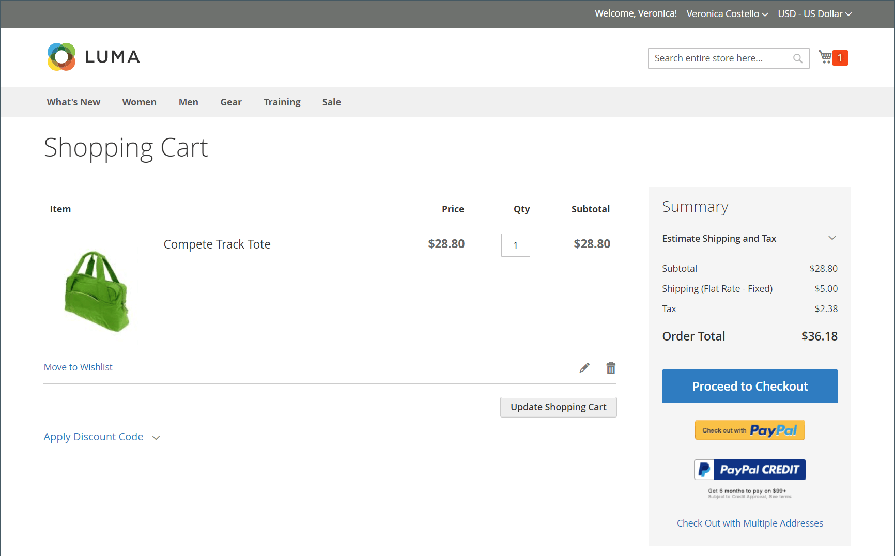

# 商店和购买体验简介

Adobe Commerce和Magento Open Source提供了一系列全面的功能，用于构建和管理您的在线商店以及客户的购买体验。 在Commerce实例中，您可以管理网站、商店和视图的商店层次结构。 您还可以配置为多个区域设置运行商店所需的税和汇率，包括产品和客户组的税分类。

## 存储结构

Adobe Commerce或Magento Open Source的单个实例可以支持使用不同属性和内容的多个网站、商店或商店视图。 一种典型的情况是，在不同的域中设置具有不同选项的存储区。 例如，您可能希望一个域上的一组类别和产品，以及不同域上另一组类别和产品，并使用另一种语言。 商家可以在“管理员”中配置网站、商店和商店视图。

定义[层次结构](stores.md)后，您可以根据[范围](../getting-started/websites-stores-views.md#scope-settings)应用配置设置，以便每个站点、商店和商店视图都提供您想要的产品目录和店面体验。

## 购买点

Adobe Commerce和Magento Open Source通过在提交订单之前自动验证所有项目的SKU和可用性，从而减少订购错误。 您可以配置[购物车](cart.md)和[结账选项](checkout-process.md)以提供最佳的购买体验（从交易到投放）。 登录到其帐户的客户可以快速完成结帐，因为许多信息都已在他们的帐户中。 _结帐_&#x200B;页面将引导客户完成订单交易流程的每个步骤。 如果激活[即时购买](checkout-instant-purchase.md)，客户可以使用保存在其帐户中的信息加速结帐过程。

>[!TIP]
>
>安装并启用Adobe Commerce B2B后，可以为与公司帐户关联的客户配置&#x200B;_快速订单_。 当客户知道其要订购的产品的名称或SKU时，此函数会减少订单处理过程中的多次点击。 您还可以为公司帐户配置对可转让报价的支持。 有关B2B功能的详细信息，请参阅[Adobe Commerce B2B用户指南](https://experienceleague.adobe.com/docs/commerce-admin/b2b/introduction.html?lang=zh-Hans)。

## 购物帮助

客户有时需要帮助才能完成购买。 有些客户喜欢网上购物，但喜欢通过电话订购。 对于在商店中注册了帐户的访客和客户，您可以立即提供帮助。

- [管理购物车](shopping-assisted-cart-manage.md)
- [为注册客户创建订单](customer-account-create-order.md)
- [更新订单](order-update.md)

{width="700" zoomable="yes"}

通过观看以下视频了解卖家辅助购物：

>[!VIDEO](https://video.tv.adobe.com/v/3410200/?quality=12&learn=on&captions=chi_hans)

## 订单管理和操作

在Admin中，商家可以访问订单工作流和订单处理流程各个阶段的信息：

- [订单](orders.md)页面为商家提供了一个易于访问的当前所有订单的列表，并包括编辑和处理现有订单以及代表客户创建订单的工具。

- [发票](invoices.md)页列出了基于临时销售订单的发票，并提供该订单的永久记录。

- [Shipments](shipments.md)页列出了每张准备装运的发票的装运记录。

- [贷项通知单](credit-memos.md)页允许商家处理和管理贷项通知单，它是显示缺客户的金额的文档。 金额可用于购买或退款给客户。

- (仅限Adobe Commerce)在[Returns](returns.md)页中，列出了当前返回的商品请求(RMA)，并用于输入新的退货请求。

- [交易](transactions.md)页面列出了您的商店与付款系统之间发生的所有付款活动，并提供了访问更多详细信息的权限。

## 运输和交付

研究表明，为客户提供几种[交付方法](delivery.md)选择的商店的转化率高于使用单一方法的商店。 管理员提供各种工具，商家可以使用这些工具来设置多种交货方式和[发货运营商](carriers.md)，以及打印[发货标签](shipping-labels.md)。
