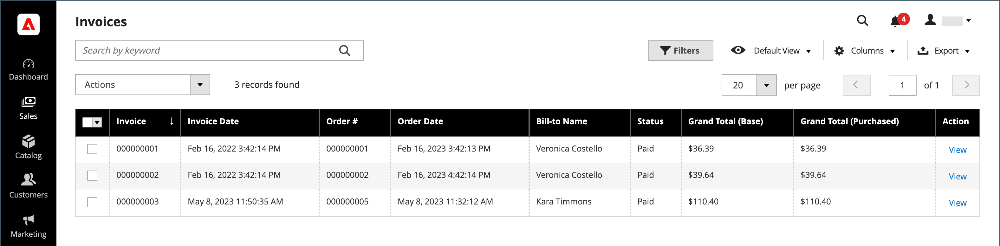

# 发票

发票是订单付款记录的记录。 多张发票可以 [已创建](#create-an-invoice) ，则每个订单都可以包含您指定的任意多个或任意几个已购买的产品。 您还可以创建 [打印就绪的PDF发票](#print-invoices) 作为客户的销售文档。

在 _管理员_ 侧栏，转到 **[!UICONTROL Sales]** > _操作_ > **发票** 以打开 _发票_ 并访问您创建的发票。

{width="700" zoomable="yes"}

## 列描述

| 列 | 描述 |
|--- |--- |
| [!UICONTROL Select] | 选中要执行操作的引号对应的复选框，或使用列标题中的选择控件。 选项： `Select All` / `Deselect All` |
| [!UICONTROL Invoice] | 在管理员提交发票时分配的唯一数字标识符。 查看发票详细信息时，此编号将显示在页面顶部，而不是报价单名称。 |
| [!UICONTROL Invoice Date] | 管理员首次提交发票的日期和时间。 |
| [!UICONTROL Order#] | 买方下订单时分配的唯一数字标识符。 查看发票详细信息时，此编号将显示为“订单和帐户信息”块中的链接。 |
| [!UICONTROL Order Date] | 客户首次成功下订单的日期和时间。 |
| [!UICONTROL Bill-to Name] | 负责支付订单的人员姓名。 |
| [!UICONTROL Status] | 指示发票的当前状态。 只能通过买方或卖方一方采取行动来更改状态。 |
| [!UICONTROL Grand Total (Base)] | 要购买的产品总价。 总金额以网站的基本货币和店面的货币显示。 |
| [!UICONTROL Grand Total (purchase)] | 订单中购买的产品总数。 总金额以网站的基本货币和店面的货币显示。 |
| [!UICONTROL Purchased From] | 从中创建发票的网站/商店/商店视图。 |
| [!UICONTROL Billing Address] | 下订单的客户的帐单地址。 |
| [!UICONTROL Shipping Address] | 将发运订单的地址。 |
| [!UICONTROL Customer Name] | 接收发票的客户的姓氏。 |
| [!UICONTROL Email] | 接收发票的客户的电子邮件地址。 |
| [!UICONTROL Customer Group] | 分配给接收发票的客户的客户组。 |
| [!UICONTROL Payment Method] | 用于付款的付款方式。 |
| [!UICONTROL Shipping Information] | 用于装运订单的方法。 |
| [!UICONTROL Subtotal] | 订单小计，不包括运费和手续费以及税金。 |
| [!UICONTROL Shipping and Handling] | 运费和包装费。 |
| [!UICONTROL Action] | **[!UICONTROL View]**  — 以编辑模式打开发票。 |

{style="table-layout:auto"}

## 创建发票

为订单创建发票会将其移至无法取消或更改的状态。 新发票页类似于已完成的订单，带有一些其他字段。 发票的“备注”部分中记录了每个与订单相关的活动。

通常，在发运流程开始时，系统会为订单开票并获取订单。 如果付款方式是采购订单，或者 [付款操作](../configuration-reference/sales/payment-methods.md#payment-actions) 设置为 `Authorize and Capture`，则会在结账期间对订单开票并记录付款。 您可以生成带装箱单的发票，也可以从承运人帐户打印发运标签。 单个订单可以分为部分发运，如有必要，这些发运将单独开票。

当新订单的状态设置为 `Processing`，选项 _自动为所有项目开票_ 在配置中变得可用。 在以下情况下，一些信用卡支付方法会作为流程的一部分完成开票步骤 [付款操作](../configuration-reference/sales/payment-methods.md#payment-actions) 设置为 `Authorize and Capture`. 在这种情况下，不会出现“发票”按钮，并且订单已准备就绪，可以发运。

>[!NOTE]
>
>使用下达的订单不会自动创建发票 `Gift Card`， `Store Credit`， `Reward Points`，或其他离线支付方式。

必须先生成订单发票，然后才能打印该发票。 要查看或打印PDF，请先下载并安装PDF阅读器，例如 [Adobe Acrobat Reader][1].

**_要为订单开票，请执行以下操作：_**

1. 在 _管理员_ 侧栏，转到 **[!UICONTROL Sales]** > _[!UICONTROL Operations]_>**[!UICONTROL Orders]**.

1. 查找状态为 `Processing` 在网格中。 然后，执行以下操作：

1. 在 _操作_ 列，单击 **[!UICONTROL View]**.

1. 在销售订单的题头中，选择 **[!UICONTROL Invoice]** 选项。

   >[!NOTE]
   >
   >此 _[!UICONTROL Invoice]_选项未出现在 [付款操作](../configuration-reference/sales/payment-methods.md#payment-actions) 针对您的特定的 [支付方式](../configuration-reference/sales/payment-methods.md) 设置为 `Authorize and Capture`，自动生成发票。 如果下达了订单并且付款方法的付款活动设置为，则情况也是如此 `Authorize` 并且订单已开票。

   {width="700" zoomable="yes"}

   新发票页类似于已完成的订单页，带有可编辑的附加字段。

1. 如果物料准备发运，则在创建发票的同时生成发运的装箱单：

   - 在 _配送信息_ 部分，单击 **[!UICONTROL Create Shipment]** 复选框。

     在生成发票的同时创建装运记录。

   - 包括一个跟踪号：

      - 单击 **[!UICONTROL Add Tracking Number]**.
      - 输入跟踪信息： _[!UICONTROL Carrier]_，_[!UICONTROL Title]_、和 _[!UICONTROL Number]_

     {width="600" zoomable="yes"}

   - （可选）生成部分发票：

      - 在 _要开票的项目_ 部分，更新 **[!UICONTROL Qty to Invoice]** 列，以仅包括发票上的特定项目。
      - 然后，单击 **[!UICONTROL Update Qty's]**.

        {width="600" zoomable="yes"}

1. 如果订单使用了在线付款方式，请设置 **[!UICONTROL Amount]** 到相应的选项。

1. 要在生成发票时通过电子邮件通知客户，请执行以下操作：

   - 选择 **[!UICONTROL Email Copy of Invoice]** 复选框。

   - 输入任意 **[!UICONTROL Invoice Comments]**. 要在通知电子邮件中包含注释，请标记 **[!UICONTROL Append Comments]** 复选框。

1. 完成后，单击 **[!UICONTROL Submit Invoice]** 在页面底部。

   **_在线支付方式：_**

   {width="600" zoomable="yes"}

   **_离线支付方式：_**

   {width="600" zoomable="yes"}

   订单的状态更改自 `Pending` 到 `Complete`.

   {width="600" zoomable="yes"}

## 打印发票

发票可以单独打印，也可以作为批打印。 但是，必须先为订单生成发票，然后才能打印发票。 您可以为可供打印的PDF发票上传高分辨率徽标，并包括 [订单ID](../stores-purchase/sales-documents.md#add-reference-ids) 在标题中。 要使用您的徽标和地址自定义发票模板，请参阅 [PDF徽标要求](../stores-purchase/sales-documents.md#image-formats).

>[!NOTE]
>
>要查看或打印PDF，您必须具有PDF读取器。 您可以下载 [Adobe Reader][1] 免费。

### 打印单张发票

1. 在 _管理员_ 侧栏，转到 **[!UICONTROL Sales]** > _[!UICONTROL Operations]_>**[!UICONTROL Invoices]**.

1. 在 _[!UICONTROL Invoices]_网格，找到发票，然后单击&#x200B;**[!UICONTROL View]**在_&#x200B;操作&#x200B;_列。

1. 在发票顶部，单击 **[!UICONTROL Print]** 以生成发票的PDF。

1. 将生成的PDF保存到文件或打印该文件。

### 打印多张发票

1. 在 _管理员_ 侧栏，转到 **[!UICONTROL Sales]** > _[!UICONTROL Operations]_>**[!UICONTROL Invoices]**.

1. 在 _[!UICONTROL Invoices]_在网格中，选中要打印的每张发票所对应的复选框。

1. 设置 **[!UICONTROL Actions]** 控制对象 `PDF Invoices`.

   {width="600" zoomable="yes"}

这些发票保存在一个PDF文件中，可以发送到打印机或进行保存。

## 资源疑难解答

有关发票问题疑难解答的帮助，请参阅以下内容 _Commerce支持知识库_ 文章：

- [无法对捆绑产品进行虚拟和简单发票](https://experienceleague.adobe.com/docs/commerce-knowledge-base/kb/support-tools/patches/v1-0-9/mdva-30889-magento-patch-can-t-invoice-bundle-products-virtual-and-simple.html)
- [没有商店信用信息的发票](https://experienceleague.adobe.com/docs/commerce-knowledge-base/kb/support-tools/patches/v1-0-8/mdva-31150-magento-patch-invoice-without-store-credit-info.html)
- [税显示在具有100%折扣的发票上](https://experienceleague.adobe.com/docs/commerce-knowledge-base/kb/support-tools/patches/v1-0-22/mdva-35773-tax-appears-on-invoice-with-100-discount.html)
- [未自动发送订单发票](https://experienceleague.adobe.com/docs/commerce-knowledge-base/kb/support-tools/patches/v1-0-13/mdva-32545-magento-patch-order-invoices-don-t-send-automatically.html)

[1]: https://www.adobe.com/acrobat/pdf-reader.html "获取Adobe Reader"
