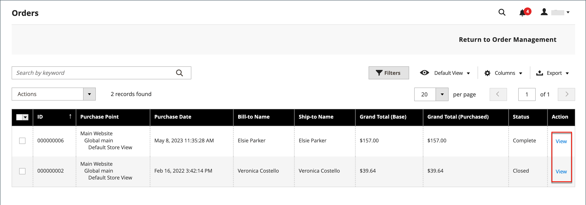

# 存档订单

{{ee-feature}}

定期存档订单可提高性能，使您的工作区中不存在不必要的信息，因此您可以专注于当前的业务。 发票、发运和贷项通知单可以自动或人工存档，并可以随时查看。

>[!NOTE]
>
>仅当存档为[已启用](../configuration-reference/sales/sales.md)时，_[!UICONTROL Archive]_&#x200B;选项才会显示在[[!UICONTROL Sales]菜单](sales-menu.md)中。

## 配置订单存档

可以将您的商店配置为在设定的天数后存档订单、发票、发运和贷项通知单。 您可以将订单及其关联文档移到存档中，或将它们恢复到其以前的状态。 存档的订单不会被删除，并且管理员可以继续使用这些订单。 存档数据可导出为CSV文件并在电子表格中打开。 启用后，_存档_&#x200B;操作将显示在工作区顶部。

1. 在&#x200B;_管理员_&#x200B;侧边栏上，转到&#x200B;**[!UICONTROL Stores]** > _[!UICONTROL Settings]_>**[!UICONTROL Configuration]**。

1. 在左侧面板中，展开&#x200B;**[!UICONTROL Sales]**&#x200B;部分并在下面选择&#x200B;**[!UICONTROL Sales]**。

1. 展开&#x200B;**[!UICONTROL Orders, Invoices, Shipments, Credit Memos Archiving]**&#x200B;部分的。

   {width="600" zoomable="yes"}

1. 将&#x200B;**[!UICONTROL Enable Archiving]**&#x200B;设置为`Yes`。

   >[!NOTE]
   >
   >如果您稍后决定关闭存档，则所有已存档的订单将恢复到以前的状态。

1. 将&#x200B;**[!UICONTROL Archive Orders Purchased]**&#x200B;设置为存档已完成的订单前等待的天数。

   默认情况下，订单会在购买30天后存档。

1. 在&#x200B;**[!UICONTROL Order Statuses to be Archived]**&#x200B;列表中，选择用于标识要存档的订单的每个订单状态。

   要选择多个项目，请在单击每个项目时按住Ctrl键(Windows)或Command键(Mac)。

1. 单击&#x200B;**[!UICONTROL Save Config]**。

1. 出现提示时，刷新任何无效的缓存。

## 查看存档的文档

1. 在&#x200B;_[!UICONTROL Archive]_&#x200B;下的&#x200B;_[!UICONTROL Sales]_&#x200B;菜单中，选择以下任一选项：

   - **[!UICONTROL Orders]**
   - **[!UICONTROL Invoices]**
   - **[!UICONTROL Shipments]**
   - **[!UICONTROL Credit Memos]**

1. 要查看详细信息，请单击列表中的任何存档文档。

## 将操作应用到已存档文档

选择要作为操作目标的每个文档，然后选择以下&#x200B;**[!UICONTROL Actions]**&#x200B;之一：

- `Cancel`
- `Hold`
- `Unhold`
- `Print`
- `Move to Orders Management`

## 手动存档文档

1. 从以下项中选择要存档的文档类型：

   - **[!UICONTROL Orders]**
   - **[!UICONTROL Invoices]**
   - **[!UICONTROL Shipments]**
   - **[!UICONTROL Credit Memos]**

1. 选中要存档的每个项目的复选框。

1. 在右上角，将&#x200B;**[!UICONTROL Actions]**&#x200B;设置为`Move to Archive`。

1. 单击&#x200B;**[!UICONTROL Submit]**&#x200B;将所选文档存档。

## 恢复存档的文档

1. 选择要还原的文档类型。

1. 使用以下选项之一选择文档：

   - 要选择所有可见文档，请单击左上角的&#x200B;**[!UICONTROL Select Visible]**。

   - 手动选中要还原的每个文档的复选框。

1. 在右上角，将&#x200B;**[!UICONTROL Action]**&#x200B;设置为`Move to Orders Management`。

1. 单击&#x200B;**[!UICONTROL Submit]**&#x200B;以恢复文档。

## 导出存档的文档

1. 选择要导出的文档类型。

1. 在右上角菜单中，将&#x200B;**[!UICONTROL Export to:]**&#x200B;设置为以下值之一：

   - `CSV`
   - `Excel`

1. 单击&#x200B;**[!UICONTROL Export]**。

可以将您的商店配置为在设定的天数后存档订单、发票、发运和贷项通知单。 您可以将订单及其关联文档移到存档中，或将它们恢复到其以前的状态。 存档的订单不会被删除，并且管理员可以继续使用这些订单。 存档数据可导出为CSV文件并在电子表格中打开。 启用后，_[!UICONTROL Archive]_&#x200B;命令将显示在工作区顶部。

## 手动存档订单

1. 在&#x200B;_管理员_&#x200B;侧边栏上，转到&#x200B;**[!UICONTROL Sales]** > _[!UICONTROL Operations]_>**[!UICONTROL Orders]**。

1. 要选择网格上的顺序，请选中第一列中的复选框。

1. 将&#x200B;**[!UICONTROL Actions]**&#x200B;控件设置为`Move to Archive`并查找已存档订单的消息。

   {width="700" zoomable="yes"}

>[!TIP]
>
>要指定可存档的订单状态列表，请参阅[配置订单存档](#configure-the-order-archive)。

## 查看已存档订单

1. 使用以下方法之一打开存档视图：

   - 在&#x200B;_[!UICONTROL Orders]_&#x200B;网格上方的按钮栏中，单击&#x200B;**[!UICONTROL Go to Archive]**。

   - 在&#x200B;_管理员_&#x200B;侧边栏上，转到&#x200B;**[!UICONTROL Sales]** > _[!UICONTROL Archive]_>**[!UICONTROL Orders]**。

   >[!NOTE]
   >
   >与“订单”页面一样，存档的订单页面的标题为&#x200B;_[!UICONTROL Orders]_。 唯一值得注意的区别是按钮栏中指向&#x200B;_[!UICONTROL Return to Orders Management]_&#x200B;的选项。 页面的URL还指示您处于顺序存档中。

1. 在&#x200B;_操作_&#x200B;列中，单击&#x200B;**[!UICONTROL View]**。

   {width="600" zoomable="yes"}

## 恢复已存档的订单

>[!NOTE]
>
>根据[!UICONTROL Archive Orders Purchased]设置中配置的天数，再次存档从已存档订单中还原的订单（请参阅[配置订单存档](#configure-the-order-archive)）。 根据订单的[!UICONTROL Updated At]日期计算天数，当从存档中移动订单时，该日期会更改。

1. 在&#x200B;_管理员_&#x200B;侧边栏上，转到&#x200B;**[!UICONTROL Sales]** > _[!UICONTROL Operations]_>**[!UICONTROL Orders]**。

1. 在按钮栏中，单击&#x200B;**[!UICONTROL Go to Archive]**。

1. 找到要恢复的记录，然后单击复选框将其选中。

   {width="600" zoomable="yes"}

1. 将&#x200B;**[!UICONTROL Actions]**&#x200B;控件值设置为`Move to Order Management`。

查找已存档订单已从存档中删除的消息。

## 导出存档订单

1. 在&#x200B;_管理员_&#x200B;侧边栏上，转到&#x200B;**[!UICONTROL Sales]** > _[!UICONTROL Operations]_>**[!UICONTROL Orders]**。

1. 在操作菜单中，单击&#x200B;**[!UICONTROL Export]**&#x200B;并选择所需的格式。
