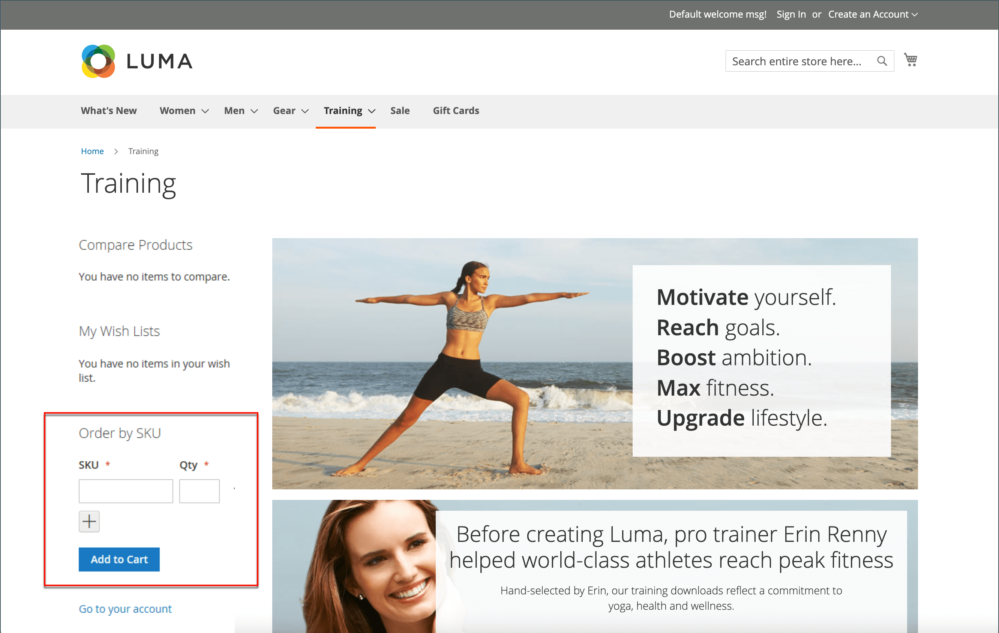

# 按SKU排序

{{ee-feature}}

“SKU”是“库存单位”。 SKU通常可帮助在线销售商识别最重要的产品特征，例如：尺寸、颜色、价格和材质。 产品ID与SKU不同：

- 此 `Product ID` 是内部用于标识产品的连续数字，客户无法查看。
- 此 `SKU` 由卖方生成，通常基于产品名称和属性进行营销或内部跟踪。 例如：蓝色棉色T恤，中号：T-COT-MED-BL。 如有必要，卖方可以更改SKU。

通常，SKU包括一组缩写，用于指示产品的区别特征。 最大SKU长度为64个字符。 SKU对于有效跟踪和管理库存非常重要，因此正确设置它们对于电子商务至关重要。

_按SKU排序_ 是 [构件](../content-design/widgets.md) 这些商品可以在商店中展示，以方便所有购物者，或者仅向特定客户群中的购物者提供。 购物者可以将SKU和数量信息直接输入到“按SKU排序”块中，也可以从其客户帐户上传csv文件。 无论配置如何，存储管理员始终可以按SKU排序。

{width="700" zoomable="yes"}

## 按SKU配置订单

1. 在 _管理员_ 侧栏，转到 **[!UICONTROL Stores]** > _[!UICONTROL Settings]_>**[!UICONTROL Configuration]**.

1. 在左侧面板中，展开 **[!UICONTROL Sales]** 部分并选择 **[!UICONTROL Sales]** 下方。

1. 展开  该 **[!UICONTROL Order by SKU Settings]** 部分。

1. 设置 **[!UICONTROL Enable Order by SKU on my Account in Storefront]** 更改为以下任一项：

   - `Yes, for Everyone`  — 每个购物者都可以在店中获取Order by SKU块。
   - `Yes, for Specified Customer Groups`  — 按SKU排序仅适用于特定客户组的成员，例如 `Wholesale`.
   - `No`  — 店面中未显示“按SKU排序”块，客户帐户中没有“按SKU排序”页面。

   {width="600" zoomable="yes"}

1. 单击 **[!UICONTROL Save Config]**.

 (仅限Adobe Commerce B2B) _**要启用“按SKU排序”功能，请禁用“快速排序”功能：**_

1. 转到 **[!UICONTROL Stores]** > _[!UICONTROL Settings]_>**[!UICONTROL Configuration]**.

1. 在左侧面板中的 _[!UICONTROL General]_，选择&#x200B;**[!UICONTROL B2B Features]**

1. 展开  该 **[!UICONTROL B2B Features]** 部分。

1. 设置 **[!UICONTROL Enable Quick Order]** 到 `No`.

   此 [快速订购功能](../b2b/quick-order.md) 允许客户和来宾根据SKU或产品名称快速下订单。

## 店面体验

为商店配置功能后，客户可以从任何包含 _按SKU排序_ 小部件或其帐户信息板中列出的所有项目。

### 按页面块中的SKU排序

1. 在 _按SKU排序_ 阻止，客户进入 **[!UICONTROL SKU]** 和 **[!UICONTROL Qty]** 订购项目的编号。

1. 要添加其他项目，请单击 **[!UICONTROL Add Row]** 然后重复这个过程。

1. 点击次数 **[!UICONTROL Add to Cart]**.

### 按客户帐户的SKU排序

1. 客户从店面登录到他们的帐户。

1. 在左侧的面板中，选择 **[!UICONTROL Order by SKU]**.

1. 根据首选项添加单个项目：

   _**按SKU添加每个项目：**_

   - 进入 **[!UICONTROL SKU]** 和 **[!UICONTROL Qty]** 订购项目的编号。

   - 要根据需要添加其他项目，请单击 _添加行_  并根据需要重复上述步骤。

   - 点击次数 **[!UICONTROL Add to Cart]**.

   _**上传包含多个项目的CSV文件：**_

   - 准备 [导入数据CSV](../systems/data-csv.md) （逗号分隔值）文件，其中包含列 `SKU` 和 `Qty`.

   {width="500" zoomable="yes"}

   - 要上传CSV文件，请单击 **[!UICONTROL Choose File]** 并选择要上传的文件。

   - 点击次数 **[!UICONTROL Add to Cart]**.

   如果有任何产品具有其他选项，则会从购物车中提示客户需要关注该产品。

   {width="600" zoomable="yes"}

   >[!NOTE]
   >
   >如果存在重复的SKU，则数量将合并到购物车中的一个行项目中。 客户可以更改任何项目的数量，然后单击 **[!UICONTROL Update Shopping Cart]** 以重新计算总计。

