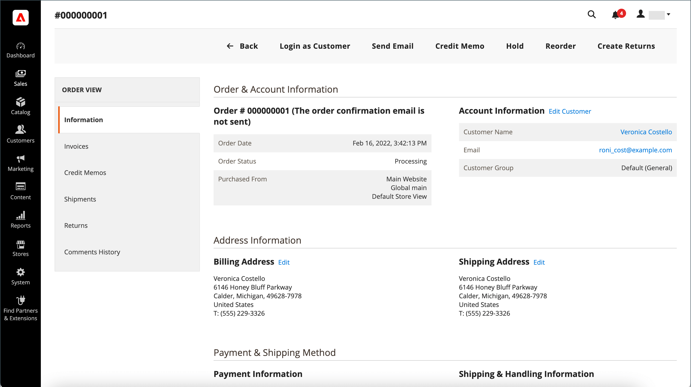
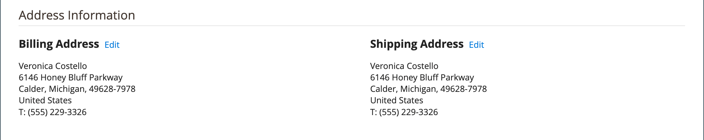
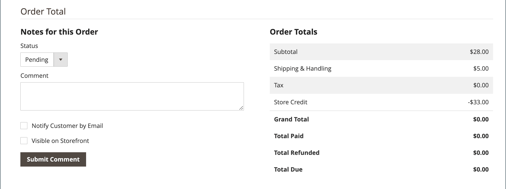

# 订单工作流和处理

客户下达订单时，销售订单将创建为事务处理的临时记录。 在“订单”网格中，销售订单最初的状态为“待定”，并且可以在处理付款之前随时取消。 确认付款后，可以对订单开票和发运。

**第1步：下单**  — 当购物者单击时，结帐过程将开始 **[!UICONTROL Go to Checkout]** 在购物车页面或 [重新排序](reorders-allow.md) 直接从其客户帐户中获取。

**步骤2：订单待定**  — 初始销售订单状态为 `Pending`. 在此状态下，尚未处理付款，仍然可以编辑或取消订单。 当付款方式配置为授权模式时，会发生此状态。

**步骤3：接收付款**  — 订单状态更改为 `Processing` 收到或授权付款时。 根据付款方法，您可能会在授权或处理事务处理时收到通知。 当付款方式配置为捕获或意向销售模式时，此状态自动发生。

**步骤4：发票订单**  — 通常在收到付款后对订单开票。 付款方法确定订单需要哪些开票选项。 生成并提交发票后，系统会将副本发送给客户。 如果付款方式配置有 `capture` 或 `intent sale` 付款活动，在授权和获取付款时自动生成发票。

>[!NOTE]
>
>使用下达的订单不会自动创建发票 `Gift Card`， `Store Credit`， `Reward Points`，或其他离线支付方式。

**步骤5：登记单个发运**  — 订单状态更改为 `Complete` 在发运详细信息完成时，系统会登记发运并设置发运。 装运要求由打印的装箱单和装运标签满足，或者 _通知准备取车_ 已选择（店内交付方式）。 客户收到通知，并且包裹已装运。 如果使用跟踪编号，则可以从客户的帐户跟踪装运。

>[!NOTE]
>
>有关订单状态和付款方式配置选项的详细信息，请参阅 [订单状态](order-status.md) 和 [支付](payments.md).

## 查看订单

1. 在 _管理员_ 侧栏，转到 **[!UICONTROL Sales]** > _[!UICONTROL Operations]_>**[!UICONTROL Orders]**.

1. 在网格中查找顺序。

1. 在 _[!UICONTROL Action]_列，单击&#x200B;**[!UICONTROL View]**.

1. 检查订单状态：

   - A `Pending` 订单可以修改、暂挂、取消或开票和发运。

   - A `Processing` 无法再对订单进行实质性编辑或取消，但可以编辑帐单和送货地址。

   - A `Completed` 订单可以重新排序。

可以通过编辑客户在订单工作流中的任意时刻编辑客户的电子邮件。 如果订单是由来宾下单，则无法编辑电子邮件。

未结订单的左侧面板提供对与订单相关的不同类型信息的访问。

{width="700" zoomable="yes"}

## 处理订单

客户下达订单时，销售订单将创建为事务处理的临时记录。 销售订单的状态为 `Pending` 直到收到付款。 在中 `Pending` 状态，可以编辑或取消订单，直到收到付款并生成发票为止。 一种简单的方式是订单变为发票，发票变为货物。 “订单”网格会列出所有订单，无论这些订单在工作流中的位置如何。 要了解如何帮助客户处理订单，请参阅 [更新订单](order-update.md).

{width="700" zoomable="yes"}

打开 `Pending` 顺序，单击 **[!UICONTROL Edit]** 在右上角。

>[!NOTE]
>
>订单只能在 `Pending` 状态。 对于处于不同状态的订单或基于 [协议报价](../b2b/quotes.md).

{width="600" zoomable="yes"}

使用字段说明作为参考，复查销售订单中的以下部分。

### 订单视图描述

| 选项卡 | 描述 |
|--- |--- |
| [!UICONTROL Information] | 显示有关订单和帐户的详细信息，包括帐单和送货地址、付款和交货方法、物料订单、合计和附注。 |
| [!UICONTROL Invoices] | 列出与订单关联的每张发票。 |
| [!UICONTROL Credit Memos] | 列出与订单关联的每个贷项通知单。 |
| [!UICONTROL Shipments] | 列出与订单关联的每个装运记录。 |
| [!UICONTROL Comments History] | 列出与订单相关的所有注释。 |

{style="table-layout:auto"}

>[!NOTE]
>
>管理员用户必须具有 **[!UICONTROL Sales / Archive]** [权限](../systems/permissions-user-roles.md) ，以查看 _发票_， _贷项通知单_、和 _装运_ 顺序选项卡。

### 按钮栏

| 按钮 | 描述 |
|--- |--- |
| **[!UICONTROL Back]** | 返回到“订单”页而不保存更改。 |
| **[!UICONTROL Cancel]** | 取消销售订单。 |
| **[!UICONTROL Send Email]** | 向客户发送有关订单的电子邮件。 |
| **[!UICONTROL Hold]** / **[!UICONTROL Unhold]** | 将销售订单的状态更改为 `On Hold`. 要释放销售订单的暂挂，请选择 **[!UICONTROL Unhold]**. |
| **[!UICONTROL Invoice]** | 通过将订单转换为发票，从销售订单创建发票。 |
| **[!UICONTROL Ship]** | 为订单创建装运记录。 |
| **[!UICONTROL Notify Order is Ready for Pickup]** | 仅在作为店内交货下达订单时显示。 通知客户订单已准备好提货。 |
| **[!UICONTROL Reorder]** | 基于当前订单创建销售订单。 |
| **[!UICONTROL Edit]** | 在编辑模式下打开待处理订单。 对于状态为“ ”的订单，“编辑”按钮不可见 `Processing`或基于协商报价的订单。 |

{style="table-layout:auto"}

### 取消订单

您可以 [取消](order-update.md) 尚未开票的订单。 A [贷项通知单](credit-memos.md) 如果客户在开票（获取付款）后想要取消订单，则必须签发。

如果订单为 `Pending` 或 `Processing` 并且付款未捕获或未完全捕获，您可以 [使订单失效](#void-an-order) 而不是取消它。

要恢复已取消的订单，请单击 **[!UICONTROL Reorder]** 按钮创建的新订单，且订单状态为 `Pending`.

>[!NOTE]
>
>取消订单也会产生作废，但撤消订单不会触发取消。

### 撤消订单

只有未开票的销售订单，其状态为 `Processing`，和 [付款集成设置 `Authorize`](../configuration-reference/sales/payment-methods.md#payment-actions)，可以是 [已失效](order-update.md#void-a-processing-order). 撤消订单后，您可以将其取消。

### [!UICONTROL Order and Account Information]

{width="600" zoomable="yes"}

#### 订单信息

| 字段 | 描述 |
|--- |--- |
| [!UICONTROL Order Number] | 订单编号显示在销售订单的顶部，随后显示一个注释，指明是否发送了确认电子邮件。 |
| [!UICONTROL Order Date] | 下订单的日期和时间。 |
| [!UICONTROL Purchased From] | 指示下订单的网站、商店和商店视图。 |
| [!UICONTROL Placed from IP] | 指示下达订单的计算机的IP地址。 |
| [!UICONTROL Order Placed from Quote] |  (适用于Adobe Commerce的B2B)指示 [引用](../b2b/quotes.md) 从中生成订单的位置（如果适用）。 报价名称与报价关联。 |

{style="table-layout:auto"}

#### 帐户信息

| 字段 | 描述 |
|--- |--- |
| [!UICONTROL Customer Name] | 下订单的客户或购买者的名称。 客户名称链接到客户配置文件。 |
| [!UICONTROL Email] | 客户或买方的电子邮件地址。 已链接电子邮件地址以打开新的电子邮件。 |
| [!UICONTROL Customer Group] | 客户分配到的客户组或共享目录的名称。 |
| [!UICONTROL Company Name] |  (适用于Adobe Commerce的B2B)：与买方关联并代表其下达订单的公司的名称。 公司名称链接到 [公司配置文件](../b2b/account-companies.md). |

{style="table-layout:auto"}

### [!UICONTROL Address Information]

{width="600" zoomable="yes"}

| 字段 | 描述 |
|--- |--- |
| [!UICONTROL Billing Address] | 下订单的客户或购买者的姓名，以及帐单地址、电话号码和 [增值税](vat.md)，如果适用。 电话号码链接到移动设备上的自动拨号。 |
| [!UICONTROL Shipping Address] | 订单应发送到的人员的姓名，以及发送地址和电话号码。 电话号码链接到移动设备上的自动拨号。 |

{style="table-layout:auto"}

### [!UICONTROL Payment & Shipping Method]

{width="600" zoomable="yes"}

| 字段 | 描述 |
|--- |--- |
| [!UICONTROL Payment Information] | 用于订单的付款方式以及采购订单编号（如果适用），后跟用于下订单的币种。 如果订单费用计入公司贷项，则使用 [分期付款](../b2b/enable-basic-features.md#configure-payment-on-account)，则会显示从帐户中收取的金额。 |
| [!UICONTROL Shipping & Handling Information] | 要使用的配送方式以及适用的任何手续费。 |

{style="table-layout:auto"}

### 查看订购的项目

{width="600" zoomable="yes"}

在 **[!UICONTROL Order Total]** 部分，执行以下操作：

1. 输入 **[!UICONTROL Comment]** 以包含在订单中。

1. 如果要通过电子邮件将评论发送给客户，请选择 **[!UICONTROL Notify Customer by Email]** 复选框。

1. 如果您希望评论显示在客户帐户中，请选择 **[!UICONTROL Visible on Storefront]** 复选框。

   {width="600" zoomable="yes"}

1. 如果您已准备好对订单开票，请单击 **[!UICONTROL Invoice]** 并按照说明操作。 [创建发票](invoices.md#create-an-invoice).

#### [!UICONTROL Items Ordered]

| 字段 | 描述 |
|--- |--- |
| [!UICONTROL Product] | 产品名称、SKU和选项（如果适用）。 |
| [!UICONTROL Item Status] | 指示项目的状态。 值： `Ordered` |
| [!UICONTROL Original Price] | 折扣前物料的原始目录价格。 |
| [!UICONTROL Price] | 物料的采购价。 此值反映从共享目录应用于项目的任何折扣（如果适用）。 |
| [!UICONTROL Qty] | 订购的数量。 |
| [!UICONTROL Subtotal] | 小计是采购价格乘以数量。 |
| [!UICONTROL Tax Amount] | 以小数值形式应用于项目的税额。 |
| [!UICONTROL Tax Percent] | 以百分比形式应用于此项目的税百分比。 |
| [!UICONTROL Discount Amount] | 适用于此项目的折扣。 如果订单基于报价，则折扣值为零。 |
| [!UICONTROL Row Total] | 行项目合计，包括在产品层到期的适用税减去折扣。 |

{style="table-layout:auto"}

#### [!UICONTROL Notes for this Order]

| 字段 | 描述 |
|--- |--- |
| [!UICONTROL Status] | 显示销售订单的状态。 |
| [!UICONTROL Comment] | 一个文本框，用于输入订单附带的客户注释。  **[!UICONTROL Notify Customer by Email]**— 如果要将评论作为单独的电子邮件发送给客户，请选中复选框。 **[!UICONTROL Visible on Storefront]**  — 如果您希望评论从客户的帐户中可见，请选中复选框。  **[!UICONTROL Submit Comment]**— 提交评论并通过电子邮件发送（如果适用）。 |

{style="table-layout:auto"}

#### [!UICONTROL Order Totals]

| 字段 | 描述 |
|--- |--- |
| [!UICONTROL Shipping & Handling] | 运费和手续费的金额。 |
| [!UICONTROL Tax] | 应用于订单的税额（如果适用）。 |
| [!UICONTROL Grand Total] | 订单总计。 |
| [!UICONTROL Total Paid] | 为订单支付的总金额（如果适用）。 |
| [!UICONTROL Total Refunded] | 从订单中退款的总金额（如果适用）。 |
| [!UICONTROL Total Due] | 到期的总金额。 |
| [!UICONTROL Store Credit] |  (仅限Adobe Commerce)应用于订单的可用商店积分（如果适用）。 |
| [!UICONTROL Catalog Total Price] |  (适用于Adobe Commerce的B2B提供)报价单中的项目总价（不含税），根据用作报价单基础的共享目录或标准目录中的定价确定。 如果店面显示货币与基本货币不同，则该值将以两种货币显示，店面显示在方括号中。 |
| [!UICONTROL Negotiated Discount] |  (适用于Adobe Commerce的B2B产品)买方与卖方协商的报价所产生的折扣。 如果店面显示货币与基本货币不同，则该值将以两种货币显示，店面显示在方括号中。 |
| [!UICONTROL Subtotal] |  (Adobe CommerceB2B提供)目录总价减去议定折扣。 |

{style="table-layout:auto"}

## 订单处理演示

观看此视频，了解有关订单处理和状态的更多信息：

>[!VIDEO](https://video.tv.adobe.com/v/343935/?quality=12)
