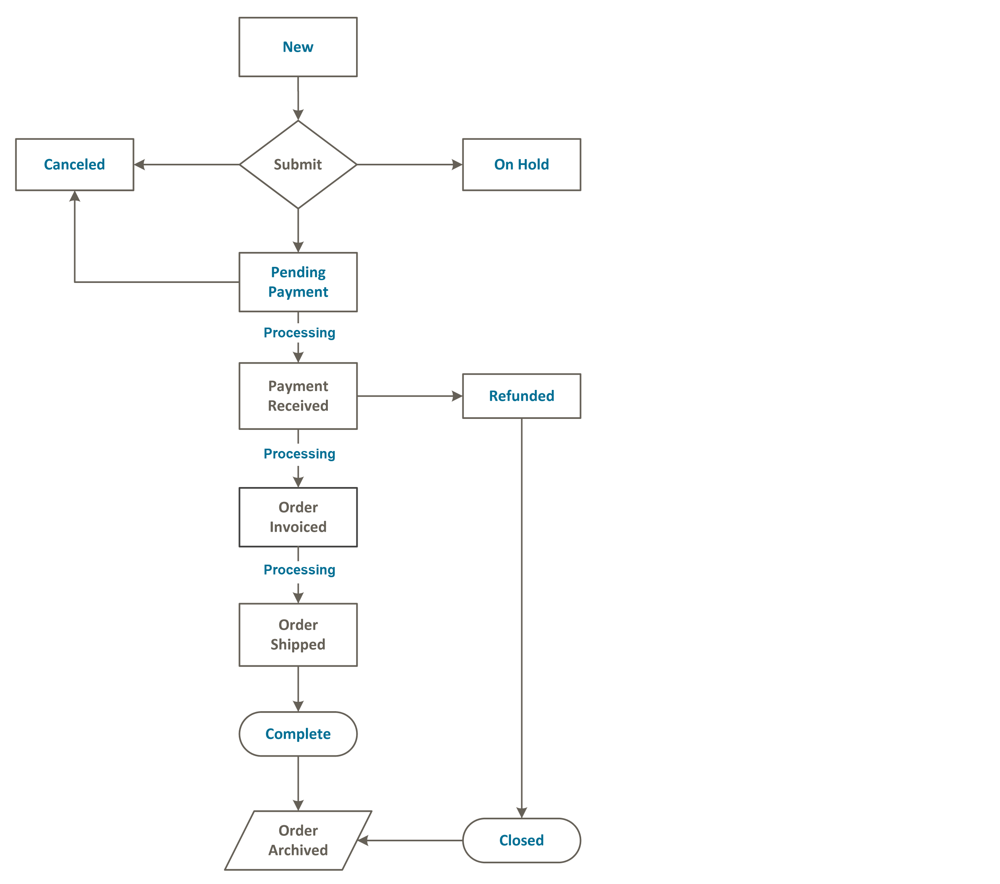

# 订单状态

所有订单都具有与订单处理中的阶段关联的订单状态 [工作流](order-processing.md). 每个订单的状态显示在 _状态_ 列 _订购_ 网格。 您的商店有一组预定义的订单状态和订单状态设置。 订单状态描述订单在工作流中的位置。

{width="700" zoomable="yes"}

>[!TIP]
>
>部份退款的订单仍在 `Processing` 状态结束日期 **_所有_** 已发运订购物料（包括退款物料）。 订单状态未更改为 `Complete` 甚至有一个订单项目尚未发运。

## 订单状态工作流

## 预定义状态

| 订单状态 | 状态代码 |  |
|--- |--- |--- |
| 正在处理 | `processing` | 当新订单的状态设置为“正在处理”时， _自动为所有项目开票_ 选项将在配置中变得可用。 对于使用礼品卡、商店信用、奖励积分或其他离线付款方式下单的订单，不会自动创建发票。 |
| 可疑欺诈 | `fraud` | 有时，通过PayPal或其他支付网关支付的订单会被标记为 _可疑欺诈_. 此状态表示该订单未开具发票，并且未发送确认电子邮件。 |
| 待处理付款 | `pending_payment` | 如果创建了订单并且使用了PayPal或类似的支付方式，则会使用此状态。 这意味着客户被定向到支付网关网站，但尚未收到退货信息。 客户付款时，此状态会更改。 |
| 付款复核 | `payment_review` | 打开PayPal付款审核时，将出现此状态。 |
| 待处理 | `pending` | 此状态表示尚未提交任何发票和发运。 |
| 保持 | `holded` | 此状态只能手动分配。 您可以暂停任何订单。 |
| 打开 | `STATE_OPEN` | 此状态表示订单或贷项通知单仍处于未结状态，可能需要执行进一步操作。 |
| 完成 | `complete` | 此状态表示订单已创建、已支付并已发运给客户。 |
| 已关闭 | `closed` | 此状态表示订单已分配了贷项通知单，并且客户已收到退款。 |
| 已取消 | `canceled` | 当客户未在指定时间内付款时，可以在管理员中手动分配此状态，对于某些付款网关，也可以手动分配。 |
| PayPal已取消冲销 | `paypay_canceled_reversal` | 此状态表示PayPal已取消冲销。 |
| 待处理PayPal | `pending_paypal` | 此状态表示PayPal已收到订单，但尚未处理付款。 |
| PayPal已撤消 | `paypal_reversed` | 此状态表示PayPal已冲销交易记录。 |

{style="table-layout:auto"}

## 自定义订单状态

除了预设的订单状态设置外，您还可以创建自己的自定义订单状态设置，将其分配给订单状态，并为订单状态设置默认订单状态。 订单状态表示订单在订单处理工作流中的位置，而订单状态则定义订单的状态。 例如，您可能需要自定义订单状态，例如 `packaging"`， `backordered`或特定于您需求的状态。 您可以为自定义状态创建一个描述性名称，并将其分配给工作流中关联的订单状态。

>[!NOTE]
>
>订单工作流中仅使用默认自定义订单状态值。 未设置为默认值的自定义状态值只能在该顺序的注释部分中使用。

{width="700" zoomable="yes"}

### 创建自定义订单状态

1. 在 _管理员_ 侧栏，转到 **[!UICONTROL Stores]** > _[!UICONTROL Settings]_>**[!UICONTROL Order Status]**.

1. 在右上角，单击 **[!UICONTROL Create New Status]**.

   {width="600" zoomable="yes"}

1. 更新 _[!UICONTROL Order Status Information]_部分：

   - 输入 **[!UICONTROL Status Code]** 以供内部参考。 第一个字符必须是字母(a-z)，其余字符可以是字母和数字(0-9)的任意组合。 请使用下划线字符而不是空格。

   - 对象 **[!UICONTROL Status Label]**，在管理员和店面中输入标识状态设置的标签。

1. 在 _[!UICONTROL Store View Specific Labels]_部分，输入不同商店视图所需的任何标签。

1. 单击 **[!UICONTROL Save Status]**.

### 将订单状态分配给状态

1. 在 _订单状态_ 页面，单击 **[!UICONTROL Assign Status to State]**.

   {width="600" zoomable="yes"}

1. 更新 **[!UICONTROL Assignment Information]** 部分，执行以下操作：

   - 选择 **[!UICONTROL Order Status]** 要分配的对象。 它们按状态标签列出。

   - 设置 **[!UICONTROL Order State]** 到工作流中订单状态所属的位置。

     >[!NOTE]
     >
     >**_[!UICONTROL Order State]_** 列表包含默认分配的订单状态。 例如， `Pending` 将显示默认订单状态，而不是 `New` 订单状态值。

   - 要使此状态成为订单状态的默认状态，请选择 **[!UICONTROL Use Order Status as Default]** 复选框。

     >[!NOTE]
     >
     >订单工作流中仅使用默认订单状态。 非默认状态只能在 **[!UICONTROL Order Comments]** 部分。

   - 要使此状态在店面中可见，请选择 **[!UICONTROL Visible On Storefront]** 复选框。

   {width="600" zoomable="yes"}

1. 单击 **[!UICONTROL Save Status Assignment]**.

### 编辑现有订单状态

1. 在 _[!UICONTROL Order Status]_网格，在编辑模式下打开状态记录。

1. 根据需要更新状态设置。

1. 单击 **[!UICONTROL Save Status]**.

### 从已分配状态中删除订单状态

>[!NOTE]
>
>如果状态正在使用中，则无法从状态中取消分配状态设置。

1. 在 _[!UICONTROL Order Status]_网格中，查找要取消分配的订单状态记录。

1. 在 _[!UICONTROL Action]_列中，单击该行最右侧的&#x200B;**[!UICONTROL Unassign]**链接。

   工作区顶部将显示一条消息，表明订单状态已取消分配。 尽管订单状态标签仍显示在列表中，但不再将其分配给状态。 无法删除订单状态设置。

>[!NOTE]
>
>如果默认订单状态是从订单状态中取消分配的， _**另一个**_ 订单状态为 _**自动设置**_ 作为此订单状态的默认值。

## 通知

客户可通过以下方式跟踪其订单的状态 [RSS源](../merchandising-promotions/social-rss.md) 是否已在配置中启用Order RSS馈送。 启用后，每张订单上都会显示指向RSS馈送的链接。

### 启用订单状态通知

1. 在 _管理员_ 侧栏，转到 **[!UICONTROL Stores]** > _[!UICONTROL Settings]_>**[!UICONTROL Configuration]**.

1. 在左侧面板中，展开 **[!UICONTROL Catalog]** 并选择 **[!UICONTROL RSS Feeds]** 下方。

1. 展开  该 **[!UICONTROL Order]** 部分。

1. 设置 **[!UICONTROL Customer Order Status Notification]** 到 `Enable`.

   {width="600" zoomable="yes"}

1. 完成后，单击 **[!UICONTROL Save Config]**.

### 配置新订单电子邮件通知

1. 在 _管理员_ 侧栏，转到 **[!UICONTROL Stores]** > _[!UICONTROL Settings]_>**[!UICONTROL Configuration]**.

1. 在左侧面板中，展开 **[!UICONTROL Sales]** 并选择 **[!UICONTROL Sales Emails]** 下方。

1. 展开  该 **[!UICONTROL Order]** 部分。

   {width="600" zoomable="yes"}

1. 设置 **[!UICONTROL New Order Confirmation Email Sender]** 更改为以下任一项：

   - `General Contact`
   - `Sales Representative`
   - `Customer Support`
   - `Custom Email 1`
   - `Custom Email 2`

1. 选择要用于每种客户类型的模板：

   - **[!UICONTROL New Order Confirmation Template]**  — 选择一个模板以用于拥有注册商店帐户的客户。
   - **[!UICONTROL New Order Confirmation Template for Guest]**  — 选择用于没有注册商店帐户的访客客户的模板。

1. 要通知其他人员（如业务经理）新订单，请输入电子邮件地址 **[!UICONTROL Send Order Email Copy To]**.

   如果需要多个收件人，则可以添加多个电子邮件地址。

1. 设置 **[!UICONTROL Send Order Email Copy Method]** 更改为以下任一项：

   - `Bcc`  — 只向客户和其他收件人发送一封有关新订单的电子邮件，但客户看不到他们收到的电子邮件也发送给其他收件人。
   - `Separate Email`  — 发送两封单独的电子邮件，一封发送给收件人，一封发送给客户。

1. 完成后，单击 **[!UICONTROL Save Config]**.
