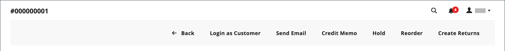

# 更新订单

在帮助已下订单的客户时，您必须确定订单的状态。 `Pending`订单的可用选项与`Processing`订单的选项不同。 有关详细信息，请参阅[处理订单](order-processing.md)。

## 待处理订单

客户下订单后，但在收到付款之前，该订单处于`Pending`状态。 您可以编辑订单、将其置于暂停状态或完全取消订单。 待定订单的按钮栏列出了订单可用的操作。

{width="600" zoomable="yes"}

如果修改了订单的主要部分，则会取消原始订单并生成新订单。 但是，您可以更改帐单或送货地址而不生成新订单。

| 按钮 | 描述 |
|--- |--- |
| **[!UICONTROL Back]** | 返回到“订单”页而不保存更改。 |
| **[!UICONTROL Login as Customer]** | 允许管理员用户协助客户完成订单。 |
| **[!UICONTROL Cancel]** | 取消待处理订单。 |
| **[!UICONTROL Send Email]** | 向客户发送有关待处理订单的电子邮件。 |
| **[!UICONTROL Hold]** / **[!UICONTROL Unhold]** | 将待处理订单的状态更改为`On Hold`。 要释放保留，请选择&#x200B;_[!UICONTROL Unhold]_。 |
| **[!UICONTROL Invoice]** | 通过将待处理订单转换为发票，从待处理订单创建[发票](invoices.md#create-an-invoice)，并将订单状态更改为`processing`。 |
| **[!UICONTROL Ship]** | 为订单创建[装运](shipments.md#create-a-shipment)记录。 |
| **[!UICONTROL Reorder]** | 创建与当前待处理订单重复的新待处理订单。 |
| **[!UICONTROL Edit]** | 在编辑模式下打开待处理订单。 “编辑”按钮仅适用于待定订单，或基于协商[报价](../b2b/quotes.md)的订单。 |

{style="table-layout:auto"}

## 处理订单

订单在以下情况下进入`Processing`状态：

* 当付款活动设置为`Authorize and Capture`时，接收/捕获订单付款并生成发票。
* 已授权订单交易记录，但尚未捕获付款 — 当付款操作设置为`Authorize`时。

[付款操作配置](../configuration-reference/sales/payment-methods.md#payment-actions)确定在创建订单后哪些订单操作可用。

您不能更改`Processing`订单，但可以编辑帐单和送货地址。

{width="600" zoomable="yes"}

>[!NOTE]
>
>当付款方法的付款活动设置为`Authorize and Capture`时，客户下达订单时将自动创建发票。 在这种情况下，您可以使用[贷项通知单](credit-memo-create.md)退款，但无法[取消](#cancel-a-pending-order)或[撤消](#void-a-processing-order)订单。

| 按钮 | 描述 |
|--- |--- |
| **[!UICONTROL Back]** | 返回到“订单”页而不保存更改。 |
| **[!UICONTROL Send Email]** | 向客户发送有关订单的电子邮件。 |
| **[!UICONTROL Void]** | [无效](#void-a-processing-order)订单交易或部分订单交易。 |
| **[!UICONTROL Credit Memo]** | 启动创建[贷项通知单](credit-memo-create.md)的进程。 |
| **[!UICONTROL Hold]** / **[!UICONTROL Unhold]** | 将销售订单的状态更改为`On Hold`。 要解除销售订单的暂挂，请选择&#x200B;_[!UICONTROL Unhold]_。 |
| **[!UICONTROL Reorder]** | 根据当前订单创建新的待处理订单。 |
| **[!UICONTROL Create Returns]** |  (仅限Adobe Commerce)启动流程以[返回订单中的](returns.md)一个或多个项目。 |

{style="table-layout:auto"}

## 撤消处理订单

当订单仍然处于`Processing`状态并且付款集成设置为`Authorize`（而不是`Authorize and Capture`）时，您只能撤消交易或取消订单。 [取消订单](#cancel-a-pending-order)也会使授权失效。

使用付款方式下达订单，并且付款活动设置为`Authorize and Capture`时，您可以通过贷项通知单退款，但不能取消资金，因为已开票并且已获取付款。

您的付款方式决定了可用的付款活动。 有关详细信息，请参阅[付款操作](../configuration-reference/sales/payment-methods.md#payment-actions)。

**_要撤消订单：_**

1. 在&#x200B;_管理员_&#x200B;侧边栏上，转到&#x200B;**[!UICONTROL Sales]** > _[!UICONTROL Operations]_>**[!UICONTROL Orders]**。

1. 在要编辑的订单的&#x200B;**[!UICONTROL Action]**&#x200B;列中，单击&#x200B;**[!UICONTROL View]**。

1. 单击&#x200B;**[!UICONTROL Void]**&#x200B;使订单失效。

1. 出现提示时，单击&#x200B;**[!UICONTROL OK]**&#x200B;使订单失效。

在获取资金后，您可以使用[贷项通知单](credit-memo-create.md)发放任何所需的退款。 您还可以创建针对产品退货签发的[退货商品授权(RMA)](returns.md)。 若要了解详细信息，请参阅[处理订单](order-processing.md)。

## 编辑待处理订单

1. 在&#x200B;_管理员_&#x200B;侧边栏上，转到&#x200B;**[!UICONTROL Sales]** > _[!UICONTROL Operations]_>**[!UICONTROL Orders]**。

1. 在要编辑的订单的&#x200B;**[!UICONTROL Action]**&#x200B;列中，单击&#x200B;**[!UICONTROL View]**。

1. 单击&#x200B;**[!UICONTROL Edit]**。

   {width="600" zoomable="yes"}

1. 出现提示时，单击&#x200B;**[!UICONTROL OK]**&#x200B;以继续编辑。

1. 根据需要更新订单。

1. 应用更改：
   * 若要保存对帐单或送货地址所做的更改，请单击&#x200B;**[!UICONTROL Save]**。
   * 要保存对行项目所做的更改并重新处理订单，请单击&#x200B;**[!UICONTROL Submit Order]**。

## 暂停订单

如果客户的首选付款方式不可用，或者如果物料暂时缺货，您可以暂挂订单。

1. 在&#x200B;_订单_&#x200B;网格中，查找要暂挂的`Pending`订单。

1. 在&#x200B;_操作_&#x200B;列中，单击&#x200B;**[!UICONTROL View]**。

1. 单击&#x200B;**[!UICONTROL Hold]**&#x200B;以暂停订单。

若要删除订单上的暂挂，请再次编辑该订单并单击&#x200B;**[!UICONTROL Unhold]**。

## 取消待处理订单

取消订单会将其状态从`Pending`更改为`Canceled`。

1. 在&#x200B;_[!UICONTROL Orders]_&#x200B;网格中，找到要取消的待处理订单。

1. 在&#x200B;_[!UICONTROL Action]_&#x200B;列中，单击&#x200B;**[!UICONTROL View]**。

1. 单击&#x200B;**[!UICONTROL Cancel]**&#x200B;取消订单。

订单的状态现在为`Canceled`。
