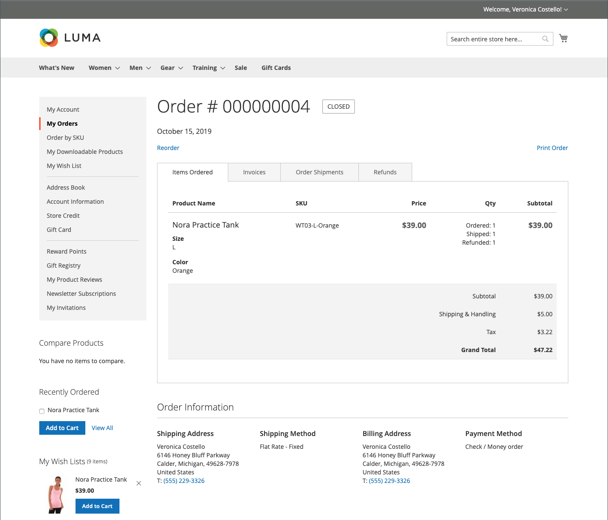
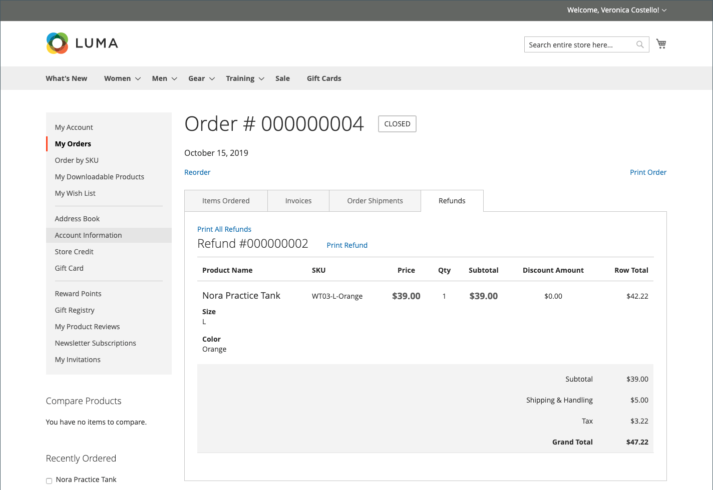
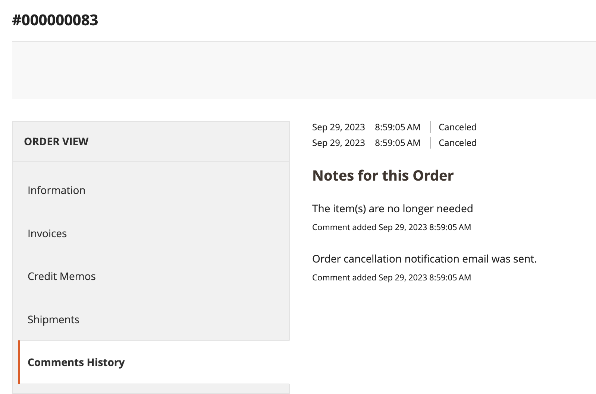

# 店面订单管理

客户可以从其帐户访问其所有订单。 订单可以查看、过滤、跟踪和重新提交为新订单。 根据订单的状态，客户可以打印其订单、发票、发运和退款记录。

## 筛选订单

{{b2b-feature}}

您的初始 _[!UICONTROL My Orders]_结果还包含来自商业实例中所有网站的从属用户的匹配订单。 与公司帐户关联的客户可以筛选订单列表，以快速查找结果中的记录。 要显示过滤器选项，客户单击&#x200B;**[!UICONTROL Filter]**，和点击次数&#x200B;**[!UICONTROL Close]**以隐藏筛选器。

{width="700" zoomable="yes"}

| 筛选 | 描述 |
| ------ | ----------- |
| [!UICONTROL SKU or Product Name] | 输入SKU或产品名称。 |
| [!UICONTROL Order Number] | 可以是完整或部分订单编号。 |
| [!UICONTROL Order Status] | 从下拉列表中选择值以按状态筛选。 |
| [!UICONTROL Invoice Number] | 输入完整的或部分发票编号。 |
| [!UICONTROL Order Date] | 设置一个或两个日期字段以按订单日期过滤。 |
| [!UICONTROL Created by] | 按订单创建者筛选公司订单。 |
| [!UICONTROL Order Total] | 设置最小值、最大值或同时设置这两个值，以按订单合计进行筛选。 |

## 查看订单

客户在列表中找到订单并单击 **[!UICONTROL View Order]**. 从未结订单中，他们可以执行以下任一操作：

{width="700" zoomable="yes"}

### 查看最近订购的产品

此 **[!UICONTROL Recent Orders]** 块显示在侧栏和 **[!UICONTROL My Account]** 页面上的访客，这些访客在下订单后登录。 它显示上次购买的五个产品。

客户可以通过选择产品并单击 **[!UICONTROL Add to Cart]**. 他们还可以通过单击 **[!UICONTROL View all]**，重定向到 _[!UICONTROL My Account]_页面和&#x200B;**[!UICONTROL Recent Orders]**封锁。

### 打印订单

1. 客户点击 **[!UICONTROL Print Order]**.

1. 按照“打印”对话框中的说明完成打印。

### 打印发票

1. 在 **[!UICONTROL Invoices]** 选项卡，客户单击以下任一选项：

   - **[!UICONTROL Print All Invoices]**

   - **[!UICONTROL Print Invoice]**

   {width="700" zoomable="yes"}

1. 使用“打印”对话框完成打印。

### 打印装运

1. 在 **[!UICONTROL Order Shipments]** 选项卡，客户单击以下任一选项：

   - **[!UICONTROL Print All Shipments]**

   - **[!UICONTROL Print Shipment]**

   {width="700" zoomable="yes"}

1. 使用“打印”对话框完成打印。

### 跟踪装运

1. 在 **[!UICONTROL Order Shipments]** 选项卡，单击 **[!UICONTROL Track this Shipment]**.

   任何可用的跟踪信息都会显示在弹出窗口中。

1. 准备就绪后，客户单击 **[!UICONTROL Close Window]**.

### 打印退款

1. 在 **退款** 选项卡，客户单击以下任一选项：

   - **打印所有退款**

   - **打印退款**

   {width="700" zoomable="yes"}

1. 使用“打印”对话框完成打印。

当客户符合以下条件时，其将可获得重新订购： [_允许重新排序_](reorders-allow.md) 配置选项已启用。

客户可以从以下两个页面启动特定订单的重新订购功能：

- “我的订单”页
- 订单查看页面

## 重新排序

此 _[!UICONTROL Reorder]_链接会显示在列表中，订单位于_[!UICONTROL View]_ 链接。

{width="700" zoomable="yes"}

**用例1.** 该订单中的所有产品均可用于重新排序

客户将被重定向到购物车，并且所有产品都会添加到购物车。

**案例2.** 订单中的部分/所有产品不可重新订购

>[!NOTE]
>
>可以重新排序 `Not Visible Individually` 产品。

此 _[!UICONTROL Reorder]_链接未出现在_[!UICONTROL My Orders]_ 和 _[!UICONTROL View Order]_页数。

{width="700" zoomable="yes"}

>[!TIP]
>
>如果购物车不为空且客户单击 **[!UICONTROL Reorder]** (来自 [!UICONTROL My Orders] 或 [!UICONTROL Order View] 页面)，现有产品会保留在购物车中，并添加重新排序的产品。

## 取消订单

取消适用于以下情况的客户： [_允许取消_](cancel-allow.md) 配置选项已启用。

客户可以从以下三个页面为特定订单启动取消功能：

- “我的订单”页
- 订单查看页面
- 我的帐户页面

此 _[!UICONTROL Cancel Order]_链接显示在_[!UICONTROL Reorder]_ 链接。 如果无法取消订单，则不会显示链接。

{width="700" zoomable="yes"}

要执行取消，客户：

1. 点击次数 **[!UICONTROL Cancel Order]**

1. 提供取消原因

   {width="700" zoomable="yes"}

   您可以自定义取消原因 [_允许取消_](cancel-allow.md) 页面。

1. 点击次数 **[!UICONTROL Confirm]**

   {width="700" zoomable="yes"}

   取消后，订单位于 _[!UICONTROL Pending]_状态，更改为_[!UICONTROL Canceled]_ 状态，订单所在的 _[!UICONTROL Processing]_状态，更改为_[!UICONTROL Closed]_ 将处理状态和退款。

   取消完成后，会向客户发送电子邮件。

   {width="700" zoomable="yes"}

   取消信息将添加到客户的订单历史记录中。 它显示在订单的注释内和“注释历史记录”选项卡中。

   {width="700" zoomable="yes"}

   {width="700" zoomable="yes"}

   如果由于某种原因订单更改为无法取消的状态，且客户未刷新页面，则仍会显示取消订单的链接。 但是，当他们尝试取消时，会显示错误消息。

   {width="700" zoomable="yes"}

   刷新页面后，您可以看到订单已完成，这就是取消不起作用的原因。

   {width="700" zoomable="yes"}
