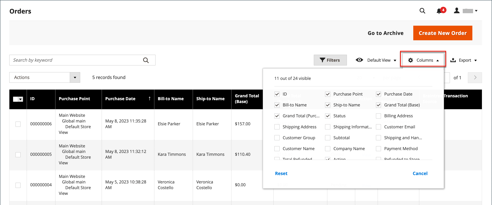
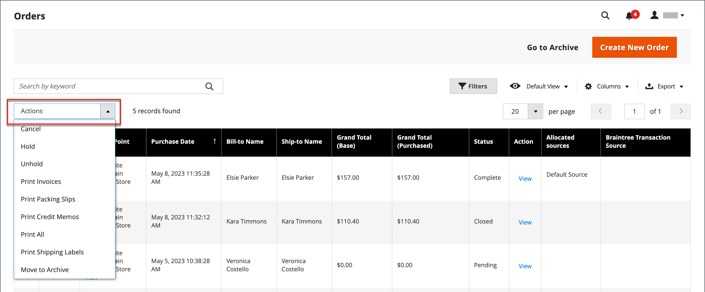
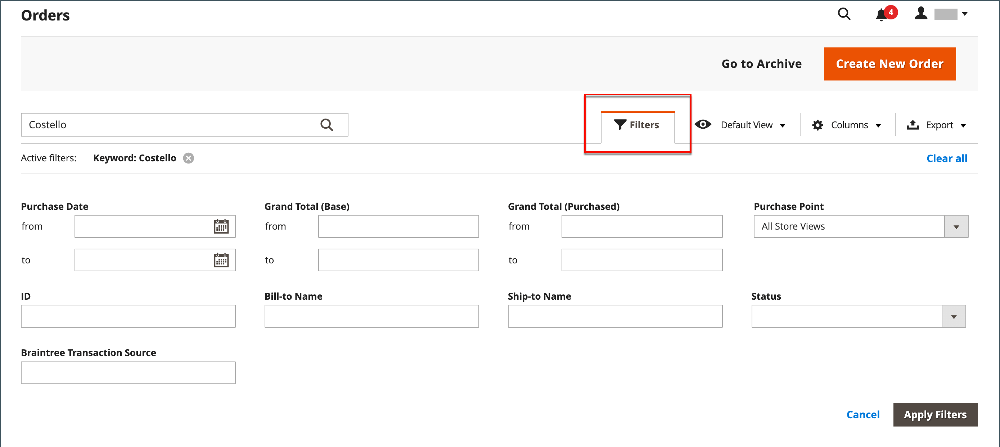

# 订购

此 _订购_ grid列出了所有当前订单并跟踪其进度，并且 [订单状态](order-status.md) 通过 [工作流](order-processing.md). 理解基本过程的一个简单方法是顺序变为 [发票](invoices.md)，并且发票将变为 [装运](shipments.md). 网格表示流程的第一阶段，您可以在此处 [更新](order-update.md) 现有订单和创建订单。

通常，订单是在客户从店面完成结帐流程时创建的。 但是，如果客户需要帮助，您还可以访问其 [购物车](shopping-assisted-cart-manage.md) 或 [创建订单](customer-account-create-order.md) 来自 _订购_ 网格或直接从客户帐户访问。

## 订单工作区

“订单”工作区列出了所有当前订单，并允许您编辑现有订单和 [创建](customer-account-create-order.md) 订单。 网格中的每一行代表一个客户订单，每一列代表一个属性或数据字段。 使用标准 [控件](../getting-started/admin-grid-controls.md) 要对列表进行排序和筛选，请查找订单并应用 [操作](../getting-started/admin-actions-control.md) 至所选订单。 使用分页控件上方的选项卡可筛选列表、更改默认视图、更改和重新排列列以及导出数据。

{width="700" zoomable="yes"}

### 网格布局

列的选择及其在网格中的顺序可以根据您的偏好进行更改。 新布局可另存为网格 _视图_. 默认情况下，网格中仅包含20个可用列中的9个。

{width="600" zoomable="yes"}

#### 更改列选择

在右上角，单击 _列_ (  )控制并执行以下操作：

- 选中要添加到网格的任何列的复选框。
- 清除要从网格中删除的任何列的复选框。

#### 重置列选择

1. 单击 _列_ (  )控件。

1. 要重置网格列，请单击 **[!UICONTROL Reset]**.

   网格布局将更改为仅显示 [默认列](#column-descriptions).

#### 移动列

1. 单击并按住列的标题。

1. 将列拖到新位置并释放。

#### 保存网格视图

1. 单击 **[!UICONTROL View]** (  )控件。

1. 单击 **[!UICONTROL Save Current View]**.

1. 输入 **[!UICONTROL name]** 用于视图。

1. 要保存所有更改，请单击箭头(  )。

   视图名称现在显示为当前视图。

#### 更改视图

单击 **[!UICONTROL View]** (  )控件。 然后，执行以下操作之一：

- 要使用其他视图，请单击视图的名称。

- 要更改视图的名称，请单击 _编辑_ (  )图标并更新名称。

### 工作区控件

| 控件 | 描述 |
|--- |--- |
| [!UICONTROL Create New Order] | 创建订单。 请参阅 [创建订单](customer-account-create-order.md) 以了解更多信息。 |
| [!UICONTROL Go to Archive] | 显示已存档订单的列表。 |
| [!UICONTROL Search] | 根据当前筛选器启动订单搜索。 |
| [!UICONTROL Filters] | 定义一组搜索参数，用于筛选网格中显示的记录。 |
| [!UICONTROL Default View] | 确定网格的默认列布局。 |
| [!UICONTROL Columns] | 确定列的选择及其在网格中的顺序。 列布局可更改并另存为 _视图_. 默认情况下，网格中只包含某些列。 |
| [!UICONTROL Export] | 将选定的记录导出为CSV或Excel XML文件。 |

{style="table-layout:auto"}

### 操作

要将操作应用于特定订单，请选中每个订单第一列中的复选框。 要选择或取消选择所有订单，请使用列顶部的控件。

{width="600" zoomable="yes"}

| 控件 | 描述 |
|--- |--- |
| [!UICONTROL Actions] | 列出可应用于选定订单的所有操作。 要将操作应用于一个订单或一组订单，请选中每个订单第一列中的复选框。  排序操作： `Cancel` / `Hold` / `Unhold` / `Print Invoices` / `Print Packing Slips` / `Print Credit Memos` / `Print All` / `Print Shipping Labels` / `Move to Archive`  (仅限Adobe Commerce) |
| [!UICONTROL Mass Actions] | 可用于选择多个记录作为操作目标。 选中操作所针对的每个记录第一列中的复选框。 选项： `Select All` / `Unselect All` / `Select Visible` / `Unselect Visible` |
| [!UICONTROL Submit] | 将当前操作应用于所选订单记录。 |
| [!UICONTROL Edit] | 在编辑模式下打开订单。 |

{style="table-layout:auto"}

### 列描述

| 列 | 描述 |
|--- |--- |
| [!UICONTROL Select] | 选中要执行操作的引号对应的复选框，或使用列标题中的选择控件。 选项：全选/取消全选 |
| [!UICONTROL ID] | 首次保存新订单时分配的唯一序列号。 |
| [!UICONTROL Purchase Point] | 标识下订单所在的商店视图。 |
| [!UICONTROL Purchase Date] | 下订单的日期和时间。 它始终根据默认时区显示。 |
| [!UICONTROL Bill-to Name] | 负责支付订单的人员姓名。 |
| [!UICONTROL Ship-to Name] | 订单接收人的姓名。 |
| [!UICONTROL Grand Total (Base)] | 订单的总计。 |
| [!UICONTROL Grand Total (Purchased)] | 订单中购买的产品总数。 |
| [!UICONTROL Status] | 当前订单状态。 |
| [!UICONTROL Action] | _[!UICONTROL View]_在编辑模式下打开订单。 |
| [!UICONTROL Allocated sources] | 分配给该特定订单的来源。 |

{style="table-layout:auto"}

其他可用列：

| 列 | 描述 |
|--- |--- |
| [!UICONTROL Billing Address] | 下订单的客户的帐单地址。 |
| [!UICONTROL Shipping Address] | 将发运订单的地址。 |
| [!UICONTROL Shipping Information] | 用于装运订单的方法。 |
| [!UICONTROL Customer Email] | 下订单的人员的电子邮件地址。 |
| [!UICONTROL Customer Group] | 下订单的人员所分配到的客户组。 |
| [!UICONTROL Subtotal] | 订单小计，不包括运费和手续费以及税金。 |
| [!UICONTROL Shipping and Handling] | 运费和包装费。 |
| [!UICONTROL Customer Name] | 下订单的客户的名字和姓氏。 |
| [!UICONTROL Payment Method] | 订单要使用的付款方式。 |
| [!UICONTROL Total Refunded] | 订单中要退款给客户的任何金额。 |
| [!UICONTROL Refunded to Store Credit] |  (仅限Adobe Commerce)订单中要退款到客户商店贷项的任何金额。 |
| [!UICONTROL Company Name] |  (在Adobe Commerce的B2B中提供)的名称 [公司](../b2b/account-companies.md) 下订单的人。 |

{style="table-layout:auto"}

## 订单搜索

“订单”网格左上角的搜索框可用于按关键字查找特定订单，或者过滤网格中的订单记录。

{width="600" zoomable="yes"}

### 搜索匹配项

1. 在页面搜索框中输入搜索词。

1. 要显示结果，请单击 _Search_ (  )。

### 筛选搜索

1. 要显示选择的搜索过滤器，请单击 _过滤器_ (  )选项卡。

   {width="600" zoomable="yes"}

1. 完成任意数量的过滤器，以说明要查找的订单。

1. 单击 **[!UICONTROL Apply Filters]** 以显示结果。

### 搜索筛选器

| 筛选 | 描述 |
|--- |--- |
| [!UICONTROL Purchase Date] | 根据购买日期筛选搜索。 要查找某个日期范围内的订单，请输入 **[!UICONTROL from]** 和 **[!UICONTROL to]** 日期。 |
| [!UICONTROL ID] | 根据订单ID筛选搜索。 |
| [!UICONTROL Grand Total (Base)] | 根据每个订单的总计筛选搜索，其中包括应用于订单的任何积分。 |
| [!UICONTROL Grand Total (Purchased)] | 根据每个订单中购买的项目总数筛选搜索。 |
| [!UICONTROL Bill-to Name] | 根据负责支付订单的人员姓名筛选搜索。 |
| [!UICONTROL Ship-to Name] | 根据接收每个订单的人员姓名筛选搜索。 |
| [!UICONTROL Purchase Point] | 按下订单的网站、商店或商店视图过滤搜索。 |
| [!UICONTROL Status] | 根据订单状态筛选搜索。 选项： `Canceled` / `Closed` / `Complete` / `Suspected Fraud` / `On Hold` / `Payment Review` / `PayPal Canceled Reversal` /` PayPal Reversed` /` Pending` / `Pending Payment` / `Pending PayPal` / `Processing` |
| [!UICONTROL Braintree Transaction Source] | 根据交易来源筛选搜索。 |

{style="table-layout:auto"}

### 搜索工具

| 工具 | 描述 |
|--- |--- |
| [!UICONTROL Apply Filters] | 将所有筛选器应用到搜索结果。 |
| [!UICONTROL Cancel] | 取消当前搜索。 |
| [!UICONTROL Clear All] | 清除所有搜索过滤器。 |

{style="table-layout:auto"}

## 资源疑难解答

有关排查订单问题的帮助，请参阅以下Commerce支持知识库文章：

- [订单显示错误](https://experienceleague.adobe.com/docs/commerce-knowledge-base/kb/troubleshooting/storefront/magento-2.4.0-known-issue-orders-display-error.html)
- [PayPal重复订单10415错误](https://experienceleague.adobe.com/docs/commerce-knowledge-base/kb/support-tools/patches/v1-0-6/mdva-31006-magento-patch-paypal-duplicate-orders-10415-error.html)
- [新订单将发送到存档](https://experienceleague.adobe.com/docs/commerce-knowledge-base/kb/troubleshooting/known-issues-patches-attached/new-orders-are-sent-to-archive.html)
- [在“管理员”的“订单”网格中不显示订单](https://experienceleague.adobe.com/docs/commerce-knowledge-base/kb/troubleshooting/known-issues-patches-attached/orders-not-displayed-in-the-orders-grid-in-the-admin.html)
- [订单状态 — 通过REST API创建的装运不正确](https://experienceleague.adobe.com/docs/commerce-knowledge-base/kb/support-tools/patches/v1-0-7/mdva-30972-magento-patch-order-status-incorrect-shipment-created-via-rest-api.html)
