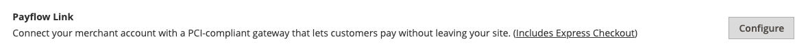

# PayPal Payflow链接

PayPal Payflow Link仅适用于美国和加拿大的商家。 客户无需拥有个人PayPal帐户，即可在PayPal托管的表单中输入其信用卡信息。 此信息绝不会存储在Adobe Commerce或Magento Open Source服务器上。 “工资流链接”不能用于从管理员创建的订单。

在线和离线退款均支持贷项通知单。 但是，不支持多个在线退款。

>[!IMPORTANT]
>
>**PSD2要求：**  
>从2019年9月14日起，欧洲银行可能会拒绝不符合[PSD2](../getting-started/compliance-payment-services-directive.md)要求的支付。 为符合PSD2的要求，PayPal Payflow Link必须与Cardinal Commerce集成。 若要了解详细信息，请参阅[Payflow的3-D安全](https://developer.paypal.com/api/nvp-soap/payflow/3d-secure-overview/)。

## 要求

- [PayPal商业帐户](https://www.paypal.com/webapps/mpp/how-to-sell-online) PayPal Payflow Pro网关将PayPal上的商家帐户与商家网站链接，同时充当网关和商家帐户。

- 如果您管理多个Commerce网站，则必须为每个网站拥有单独的PayPal商家帐户。

## 客户工作流程

1. **客户前往结帐** — 在结帐过程中，客户选择使用PayPal Payflow链接付款并输入信用卡信息。 客户无需拥有个人PayPal帐户。
1. **客户选择“立即付款”** — 客户点按“立即付款”按钮提交订单。
1. **客户输入信用卡信息** — 客户在PayPal托管的表单上输入信用卡信息。 如果客户单击&#x200B;_取消付款_&#x200B;链接，客户将返回到结帐的付款信息阶段，并且订单状态更改为&#x200B;_已取消_。
1. **客户提交订单** — 信用卡信息将直接提交给PayPal，并且不会保留在Commerce网站上的任何位置。

## 订单工作流

1. **PayPal接收请求** - PayPal接收客户的“立即付款”请求。
1. **PayPal验证付款信息** - PayPal验证信用卡信息并分配适当的状态：
   - **已验证付款：**&#x200B;如果已验证，则最初会将&#x200B;_待处理付款_&#x200B;状态分配给订单，直到交易结算为止。
   - **正在处理** — 事务成功。
   - **待处理付款** — 系统未收到来自PayPal的响应。
   - **已取消** — 由于某些原因，该事务未成功。
   - **可疑欺诈** — 交易未通过某些[PayPal欺诈过滤器](paypal.md#paypal-fraud-management-filters)。 系统接收来自PayPal的响应，指出欺诈服务正在审查交易。
   - **取消付款：**&#x200B;如果客户单击&#x200B;_取消付款_&#x200B;链接，客户将返回到结帐的付款信息阶段，并且订单状态更改为&#x200B;_已取消_。
1. **客户被重定向到确认页面** — 如果交易成功完成，客户将被重定向到您商店中的订单确认页面。 如果由于任何原因事务处理失败，则结账页面上会显示一条错误消息，并指示客户重复结账过程。 这些情况由PayPal管理。
1. **商家履行订单** — 商家按常规开具发票并发送订单。

## 配置PayPal帐户

1. 登录到您的[PayPal企业帐户](https://manager.paypal.com/)。

1. 使用以下设置使用PayPal管理器配置[托管签出页面](https://developer.paypal.com/docs/payflow/integration-guide/configure-hosted-checkout/#configuring-hosted-pages-using-paypal-manager)：

   - 在&#x200B;**[!UICONTROL Security Options]**&#x200B;下，完成以下设置：

     **[!UICONTROL AVS]**： `No`

     **[!UICONTROL CSC]**： `No`

     **[!UICONTROL Enable Secure Token]**： `Yes`

   - 选择&#x200B;**[!UICONTROL Customize]**，然后选择&#x200B;**[!UICONTROL Layout C]**。

     布局C仅显示信用卡和借记卡字段，并且可以在您的网站上设置框架或用作独立的弹出窗口。 大小固定在490 x 565像素，为错误消息留出额外空间。 在某些系统上，此设置更正了透明重定向的问题。

1. 配置设置完成后，单击&#x200B;**[!UICONTROL Save and Publish]**。

1. 设置一个额外的用户（由PayPal推荐）：

   - 在主菜单的第二行中，单击&#x200B;**[!UICONTROL Manage Users]**。

   - 若要向帐户添加其他用户，请单击&#x200B;**[!UICONTROL Add User]**。

   - 完成&#x200B;_添加用户_&#x200B;表单的以下部分中的必填字段：

      - [!UICONTROL Admin Confirmation]
      - [!UICONTROL User Information]
      - [!UICONTROL User Login Information]
      - [!UICONTROL Assign Privilege to User]

   - 单击&#x200B;**[!UICONTROL Update]**。

## 设置PayPal Payflow链接

>[!TIP]
>
>随时单击&#x200B;**[!UICONTROL Save Config]**&#x200B;以保存进度。

### 步骤1：开始配置

此设置方法假定您拥有现有的PayPal帐户。

1. 在&#x200B;_管理员_&#x200B;侧边栏上，转到&#x200B;**[!UICONTROL Stores]** > _[!UICONTROL Settings]_>**[!UICONTROL Configuration]**。

1. 在左侧面板中，展开&#x200B;**[!UICONTROL Sales]**&#x200B;并选择&#x200B;**[!UICONTROL Payment Methods]**。

1. 如果您的Commerce安装有多个网站、商店或视图，请将&#x200B;**[!UICONTROL Store View]**&#x200B;设置为要应用此配置的商店视图。

1. 在&#x200B;_[!UICONTROL Merchant Location]_&#x200B;部分中，选择您的公司所在的&#x200B;**[!UICONTROL Merchant Country]**。

   此设置确定配置中显示的PayPal解决方案的选择。

   {width="600" zoomable="yes"}

1. 展开&#x200B;**[!UICONTROL PayPal Payment Gateways]** （如果需要）并单击&#x200B;**[!UICONTROL Configure]**&#x200B;的&#x200B;**[!UICONTROL Payflow Link]**。

   {width="600" zoomable="yes"}

### 步骤2：完成所需的PayPal设置

{width="600" zoomable="yes"}

1. （可选）输入&#x200B;**[!UICONTROL Email Associated with your PayPal Merchant Account]**。

   >[!IMPORTANT]
   >
   >电子邮件地址区分大小写。 要接收付款，电子邮件地址必须与在您的PayPal商家帐户中指定的电子邮件地址匹配。

1. 输入以下凭据之一，用于登录到PayPal商家帐户：

   - **[!UICONTROL Partner]** — 您的PayPal合作伙伴ID。
   - **[!UICONTROL User]** — 在您的PayPal帐户中设置的另一个用户的ID。
   - **[!UICONTROL Vendor]** — 您的PayPal用户登录名。

1. 输入与您的PayPal帐户关联的&#x200B;**[!UICONTROL Password]**。

1. 要运行测试事务，请将&#x200B;**[!UICONTROL Test Mode]**&#x200B;设置为`Yes`。

   在沙盒中测试配置时，仅使用PayPal推荐的[信用卡号](https://www.paypalobjects.com/en_AU/vhelp/paypalmanager_help/credit_card_numbers.htm)。 当您准备好进入生产环境时，请返回到配置并将测试模式设置为`No`。

1. 如果您的系统使用代理服务器建立与PayPal系统的连接，请将&#x200B;**[!UICONTROL Test Mode]**&#x200B;设置为`Yes`并执行以下操作：

   - 输入&#x200B;**[!UICONTROL Proxy Host]**&#x200B;的IP地址。

   - 输入&#x200B;**[!UICONTROL Proxy Port]**&#x200B;的端口号。

     当服务器防火墙阻止直接访问PayPal服务器时，将使用代理。 在这种情况下，使用第三方服务器来中继流量。

1. 将&#x200B;**[!UICONTROL Enable Payflow Link]**&#x200B;设置为`Yes`。

1. 如果要为客户启用[PayPal Express签出](paypal-express-checkout.md)选项，请将&#x200B;**[!UICONTROL Enable Express Checkout]**&#x200B;设置为`Yes`。

1. 如果要为客户提供点数[PayPal](paypal.md#paypal-credit-and-pay-later)，请将&#x200B;**[!UICONTROL Enable PayPal Credit]**&#x200B;设置为`Yes`。

### 步骤3：设置广告PayPal Credit/广告PayPal PayLater（可选）

从2.4.3版本开始，在包括PayPal的部署中支持PayPal PayLater。 此功能允许购物者以每两周一次分期付款的方式支付订单，而不是在购买时支付全额。 弃用PayPal信用体验。

将&#x200B;**[!UICONTROL Enable PayPal PayLater Experience]**&#x200B;设置为以下项之一：

- `Yes` — 设置广告PayPal PayLater
- `No` — 设置广告PayPal点数

#### 广告PayPal点数

1. 展开扩展选择器&#x200B;**[!UICONTROL Advertise PayPal Credit]**。

   {width="600" zoomable="yes"}

1. 若要获取帐户信息，请单击&#x200B;**[!UICONTROL Get Publisher ID from PayPal]**&#x200B;并按照说明操作。

1. 输入您的&#x200B;**[!UICONTROL Publisher ID]**。

1. 展开扩展选择器&#x200B;**[!UICONTROL Home Page]**。

   {width="600" zoomable="yes"}

1. 若要在页面上放置横幅，请将&#x200B;**[!UICONTROL Display]**&#x200B;设置为`Yes`。

1. 将&#x200B;**[!UICONTROL Position]**&#x200B;设置为以下项之一：

   - `Header (center)`
   - `Sidebar (right)`

1. 将&#x200B;**[!UICONTROL Size]**&#x200B;设置为以下项之一：

   - `190 x 100`
   - `234 x 60`
   - `300 x 50`
   - `468 x 60`
   - `728 x 90`
   - `800 x 66`

1. 展开其余部分，并重复主页配置的上述步骤：

   - **[!UICONTROL Catalog Category Page]**
   - **[!UICONTROL Catalog Product Page]**
   - **[!UICONTROL Checkout Cart Page]**

#### 广告PayPal PayLater

1. 展开扩展选择器&#x200B;**[!UICONTROL Advertise PayPal PayLater]**。

1. 将&#x200B;**[!UICONTROL Enable PayPal PayLater]**&#x200B;设置为`Yes`。

1. 展开扩展选择器&#x200B;**[!UICONTROL Home Page]**。

   {width="600" zoomable="yes"}

1. 若要在页面上放置横幅，请将&#x200B;**[!UICONTROL Display]**&#x200B;设置为`Yes`。

1. 将&#x200B;**[!UICONTROL Position]**&#x200B;设置为以下项之一：

   - `Header (center)`
   - `Sidebar`

1. 将&#x200B;**[!UICONTROL Style Layout]**&#x200B;设置为以下项之一：

   - `Text`
   - `Flex`

1. 仅对于[!UICONTROL Style Layout] **[!UICONTROL Text]**，将&#x200B;**[!UICONTROL Logo Type]**&#x200B;设置为以下项之一：

   - `Primary`
   - `Alternative`
   - `Inline`
   - `None`

1. 仅对于[!UICONTROL Style Layout] **[!UICONTROL Text]**，将&#x200B;**[!UICONTROL Logo Position]**&#x200B;设置为以下项之一：

   - `Left`
   - `Right`
   - `Top`

1. 仅对于[!UICONTROL Style Layout] **[!UICONTROL Text]**，将&#x200B;**[!UICONTROL Text Color]**&#x200B;设置为以下项之一：

   - `Black`
   - `White`
   - `Monochrome`
   - `Grayscale`

1. 仅对于[!UICONTROL Style Layout] **[!UICONTROL Text]**，将&#x200B;**[!UICONTROL Text Size]**&#x200B;设置为以下项之一：

   - `10px`
   - `11px`
   - `12px`
   - `13px`
   - `14px`
   - `15px`
   - `16px`

1. 仅对于[!UICONTROL Style Layout] **[!UICONTROL Flex]**，将&#x200B;**[!UICONTROL Ratio]**&#x200B;设置为以下项之一：

   - `1x1`
   - `1x4`
   - `8x1`
   - `20x1`

1. 仅对于[!UICONTROL Style Layout] **[!UICONTROL Flex]**，将&#x200B;**[!UICONTROL Color]**&#x200B;设置为以下项之一：

   - `Blue`
   - `Black`
   - `White`
   - `White No Border`
   - `Gray`
   - `Monochrome`
   - `Grayscale`

1. 展开其余部分并重复上述步骤：

   - **[!UICONTROL Catalog Product Page]**
   - **[!UICONTROL Checkout Cart Page]**
   - **[!UICONTROL Checkout Payment Step]**
   - **[!UICONTROL Catalog Category Page]**

### 步骤4：完成基本设置

1. 展开扩展选择器&#x200B;**[!UICONTROL Basic Settings - PayPal Payflow Link]**。

   {width="600" zoomable="yes"}

1. 对于&#x200B;**[!UICONTROL Title]**，输入在结帐期间标识PayPal Payflow Link的标题。

   建议您使用标题&#x200B;_借记卡或信用卡_。

1. 如果您提供多种付款方法，请输入&#x200B;**[!UICONTROL Sort Order]**&#x200B;的数字，以确定与其它付款方法一起列出时，Payflow Link的显示顺序。

   此数字相对于其他支付方式。 （`0` =第一，`1` =第二，`2` =第三，依此类推。）

1. 将&#x200B;**[!UICONTROL Payment Action]**&#x200B;设置为以下项之一：

   - `Authorization` — 批准购买并暂停资金。 该金额在商户缴获前不会提取。
   - `Sale` — 已授权并立即从客户帐户中收回购买金额。

### 步骤5：完成高级设置

1. 展开扩展选择器&#x200B;**[!UICONTROL Advanced Settings]**。

   {width="600" zoomable="yes"}

1. 将&#x200B;**[!UICONTROL Payment Applicable From]**&#x200B;设置为以下项之一：

   - `All Allowed Countries` — 来自您商店配置中指定的所有[国家/地区](../getting-started/store-details.md#country-options)的客户都可以使用此付款方式。
   - `Specific Countries` — 选择此选项后，将显示&#x200B;_[!UICONTROL Payment from Specific Countries]_&#x200B;列表。 按住Ctrl键并选择列表中客户可在您的商店购买产品的每个国家/地区。

1. 要将与付款系统的通信写入日志文件，请将&#x200B;**[!UICONTROL Debug Mode]**&#x200B;设置为`Yes`。

   >[!NOTE]
   >
   >根据PCI数据安全标准，信用卡信息不会记录在日志文件中。

1. 要启用主机真实性验证，请将&#x200B;**[!UICONTROL Enable SSL Verification]**&#x200B;设置为`Yes`。

1. 如果希望客户能够更正信用卡背面输入的3位数CVV安全代码，请将&#x200B;**[!UICONTROL CVV Entry is Editable]**&#x200B;设置为`Yes`。

1. 若要要求客户输入CVV代码，请将&#x200B;**[!UICONTROL Require CVV Entry]**&#x200B;设置为`Yes`。

1. 若要向客户发送付款确认，请将&#x200B;**[!UICONTROL Send Email Confirmation]**&#x200B;设置为`Yes`。

1. 要确定在交易期间与PayPal服务器交换信息的方法，请将&#x200B;**[!UICONTROL URL method for Cancel URL and Return URL]**&#x200B;设置为以下任一项：

   - `GET` — 检索进程结果的信息（默认方法）。
   - `POST` — 向数据处理流程提供数据块，例如输入到表单中的数据。

   _取消URL_&#x200B;和&#x200B;_返回URL_&#x200B;是指客户在PayPal服务器上完成或取消结帐流程中的付款部分后返回的页面

1. 根据存储需要，完成以下部分：

   - [结算报表设置](#settlement-report-settings)
   - [前端体验设置](#frontend-experience-settings)

#### 结算报表设置

1. 展开扩展选择器&#x200B;**[!UICONTROL Settlement Report Settings]**。

   {width="600" zoomable="yes"}

1. 对于&#x200B;**[!UICONTROL SFTP Credentials]**，执行以下操作：

   - 如果您已注册PayPal安全FTP服务器，请输入以下SFTP登录凭据：

      - 登录
      - 密码

   - 要在使用Express Checkout在您的网站上正式启用之前运行测试报告，请将&#x200B;**[!UICONTROL Sandbox Mode]**&#x200B;设置为`Yes`。

   - 输入&#x200B;**[!UICONTROL Custom Endpoint Hostname or IP Address]**。

     默认情况下，值为`reports.paypal.com`。

   - 输入保存报告的&#x200B;**[!UICONTROL Custom Path]**。

     默认情况下，值为`/ppreports/outgoing`。

1. 要根据计划生成报表，请完成&#x200B;**[!UICONTROL Scheduled Fetching]**&#x200B;设置：

   - 将&#x200B;**[!UICONTROL Enable Automatic Fetching]**&#x200B;设置为`Yes`。

   - 将&#x200B;**[!UICONTROL Schedule]**&#x200B;设置为以下项之一：

      - `Daily`
      - `Every 3 Days`
      - `Every 7 Days`
      - `Every 10 Days`
      - `Every 14 Days`
      - `Every 30 Days`
      - `Every 40 Days`

     PayPal会将每个报表保留45天。

   - 如果要生成报告，请将&#x200B;**[!UICONTROL Time of Day]**&#x200B;设置为小时、分钟和秒。

#### 前端体验设置

使用&#x200B;_[!UICONTROL Frontend Experience Settings]_&#x200B;选择要在您的网站上显示的PayPal徽标，并自定义PayPal商家页面的外观。

1. 展开扩展选择器&#x200B;**[!UICONTROL Frontend Experience Settings]**。

   {width="600" zoomable="yes"}

1. 选择要显示在应用商店的PayPal块中的&#x200B;**[!UICONTROL PayPal Product Logo]**。

   PayPal徽标有四种样式和两种尺寸：

   - `No Logo`
   - `We Prefer PayPal (150 x 60 or 150 x 40)`
   - `Now Accepting PayPal (150 x 60 or 150 x 40)`
   - `Payments by PayPal (150 x 60 or 150 x 40)`
   - `Shop Now Using PayPal (150 x 60 or 150 x 40)`

1. 要自定义PayPal商家页面的外观，请执行以下操作：

   - 输入要应用于PayPal商家页面的&#x200B;**[!UICONTROL Page Style]**&#x200B;的名称：

      - `paypal` — 使用PayPal页面样式。
      - `primary` — 使用您在帐户配置文件中标识为&#x200B;_primary_&#x200B;样式的页面样式。
      - `your_custom_value` — 使用在您的帐户配置文件中指定的自定义付款页面样式。

   - 对于&#x200B;**[!UICONTROL Header Image URL]**，输入要显示在付款页左上角的图像URL。 最大文件大小为750像素宽x 90像素高。

     >[!NOTE]
     >
     >PayPal建议将映像驻留在安全(https)服务器上。 否则，浏览器可能会警告&#x200B;_该页面包含安全和非安全项目_。

   - 要设置页面的颜色，请为以下各项输入六个字符的十六进制代码（不带`#`符号）：

      - **[!UICONTROL Header Background Color]** — 签出页面标题的背景颜色。
      - **[!UICONTROL Header Border Color]** — 标题周围两像素边框的颜色。
      - **[!UICONTROL Page Background Color]** — 结账页面以及标题和付款表单周围的背景颜色。

### 步骤6：完成PayPal Express结帐的基本设置

1. 展开扩展选择器&#x200B;**[!UICONTROL Basic Settings - PayPal Express Checkout]**。

   {width="600" zoomable="yes"}

1. 对于&#x200B;**[!UICONTROL Title]**，输入在结帐时标识此付款方式的标题。

   建议将每个商店视图的标题设置为&#x200B;_PayPal_。

1. 如果您提供多种付款方式，请输入&#x200B;**[!UICONTROL Sort Order]**&#x200B;的数字，以确定与其他付款方式一起列出时PayPal快速结帐的出现顺序。

   此数字相对于其他支付方式。 （`0` =第一，`1` =第二，`2` =第三，依此类推。）

1. 将&#x200B;**[!UICONTROL Payment Action]**&#x200B;设置为以下项之一：

   - `Authorization` — 批准购买并暂停资金。 在商户捕获&#x200B;_金额_&#x200B;之前，不撤消该金额。
   - `Sale` — 已授权并立即从客户帐户中收回购买金额。

1. 要在产品页面上显示&#x200B;_[!UICONTROL Check out with PayPal]_&#x200B;按钮，请将&#x200B;**[!UICONTROL Display on Product Details Page]**&#x200B;设置为`Yes`。

### 步骤7：完成PayPal Express签出的高级设置

1. 展开扩展选择器&#x200B;**[!UICONTROL Advanced Settings]**。

   {width="600" zoomable="yes"}

1. 将&#x200B;**[!UICONTROL Display on Shopping Cart]**&#x200B;设置为`Yes`。

1. 将&#x200B;**[!UICONTROL Payment Applicable From]**&#x200B;设置为以下项之一：

   - `All Allowed Countries` — 来自您商店配置中指定的所有国家/地区的客户可以使用此付款方式。
   - `Specific Countries` — 选择此选项后，将显示&#x200B;_[!UICONTROL Payment from Specific Countries]_&#x200B;列表。 要选择多个国家/地区，请按住Ctrl键(PC)或Command键(Mac)并单击每个项目。

1. 要将与付款系统的通信写入日志文件，请将&#x200B;**[!UICONTROL Debug Mode]**&#x200B;设置为`Yes`。

   >[!NOTE]
   >
   >根据PCI数据安全标准，信用卡信息不会记录在日志文件中。

1. 要启用主机真实性验证，请将&#x200B;**[!UICONTROL Enable SSL Verification]**&#x200B;设置为`Yes`。

1. 要显示PayPal网站中按行项目的客户订单的完整摘要，请将&#x200B;**[!UICONTROL Transfer Cart Line Items]**&#x200B;设置为`Yes`。

1. 要允许客户从PayPal网站完成交易而不返回商店进行订单审核，请将&#x200B;**[!UICONTROL Skip Order Review Step]**&#x200B;设置为`Yes`。

1. 完成后，单击&#x200B;**[!UICONTROL Save Config]**。
