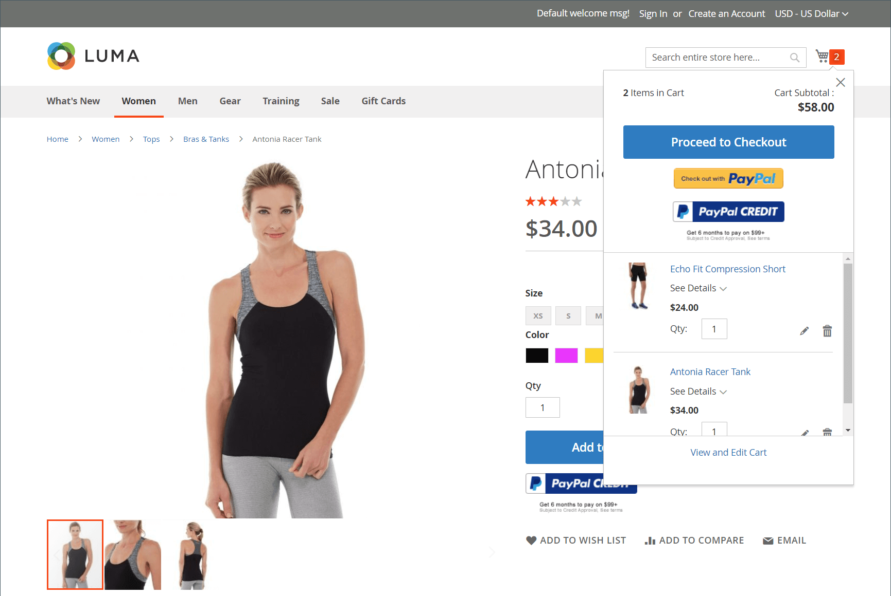
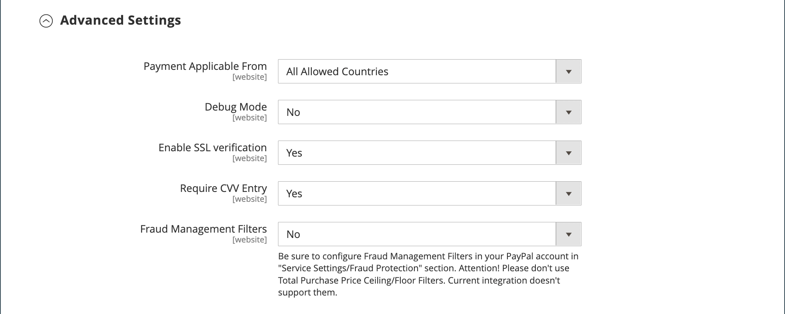
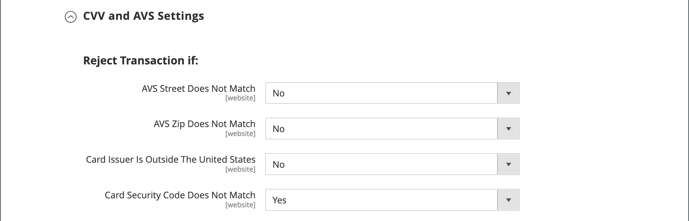

# PayPal Payments Pro

[PayPal Payments Pro][3] 将商户帐户和支付网关的所有优势集中在一起，并且允许您创建自己的完全自定义的结账体验。 PayPal Express Checkout通过PayPal Payments Pro自动启用，因此您可以访问1.1亿多位PayPal活跃用户。

{width="700" zoomable="yes"}

>[!IMPORTANT]
>
>**PSD2要求：**  
>从2019年9月14日起，欧洲银行可能会拒绝未满足要求的支付 [PSD2](../getting-started/compliance-payment-services-directive.md) 要求。 为了符合PSD2，PayPal Payments Pro必须集成到第三方插件中。

>[!NOTE]
>
>目前，PayPal Payments Pro在美国、英国和加拿大均可用。

## 要求

- [PayPal商家帐户][1] （激活直接支付的情况下）

## 签出工作流

1. **客户前往结帐**  — 客户将产品添加到购物车，然后单击/点按 _继续操作直到进入结账流程_.|
1. **客户选择付款方式**  — 在结账过程中，客户选择 _PayPal直接付款_ 选项，并输入信用卡信息。
   - 如果使用PayPal Payments Pro付款，客户在结账过程中将留在您的网站上。
   - 如果通过PayPal Express Checkout付款，客户将被重定向至PayPal网站以完成交易。

应客户请求，商店管理员还可以从管理员处创建订单，并使用PayPal Payments Pro处理交易。

## 订单处理工作流

1. **下单**  — 订单可由商店管理员或PayPal商家帐户处理。

1. **[!UICONTROL Payment Action]**  — 配置中指定的付款活动应用于订单。 选项包括：

   - **授权** - Commerce使用创建销售订单 _正在处理_ 状态。 在此情况下，将授权的货币金额正在等待审批。
   - **销售** - Commerce创建销售订单和发票。
   - **Capture** - PayPal将订单金额从客户余额、银行帐户或信用卡转移到商家帐户。

1. **开票** - PayPal向Commerce发送即时付款通知消息后，将在Commerce中创建发票。

   确保在您的PayPal商家帐户中启用即时付款通知。

   >[!NOTE]
   >
   >如有必要，可以为指定数量的产品对订单开部分发票。 对于每个提交的部分发票，具有唯一ID的单独捕获事务将变为可用，并会生成单独的发票。

   仅在获取全部订单金额后关闭仅授权付款事务处理。

   您可以随时联机撤消订单，直到对订单金额全额开票为止。

1. **返回**  — 如果客户退回所购买的产品并申请退款（与获取订单金额和创建发票一样），则您可以从管理员或PayPal商家帐户创建联机退款。

## 配置PayPal帐户

在Commerce中设置PayPal Payments Pro之前，必须在PayPal网站上配置您的商家帐户。

1. 登录 [PayPal商业帐户](https://manager.paypal.com/).

1. 在PayPal管理器菜单中，选择 **[!UICONTROL Service Settings]**.

1. 下 **[!UICONTROL Hosted Checkout Pages]**，单击 **[!UICONTROL Set Up]**.

1. 下 **[!UICONTROL Choose your settings]**，设置 **[!UICONTROL Transaction Process Mode]** 到 `Live`.

1. 下 **[!UICONTROL Display options on payment page]**，设置 **[!UICONTROL Cancel URL Method]** 到 `POST`.

1. 下 **[!UICONTROL Billing Information]**，选择卡安全代码 **[!UICONTROL CSC]** 必填字段和可编辑字段对应的复选框。

1. 下 **[!UICONTROL Payment Confirmation]**，设置 **[!UICONTROL Return URL Method]** 到 `POST`.

1. 下 **[!UICONTROL Security Options]**，配置以下内容：

   - **[!UICONTROL AVS]**: `No`
   - **[!UICONTROL CSC]**: `No`
   - **[!UICONTROL Enable Secure Token]**: `Yes`

1. 单击 **[!UICONTROL Save Changes]**.

1. 在 _PayPal管理器_ 菜单，选择 **[!UICONTROL Service Settings]** 和下 _托管的签出页面_，选择 **[!UICONTROL Customize]**.

1. 选择 **[!UICONTROL Layout C]**.

   布局C仅显示信用卡和借记卡字段，并且可以在您的网站上设置框架或用作独立的弹出窗口。 大小固定在490 x 565像素，为错误消息留出额外空间。 在某些系统上，此设置更正了透明重定向的问题。

1. 单击 **[!UICONTROL Save and Publish]**.

1. 在PayPal管理器菜单中，选择 **[!UICONTROL Account Administration]**. 下 **[!UICONTROL Manage Security]**，单击 **[!UICONTROL Transaction Settings]**.

1. 设置 **[!UICONTROL Allow reference transactions]** 到 `Yes`.

1. 单击 **[!UICONTROL Confirm]**.

   >[!NOTE]
   >
   >如果您有多个Commerce网站，则必须为每个网站创建单独的PayPal Payments Pro帐户。

1. 设置另一个用户（由PayPal推荐）：

   - 在主菜单的第二行中，单击 **[!UICONTROL Manage Users]**.

   - 若要向帐户中添加其他用户，请单击 **[!UICONTROL Add User]**. 该链接位于“管理用户”标题的正上方。

   - 填写以下部分中的必填字段 _[!UICONTROL Add User]_表单：

      - [!UICONTROL Admin Confirmation]
      - [!UICONTROL User Information]
      - [!UICONTROL User Login Information]
      - [!UICONTROL Assign Privilege to User]

   - 单击 **[!UICONTROL Update]**.

1. 确保注销您的PayPal帐户。

## 在商业中设置PayPal Payments Pro

>[!NOTE]
>
>您可以同时激活两个PayPal解决方案： [PayPal Express签出](paypal-express-checkout.md)，加上任一 [一体式解决方案](paypal.md#paypal-all-in-one-payment-solutions). 如果您更改付款解决方案，则以前使用的解决方案会自动禁用。

>[!TIP]
>
>单击 **[!UICONTROL Save Config]** 以保存进度。

### 步骤1：开始配置

1. 在 _管理员_ 侧栏，转到 **[!UICONTROL Stores]** > _[!UICONTROL Settings]_>**[!UICONTROL Configuration]**.

1. 在左侧面板中，展开 **[!UICONTROL Sales]** 并选择 **[!UICONTROL Payment Methods]**.

1. 如果您的Commerce安装有多个网站、商店或视图，请设置 **[!UICONTROL Store View]** 到要应用此配置的商店视图。

1. 在 _[!UICONTROL Merchant Location]_部分，选择&#x200B;**[!UICONTROL Merchant Country]**公司所在的位置。

   此设置确定配置中显示的PayPal解决方案的选择。

   {width="600" zoomable="yes"}

1. 展开 **[!UICONTROL PayPal All-in-One Payment Solution]** 并单击 **[!UICONTROL Configure]** 对象 **[!UICONTROL Payments Pro]**.

   {width="600" zoomable="yes"}

### 步骤2：完成所需的PayPal设置

1. 展开  该 **[!UICONTROL Payments Pro and Express Checkout]** 部分。

   {width="600" zoomable="yes"}

1. （可选）输入 **[!UICONTROL Email Associated with your PayPal Merchant Account]**.

   >[!IMPORTANT]
   >
   >电子邮件地址区分大小写。 要接收付款，电子邮件地址必须与在您的PayPal商家帐户中指定的电子邮件地址匹配。

   如果您没有PayPal帐户，请单击 **[!UICONTROL Start accepting payments via PayPal]**.

1. 输入以下凭据之一，用于登录到PayPal商家帐户：

   - **[!UICONTROL Partner]**  — 您的PayPal合作伙伴ID。
   - **[!UICONTROL Vendor]**  — 您的PayPal用户登录名。
   - **[!UICONTROL User]**  — 在您的PayPal帐户中设置的另一个用户的ID。

1. 输入 **[!UICONTROL Password]** 与您的PayPal帐户关联的帐户。

1. 要运行测试事务，请设置 **[!UICONTROL Test Mode]** 到 `Yes`.

   在沙盒中测试配置时，仅使用 [信用卡号码][2] 由PayPal推荐。 当您准备好进入生产环境时，请返回到配置并将测试模式设置为 `No`.

1. 如果您的系统使用代理服务器建立与PayPal系统的连接，请设置 **[!UICONTROL Use Proxy]** 到 `Yes` 并执行以下操作：

   - 输入IP地址 **[!UICONTROL Proxy Host]**.

   - 输入 **[!UICONTROL Proxy Port]**.

   当服务器防火墙阻止直接访问PayPal服务器时，将使用代理。 在这种情况下，使用第三方服务器来中继流量。

1. 设置 **[!UICONTROL Enable this Solution]** 到 `Yes`.

1. 如果您想提供 [PayPal点数](paypal.md#paypal-credit-and-pay-later) 对于客户，设置 **[!UICONTROL Enable PayPal Credit]** 到 `Yes`.

1. 如果要安全存储客户付款/信用卡详细信息，以便客户不必每次都重新输入付款信息，请设置 **[!UICONTROL Vault Enabled]** 到 `Yes`.

### 步骤3：设置广告PayPal Credit/广告PayPal PayLater（可选）

从2.4.3版本开始，在包括PayPal的部署中支持PayPal PayLater。 此功能允许购物者以每两周一次分期付款的方式支付订单，而不是在购买时支付全额。 弃用PayPal信用体验。

设置 **[!UICONTROL Enable PayPal PayLater Experience]** 更改为以下任一项：

- `Yes`  — 设置广告PayPal PayLater
- `No`  — 设置广告PayPal信用

#### 广告PayPal点数

1. 展开  该 **[!UICONTROL Advertise PayPal Credit]** 部分。

   {width="600" zoomable="yes"}

1. 要获取您的帐户信息，请单击 **[!UICONTROL Get Publisher ID from PayPal]** 然后按照说明操作。

1. 输入您的 **[!UICONTROL Publisher ID]**.

1. 展开  该 **[!UICONTROL Home Page]** 部分。

   {width="600" zoomable="yes"}

1. 要在页面上放置横幅，请设置 **[!UICONTROL Display]** 到 `Yes`.

1. 设置 **[!UICONTROL Position]** 更改为以下任一项：

   - `Header (center)`
   - `Sidebar (right)`

1. 设置 **[!UICONTROL Size]** 更改为以下任一项：

   - `190 x 100`
   - `234 x 60`
   - `300 x 50`
   - `468 x 60`
   - `728 x 90`
   - `800 x 66`

1. 展开  其余部分并重复上述步骤：

   - **[!UICONTROL Catalog Category Page]**
   - **[!UICONTROL Catalog Product Page]**
   - **[!UICONTROL Checkout Cart Page]**

#### 广告PayPal PayLater

1. 展开  该 **[!UICONTROL Advertise PayPal PayLater]** 部分。

1. 设置 **[!UICONTROL Enable PayPal PayLater]** 到 `Yes`.

1. 展开  该 **[!UICONTROL Home Page]** 部分。

   {width="600" zoomable="yes"}

1. 要在页面上放置横幅，请设置 **[!UICONTROL Display]** 到 `Yes`.

1. 设置 **[!UICONTROL Position]** 更改为以下任一项：

   - `Header (center)`
   - `Sidebar`

1. 设置 **[!UICONTROL Style Layout]** 更改为以下任一项：

   - `Text`
   - `Flex`

1. 对象 [!UICONTROL Style Layout] **[!UICONTROL Text]** 仅限，设置 **[!UICONTROL Logo Type]** 更改为以下任一项：

   - `Primary`
   - `Alternative`
   - `Inline`
   - `None`

1. 对象 [!UICONTROL Style Layout] **[!UICONTROL Text]** 仅限，设置 **[!UICONTROL Logo Position]** 更改为以下任一项：

   - `Left`
   - `Right`
   - `Top`

1. 对象 [!UICONTROL Style Layout] **[!UICONTROL Text]** 仅限，设置 **[!UICONTROL Text Color]** 更改为以下任一项：

   - `Black`
   - `White`
   - `Monochrome`
   - `Grayscale`

1. 对象 [!UICONTROL Style Layout] **[!UICONTROL Text]** 仅限，设置 **[!UICONTROL Text Size]** 更改为以下任一项：

   - `10px`
   - `11px`
   - `12px`
   - `13px`
   - `14px`
   - `15px`
   - `16px`

1. 对象 [!UICONTROL Style Layout] **[!UICONTROL Flex]** 仅限，设置 **[!UICONTROL Ratio]** 更改为以下任一项：

   - `1x1`
   - `1x4`
   - `8x1`
   - `20x1`

1. 对象 [!UICONTROL Style Layout] **[!UICONTROL Flex]** 仅限，设置 **[!UICONTROL Color]** 更改为以下任一项：

   - `Blue`
   - `Black`
   - `White`
   - `White No Border`
   - `Gray`
   - `Monochrome`
   - `Grayscale`

1. 展开  其余部分并重复上述步骤：

   - **[!UICONTROL Catalog Product Page]**
   - **[!UICONTROL Checkout Cart Page]**
   - **[!UICONTROL Checkout Payment Step]**
   - **[!UICONTROL Catalog Category Page]**

### 步骤4：完成基本设置

1. 展开  该 **[!UICONTROL Basic Settings - PayPal Payments Pro]** 部分。

   {width="600" zoomable="yes"}

1. 对象 **[!UICONTROL Title]**，输入在结账时标识PayPal Payments Pro的标题。

   建议您使用标题 _借记卡或信用卡_.

1. 如果您提供多种支付方式，请输入一个数字 **[!UICONTROL Sort Order]** 确定在结账过程中与其他支付方式一起列出PayPal Payments Pro时显示的顺序。

   此数字相对于其他支付方式。 (`0` =第一个， `1` =秒， `2` =第三，依此类推。)

1. 设置 **[!UICONTROL Payment Action]** 更改为以下任一项：

   - `Authorization`  — 批准购买，但保留资金。 该款项于到期前不会提取。 _已捕获_ 是商贩送的。
   - `Sale`  — 采购金额已获授权并立即从客户帐户中提取。

1. 对象 **[!UICONTROL Credit Card Settings]**，选择您同意在商店中付款的信用卡。

   要选择多个卡，请按住Ctrl键(PC)或Command键(Mac)并单击每个卡。

   >[!NOTE]
   >
   >美国运通需要额外的协议。

### 步骤5：完成高级设置

1. 展开  该 **[!UICONTROL Advanced Settings]** 部分。

   {width="600" zoomable="yes"}

1. 设置 **[!UICONTROL Payment Applicable From]** 更改为以下任一项：

   - `All Allowed Countries`  — 来自所有客户的客户 [国家/地区](../getting-started/store-details.md#country-options) 在商店配置中指定的可使用此付款方式。
   - `Specific Countries`  — 选择此选项后， _[!UICONTROL Payment from Specific Countries]_列表出现。 按住Ctrl键(PC)或Command键(Mac)，然后选择客户可在您的商店中购买产品的每个国家/地区。

1. 要将与支付系统的通信写入日志文件，请设置 **[!UICONTROL Debug Mode]** 到 `Yes`.

   >[!NOTE]
   >
   >根据PCI数据安全标准，信用卡信息不会记录在日志文件中。

1. 要启用主机真实性验证，请设置 **[!UICONTROL Enable SSL Verification]** 到 `Yes`.

1. 要要求客户输入CVV代码，请设置 **[!UICONTROL Require CVV Entry]** 到 `Yes`.

1. 展开  该 **[!UICONTROL CVV and AVS Settings]** 部分。

1. 要确定当地址验证系统标识不匹配时何时应拒绝事务，请指定如何处理以下每种情况：

   - 要根据不匹配的街道匹配拒绝事务，请设置 **[!UICONTROL AVS Street Does Not Match]** 到 `Yes`.

   - 要根据不匹配的邮政编码拒绝交易，请设置 **[!UICONTROL AVS Zip Does Not Match]** 到 `Yes`.

   - 要根据不匹配的国家/地区标识符拒绝交易，请设置 **[!UICONTROL International AVS Indicator Does Not Match]** 到 `Yes`.

   - 要根据不匹配的CVV代码拒绝事务，请设置 **[!UICONTROL International Card Security Code Does Not Match]** 到 `Yes`.

   {width="600" zoomable="yes"}

1. 根据存储需要，完成以下部分：

   - [结算报表设置](#settlement-report-settings)
   - [前端体验设置](#frontend-experience-settings)

#### 结算报表设置

1. 展开  该 **[!UICONTROL Settlement Report Settings]** 部分。

   {width="600" zoomable="yes"}

1. 对象 **[!UICONTROL SFTP Credentials]**，请执行以下操作：

   - 如果您已注册PayPal的安全FTP服务器，请输入以下SFTP登录凭据：

      - 登录
      - 密码

   - 要在网站上启用Payments Pro之前运行测试报告，请设置 **[!UICONTROL Sandbox Mode]** 到 `Yes`.

   - 输入 **[!UICONTROL Custom Endpoint Hostname or IP Address]**.

     默认情况下，该值为 `reports.paypal.com`.

   - 输入 **[!UICONTROL Custom Path]** 保存报告的位置。

     默认情况下，该值为 `/ppreports/outgoing`.

1. 要根据计划生成报表，请完成 **[!UICONTROL Scheduled Fetching]** 设置：

   - 设置 **[!UICONTROL Enable Automatic Fetching]** 到 `Yes`.

   - 设置 **[!UICONTROL Schedule]** 更改为以下任一项：

      - `Daily`
      - `Every 3 Days`
      - `Every 7 Days`
      - `Every 10 Days`
      - `Every 14 Days`
      - `Every 30 Days`
      - `Every 40 Days`

     PayPal会将每个报表保留45天。

   - 设置 **[!UICONTROL Time of Day]** 到您希望生成报告时的小时、分钟和秒。

#### 前端体验设置

使用 _[!UICONTROL Frontend Experience Settings]_选择要在您的网站上显示的PayPal徽标，以及自定义您的PayPal商家页面的外观。

1. 展开  该 **[!UICONTROL Frontend Experience Settings]** 部分。

   {width="600" zoomable="yes"}

1. 选择 **[!UICONTROL PayPal Product Logo]** 出现在你商店的PayPal区块中。

   PayPal徽标有四种样式和两种尺寸：

   - `No Logo`
   - `We Prefer PayPal (150 x 60 or 150 x 40)`
   - `Now Accepting PayPal (150 x 60 or 150 x 40)`
   - `Payments by PayPal (150 x 60 or 150 x 40)`
   - `Shop Now Using PayPal (150 x 60 or 150 x 40)`

1. 要自定义PayPal商家页面的外观，请执行以下操作：

   - 输入 **[!UICONTROL Page Style]** 要应用到您的PayPal商家页面的：

      - `paypal`  — 使用PayPal页面样式。
      - `primary`  — 使用您标识为 _主要_ 帐户个人资料中的样式。
      - `your_custom_value`  — 使用在您的帐户配置文件中指定的自定义付款页面样式。

   - 对象 **[!UICONTROL Header Image URL]**，输入要显示在付款页面左上角的图像的URL。 最大文件大小为750像素宽x 90像素高。

     >[!NOTE]
     >
     >PayPal建议将映像驻留在安全(https)服务器上。 否则，浏览器可能会警告 _该页面包含安全和非安全项目_.

   - 要设置页面的颜色，请输入六个字符的十六进制代码，而不是 `#` 符号，表示下列各项：

      - **[!UICONTROL Header Background Color]**  — 签出页面标题的背景颜色。
      - **[!UICONTROL Header Border Color]**  — 标题周围两像素边框的颜色。
      - **[!UICONTROL Page Background Color]**  — 结账页面以及标题和付款表单周围的背景颜色。

### 步骤6：完成PayPal Express结帐的基本设置

1. 展开  该 **[!UICONTROL Basic Settings - PayPal Express Checkout]** 部分。

   {width="600" zoomable="yes"}

1. 对象 **[!UICONTROL Title]**，输入在结账时标识此付款方式的标题。

   将标题设置为 _PayPal_ 建议每个商店视图使用。

1. 如果您提供多种支付方式，请输入一个数字 **[!UICONTROL Sort Order]** 确定与其他支付方式一起列出时PayPal Express Checkout出现的顺序。

   此数字相对于其他支付方式。 (`0` =第一个， `1` =秒， `2` =第三，依此类推。)

1. 设置 **[!UICONTROL Payment Action]** 更改为以下任一项：

   - `Authorization`  — 批准购买并暂停资金。 该款项于到期前不会提取。 _已捕获_ 是商贩送的。
   - `Sale`  — 采购金额已获授权并立即从客户账户中提取。

1. 要显示 _[!UICONTROL Check out with PayPal]_产品页面上的按钮，设置&#x200B;**[!UICONTROL Display on Product Details Page]**到 `Yes`.

### 步骤7：完成PayPal Express签出的高级设置

1. 展开  该 **[!UICONTROL Advanced Settings]** 部分。

   {width="600" zoomable="yes"}

1. 设置 **[!UICONTROL Display on Shopping Cart]** 到 `Yes`.

1. 设置 **[!UICONTROL Payment Applicable From]** 更改为以下任一项：

   - `All Allowed Countries`  — 来自所有客户的客户 [国家/地区](../getting-started/store-details.md#country-options) 在商店配置中指定的可使用此付款方式。
   - `Specific Countries`  — 选择此选项后， _[!UICONTROL Payment from Specific Countries]_列表出现。 要选择多个国家/地区，请按住Ctrl键(PC)或Command键(Mac)并单击每个项目。

1. 要将与支付系统的通信写入日志文件，请设置 **[!UICONTROL Debug Mode]** 到 `Yes`.

   >[!NOTE]
   >
   >根据PCI数据安全标准，信用卡信息不会记录在日志文件中。

1. 要启用主机真实性验证，请设置 **[!UICONTROL Enable SSL Verification]** 到 `Yes`.

1. 要显示PayPal站点中按行项目列出的客户订单的完整汇总，请设置 **[!UICONTROL Transfer Cart Line Items]** 到 `Yes`.

1. 要允许客户从PayPal网站完成交易，而无需返回到您的商店进行订单审核，请设置 **[!UICONTROL Skip Order Review Step]** 到 `Yes`.

1. 完成后，单击 **[!UICONTROL Save Config]**.

[1]: https://www.paypal.com/webapps/mpp/how-to-sell-online
[2]: https://www.paypalobjects.com/en_AU/vhelp/paypalmanager_help/credit_card_numbers.htm
[3]: https://developer.paypal.com/docs/paypal-payments-pro/
