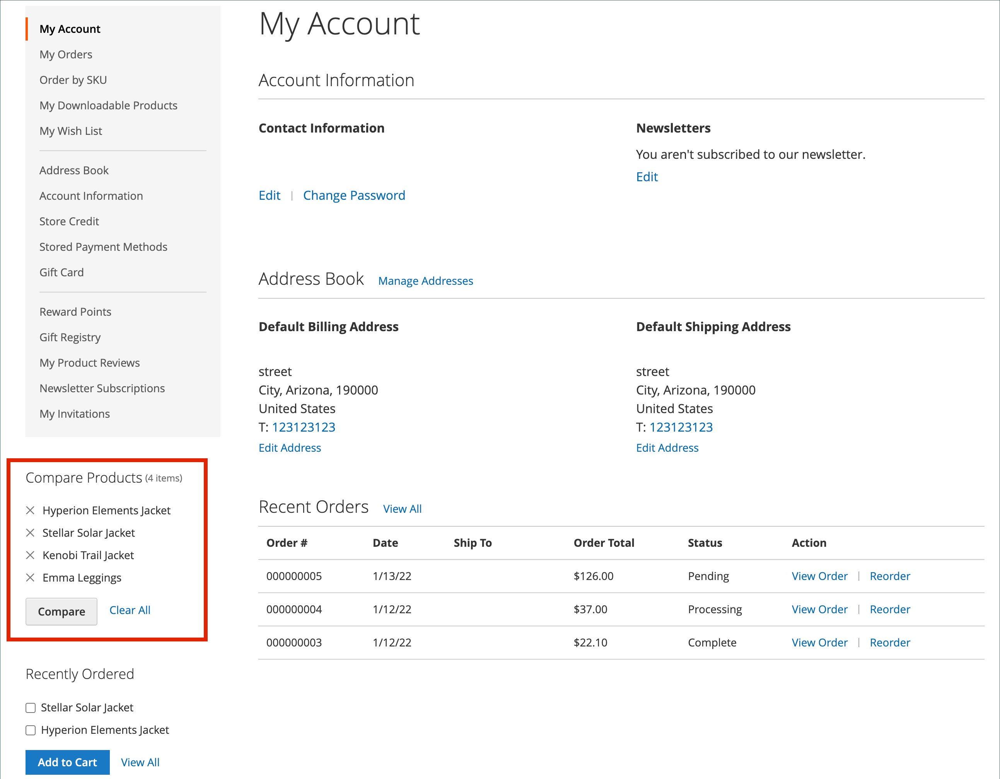

# 比较产品

比较产品生成两个或更多产品的详细并排比较。 根据主题，添加到比较链接可能会用图标或文本表示。 此 _比较产品_ 块通常显示在目录页面的左侧或右侧边栏中。

{width="700" zoomable="yes"}

不像 [最近查看/比较的产品](products-viewed-compared.md) 块，管理员不包括用于比较产品的其他配置设置。

## 比较店面上的产品

店面上有几种使用比较列表的方法。

### 从目录页面

1. 客户找到要比较的产品，然后单击 **[!UICONTROL Add to Compare]** 每个的链接。

1. 导航到关联的类别页面。

   根据主题和页面布局，可能存在 _比较产品_ 在侧栏中阻止。 如果是这样，将列出类别中标记为进行比较的项目。

   客户可以单击 _删除_ (  )，以将其从比较报表中删除，或单击 **[!UICONTROL Clear All]** 以删除所有项目并使用比较选择重新开始。

1. 点击次数 **[!UICONTROL Compare]**.

1. 要打印比较信息，请单击 **[!UICONTROL Print This Page]**.

1. 要从比较页面中删除单个产品，请单击 _删除_ (  )。

### 来自通知消息

1. 客户将产品添加到比较列表后，页面会显示通知消息。

1. 在显示的顶部消息通知中，单击 _比较列表_ 链接。

   {width="700" zoomable="yes"}

此操作可将客户重定向到比较列表，客户可在其中访问其他操作。

### 从 _比较产品_ 块

1. 客户找到要比较的产品，然后单击 **[!UICONTROL Add to Compare]** 每个的链接。

1. 在搜索字段附近的标题中，单击 _比较产品_ 链接。

   {width="700" zoomable="yes"}

### 从我的帐户信息板

1. 客户将所需的产品添加到比较列表。

1. 导航到 **[!UICONTROL My Account]**.

1. 在 _比较产品_ 阻止，单击 **[!UICONTROL Compare]**.

   {width="700" zoomable="yes"}

## 其他比较列表操作

| [!UICONTROL Action] | 描述 |
|------|-----------|
|  | 从比较列表中删除单个项目。 |
| **[!UICONTROL Add to Cart]** | 将产品添加到购物车。 如果产品有任何配置，页面会将客户重定向到产品页面，客户可在其中选择可配置选项，然后单击 **[!UICONTROL Add to Cart]**. |
| _愿望清单图标_ | 将产品添加到愿望清单（需要在商店配置中启用愿望清单功能）。 |
| _打印此页_ | 打印比较列表页。 |

{style="table-layout:auto"}
