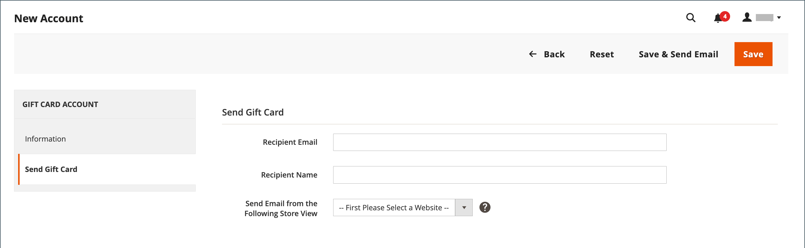

# 礼品卡帐户

系统会自动为每个购买的礼品卡创建礼品卡帐户。 然后，礼品卡的价值可用于购买您商店中的产品。 您还可以从管理员创建礼品卡帐户，作为客户的促销或服务。 礼品卡帐号对应于礼品卡代码。

{width="700" zoomable="yes"}

## 配置礼品卡帐户

礼品卡配置将为商店视图的所有礼品卡建立默认设置，并管理代码池。 代码池是特定格式的一组唯一礼品卡代码。 每次创建礼品卡帐户时，都会使用池中的代码。 商店管理员有责任确保有足够的代码可供礼品卡销售。 在提供礼品卡销售之前，请确保生成代码池。 默认情况下，Adobe Commerce会生成1,000个代码。 在当前池中没有更多可用代码之前，不会生成新的代码池。

### 步骤1：配置电子邮件通知

1. 在 _管理员_ 侧栏，转到 **[!UICONTROL Stores]** > _[!UICONTROL Settings]_>**[!UICONTROL Configuration]**.

1. 在左侧面板中，展开 **[!UICONTROL Sales]** 并选择 **[!UICONTROL Gift Cards]**.

1. 展开  该 _[!UICONTROL Gift Card Email Settings]_部分并执行以下操作：

   - 设置 **[!UICONTROL Gift Card Notification Email Sender]** 将显示为礼品卡通知发送者的商店标识。

   - 设置 **[!UICONTROL Gift Card Notification Email Template]** 到用于通知的模板。

   {width="600" zoomable="yes"}

1. 展开  该 _[!UICONTROL Email Sent from Gift Card Account Management]_部分并执行以下操作：

   - 设置 **[!UICONTROL Gift Card Email Sender]** 将显示为礼品卡发送者的商店身份。

   - 设置 **[!UICONTROL Gift Card Template]** 添加到要用于礼品卡的模板。

请参阅 [存储电子邮件地址](../configuration-reference/general/store-email-addresses.md) 特定配置字段和选项。

### 第2步：完成常规设置

1. 展开  该 _[!UICONTROL Gift Card General Settings]_部分。

1. 要允许客户将卡上的值兑换为现金，请设置 **[!UICONTROL Redeemable]** 到 `Yes`.

1. 对象 **[!UICONTROL Lifetime (days)]**，输入信息卡过期前的天数。

   如果没有到期日期，请将该字段留空。

   >[!NOTE]
   >
   >根据您所在的位置，礼品卡过期可能是非法的。 在为礼品卡设置生命周期之前，请查看您当地的法律。

1. 若要让客户可以选择输入礼品卡随附的消息，请设置 **[!UICONTROL Allow Gift Message]** 到 `Yes` 并输入消息可用的字符数 **[!UICONTROL Gift Message Maximum Length]**.

1. 设置 **[!UICONTROL Generate Gift Card Account when Orders Item is]** 更改为以下任一项：

   - `Ordered`  — 在下订单时创建礼品卡帐户。
   - `Invoiced`  — 在获取付款并开票后创建礼品卡帐户。

   {width="600" zoomable="yes"}

### 步骤3：建立礼品卡代码池

1. 展开  该 _[!UICONTROL Gift Card Account General Settings]_部分并执行以下操作：

   {width="600" zoomable="yes"}

   - 要自定义代码，请根据您的喜好完成以下操作：

      - 代码长度
      - 代码格式
      - 代码前缀
      - 代码后缀
      - 将每X个字符破折号

   - 要确定要生成的代码数，请输入 **[!UICONTROL New Pool Size]**.

   - 要指定何时收到通知以重新补充代码池，请输入 **[!UICONTROL Low Code Pool Threshold]**.

1. 在生成代码池之前，单击 **[!UICONTROL Save Config]**.

1. 单击 **[!UICONTROL Generate]**.

1. 完成后，单击 **[!UICONTROL Save Config]**.

## 检查现有的礼品卡帐户

1. 要查找当前订单的礼品卡帐户编号，请执行以下操作：

   - 在 _管理员_ 侧栏，转到 **[!UICONTROL Sales]** > _[!UICONTROL Operations]_>**[!UICONTROL Orders]**.

   - 在列表中查找顺序并单击 **[!UICONTROL View]** 在 _[!UICONTROL Action]_列。

   - 向下滚动到 _[!UICONTROL Items Ordered]_部分。

   该数字位于 _[!UICONTROL Product]_列，下&#x200B;**[!UICONTROL Gift Card Accounts]**.

1. 在 _管理员_ 侧栏，转到 **[!UICONTROL Marketing]** > _[!UICONTROL Promotions]_>**[!UICONTROL Gift Card Accounts]**.

1. 在网格中找到礼品卡帐户，并在编辑模式下将其打开。

   礼品卡代码显示在 _信息_ 部分。

   {width="600" zoomable="yes"}

## 创建礼品卡帐户

1. 在 _管理员_ 侧栏，转到 **[!UICONTROL Marketing]** > _[!UICONTROL Promotions]_>**[!UICONTROL Gift Card Accounts]**.

1. 在右上角，单击 **[!UICONTROL Add Gift Card Account]**.

1. 在 _[!UICONTROL Information]_部分，设置&#x200B;**[!UICONTROL Active]**到 `Yes` 并执行以下操作：

   - 要使卡余额可在结账时兑换或转移到客户的商店贷方，请设置 **[!UICONTROL Redeemable]** 到 `Yes`.

   - 选择 **[!UICONTROL Website]** 可以使用礼品卡帐户的位置。

   - 输入初始值 **[!UICONTROL Balance]** 在礼品卡上。

   - _（可选）_ 要设置 **[!UICONTROL Expiration Date]** 对于礼品卡，从日历中选择日期 .

     如果留空，礼品卡帐户将不会过期。

     {width="600" zoomable="yes"}

1. 在左侧面板中，选择 **[!UICONTROL Send Gift Card]** 并执行以下操作：

   - 输入 **[!UICONTROL Recipient Email]** 地址。

   - 输入 **[!UICONTROL Recipient Name]**.

   - 设置 **[!UICONTROL Send Email from the Following Store View]** 将显示为礼品卡通知发送者的商店视图。

   {width="600" zoomable="yes"}

1. 执行以下操作之一以保存新帐户：

   - 如果您还未准备好发送礼品卡，请单击 **[!UICONTROL Save]**.

   - 要保存更改并通过电子邮件将礼品卡发送给收件人，请单击 **保存并发送电子邮件**.

## 查看礼品卡帐户历史记录

1. 转到 **[!UICONTROL Marketing]** > _[!UICONTROL Promotions]_>**[!UICONTROL Gift Card Accounts]**.

1. 在编辑模式下打开礼品卡。

1. 此 **[!UICONTROL History]** 显示的是礼品卡的。

   {width="600" zoomable="yes"}

| 列 | 描述 |
|--- |--- |
| [!UICONTROL ID] | 礼品卡操作的唯一数值。 |
| [!UICONTROL Date] | 操作日期。 |
| [!UICONTROL Action] | 确定礼品卡的所有可能操作。 选项： `Created` / `Updated` / `Sent` / `Used` / `Redeemed` / `Expired` |
| [!UICONTROL Balance Change] | 显示礼品卡余额的更改金额。 |
| [!UICONTROL Balance] | 指示可用余额。 |
| [!UICONTROL More Information] | 显示有关谁更改了礼品卡余额的信息。 |

{style="table-layout:auto"}

## 删除礼品卡帐户

1. 在 _管理员_ 侧栏，转到 **[!UICONTROL Marketing]** > _[!UICONTROL Promotions]_>**[!UICONTROL Gift Card Accounts]**.

1. 选择要删除的礼品卡帐户，并在编辑模式下将其打开。

1. 在菜单栏中，单击 **[!UICONTROL Delete]**.

1. 要确认操作，请单击 **[!UICONTROL OK]**.

## 列描述

| 列 | 描述 |
|--- |--- |
| [!UICONTROL ID] | 分配给礼品卡帐户的唯一数字标识符。 |
| [!UICONTROL Code] | 要应用礼品卡必须输入的代码。 |
| [!UICONTROL Website] | 指示礼品卡帐户可用的网站。 |
| [!UICONTROL Created] | 创建日期。 |
| [!UICONTROL End] | 礼品卡到期日期（如果已计划）。 |
| [!UICONTROL Active] | 确定礼品卡是否有效。 |
| [!UICONTROL Status] | 确定礼品卡是在客户帐户中兑现还是可用。 选项： `Used` / `Redeemed` / `Expired` |
| [!UICONTROL Balance] | 指示可用余额。 |

{style="table-layout:auto"}
