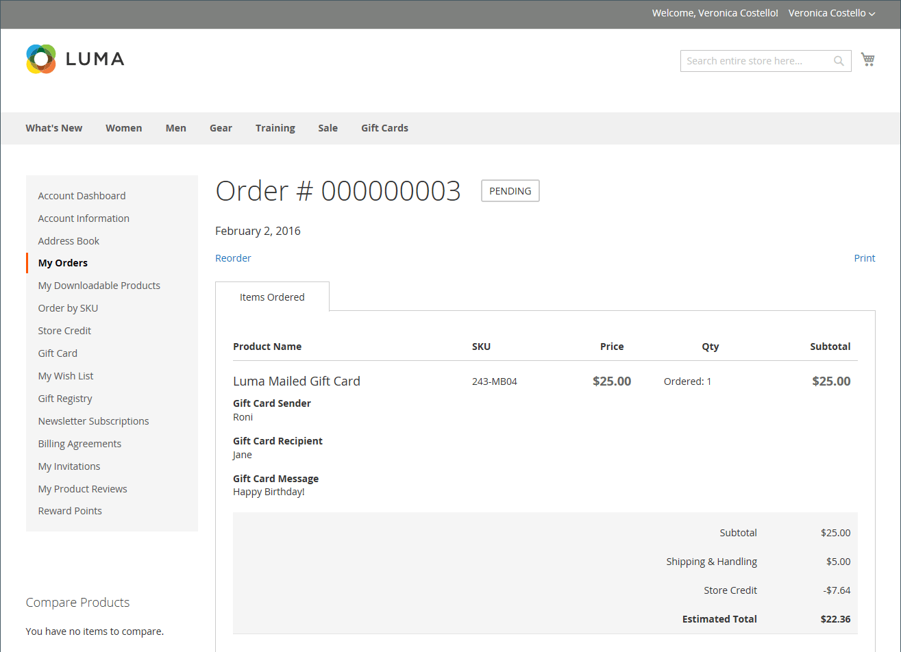
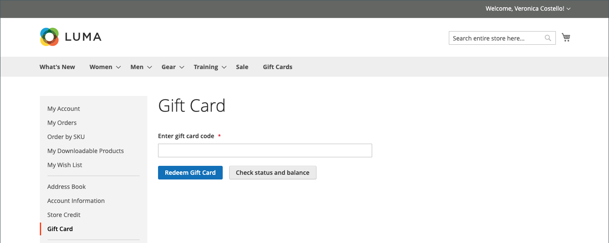

# 礼品卡购买和兑换

{{ee-feature}}

在购物车中兑换礼品卡的方式与将优惠券应用到订单类似。 在结账过程中，购物者输入礼品卡代码以将礼品卡中的金额用于购买。 拥有客户帐户的礼品卡持有者可以从其帐户信息板中检查状态和余额。 单张和多张礼品卡可用于支付全部或部分订单。

通过在&#x200B;_管理员_&#x200B;中打开订单，可以查看应用的礼品卡代码，这样您可以根据需要检索代码以将其放入实际礼品卡中。 如果礼品卡订单被取消或退款，您必须人工取消关联的礼品卡帐户。 您可以完全删除帐户或停用帐户。

购物车中的{width="700" zoomable="yes"}

例如，客户在演示Luma商店购物时，可以购买虚拟或物理礼品卡。

**虚拟礼品卡** - Luma虚拟礼品卡通过电子邮件发送给收件人，邮件中包含可选邮件。 它可以在Luma系列网站中兑换，并且永不过期。

**实物礼品卡** - Luma礼品卡已打包在自定义艺术邮件程序中，免费发送给收件人。 它可以预先制作、标有唯一代码，并在店内、电话或Luma系列任何网站上兑换。 它永不过期。

**组合礼品卡** — 组合礼品卡具有虚拟和实体礼品卡的特征。 Luma组合礼品卡已发运，并通过电子邮件发送给收件人。 购买礼品卡时需要提供电子邮件和送货地址。 它永不过期。

## 礼品卡生命周期

1. **客户确定礼品卡值**。

   客户从产品页面确定礼品卡的价值。 根据配置，可能会有一个固定价格字段和/或价格选项列表。 所有金额均以商店中使用的货币显示。

1. **客户完成礼品卡信息**。

   对于实体礼品卡，客户输入&#x200B;**发件人姓名**&#x200B;和&#x200B;**收件人姓名**。 对于虚拟或组合礼品卡，客户还会输入&#x200B;**发件人电子邮件**&#x200B;和&#x200B;**收件人电子邮件**。 如果客户已登录，则会自动从其帐户输入“发件人姓名”（和“发件人电子邮件”，如果适用）。 根据配置，客户可能还会向收件人输入消息。

1. **客户完成签出**。

   礼品卡在购物车中显示为行项目，其详细信息显示发件人、收件人和邮件的名称（如果适用）。 将礼品卡添加到购物车时，与礼品卡关联的金额会转换为商店的基本货币。

1. **客户收到订单确认**。

   礼品卡购买者可以单击确认中的链接，从其帐户仪表板跟踪订单。

1. **收件人收到礼品卡**。

   对于虚拟或组合礼品卡，收件人会收到一封电子邮件，其中包含礼品卡代码、发件人姓名和消息（如果适用）。 如果在一次订购中购买了多张礼品卡，并且类型是虚拟的或组合的，则所有相应的礼品卡代码都会通过一封电子邮件发送给收件人。 可以将实物礼品卡直接发运给收件人或客户，然后客户可以亲自将礼品卡交付给收件人。

1. **收件人将礼品卡用于购买**。

   收件人会在您的商店中购买商品，并在结账时应用礼品卡代码。 每次在结账期间应用礼品卡时，该金额都会显示在订单总计块中，并从总计中扣除。 每张礼品卡的全部余额从购物车总计中扣除。 如果一次购买使用了多张礼品卡，则会从余额最小的礼品卡开始按升序应用，直到全部应用或总计为零为止。 当总计达到零时，应用于购物车的最后一个礼品卡帐户将收到部分扣款。 任何尚未应用到购物车的卡都不会收到余额扣减额。 只有在下订单后，才会从礼品卡帐户中扣减金额。

## 店面体验

礼品卡在店面的使用方式：

- 礼品卡代码可以应用于购物车或结账时，以覆盖订单的总金额。

- 在目录中，礼品卡作为单独的产品类型提供。

- 在订单开票后，将激活礼品卡代码。 如果未支付订单，则接收客户无法使用礼品卡。

- 创建礼品代码的帐户以跟踪特定优惠券的余额。 商店管理员可以手动调整余额。

接收客户可以使用其帐户仪表板的&#x200B;_[!UICONTROL Gift Card]_&#x200B;部分来检查其[礼品卡帐户](product-gift-card-accounts.md)的余额并兑换[商店点数](../customers/store-credit-using.md)的礼品卡。

{width="700" zoomable="yes"}

### 检查礼品卡的状态和余额

1. 客户从店面登录并打开其客户帐户页面。

1. 客户打开&#x200B;**[!UICONTROL Gift Card]**&#x200B;页面并输入礼品卡代码。

1. 客户单击&#x200B;**[!UICONTROL Check status and balance]**。

{width="700" zoomable="yes"}

将显示礼品卡的余额。

### 礼品卡激活

1. 在&#x200B;_[!UICONTROL Gift Card]_&#x200B;页面上，客户输入礼品卡代码。

1. 客户单击&#x200B;**[!UICONTROL Redeem Gift Card]**。

{width="700" zoomable="yes"}

已激活礼品卡金额并将其添加到商店总信用余额。

{width="700" zoomable="yes"}

可在&#x200B;_[!UICONTROL Store Credit]_&#x200B;页面上找到礼品卡余额的所有操作。

### 在结账时应用礼品卡

如果礼品卡不可赎回，客户可以在结账时应用礼品卡代码。

1. 在&#x200B;_审核和支付_&#x200B;步骤中，客户单击&#x200B;**[!UICONTROL Apply Gift Card]**。

1. 输入礼品卡代码，然后单击&#x200B;**[!UICONTROL Apply]**。

   折扣应反映在&#x200B;_[!UICONTROL Order Summary]_&#x200B;中。

1. 单击&#x200B;**[!UICONTROL Place Order]**&#x200B;以完成订单。
