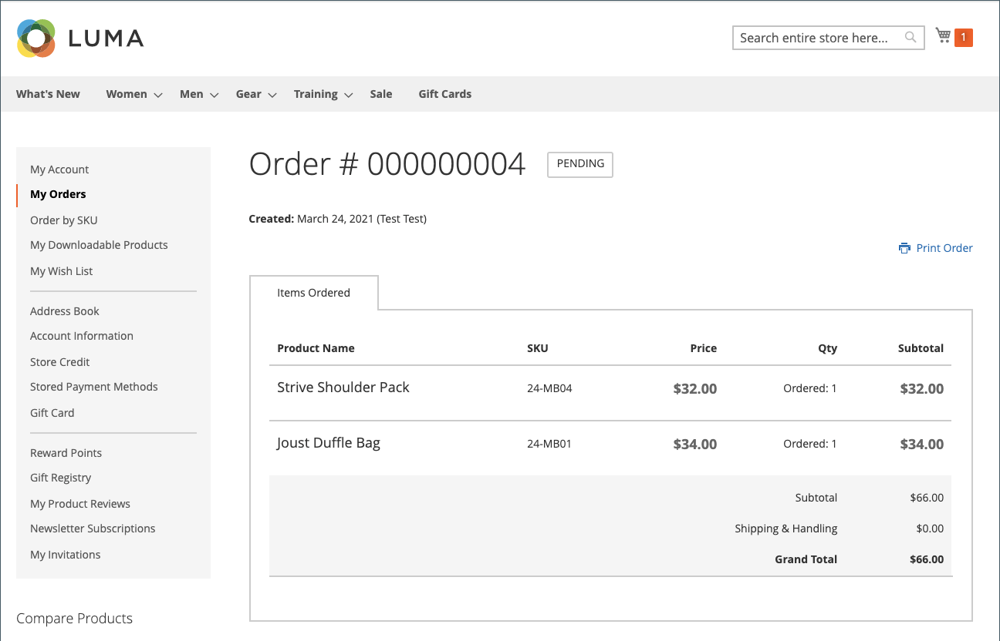
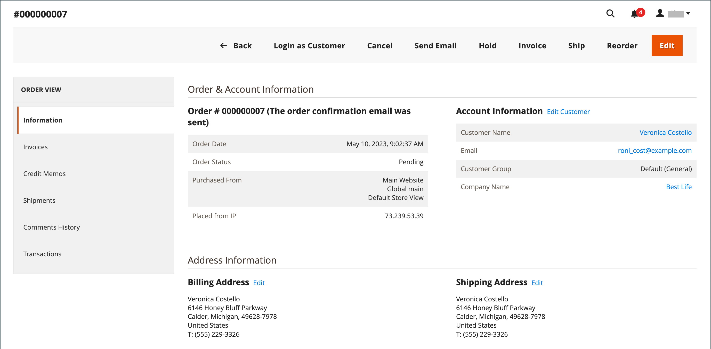
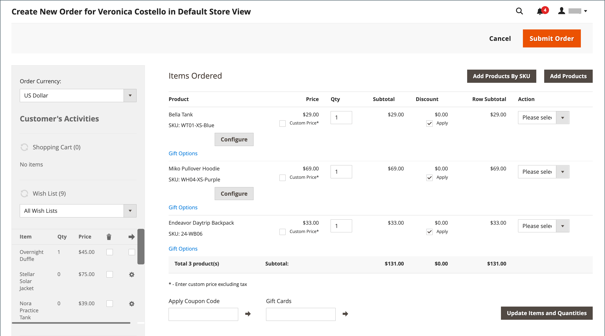

# 允许重新排序

启用后，可以直接从客户帐户或从中的原始订单进行重新订购 _管理员_. 默认情况下，将启用重新排序。

{width="700" zoomable="yes"}

## 为订单启用重新排序的条件

- 此 _允许重新排序_ 必须启用配置选项。

- 如果订单已到 `Hold` 或 `Payment Review` 状态，重新排序选项被禁用。

- 如果订单中的任何项目不可用、缺货或已禁用，店面将禁用重新排序选项。

- An _管理员_ 即使任何项目缺货或停用，也可以重新排序。

## 配置以允许客户重新订购

1. 在 _管理员_ 侧栏，转到 **[!UICONTROL Stores]** > _[!UICONTROL Settings]_>**[!UICONTROL Configuration]**.

1. 在左侧面板中，展开 **[!UICONTROL Sales]** 并选择 **[!UICONTROL Sales]** 下方。

1. 展开  该 **[!UICONTROL Reorder]** 部分。

   {width="600" zoomable="yes"}

1. 设置 **[!UICONTROL Allow Reorder]** 到 `Yes`.

   此设置从管理员的店面或订单列表中的客户帐户启用重新排序功能。

1. 单击 **[!UICONTROL Save Config]**.

## 从店面重新排序

客户可以从以下两个页面启动特定订单的重新订购功能：

- _我的订单_ 页面

- _订单视图_ 页面

### 我的订单

此 _重新排序_ 按钮始终显示在带有订单的列表中（即使订单中的所有产品都不可重新排序）。

{width="700" zoomable="yes"}

**用例1.** 该订单的所有产品为 **可用** 进行重新排序

用户被重定向到购物车，并且所有产品都已添加到购物车

{width="700" zoomable="yes"}

**案例2.** 订单中的部分/所有产品为 **不可用** 进行重新排序

>[!NOTE]
>
>可以重新排序 `Not Visible Individually` 产品。

此 _重新排序_ 按钮未出现在 _我的订单_ 和 _查看订单_ 页数。

{width="700" zoomable="yes"}

### 订单查看页面

**用例1.** 该订单中的所有产品均可用于重新排序

用户被重定向到购物车，并且所有产品都已添加到购物车

**案例2.** 订单中的部分/所有产品为 **不可用** 进行重新排序

>[!NOTE]
>
>可以重新排序 `Not Visible Individually` 产品。

此 _重新排序_ 按钮未出现在 _我的订单_ 和 _查看订单_ 页数。

{width="700" zoomable="yes"}

### 购物车不为空

如果购物车不为空且用户单击 **[!UICONTROL Reorder]** (来自 _我的订单_  或 _订单视图_ 页面)，现有产品会保留在购物车中，并添加重新排序的产品。

{width="700" zoomable="yes"}

## 管理员重新排序

1. 在 _管理员_ 侧栏，转到 **[!UICONTROL Sales]** > **[!UICONTROL Orders]**.

1. 找到订单并在中打开 **[!UICONTROL View]** 模式。

1. 单击 **[!UICONTROL Reorder]** ，即会显示在顶部按钮栏中。

   {width="600" zoomable="yes"}

   单击之后 **[!UICONTROL Reorder]**， _创建新订单_ 此时将打开页面，其中对产品进行了重新排序。

   {width="600" zoomable="yes"}

1. 根据需要填写所有必填字段。

1. 要提交订单，请单击 **[!UICONTROL Submit Order]**.
