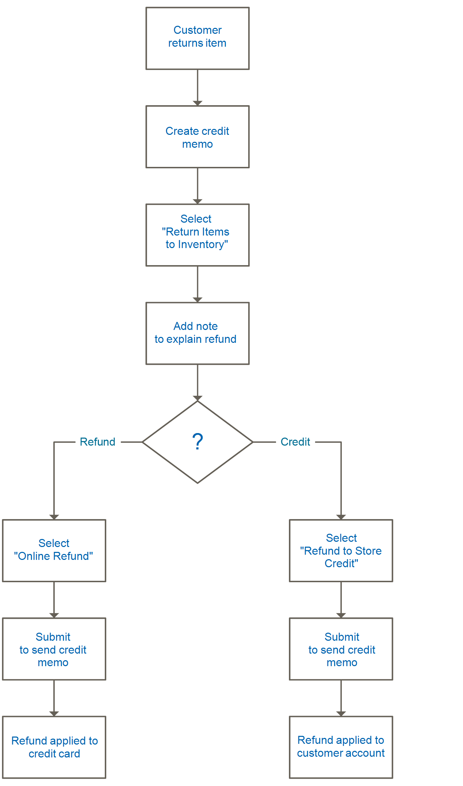

# 返回

A _退回商品授权_ (RMA)适用于要求退回部件以便更换或退款的客户。 通常，客户会联系商家请求退款。 如果获得批准，将分配一个唯一的RMA编号以标识返回的产品。 在配置中，您可以为所有产品启用RMA，或者仅允许为某些产品启用RMA。 此 _[!UICONTROL Returns]_网格列出了当前返回的商品请求(RMA)，并用于输入新的退货请求。

{width="600" zoomable="yes"}

可为简单、分组、可配置和捆绑产品类型发布RMA。 但是，RMA不适用于虚拟产品、可下载产品和礼品卡。

## 列描述

| 列 | 描述 |
|--- |--- |
| [!UICONTROL Select] | 选中要执行操作的返回所对应的复选框，或使用列标题中的选择控件。 选项： `Select All` / `Deselect All` / `Select Visible` / `Unselect Visible` |
| [!UICONTROL RMA] | 分配给每个退货的唯一数字标识符 |
| [!UICONTROL Requested] | 退货的日期和时间 |
| [!UICONTROL Order] | 原始订单的唯一编号 |
| [!UICONTROL Ordered] | 下订单的日期和时间 |
| [!UICONTROL Customer] | 下订单的客户或购买者的名称 |
| [!UICONTROL Status] | 返回状态。 选项： `Pending` / `Authorized` / `Partially Authorized` / `Approved` / `Rejected` / `Processed and Closed` / `Closed` |
| [!UICONTROL Action] | **[!UICONTROL View]** 在编辑模式下打开返回。 |

{style="table-layout:auto"}

## RMA和退货工作流程

1. **接收请求**  — 如果 [已启用](rma-configure.md#enable-rmas-for-your-store) 对于店面，注册客户和客人均可申请RMA。 您还可以 [在管理员中提交RMA请求](#create-a-return-request-in-the-admin).

2. **已签发RMA**  — 考虑请求后，您可以部分授权、完全授权或取消请求。 如果您授权退货，并同意支付退货发运费用，则可以使用支持的承运人从管理员创建发运订单。

3. **收到的商品和处理的产品退货**  — 下面的流程图描述了完成退货流程的操作顺序：

   {width="500"}

## RMA状态

在其生命周期中，退回的商品授权(RMA)可以具有许多已分配状态（例如“待处理”或“已授权”）。 RMA状态表示用户或商家发出的RMA请求的进度。

| 状态 | 描述 |
|--- |--- |
| [!UICONTROL Pending] | RMA请求由店面的用户或管理员中的商家发起时，为其分配的初始状态。 |
| [!UICONTROL Authorized] | 当所有请求的项目都由管理员中的商家为退货授权时，此状态将分配给RMA。 |
| [!UICONTROL Partially Authorized] | 如果请求的任何项目被拒绝而其他产品获得授权，则此状态将分配给RMA。 |
| [!UICONTROL Denied] | 如果所有请求的物料都被管理员中的商家拒绝以获取退货，则此状态会分配给RMA。 |
| [!UICONTROL Return Received] | 当从用户收到所请求的物料时，商家将这个状态分配给RMA。 |
| [!UICONTROL Return Partially Received] | 当请求的物料被部分返回并且某些物料被拒绝处理时，商家将此状态分配给RMA。 |
| [!UICONTROL Approved] | 当请求的物料被批准进一步处理时，商家会将此状态分配给RMA。 |
| [!UICONTROL Rejected] | 当请求的物料被拒绝以进一步处理时，商家会将此状态分配给RMA。 |
| [!UICONTROL Processed and Closed] | 当所有请求物料都批准进一步处理时，商家会将此状态分配给RMA。 |
| [!UICONTROL Closed] | 当请求的物料被拒绝以处理退货时，商家会将此状态分配给RMA。 |

{style="table-layout:auto"}

## 在管理员中创建返回请求

商家可以从管理员代表客户创建退货请求。 客户可以 [创建退货请求](rma-customer-experience.md) Adobe Commerce店铺的店面。

1. 在 _管理员_ 侧栏，转到 **[!UICONTROL Sales]** > **[!UICONTROL Returns]**.

1. 单击 **[!UICONTROL New Return Request]**.

1. 要创建退货请求，请单击 `Complete` 状态。

1. 在 _[!UICONTROL Return Information]_部分，选择&#x200B;**[!UICONTROL Return Items]**选项卡。

1. 要添加要返回的项目，请单击 **[!UICONTROL Add Items]**.

1. 选中所需产品的复选框，然后单击 **[!UICONTROL Add Selected Product to returns]**.

1. 对象 **[!UICONTROL Requested]**，输入要返回的项数。

1. 设置 **[!UICONTROL Return Reason]** 更改为以下任一项：

   - `Wrong Color`
   - `Wrong Size`
   - `Out of Service`
   - `Other`

   如果退货原因与列出的选择不同，则您可以输入您自己的选择 `Other` 选项。

1. 设置 **[!UICONTROL Item Condition]** 更改为以下任一项：

   - `Unopened`
   - `Opened`
   - `Damaged`

1. 设置 **[!UICONTROL Resolution]** 更改为以下任一项：

   - `Exchange`
   - `Refund`
   - `Store Credit`

1. 要创建退货，请单击 **[!UICONTROL Submit Returns]**.

   {width="600" zoomable="yes"}

   新提交的RMA请求将显示在 **[!UICONTROL Returns]** 页面带有 `Pending` 状态。
