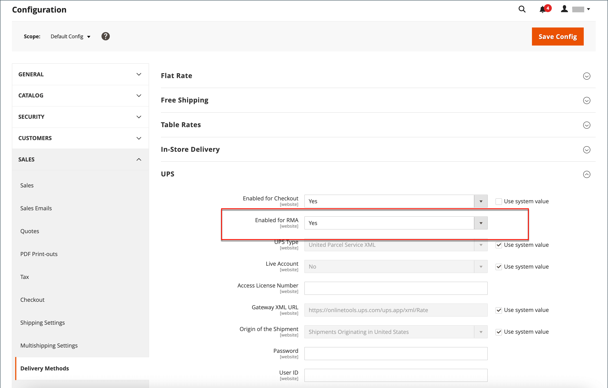
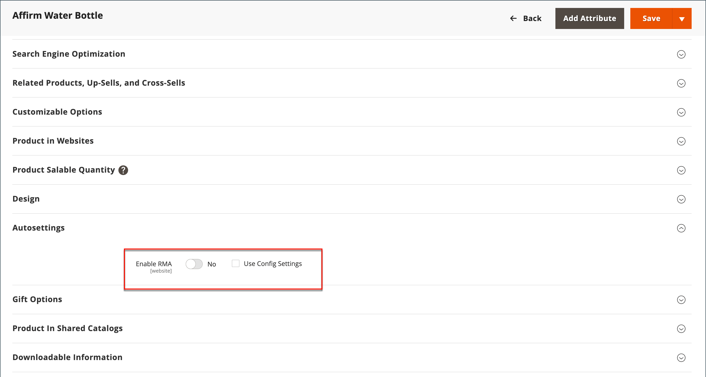

# 配置退货

{{ee-feature}}

启用后，客户可以从店面提交RMA请求。 仅当订单中存在可用于退货的项目时，才能生成RMA。 返回单个项目的请求由每个产品记录中的&#x200B;_启用RMA_&#x200B;属性管理。 默认情况下，配置设置将应用于产品（已选择&#x200B;_[!UICONTROL Use Config Settings]_）。 如果&#x200B;_[!UICONTROL Enable RMA]_&#x200B;设置为`No`，则该产品不会出现在可返回的项目列表中。 如果更改&#x200B;_启用RMA_&#x200B;设置，它将同时应用于新订单和现有订单。

## 为您的存储启用RMA

1. 在&#x200B;_管理员_&#x200B;侧边栏上，转到&#x200B;**[!UICONTROL Stores]** > _[!UICONTROL Settings]_>**[!UICONTROL Configuration]**。

1. 在左侧面板中，展开&#x200B;**[!UICONTROL Sales]**&#x200B;并在下面选择&#x200B;**[!UICONTROL Sales]**。

1. 展开&#x200B;**[!UICONTROL RMA Settings]**&#x200B;部分的。

   {width="600" zoomable="yes"}

1. 将&#x200B;**[!UICONTROL Enable RMA on Storefront]**&#x200B;设置为`Yes`。

   该设置确定客户是否可以从店面创建和查看RMA请求。 RMA可同时应用于新订单和现有订单。

1. 将&#x200B;**[!UICONTROL Enable RMA on Product Level]**&#x200B;设置为`Yes`。

   此设置确定店面中各个产品的&#x200B;_启用RMA_&#x200B;属性的行为：

   - 当[!UICONTROL Enable RMA on Product Level]设置为`Yes`时，店面上的客户可以返回所有单个产品。 它包括&#x200B;_[!UICONTROL Enable RMA]_= `Yes`和&#x200B;_[!UICONTROL Enable RMA]_ = `No`产品属性值。
   - 当[!UICONTROL Enable RMA on Product Level]设置为`No`时，店面上的客户只能返回具有&#x200B;_[!UICONTROL Enable RMA]_= `Yes`产品属性值的产品。

1. 将&#x200B;**[!UICONTROL Use Store Address]**&#x200B;设置为以下值之一：

   - `Yes` — 将返回的产品发送到商店地址。
   - `No` — 输入产品退货的备用地址。

   使用备用地址的{width="600" zoomable="yes"}

1. 单击&#x200B;**[!UICONTROL Save Config]**。

## 配置退货的配送方式

1. 在&#x200B;_管理员_&#x200B;侧边栏上，转到&#x200B;**[!UICONTROL Stores]** > _[!UICONTROL Settings]_>**[!UICONTROL Configuration]**。

1. 在左侧面板中，展开&#x200B;**[!UICONTROL Sales]**&#x200B;并选择&#x200B;**[!UICONTROL Delivery Methods]**。

1. 展开要用于退货服务的运营商的部分，如&#x200B;**[!UICONTROL UPS]**。

   {width="600" zoomable="yes"}

1. 将&#x200B;**[!UICONTROL Enabled for RMA]**&#x200B;设置为`Yes`。

1. 单击&#x200B;**[!UICONTROL Save Config]**。

## 在产品级别更改允许的RMA

如果为商店启用RMA，并且目录中包含一些不允许退货的产品，则可以在产品级别修改设置，

1. 在编辑模式下打开产品。

1. 向下滚动并展开&#x200B;**[!UICONTROL Autosettings]**&#x200B;部分的。

1. 根据需要清除&#x200B;**[!UICONTROL Use Config Setting]**&#x200B;复选框。

1. 将&#x200B;**[!UICONTROL Enable RMA]**&#x200B;设置切换为`No`。

   {width="600" zoomable="yes"}

1. 单击&#x200B;**[!UICONTROL Save]**。
