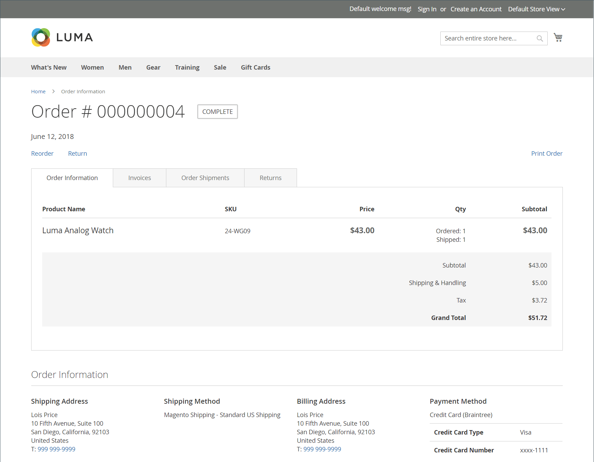
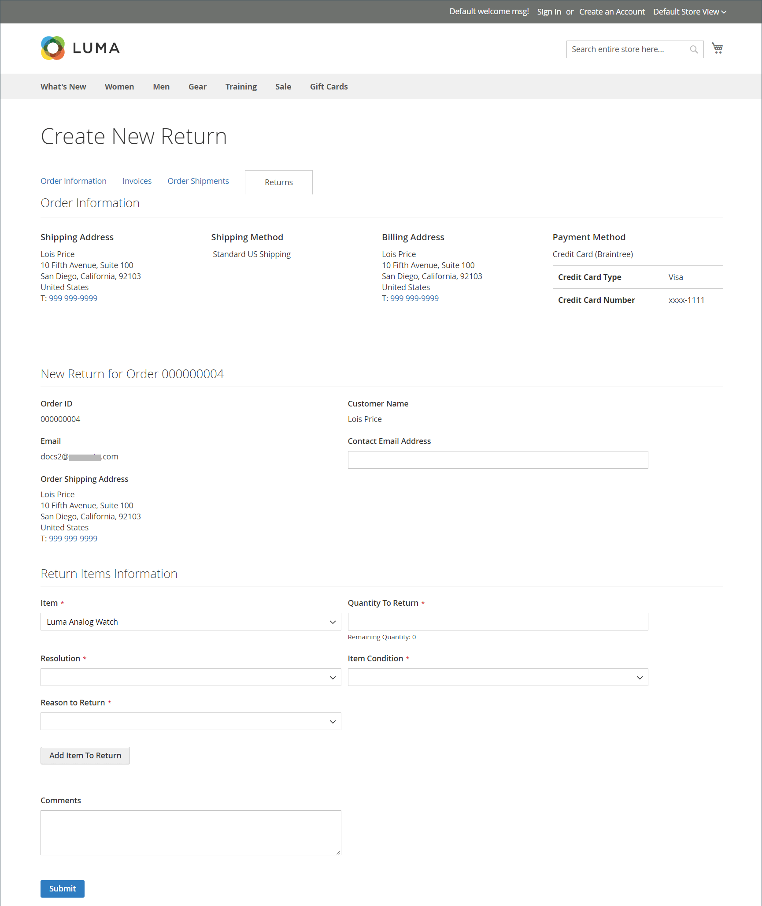

# 返回店面体验

{{ee-feature}}

客户可以使用以下任一方式从店面请求RMA：

- 侧栏中的[订单和退货小组件](../content-design/widget-orders-returns.md)
- 页脚中的&#x200B;_订单和退货_&#x200B;链接

作为最佳实践，请确保在客户服务策略中包含RMA要求和流程的描述。

>[!NOTE]
>
>如果要收集与退货相关的其他信息，可以添加自己的自定义[退货属性](attributes-returns.md)。

所有客户RMA信息都显示在客户帐户仪表板的&#x200B;**[!UICONTROL My Returns]**&#x200B;页面上。

{width="700" zoomable="yes"}

## 请求RMA

客户在店面完成以下步骤以提交RMA：

1. 在页脚中，单击&#x200B;**[!UICONTROL Orders and Returns]**。

1. 输入订单信息：

   - 订单ID
   - 帐单姓氏
   - 电子邮件

1. 单击&#x200B;**[!UICONTROL Continue]**。

   {width="700" zoomable="yes"}

1. 在订购日期下，单击&#x200B;**[!UICONTROL Return]**。

   {width="700" zoomable="yes"}

1. 选择要返回的项目并输入&#x200B;**[!UICONTROL Quantity to Return]**。

1. 将&#x200B;**[!UICONTROL Resolution]**&#x200B;设置为以下项之一：

   - Exchange
   - [退款](../customers/refunds-customer-account.md)
   - [商店点数](../customers/store-credit-using.md)

1. 将&#x200B;**[!UICONTROL Item Condition]**&#x200B;设置为以下项之一：

   - `Unopened`
   - `Opened`
   - `Damaged`

1. 将&#x200B;**[!UICONTROL Reason to Return]**&#x200B;设置为以下项之一：

   - `Wrong Color`
   - `Wrong Size`
   - `Out of Service`
   - `Other`

   {width="700" zoomable="yes"}

1. 如果需要，设置&#x200B;**[!UICONTROL Contact Email Address]**&#x200B;和&#x200B;**[!UICONTROL Comments]**。

   >[!NOTE]
   >
   >如果订单包含多个项目，而客户希望返回另一个项目，则可以单击&#x200B;**[!UICONTROL Add Item To Return]**，选择项目，然后设置所有提及的选项。

1. 单击&#x200B;**[!UICONTROL Submit]**。
