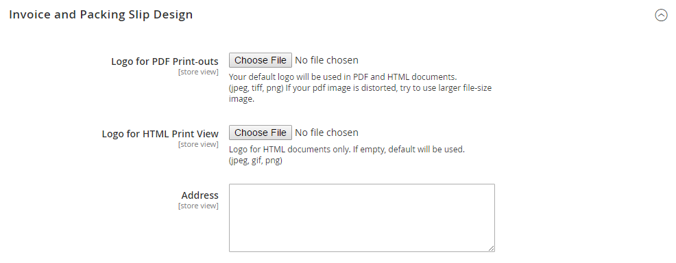

# 销售文档

要支持订单工作流并向客户提供有关他们提交的订单的文档，请配置相关销售文档以反映您的商店品牌并包括参考信息。

## 配置发票和装箱单

与店面页中使用的徽标图像不同，PDF发票和其他销售文档的徽标可以是高分辨率、300 dpi图像。 在调整徽标大小时请注意保持宽高比。 调整徽标大小，使其适合高度，并且无需担心右侧任何未使用的空间。

{width="200"}

调整徽标大小以适合所需大小的一种方法是创建具有正确尺寸的新空白图像。 然后，粘贴您的徽标图像并调整其大小以适合其高度。 对于大多数图像编辑程序，您可以按百分比缩放以保留纵横比，也可以按住Shift键并手动调整图像大小。

**_更新徽标:_**

1. 在&#x200B;_管理员_&#x200B;侧边栏上，转到&#x200B;**[!UICONTROL Stores]** > _[!UICONTROL Settings]_>**[!UICONTROL Configuration]**。

1. 在左侧面板中，展开&#x200B;**[!UICONTROL Sales]**&#x200B;并在下面选择&#x200B;**[!UICONTROL Sales]**。

1. 展开&#x200B;**[!UICONTROL Invoice and Packing Slip Design]**&#x200B;部分中的并执行以下操作：

   {width="600" zoomable="yes"}

   - 要上传&#x200B;**[!UICONTROL Logo for PDF Print-outs]**，请单击&#x200B;**[!UICONTROL Choose File]**，查找您已准备的徽标，然后单击&#x200B;**[!UICONTROL Open]**。

   - 要上传&#x200B;**[!UICONTROL Logo for HTML Print View]**，请单击&#x200B;**[!UICONTROL Choose File]**，查找您已准备的徽标，然后单击&#x200B;**[!UICONTROL Open]**。

   - 输入您希望在发票和装箱单上显示的地址。

1. 完成后，单击&#x200B;**[!UICONTROL Save Config]**。

   作为参考，上传图像的缩略图显示在每个字段之前。 如果缩略图出现失真，请不要担心。 徽标在发票上的比例正确。

### 替换图像

1. 单击&#x200B;**[!UICONTROL Choose File]**&#x200B;并选择其他徽标文件。

1. 选中要替换的图像的&#x200B;**[!UICONTROL Delete Image]**&#x200B;复选框。

1. 单击&#x200B;**[!UICONTROL Save Config]**。

### 图像格式

| 格式化 | 要求 |
|--- |------------------------------------------|
| **_PDF_** |  |
| 文件格式 | JPG (JPEG)、PNG、TIF (TIFF) |
| 图像大小 | 宽达1080像素x高270像素 |
| 解决方法 | 建议使用300 DPI |
| **_HTML_** |  |
| 文件格式 | JPG (JPEG)、PNG、GIF |
| 图像大小 | 由主题决定。 |
| 解决方法 | 72或96 DPI |

{style="table-layout:auto"}

## 添加引用ID

订单ID和客户IP地址可以包含在订单随附的销售文档标题中。 默认情况下，订单ID和客户IP地址都会显示在发票、发运装箱单和贷项通知单的题头中。

{width="600" zoomable="yes"}

**_要更改订单ID设置:_**

1. 在&#x200B;_管理员_&#x200B;侧边栏上，转到&#x200B;**[!UICONTROL Stores]** > _[!UICONTROL Settings]_>**[!UICONTROL Configuration]**。

1. 在左侧面板中，展开&#x200B;**[!UICONTROL Sales]**&#x200B;并选择&#x200B;**[!UICONTROL PDF Print-outs]**。

1. 展开&#x200B;**发票**&#x200B;部分的。

1. 根据您的喜好设置&#x200B;**[!UICONTROL Display Order ID in Header]**。

1. 对&#x200B;**[!UICONTROL Shipment]**&#x200B;和&#x200B;**[!UICONTROL Credit Memo]**&#x200B;部分重复执行上述操作。

1. 完成后，单击&#x200B;**[!UICONTROL Save Config]**。

**_要更改客户IP地址设置:_**

1. 在&#x200B;_管理员_&#x200B;侧边栏上，转到&#x200B;**[!UICONTROL Stores]** > _[!UICONTROL Settings]_>**[!UICONTROL Configuration]**。

1. 在左侧面板中，展开&#x200B;**[!UICONTROL Sales]**&#x200B;并在下面选择&#x200B;**[!UICONTROL Sales]**。

1. 展开&#x200B;**[!UICONTROL General]**&#x200B;部分的。

   {width="600" zoomable="yes"}

1. 将&#x200B;**[!UICONTROL Hide Customer IP]**&#x200B;设置为您的首选项。

1. 完成后，单击&#x200B;**[!UICONTROL Save Config]**。
