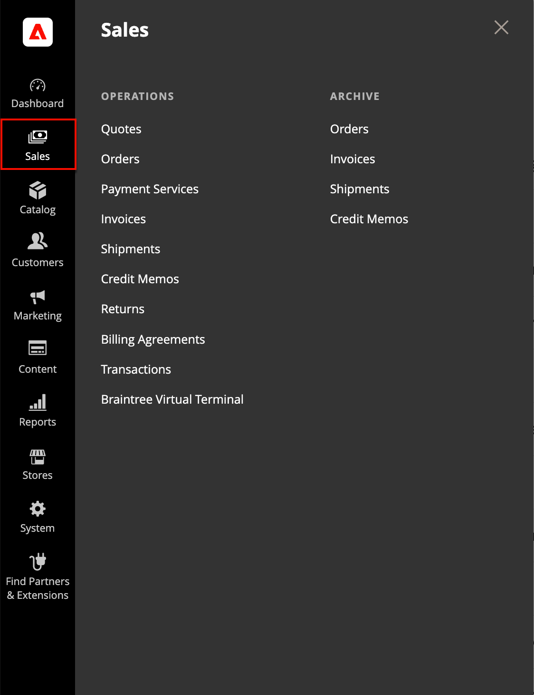

# [!UICONTROL Sales]菜单

“销售”菜单根据交易在订单工作流中的位置列出交易。 您可能会将每个选项视为订单生命周期中的不同阶段。

>[!BEGINTABS]

>[!TAB Adobe Commerce]

仅[!BADGE PaaS]{type=Informative url="https://experienceleague.adobe.com/zh-hans/docs/commerce/user-guides/product-solutions" tooltip="仅适用于云项目(Adobe管理的PaaS基础架构)和内部部署项目上的Adobe Commerce 。"}

{width="450" zoomable="yes"}

>[!TAB Adobe Commerce as a Cloud Service]

仅[!BADGE SaaS]{type=Positive url="https://experienceleague.adobe.com/zh-hans/docs/commerce/user-guides/product-solutions" tooltip="仅适用于Adobe Commerce as a Cloud Service和Adobe Commerce Optimizer项目(Adobe管理的SaaS基础架构)。"}

{width="450" zoomable="yes"}

>[!ENDTABS]

## 显示[!UICONTROL Sales]菜单

在&#x200B;_管理员_&#x200B;侧边栏上，单击&#x200B;**[!UICONTROL Sales]**。

## 菜单选项

### [!UICONTROL Quotes]

(适用于Adobe Commerce B2B)

授权购买者可以通过从购物车发送[请求](../b2b/quote-request.md)与卖方[协商价格](../b2b/quotes.md)。

### [!UICONTROL Quote Templates]

(适用于Adobe Commerce B2B)

允许买方和卖方通过创建可重复使用和自定义的[报价模板](../b2b/quote-templates-overview.md)来简化报价流程。

### [!UICONTROL Orders]

下达[订单](orders.md)后，将创建销售订单作为交易的临时记录。 尚未处理付款，仍可取消订单。

### [!UICONTROL Invoices]

[发票](invoices.md)是订单付款的接收记录。 可以为单个订单创建多张发票，每张发票包含您指定的相同数量的或相同数量的已购产品。 根据付款活动，可以在生成发票时自动获取付款。

### [!UICONTROL Shipments]

[装运](shipments.md)是已装运订单中产品的记录。 与发票一样，多个发运可以与单个订单关联，直到该订单中的所有产品都已发运。

### [!UICONTROL Credit Memos]

[贷项通知单](credit-memos.md)是显示客户全部或部分退款的应付金额的文档。 金额可用于购买或退款给客户。

### [!UICONTROL Returns]

(仅限Adobe Commerce)

可以将[退回的商品授权](returns.md) (RMA)授予请求退回项目以进行更换或退款的客户。 可以针对简单、分组、可配置和捆绑产品类型发布RMA。 但是，RMA不适用于虚拟和可下载的产品或礼品卡。

### [!UICONTROL Billing Agreements]

仅[!BADGE PaaS]{type=Informative url="https://experienceleague.adobe.com/zh-hans/docs/commerce/user-guides/product-solutions" tooltip="仅适用于云项目(Adobe管理的PaaS基础架构)和内部部署项目上的Adobe Commerce 。"}

[帐单协议](paypal-billing-agreements.md)类似于采购订单，只是它不限于单次购买。 在结帐过程中，客户选择“开单协议”作为付款方式。 由于客户不必为每次购买输入付款信息，因此开单协议可简化结帐流程。

### [!UICONTROL Transactions]

[交易](transactions.md)页面列出了您的商店与所有付款系统之间发生的所有付款活动，并提供了访问更多详细信息的权限。

### [!UICONTROL Braintree Virtual Terminal]

仅[!BADGE PaaS]{type=Informative url="https://experienceleague.adobe.com/zh-hans/docs/commerce/user-guides/product-solutions" tooltip="仅适用于云项目(Adobe管理的PaaS基础架构)和内部部署项目上的Adobe Commerce 。"}

在“Braintree虚拟终端”页面上，管理员用户可以接受所选金额的付款。 要使终端功能可用，商家应配置基本[Braintree设置](braintree.md)。 Braintree通过欺诈检测和PayPal集成提供完全可自定义的结账体验。

### [!UICONTROL Archive]

(仅限Adobe Commerce)

（必须启用存档选项） [将订单](order-archive.md)和其他销售文档存档可以定期提高性能，使您的工作区中不存在不必要的信息。
