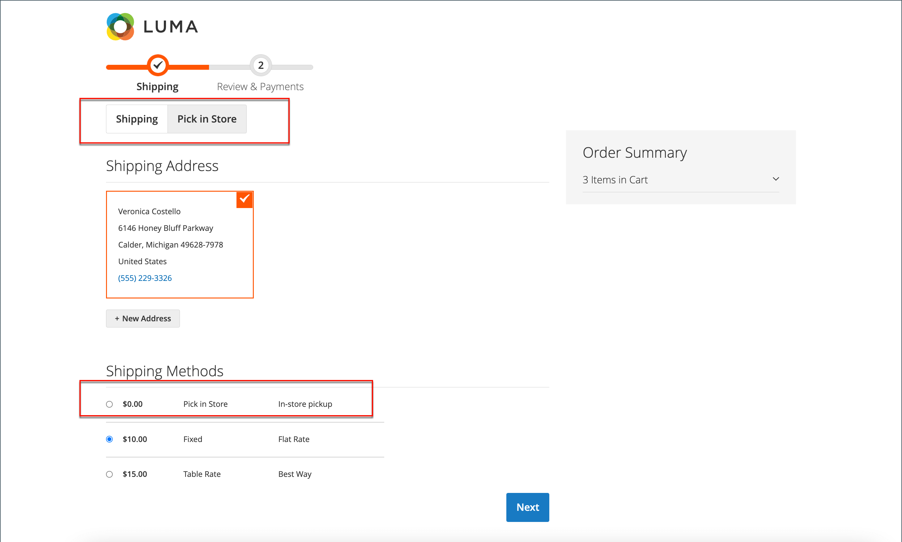

# 店内投放

使用店内交货方法，客户可以在结账期间选择用作取货地点的来源。

签出时{width="700" zoomable="yes"}

在店面结帐期间：

1. 客户单击&#x200B;**[!UICONTROL Pick In Store]**&#x200B;或选择&#x200B;_[!UICONTROL In-Store Pickup Delivery]_配送方式。
1. 将打开&#x200B;_[!UICONTROL Pick In Store]_签出选项卡。

当客户有地址，或者在切换到&#x200B;_[!UICONTROL Pick In Store]_选项卡之前填写了送货地址表单时：

- 在配置的半径内，与客户地址最接近的来源会自动预选为提货商店。
- 当客户单击&#x200B;**[!UICONTROL Select Other]**&#x200B;时，_[!UICONTROL Select Store]_搜索表单将打开。 在列表中仅显示与预先选定的商店之间的配置距离（半径）内的商店。 列表中的所有商店都按到预选商店的距离排序。
- 当客户在搜索字段中输入邮政编码或城市名称时，列表中只显示距搜索位置的配置距离（半径）内的商店。 列表中的所有存储都按到搜索位置的距离排序。
- 当客户从搜索字段清除邮政编码或城市名称时，分配给购物车中产品的所有提货商店都会显示给客户。 列表中的所有存储都按源代码的升序排序，没有任何距离（半径）限制。

如果客户在切换到&#x200B;_[!UICONTROL Pick In Store]_选项卡之前没有地址或以前未填写送货地址表单：

- 页面显示&#x200B;_我们无法根据可用信息预先选择取车地点_&#x200B;消息。
- 当客户单击&#x200B;**[!UICONTROL Select Store]**&#x200B;时，_[!UICONTROL Select Store]_搜索表单将打开。
- 分配给购物车中产品的所有提货商店按源代码的升序显示，没有任何距离（半径）限制。
- 当客户在搜索字段中输入邮政编码或城市名称时，列表中只显示距搜索位置的配置距离（半径）内的商店。 列表中的所有存储都按到搜索位置的距离排序。

## 设置之前

- 确保您拥有非默认库存和来源。 有关如何将源配置为接收位置的详细信息，请参阅[添加源](../inventory-management/sources-add.md)。
- 确保已配置距离优先级算法。 有关详细信息，请参阅[配置距离优先级算法](../inventory-management/distance-priority-algorithm.md)。
- 确保您已[下载并导入](../inventory-management/cli.md#import-geocodes)离线计算所需的所有地理代码。
- 确保您已配置[默认纳税目标计算](../configuration-reference/sales/tax.md#default-tax-destination-calculation)设置。

>[!IMPORTANT]
>
>**在店面，搜索结果按距离（半径）过滤以显示相关结果：**  
>如果客户有送货地址，则计算距离（半径）的基本位置是从送货地址获得的。  
>如果客户没有送货地址，则用于计算距离的基本地点是从[默认纳税目标计算](../configuration-reference/sales/tax.md#default-tax-destination-calculation)设置中获取的。 这些设置是按商店视图设置的，您必须配置默认纳税目标计算设置以确保拣选商店搜索正常工作。

## 设置店内投放

首先，检查是否已启用店内交付。

1. 在&#x200B;_管理员_&#x200B;侧边栏上，转到&#x200B;**[!UICONTROL Stores]** > _[!UICONTROL Settings]_>**[!UICONTROL Configuration]**。

1. 在左侧面板中，展开&#x200B;**[!UICONTROL Sales]**&#x200B;并选择&#x200B;**[!UICONTROL Delivery Methods]**。

1. 展开&#x200B;**[!UICONTROL In-Store Delivery]**&#x200B;部分的。

   {width="600" zoomable="yes"}

1. 将&#x200B;**[!UICONTROL Enabled]**&#x200B;设置为`Yes`。

   >[!NOTE]
   >
   >如果需要，请清除&#x200B;**[!UICONTROL Use system value]**&#x200B;复选框以更改任何字段的默认值。

1. 输入描述用于生成装运估算的计算方法的&#x200B;**[!UICONTROL Method Name]**。

   方法名称显示在购物车中计算的预计费率旁边。

1. 输入您希望在结帐期间为&#x200B;_店内投放_&#x200B;分区显示的&#x200B;**[!UICONTROL Title]**。

   默认标题为`In-Store Pickup Delivery`。

1. 若要向客户收取店内接送服务的费用，请在&#x200B;**[!UICONTROL Price]**&#x200B;字段中输入该费用。

1. 输入在店面结帐时进行商店取货位置搜索的&#x200B;**[!UICONTROL Search Radius]**&#x200B;公里。

1. 对于&#x200B;**[!UICONTROL Displayed Error Message]**，输入当店内投放变得不可用时显示的消息。

   默认消息为`In-Store Delivery is not available. To use this delivery method, please contact us.`

1. 单击&#x200B;**[!UICONTROL Save Config]**。
