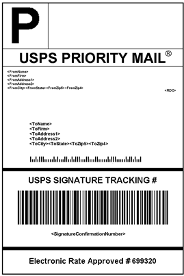

# 配送标签

Commerce包括与主要运输运营商的高级集成，让您能够访问运营商运输系统以跟踪订单、创建运输标签等。 可为常规装运和获退货商品授权的产品创建装运标签。 除了航运承运人提供的信息外，标签还包括Commerce订单号、包裹编号和航运的包裹总数。

{width="300"}

- [配置配送标签](shipping-label-configure.md)
- [创建装运标签和包装](shipping-label-create.md)

## 装运标签工作流

可以在创建装运时或稍后生成装运标签。 装运标签以PDF格式存储，并下载到您的计算机。

### 步骤1：商家提交发运标签请求

商家/商店经理完成生成标签所需的信息，并提交请求。

### 步骤2：请求已发送到运营商

Commerce与装运承运人联系，并在该承运人的系统中创建订单。 系统会为每个已发运的包创建单独的订单。

### 步骤3：运营商发送标签和跟踪号

承运人发送装运的装运标签和跟踪编号。

- 具有多个包装的单个装运可接收多个装运标签。

- 如果多次生成相同的配送标签，则会保留原始跟踪编号。

- 对于退回的具有RMA编号的产品，旧的跟踪编号将替换为新的跟踪编号。

### 步骤4：商家下载并打印标签

生成装运标签后，保存新装运并打印标签。 如果由于连接问题或任何其他原因无法创建装运标签，则不会创建装运。 根据您的浏览器设置，可以打开和打印PDF文件。 每个标签均显示在PDF中的单独页面上。
