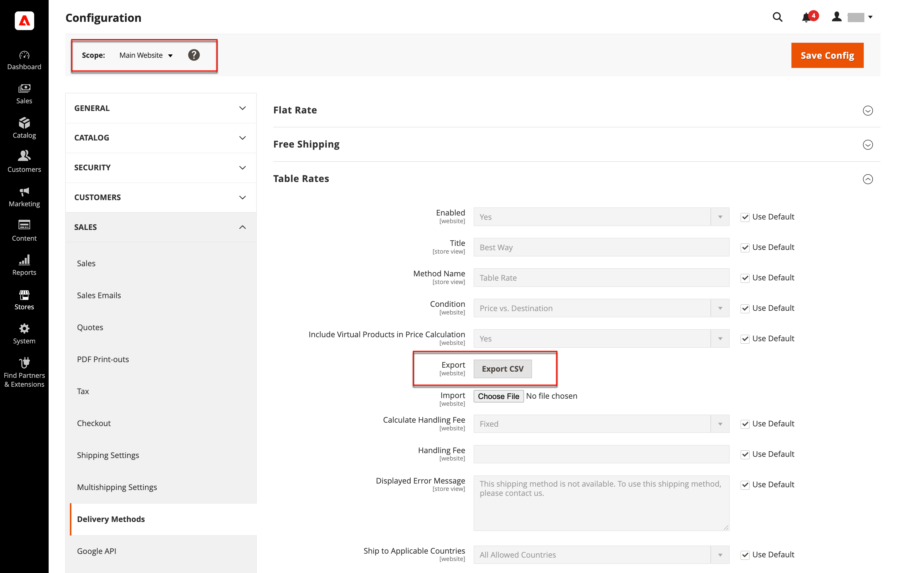

# 表格费率运费

_table rate_&#x200B;配送方式引用了一个数据表，以根据各种条件组合计算配送费率，包括：

- 权重v.目标
- 价格v.目标
- 项目数对目标

例如，如果您的仓库位于洛杉矶，则发往圣地亚哥的成本比发往佛蒙特州更低。 您可以使用表费率配送将节省额转嫁给客户。

用于计算表格比率的数据在电子表格中准备并导入到您的存储中。 当客户请求报价时，结果会显示在购物车的送货估价部分中。

>[!NOTE]
>
>一次只能激活一组表速率数据。

购物车订单摘要中的{width="700" zoomable="yes"}

## 步骤1：完成默认设置

第一步是完成表速率的默认设置。 您可以在不更改配置范围的情况下完成此步骤。

1. 在&#x200B;_管理员_&#x200B;侧边栏上，转到&#x200B;**[!UICONTROL Stores]** > _[!UICONTROL Settings]_>**[!UICONTROL Configuration]**。

1. 在左侧面板的&#x200B;_[!UICONTROL Sales]_&#x200B;部分中，选择&#x200B;**[!UICONTROL Delivery Methods]**。

1. 展开扩展选择器&#x200B;**[!UICONTROL Table Rates]**。

   >[!NOTE]
   >
   >如有必要，请首先清除&#x200B;**[!UICONTROL Use system value]**&#x200B;复选框以更改以下设置，如所述。

   {width="600" zoomable="yes"}

1. 将&#x200B;**[!UICONTROL Enabled]**&#x200B;设置为`Yes`。

1. 输入您希望在结账期间在表费率分区显示的&#x200B;**[!UICONTROL Title]**。

   默认标题为`Best Way`。

1. 输入您希望在购物车中作为计算费率旁边的标签显示的&#x200B;**[!UICONTROL Method Name]**。

1. 将&#x200B;**[!UICONTROL Condition]**&#x200B;设置为以下计算方法之一：

   - `Weight v. Destination`
   - `Price v. Destination`
   - `Number of Items v. Destination`

1. 对于包含虚拟产品的订单，如果要在计算中包括虚拟产品，请将&#x200B;**[!UICONTROL Include Virtual Products in Price Calculation]**&#x200B;设置为`Yes`。

   >[!NOTE]
   >
   >由于虚拟产品（如服务）没有权重，因此它们无法更改基于“权重v.目标”条件的计算结果。 但是，虚拟产品可以更改基于“价格v.目标”或“项目数vs.目标”条件的计算结果。

1. 根据您的要求配置手续费选项。

   手续费是可选的，显示为添加到运输成本中的额外费用。 如果要包括手续费，请执行以下操作：

   - 设置&#x200B;**[!UICONTROL Calculate Handling Fee]**：

      - `Fixed`
      - `Percent`

   - 根据用于计算费用的方法输入&#x200B;**[!UICONTROL Handling Fee]**&#x200B;费率。

     例如，如果费用基于固定费用，则以小数形式输入金额，如`4.90`。 但是，如果手续费基于订单的百分比，则按百分比输入金额。 例如，如果您对订单的6%收费，则输入值为`.06`。

1. 如果需要，请更改&#x200B;**[!UICONTROL Displayed Error Message]**。

   此文本框已预设为默认消息，但您可以输入其他消息，以便在此投放方法不可用时显示。

1. 设置&#x200B;**[!UICONTROL Ship to Applicable Countries]**：

   - `All Allowed Countries` — 来自您商店配置中指定的所有[国家/地区](../getting-started/store-details.md#country-options)的客户都可以使用此交付方法。
   - `Specific Countries` — 选择此选项时，将显示&#x200B;_[!UICONTROL Ship to Specific Countries]_&#x200B;列表。 选择列表中可使用此投放方法的每个国家/地区。

1. 如果要始终显示表费率，请将&#x200B;**[!UICONTROL Show Method if Not Applicable]**&#x200B;设置为`Yes`

1. 对于&#x200B;**[!UICONTROL Sort Order]**，请输入一个数字以确定在结账期间与其他交货方式一起列出表费率发运时显示的顺序。

   `0` =第一，`1` =第二，`2` =第三，依此类推。

1. 单击&#x200B;**[!UICONTROL Save Config]**。

## 步骤2：准备表速率数据

1. 在左上角，将&#x200B;**[!UICONTROL Store View]**&#x200B;设置为`Main Website`，或设置为应用配置的任何其他网站。

   >[!NOTE]
   >
   >如有必要，请首先取消选中&#x200B;**[!UICONTROL Use system value]**&#x200B;复选框以更改以下设置，如所述。

1. 根据需要更改&#x200B;**[!UICONTROL Condition]**。

1. 单击&#x200B;**[!UICONTROL Export CSV]**。

   {width="700" zoomable="yes"}

1. 将`tablerates.csv`文件保存到您的系统。

1. 在电子表格应用程序中打开文件。

1. 使用适合装运计算条件的值填写该表。

   - 使用星号(*)作为通配符，表示任何类别中的所有可能值。
   - _[!UICONTROL Country]_&#x200B;列必须包含每行的[个有效的三字符代码](https://en.wikipedia.org/wiki/ISO_3166-1_alpha-3)。
   - 按&#x200B;_[!UICONTROL Region/State]_&#x200B;对数据排序，使特定位置位于列表顶部，通配符位置位于底部。 使用此方法会先处理具有绝对值的规则，稍后再处理通配符值。
   - 不支持邮政编码范围。 使用星号(*)可允许区域/状态中的所有代码，或者为&#x200B;_[!UICONTROL Zip/Postal Code]_&#x200B;列中的特定位置指定单个代码。
   - _[!UICONTROL Weight (and above)]_&#x200B;列中的值最多可以有四位小数（如`2.5075`）。 在数据中使用更多小数位会导致导入失败。

   {width="500"}

1. 保存`tablerates.csv`文件。

## 步骤3：导入表费率数据

1. 返回商店配置的&#x200B;**[!UICONTROL Table Rates]**&#x200B;部分。

1. 在左上角，将&#x200B;**[!UICONTROL Store View]**&#x200B;设置为使用此方法的网站。

1. 对于&#x200B;**[!UICONTROL Import]**，单击&#x200B;**[!UICONTROL Choose File]**&#x200B;并选择已完成的`tablerates.csv`文件以导入费率。

   {width="600" zoomable="yes"}

1. 单击&#x200B;**[!UICONTROL Save Config]**。

## 步骤4：验证费率

为确保表费率数据正确，请使用多个不同的地址完成付款流程，以确保正确计算运费和包装费。

### 示例1：价格和目标

此示例使用Price v. Destination条件根据美国大陆、阿拉斯加和夏威夷的订单小计金额创建一组三种不同的运费。 星号(*)是表示所有值的通配符。

| 国家/地区 | 地区/州 | 邮政编码 | 订单小计（及以上） | 运费 |
|--- |--- |--- |--- |--- |
| 美国 | 您好 | * | 100 | 10 |
| 美国 | 您好 | * | 50 | 15 |
| 美国 | 您好 | * | 0 | 20 |
| 美国 | AK | * | 100 | 10 |
| 美国 | AK | * | 50 | 15 |
| 美国 | AK | * | 0 | 20 |
| 美国 | * | * | 100 | 5 |
| 美国 | * | * | 50 | 10 |
| 美国 | * | * | 0 | 15 |

{style="table-layout:auto"}

### 示例2：权重和目标

此示例使用“重量v.目标”条件根据订单的重量创建不同的发运费率。

| 国家/地区 | 地区/州 | 邮政编码 | 权重（及以上） | 运费 |
|--- |--- |--- |--- |--- |
| AUS | NT | * | 9 | 39.95 |
| AUS | NT | * | 0 | 19.95 |
| AUS | VIC | * | 9 | 19.95 |
| AUS | VIC | * | 0 | 5.95 |
| AUS | 华盛顿 | * | 9 | 39.95 |
| AUS | 华盛顿 | * | 0 | 19.95 |
| AUS | * | * | 9 | 29.95 |
| AUS | * | * | 0 | 9.95 |

{style="table-layout:auto"}

### 示例3：限制美国大陆的免费运输

1. 创建一个`tablerates.csv`文件，其中包含您愿意提供免费送货的所有州目的地。

1. 使用以下设置完成表速率配置：

   | 设置 | 值 |
   |----------|-------|
   | [!UICONTROL Condition] | `Price v. Destination` |
   | [!UICONTROL Method Name] | `Free Shipping` |
   | [!UICONTROL Ship to Applicable Countries] | `Specific Countries` |
   | [!UICONTROL Ship to Specific Countries] | `Select only United States` |
   | [!UICONTROL Show method if not applicable] | `No` |

   {style="table-layout:auto"}

1. 在左上角，将&#x200B;**[!UICONTROL Store View]**&#x200B;设置为`Main Website`，或设置为应用配置的任何其他网站。

1. 对于&#x200B;**[!UICONTROL Import]**，单击&#x200B;**[!UICONTROL Choose File]**&#x200B;并选择已完成的`tablerates.csv`文件以导入费率。
