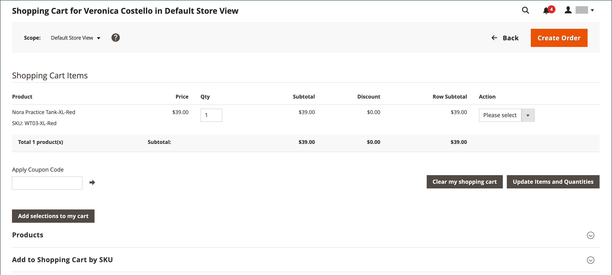
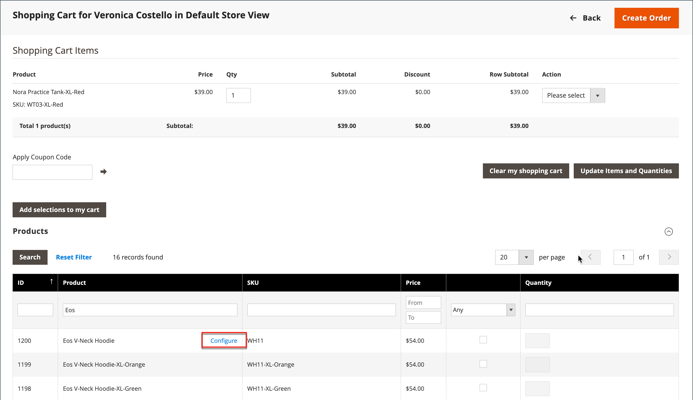
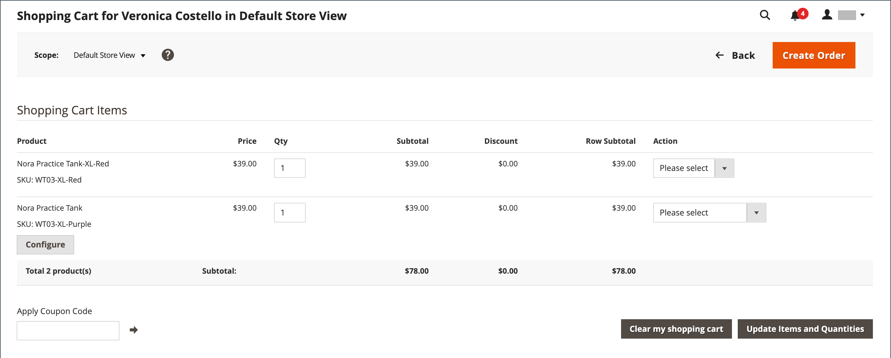

# 管理购物车

{{ee-feature}}

要开始辅助购物会话，客户必须从店面登录其帐户才能使信息可用。 如果客户没有帐户，您可以 [创建一个](../customers/account-create.md).

{width="600" zoomable="yes"}

## 操作控制

| 选项 | 描述 |
|--- |--- |
| [!UICONTROL Remove] | 从当前购物车中删除项目 |
| [!UICONTROL Move to Wish List] | 将项目移至所选客户的愿望清单 |

{style="table-layout:auto"}

## 控制按钮

| 按钮 | 描述 |
|--- |--- |
| [!UICONTROL Clear my shopping cart] | 清除所有产品中的当前购物车。 |
| [!UICONTROL Update Items and Quantities|]在 **[!UICONTROL Qty]** 字段并更新购物车中的项目数。 |
| [!UICONTROL Add selections to my cart] | 将所有部分的产品添加到购物车。 |

{style="table-layout:auto"}

## 验证客户是否已登录

1. 在 _管理员_ 侧栏，转到 **[!UICONTROL Customers]** > **[!UICONTROL Now Online]**.

   商店的所有访客和登录的客户都会显示在列表中。

   {width="700" zoomable="yes"}

## 优惠辅助购物

1. 在 _管理员_ 侧栏，转到 **[!UICONTROL Customers]** > **[!UICONTROL All Customers]**.

1. 在列表中，以编辑模式打开客户记录。

   >[!TIP]
   >
   >要快速查找客户记录，请使用 [过滤器](../getting-started/admin-grid-controls.md) 控制。

   在客户配置文件中的 _[!UICONTROL Personal Information]_，_[!UICONTROL Last Logged In]_ 日期和时间显示客户处于在线状态。

   {width="600" zoomable="yes"}

1. 要进入辅助购物模式，请单击 **[!UICONTROL Manage Shopping Cart]** 在顶部按钮栏中。

   {width="600" zoomable="yes"}

## 按属性将产品添加到购物车

1. 展开  该 **[!UICONTROL Products]** 部分。

1. 使用每列顶部的任意过滤器查找产品。

1. 单击 **[!UICONTROL Search]**.

1. 根据产品类型，执行以下一系列步骤之一：

### 添加简单产品

1. 单击要订购的产品。

   此操作选择记录并设置 **[!UICONTROL Quantity]** 到默认值 `1`.

1. 如有必要，请更新订购数量。

1. 在网格的左上方，单击 **[!UICONTROL Add selections to my cart]**.

   {width="600" zoomable="yes"}

   行项目将添加到页面顶部的购物车。

   {width="600" zoomable="yes"}

### 添加包含配置的产品

在添加到购物车之前必须配置三种类型的产品： `Bundle Product`， `Configurable Product`、和 `Grouped Product`.

1. 在网格中，单击 **[!UICONTROL Configure]** 产品名称旁边。

   {width="600" zoomable="yes"}

1. 在 _关联的产品_ 对话框，选择每个产品选项以描述要订购的物料，输入 **[!UICONTROL Quantity]**，然后单击 **[!UICONTROL OK]**.

   选择带有复选标记的产品，订购数量会显示在网格中。

1. 要将产品添加到购物车，请单击 **[!UICONTROL Add selections to my cart]**.

   {width="600" zoomable="yes"}

1. 根据需要更新购物车中的产品选项：

   - 单击 **[!UICONTROL Configure]**.

   - 更新选项，然后单击 **[!UICONTROL OK]**.

## 按SKU添加产品

1. 展开  该 **[!UICONTROL Add to Shopping Cart by SKU]** 部分。

1. 按如下方式单独添加产品 **[!UICONTROL SKU]** 或通过上传CSV文件添加产品。

### 按SKU单独添加项目

1. 输入 **[!UICONTROL SKU]** 和 **[!UICONTROL Qty]** 订购项目的编号。

1. 要订购其他产品，请单击 **[!UICONTROL Add another]**.

   {width="600" zoomable="yes"}

1. 单击 **[!UICONTROL Add selections to my cart]**.

1. 如果项目是可配置产品，请在提示时选择产品选项，然后单击 **[!UICONTROL Add to Shopping Cart]**.

### 通过上传CSV文件添加产品

1. 准备 [csv文件](../systems/data-csv.md) ，并将商品添加到购物车。

   文件必须只包含两列，其中 `sku` 和 `qty` 在标题中。

1. 上载准备的文件：

   - 单击 **[!UICONTROL Choose File]**.

   - 选择要从目录中上传的文件。

## 转移项目

您可以将客户愿望清单中的商品以及最近查看、比较或订购的商品传输到购物车。 每个部分中的项目数都显示在部分标题后面的括号中。

1. 展开  以下部分之一：

   - [!UICONTROL Wish List]
   - [!UICONTROL Products in the Comparison List]
   - [!UICONTROL Recently Compared Products]
   - [!UICONTROL Recently Viewed Products]
   - [!UICONTROL Last Ordered Items]

1. 在网格中，选择要订购的每个产品，并输入 **[!UICONTROL Quantity]**.

1. 要输入可配置产品的选项，请单击 **[!UICONTROL Configure]** 并根据需要设置产品选项。

1. 单击 **[!UICONTROL Add selections to my cart]**.

1. 应用一个或多个优惠券代码（如果可用）：

   - 对象 **[!UICONTROL Apply Coupon Code]**，请输入有效的优惠券代码。

   - 单击 _应用_ (  )箭头。

1. 根据需要调整订购数量：

   - 在 **[!UICONTROL Qty]** 在要调整的产品列中，输入正确的金额。

   - 单击 **[!UICONTROL Update Items and Quantities]**.

## 创建订单

1. 单击 **[!UICONTROL Create Order]**.

   此 _[!UICONTROL Create New Order]_页面显示购物车中的商品，以及配送和付款信息。

1. 填写送货和付款信息。

1. 单击 **[!UICONTROL Submit Order]**.

要了解更多信息，请参阅 [创建订单](customer-account-create-order.md).
