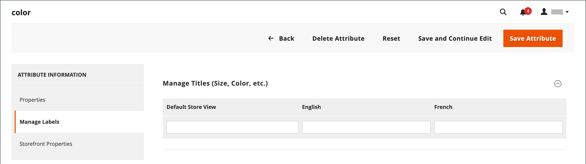
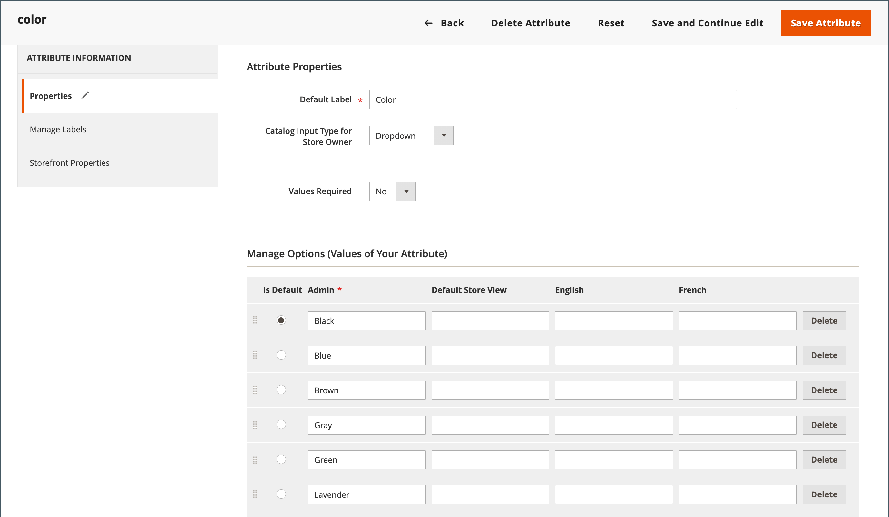

# 商店本地化

通过更改视图的区域设置，可以立即将整个存储中页面上看起来为硬编码的大多数文本更改为其他语言。 更改区域设置实际上不会逐字翻译文本，而只是引用不同的翻译表，该表提供在整个存储区中使用的界面文本。 可更改的文本包括导航标题、标签、按钮和链接，如&#x200B;_我的购物车_&#x200B;和&#x200B;_我的帐户_。 您还可以使用[内联翻译](../configuration-reference/advanced/developer.md)工具修剪界面中的文本。

可在Commerce Marketplace上的[翻译和本地化][1]{：target=&quot;_blank&quot;}下找到语言包。 Marketplace会不断添加新扩展，因此请经常回来查看。

## 步骤1：安装语言包

按照标准说明安装语言包扩展。 有关安装扩展的详细信息，请参阅&#x200B;_扩展指南_&#x200B;中的[常规CLI安装][2]。

## 步骤2：创建该语言的存储视图

1. 在&#x200B;_管理员_&#x200B;侧边栏上，转到&#x200B;**[!UICONTROL Stores]** > _[!UICONTROL Settings]_>**[!UICONTROL All Stores]**。

1. 单击&#x200B;**[!UICONTROL Create Store View]**。

1. 设置新商店视图的选项：

   - **[!UICONTROL Store]** — 选择作为视图父级的存储。

   - **[!UICONTROL Name]** — 输入存储视图的名称。 例如：葡萄牙语。

     在存储的标头中，该名称出现在&#x200B;_语言选择器_&#x200B;中。

   - **[!UICONTROL Code]** — 输入小写字符代码以标识视图。 例如： `portuguese`。

   - **[!UICONTROL Status]** — 要激活视图，请设置为`Enabled`。

   - **[!UICONTROL Sort Order]** — （可选）输入一个数字以确定此视图与其他视图一起列出的顺序。

1. 完成后，单击&#x200B;**[!UICONTROL Save Store View]**。

## 步骤3：更改存储视图的区域设置

1. 在&#x200B;_管理员_&#x200B;侧边栏上，转到&#x200B;**[!UICONTROL Stores]** > _[!UICONTROL Settings]_>**[!UICONTROL Configuration]**。

1. 在左上角，将&#x200B;**[!UICONTROL Store View]**&#x200B;设置为将应用配置的特定视图。

1. 提示确认范围切换时，单击&#x200B;**[!UICONTROL OK]**。

1. 展开&#x200B;**[!UICONTROL Locale Options]**&#x200B;部分的。

1. 清除&#x200B;**[!UICONTROL Use Website]**&#x200B;复选框，并将&#x200B;**[!UICONTROL Locale]**&#x200B;设置为要分配给视图的语言。

   如果存在几种可用的语言变体，请确保为特定区域或方言选择一种变体。

1. 完成后，单击&#x200B;**[!UICONTROL Save Config]**。

   更改区域设置的语言后，必须为每个商店视图单独翻译您创建的其余内容，包括产品名称和描述、类别、[CMS](../content-design/page-translate.md)页面和块。

## 将产品本地化

如果您的商店以不同语言提供了多个视图，则每个商店视图中提供了相同的产品。 您可以使用相同的基本产品信息，例如SKU、价格和库存水平，而无论使用何种语言。 然后，根据需要，仅翻译每种语言的产品名称、描述字段和元数据。

### 步骤1：翻译产品字段

1. 在&#x200B;_管理员_&#x200B;侧边栏上，转到&#x200B;**[!UICONTROL Catalog]** > **[!UICONTROL Products]**。

1. 在网格中，找到要翻译的产品，并以编辑模式将其打开。

1. 在左上角，将&#x200B;**[!UICONTROL Store View]**&#x200B;设置为翻译的视图，并在提示确认时单击&#x200B;**[!UICONTROL OK]**。

1. 对于要编辑的每个字段，执行以下操作：

   - 取消选中字段右侧的&#x200B;**[!UICONTROL Use Default Value]**&#x200B;复选框。

   - 在字段中粘贴或键入已翻译文本。

   确保翻译所有文本字段，包括[图像](../catalog/catalog-images-video.md)标签和Alt文本、[搜索引擎优化](../catalog/product-search-engine-optimization.md)字段和任何[自定义选项](../catalog/settings-advanced-custom-options.md)信息。

1. 完成后，单击&#x200B;**[!UICONTROL Save]**。

### 步骤2：翻译字段标签

1. 在&#x200B;_管理员_&#x200B;侧边栏上，转到&#x200B;**[!UICONTROL Stores]** > _[!UICONTROL Attributes]_>**[!UICONTROL Product]**。

1. 在列表中，找到要翻译的属性，并在编辑模式下打开。

1. 在左侧面板中，选择&#x200B;**[!UICONTROL Manage Labels]**。

1. 在&#x200B;_[!UICONTROL Manage Titles]_部分中，为每个商店视图输入一个已翻译的标签。

   {width="600" zoomable="yes"}

1. 完成后，单击&#x200B;**[!UICONTROL Save Attribute]**。

### 步骤3：翻译所有类别

1. 在&#x200B;_管理员_&#x200B;侧边栏上，转到&#x200B;**[!UICONTROL Catalog]** > **类别**。

1. 在左上角，将&#x200B;**[!UICONTROL Store View]**&#x200B;设置为翻译的视图，并在提示确认时单击&#x200B;**[!UICONTROL OK]**。

1. 在树中，找到要翻译的类别，然后在编辑模式下打开该类别。

1. 对于&#x200B;_基本信息_，请翻译&#x200B;**[!UICONTROL Category Name]**。

1. 展开 _[!UICONTROL Content]_部分并翻译&#x200B;**[!UICONTROL Description]**。

1. 展开 **[!UICONTROL Search Engine Optimization Settings]**&#x200B;部分并翻译以下字段：

   - **[!UICONTROL Meta Title]**
   - **[!UICONTROL Meta Keywords]**
   - **[!UICONTROL Meta Description]**

1. 在&#x200B;_[!UICONTROL Search Engine Optimization Settings]_部分下，执行以下操作以翻译&#x200B;**[!UICONTROL URL Key]**：

   - 清除字段右侧的&#x200B;**[!UICONTROL Use Default Value]**&#x200B;复选框。

   - 输入已翻译文本。

   - 确保选中&#x200B;**[!UICONTROL Create Permanent Redirect for old URL]**&#x200B;复选框。

   

1. 完成后，单击&#x200B;**[!UICONTROL Save Category]**。

1. 对存储中使用的所有类别重复该过程。

### 步骤4：翻译产品属性和属性选项

1. 在&#x200B;_管理员_&#x200B;侧边栏上，转到&#x200B;**[!UICONTROL Stores]** > _[!UICONTROL Attributes]_>**[!UICONTROL Product]**。

1. 选择要翻译的属性。

1. 选择左侧的&#x200B;**[!UICONTROL Manage Labels]**&#x200B;并设置&#x200B;**[!UICONTROL Managed Titles]**&#x200B;选项以定义属性标题转换。

1. 选择左侧的&#x200B;**[!UICONTROL Properties]**，然后在&#x200B;**[!UICONTROL Manage Options]**&#x200B;部分中输入已翻译的属性选项。

   {width="600" zoomable="yes"}

1. 完成后，单击&#x200B;**[!UICONTROL Save Attribute]**。

[1]: https://marketplace.magento.com/extensions/content-customizations/translations-localization.html
[2]: https://experienceleague.adobe.com/docs/commerce-operations/installation-guide/tutorials/extensions.html
