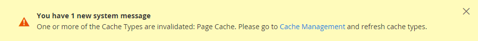

# 存储URL

Adobe Commerce或Magento Open Source安装中的每个网站都有一个分配给店面的基本URL，以及一个分配给管理员的URL。 Adobe使用变量来定义与基本URL相关的内部链接，这样可以将整个存储从一个位置移动到另一个位置，而无需更新链接。 标准基本URL以`http`开头，安全基本URL以`https`开头。

- **基本URL** — `http://www.yourdomain.com/magento/`
- **安全基础URL** — `https://www.yourdomain.com/magento/`
- IP地址为&#x200B;**的** URL — `http://###.###.###.###/magento/`或`https://###.###.###.###/magento/`

>[!IMPORTANT]
>
>请勿更改管理员URL的默认基本URL配置。 若要更改管理员URL或路径，请参阅[使用自定义管理员URL](#use-a-custom-admin-url)。

## 使用安全协议

商店的基本URL最初是在Adobe Commerce安装期间设置的。 如果当时有安全证书可用，则可以指定要用于存储、管理员或两者的`HTTPS`个URL。 如果您的Adobe Commerce安装包含多个商店，或者您计划稍后添加更多商店，则可以在URL中包含商店代码。 所有Adobe资源和操作都可以通过安全协议使用。

如果在安装时安全证书不可用于域，请确保在启动存储之前更新配置。 在为域建立安全证书后，您可以将基本URL配置为使用加密的安全套接字层(SSL)和[传输层安全性](https://en.wikipedia.org/wiki/Transport_Layer_Security) (TLS)协议来操作，或者同时配置这两个基本的URL。

>[!IMPORTANT]
>
>Adobe强烈建议使用安全协议传输生产站点的所有页面，包括内容和产品页面。

默认情况下，Adobe Commerce和Magento Open Source可配置为交付超过`HTTPS`的所有页面。 如果您的存储已使用标准协议运行，则可以通过启用[HTTP Strict Transport Security](https://en.wikipedia.org/wiki/HTTP_Strict_Transport_Security) (HSTS)并升级任何不安全的页面请求来提高安全性。 HSTS是一种选择加入协议，它阻止浏览器呈现使用指定域的不安全协议传输的标准`HTTP`页面。 由于搜索引擎可能已使用标准`HTTP` URL对您存储区的每个页面编制索引，因此您可以配置Commerce以自动将任何不安全的页面请求升级到`HTTPS`，这样您就不会丢失任何流量。 当Commerce配置为对店面和管理员使用安全URL时，会显示两个额外的字段，允许您启用`HSTS`。

## 配置基本URL

1. 在&#x200B;_管理员_&#x200B;侧边栏上，转到&#x200B;**[!UICONTROL Stores]** > _[!UICONTROL Settings]_>**[!UICONTROL Configuration]**。

1. 在左侧面板中的&#x200B;_常规_&#x200B;下，选择&#x200B;**[!UICONTROL Web]**。

1. 展开扩展选择器&#x200B;**[!UICONTROL Base URL]**。

   - **[!UICONTROL Base URL]** — 输入存储区的完全限定的基本URL。 请确保以正斜杠结束URL，以便可以使用存储中的其他URL密钥进行扩展。 例如： `http://yourdomain.com/`

     >[!NOTE]
     >
     >请勿更改&#x200B;_[!UICONTROL Base Link URL]_&#x200B;字段中的占位符。 它是用于创建基本URL的相对链接的占位符。

   - **[!UICONTROL Base URL for Static View Files]** — （可选）通过输入以下占位符开头的路径，为静态视图文件的基本URL指定备用位置：

     \{\{unsecure_base_url}}

   - **[!UICONTROL Base URL for User Media Files]** — （可选）通过输入以下占位符开头的路径，为用户媒体文件的基本URL指定备用位置：

     \{\{unsecure_base_url}}

     对于典型安装，无需更新静态视图文件或媒体文件的路径，因为它们是相对于基本URL的。

   {width="600" zoomable="yes"}

   >[!NOTE]
   >
   >用双大括号括起来的占位符是变量的标记标记。

1. 完成后，单击&#x200B;**[!UICONTROL Save Config]**。

## 配置安全基本URL

如果您的域具有有效的安全证书，则可以配置店面和管理员的URL以通过安全(https)渠道传输数据。 如果没有有效的安全证书，您的存储将无法使用安全(SSL/TLS)协议运行。

1. 展开 _[!UICONTROL Base URLs (Secure]_&#x200B;部分并执行以下操作：

   {width="600" zoomable="yes"}

   - **[!UICONTROL Secure Base URL]** — 输入完整的安全基础URL，后跟正斜杠。 例如： `https://yourdomain.com/`

   - **[!UICONTROL Secure Base Link URL]** — 请勿更改安全基础链接URL字段中的占位符。 它用于创建指向安全基础URL的相对链接。

   - **[!UICONTROL Secure Base URL for Static View Files]** — （可选）通过输入以下占位符开头的路径，为静态视图文件的安全基本URL指定备用位置：

     \{\{secure_base_url}}

   - **[!UICONTROL Secure Base URL for User Media Files]** — （可选）通过输入以下占位符开头的路径，为用户媒体文件的安全基本URL指定替代位置：

     \{\{secure_base_url}}

1. 要增强安全性，请将以下两个选项设置为`Yes`。

   - **[!UICONTROL Use Secure URLs on Storefront]**
   - **[!UICONTROL Use Secure URLs in Admin]**

1. 对于&#x200B;_[!UICONTROL Enhanced Security Settings]_，执行以下操作：

   - **[!UICONTROL Enable HTTP Strict Transport Security (HSTS)]** — 如果您希望商店仅显示安全的HTTPS页面请求，请设置为`Yes`。

   - **[!UICONTROL Upgrade Insecure Requests]** — 要将任何对标准无安全HTTP页面的请求升级为安全HTTPS，请设置为`Yes`。

1. 为您的服务器设置&#x200B;**[!UICONTROL Offloader Header]**。

   大多数Commerce安装都使用默认`X-Forward-Proto`将协议标识为`HTTP`或`HTTPS`。 如果您的服务器配置使用不同的offloader_header，请在此处输入它。

1. 完成后，单击&#x200B;**[!UICONTROL Save Config]**。

## 在URL中包含商店代码

>[!NOTE]
>
>当&#x200B;_将存储代码添加到URL_&#x200B;选项设置为`Yes`时，必须在浏览器URL中包含存储代码。 此设置可确保URL重写正确映射，并成功打开所有页面，且没有&#x200B;_“404页面未找到”_&#x200B;错误。

1. 在&#x200B;_管理员_&#x200B;侧边栏上，转到&#x200B;**[!UICONTROL Stores]** > _[!UICONTROL Settings]_>**[!UICONTROL Configuration]**。

1. 在左侧面板的&#x200B;_[!UICONTROL General]_&#x200B;下，选择&#x200B;**[!UICONTROL Web]**。

1. 展开扩展选择器&#x200B;**[!UICONTROL URL Options]**。

1. 将&#x200B;**[!UICONTROL Add Store Code]**&#x200B;设置为您的首选项：

   - **[!UICONTROL URL with Store Code]**： `http://www.yourdomain.com/magento/[store-code]/index.php/url-identifier`
   - **[!UICONTROL URL without Store Code]**： `http://www.yourdomain.com/magento/index.php/url-identifier`

   {width="600" zoomable="yes"}

1. 完成后，单击&#x200B;**[!UICONTROL Save Config]**。

1. 单击工作区顶部消息中的&#x200B;**[!UICONTROL Cache Management]**&#x200B;链接。 然后，按照说明刷新缓存。

   

## URL疑难解答

如果按照配置说明操作后，某些页面继续使用不安全的URL (`http://`)提供服务，请执行以下操作：

- 将（不安全）基本URL更改为安全HTTPS URL。
- 在服务器上，编辑`.htaccess`文件（或负载平衡器），以便将不安全URL重定向到安全URL。

## 使用自定义管理员URL

作为[安全最佳实践](https://experienceleague.adobe.com/docs/commerce-operations/implementation-playbook/best-practices/launch/security-best-practices.html?lang=zh-Hans)，Adobe建议您使用唯一的管理员URL，而不是默认的&#x200B;_管理员_&#x200B;或常用术语，如&#x200B;_后端_。 尽管它不会直接保护您的网站免受确定性错误行为者的攻击，但它可以减小试图获得未经授权访问的脚本的暴露程度。

>[!NOTE]
>
>在实施自定义管理员URL之前，请咨询您的托管提供商。 某些托管提供程序需要标准URL才能符合防火墙保护规则。

在典型安装中，管理员URL和路径紧跟在基本URL之后。 管理路径是根目录下的一个目录。

- **默认基本URL**： `http://yourdomain.com/magento/`
- **默认管理路径**： `admin`
- **默认管理员URL和路径**： `http://yourdomain.com/magento/admin`

尽管可以将管理员URL和路径更改为其他位置，但任何错误都会删除对管理员的访问权限，必须从服务器进行更正。

>[!NOTE]
>
>作为预防措施，除非您知道如何编辑服务器上的配置文件，否则请不要尝试自己更改管理员URL。 对于在云基础架构上部署的Adobe CommerceAdobe Commerce项目，请按照[Cloud Infrastructure指南](https://experienceleague.adobe.com/docs/commerce-cloud-service/user-guide/configure/env/stage/variables-admin.html?lang=zh-Hans#admin-url)中的&#x200B;*说明*&#x200B;更改管理员URL。

### 方法1：从管理员更改

1. 在&#x200B;_管理员_&#x200B;侧边栏上，转到&#x200B;**[!UICONTROL Stores]** > _[!UICONTROL Settings]_>**[!UICONTROL Configuration]**。

1. 在左侧面板中，展开&#x200B;**[!UICONTROL Advanced]**&#x200B;并选择&#x200B;**[!UICONTROL Admin]**。

1. 展开扩展选择器&#x200B;**[!UICONTROL Admin Base URL]**。

1. 为自定义URL设置配置选项：

   {width="600" zoomable="yes"}

   如果需要，请清除&#x200B;**[!UICONTROL Use system value]**&#x200B;复选框以更改设置。

   - 将&#x200B;**[!UICONTROL Use Custom Admin URL]**&#x200B;设置为`Yes`。

   - 输入&#x200B;**[!UICONTROL Custom Admin URL]**： `http://yourdomain.com/magento/`

     >[!NOTE]
     >
     >管理员URL必须位于同一Commerce安装中，并且与店面具有相同的文档根。

   - 将&#x200B;**[!UICONTROL Custom Admin Path]**&#x200B;设置为`Yes`。

   - 对于&#x200B;**[!UICONTROL Custom Admin Path]**，输入要用作自定义管理文件夹名称的路径。

     示例： `sample_custom_admin`

1. 完成后，单击&#x200B;**[!UICONTROL Save Config]**。

1. 保存更改后，注销管理员并使用新的管理员URL和路径重新登录。

### 方法2：从服务器命令行更改管理路径

1. 在文本编辑器中打开`app/etc/env.php`文件，并更改`frontName`节的`backend`参数的值。 然后，保存文件。

   确保仅使用小写字符。

   >[!NOTE]
   >
   >   此方法允许您更改管理员路径，但不能更改管理员URL。

   >[!TIP]
   >
   >对于云基础架构上的Adobe Commerce，您可以使用Cloud UI中的`ADMIN_URL`变量设置自定义管理路径。 请参阅《云基础架构上的Commerce指南》[中的](https://experienceleague.adobe.com/docs/commerce-cloud-service/user-guide/configure/env/stage/variables-admin.html?lang=zh-Hans)管理员变量主题&#x200B;__。

   - **默认管理路径**

     ```php?start_inline=1
     'backend' => [
      'frontName' => 'admin'
     ],
     ```

   - **新管理员路径**

     ```php?start_inline=1
     'backend' => [
         'frontName' => 'backend'
     ],
     ```

1. 使用以下方法之一清除缓存：

   - 在&#x200B;_管理员_&#x200B;侧边栏上，转到&#x200B;**[!UICONTROL System]** > _[!UICONTROL Tools]_>**[!UICONTROL Cache Management]**。 然后，单击&#x200B;**[!UICONTROL Flush Magento Cache]**。
   - 在服务器上，执行以下命令：

     ```bash
     php bin/magento cache:flush
     ```

   >[!NOTE]
   >
   >使用方法1所做的更改优先于`app/etc/env.php`文件中的更改。

### 方法3：使用Commerce CLI更改管理员路径

您可以使用CLI `setup:config:set`命令更改管理路径。 以下示例使用`--backend-frontname`选项将路径从Commerce根更改为新的管理员路径：

```bash
bin/magento setup:config:set --backend-frontname="backend_front_name"
```

此命令更新`backend`文件中的`frontName` > `app/etc/env.php`配置选项。

## 恢复默认的管理员URL和管理员路径

如果您设置了无效的管理员URL或管理员路径并且无法访问后端，可以通过命令行修复它。

1. 要还原到默认的管理URL，请执行以下命令：

   ```bash
   php bin/magento config:set admin/url/use_custom 0
   ```

1. 要还原到默认管理路径（在`app/etc/env.php`中设置，如方法2中所述），请执行此命令：

   ```bash
   php bin/magento config:set admin/url/use_custom_path 0
   ```

1. 使用以下方法之一清除缓存：

   - 在&#x200B;_管理员_&#x200B;侧边栏上，转到&#x200B;**[!UICONTROL System]** > _[!UICONTROL Tools]_>**[!UICONTROL Cache Management]**。 然后，单击&#x200B;**[!UICONTROL Flush Magento Cache]**。
   - 在服务器上，执行以下命令：

     ```bash
     php bin/magento cache:flush
     ```
