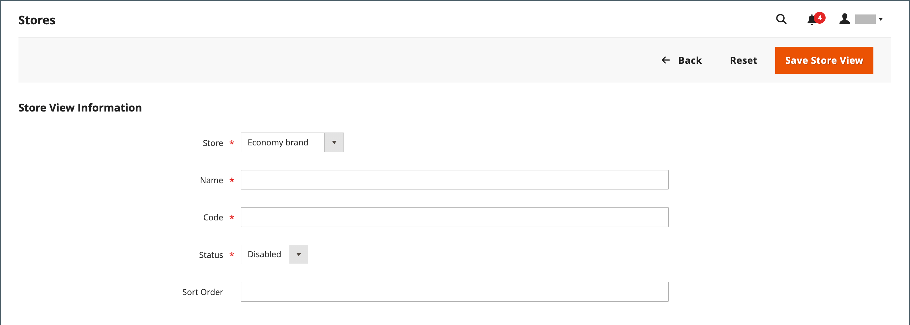

# 商店视图

商店视图通常用于使商店在不同的区域设置中可用。 购物者可以使用商店标题中的语言选择器来更改商店视图。

{width="550"}

## 添加商店视图

1. 在&#x200B;_管理员_&#x200B;侧边栏上，转到&#x200B;**[!UICONTROL Stores]** > _[!UICONTROL Settings]_>**[!UICONTROL All Stores]**。

   {width="700" zoomable="yes"}

1. 单击&#x200B;**[!UICONTROL Create Store View]**。

   {width="600" zoomable="yes"}

1. 将&#x200B;**[!UICONTROL Store]**&#x200B;设置为此视图的父存储。

1. 输入此商店视图的&#x200B;**[!UICONTROL Name]**。

   该名称显示在商店标题的语言选择器中。 例如： `Spanish`。

1. 对于&#x200B;**[!UICONTROL Code]**，输入用于标识视图的代码（小写字符）。

   例如： `spanish`。

1. 要激活视图，请将&#x200B;**[!UICONTROL Status]**&#x200B;设置为`Enabled`。

1. （可选）输入&#x200B;**[!UICONTROL Sort Order]**&#x200B;数字以确定此视图与其他视图一起列出的顺序。

1. 单击&#x200B;**[!UICONTROL Save Store View]**。

## 编辑商店视图

由于视图名称显示在语言选择器中，因此您最终可能希望将默认视图的名称更改为更具描述性的名称。 _Name_&#x200B;字段只是标签，可以轻松更改。

如果您的Adobe Commerce或Magento Open Source安装具有多站点或多存储设置，则请勿更改存储代码字段，除非验证该值未在`index.php`文件中引用。 如果您无权访问服务器来检查文件，请向开发人员寻求帮助。

| 字段 | 原始值 | 已更新值 |
| ----- | -------------- | ------------- |
| [!UICONTROL Name] | `Default Store View` | `English` |
| [!UICONTROL Code] | `default` | `english` |

{style="table-layout:auto"}

1. 在&#x200B;_管理员_&#x200B;侧边栏上，转到&#x200B;**[!UICONTROL Stores]** > _[!UICONTROL Settings]_>**[!UICONTROL All Stores]**。

1. 在网格的&#x200B;_[!UICONTROL Store View]_列中，单击要编辑的视图的名称。

   编辑默认视图时，_[!UICONTROL Store]_和_[!UICONTROL Status]_&#x200B;字段不可用。

   {width="600" zoomable="yes"}

1. 根据需要更新以下字段：

   - **[!UICONTROL Store]** （仅限非默认视图）
   - **[!UICONTROL Name]**
   - **[!UICONTROL Code]** （仅当未在`index.php`中使用时）
   - **[!UICONTROL Status]** （仅限非默认视图）
   - **[!UICONTROL Sort Order]**

1. 单击&#x200B;**[!UICONTROL Save Store View]**。
