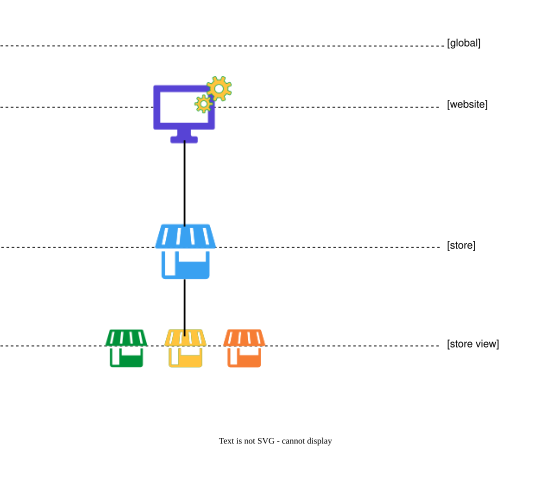
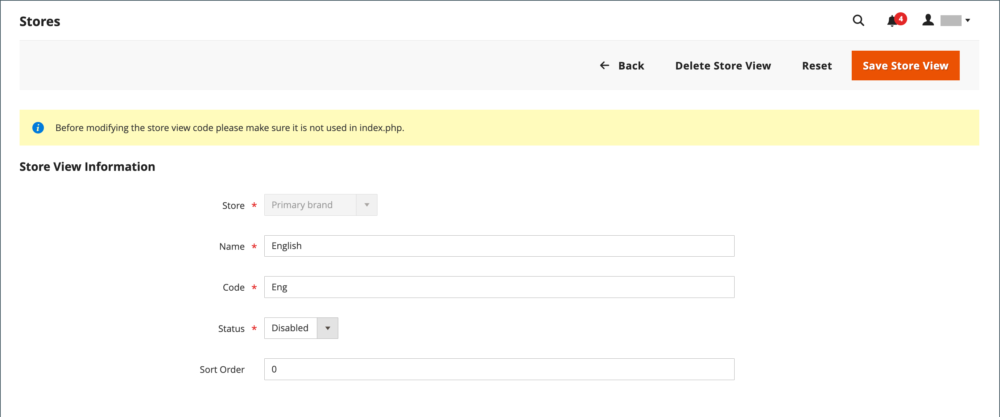

# 商店视图

商店视图通常用于使商店在不同的区域设置中可用。 购物者可以使用商店标题中的语言选择器来更改商店视图。

{width="550"}

## [!DNL Adobe Commerce Optimizer]同步状态 {#optimizer-sync-status}

如果已为网站或商店视图安装和启用[!DNL Adobe Commerce Optimizer Connector]，则[!UICONTROL All Stores]网格将显示同步状态指示器。 如果已安装[!DNL Adobe Commerce Optimizer Connector for B2B]，则还会同步可用B2B共享目录的数据。 请参阅[管理目录视图](../b2b/catalog-views-manage.md)。

| 列 | 指示器 | 描述 |
| ----- | ----- | ----- |
| [!UICONTROL Web Site] | [!UICONTROL Price sync enabled for Commerce Optimizer] | 此网站的价格和价格手册已同步到[!DNL Adobe Commerce Optimizer]。 |
| [!UICONTROL Store View] | [!UICONTROL Product sync enabled for Commerce Optimizer] | 此商店视图的产品和属性已同步到[!DNL Adobe Commerce Optimizer]。 |

{width="700" zoomable="yes"}

要启用或禁用同步，请在您[创建网站](stores.md#step-1-create-a-website)或[添加商店视图](#add-a-store-view)或更新现有网站或商店视图时编辑&#x200B;**[!UICONTROL Adobe Commerce Optimizer exporter settings]**。

## 添加商店视图

1. 在&#x200B;_管理员_&#x200B;侧边栏上，转到&#x200B;**[!UICONTROL Stores]** > _[!UICONTROL Settings]_>**[!UICONTROL All Stores]**。

   {width="700" zoomable="yes"}

1. 单击&#x200B;**[!UICONTROL Create Store View]**。

   {width="600" zoomable="yes"}

1. 将&#x200B;**[!UICONTROL Store]**&#x200B;设置为此视图的父存储。

1. 输入此商店视图的&#x200B;**[!UICONTROL Name]**。

   该名称显示在商店标题的语言选择器中。 例如： `Spanish`。

1. 对于&#x200B;**[!UICONTROL Code]**，输入用于标识视图的代码（小写字符）。

   例如： `spanish`。

1. 要激活视图，请将&#x200B;**[!UICONTROL Status]**&#x200B;设置为`Enabled`。

1. （可选）输入&#x200B;**[!UICONTROL Sort Order]**&#x200B;数字以确定此视图与其他视图一起列出的顺序。

1. （可选）如果已安装[!DNL Adobe Commerce Optimizer Connector]，请在&#x200B;**[!UICONTROL Adobe Commerce Optimizer exporter settings]**&#x200B;部分中选择&#x200B;**[!UICONTROL Sync products and attributes]**&#x200B;以将此商店视图的产品和属性同步到[!DNL Adobe Commerce Optimizer]。 如果还安装了[!DNL Adobe Commerce Optimizer Connector for B2B]，则此设置还会将B2B共享目录数据同步到[!DNL Adobe Commerce Optimizer]。 请参阅[管理目录视图](../b2b/catalog-views-manage.md)。

   {width="600" zoomable="yes"}

   在初始同步后更改此设置将触发完全重新索引。 请参阅&#x200B;*Commerce连接器指南*&#x200B;中的[自定义Adobe Commerce Optimizer范围导出配置](https://experienceleague.adobe.com/en/docs/commerce/aco-optimizer-connector/get-started#customize-the-commerce-scopes-export-configuration)。

1. 单击&#x200B;**[!UICONTROL Save Store View]**。

## 编辑商店视图

由于视图名称显示在语言选择器中，因此您最终可能希望将默认视图的名称更改为更具描述性的名称。 _Name_&#x200B;字段只是标签，可以轻松更改。

如果您的Adobe Commerce或Magento Open Source安装具有多站点或多存储设置，则在未验证`index.php`文件中是否未引用该值之前，请勿更改存储代码字段。 如果您无权访问服务器来检查文件，请向开发人员寻求帮助。

| 字段 | 原始值 | 已更新值 |
| ----- | -------------- | ------------- |
| [!UICONTROL Name] | `Default Store View` | `English` |
| [!UICONTROL Code] | `default` | `english` |

{style="table-layout:auto"}

1. 在&#x200B;_管理员_&#x200B;侧边栏上，转到&#x200B;**[!UICONTROL Stores]** > _[!UICONTROL Settings]_>**[!UICONTROL All Stores]**。

1. 在网格的&#x200B;_[!UICONTROL Store View]_列中，单击要编辑的视图的名称。

   编辑默认视图时，_[!UICONTROL Store]_和_[!UICONTROL Status]_&#x200B;字段不可用。

   {width="600" zoomable="yes"}

1. 根据需要更新以下字段：

   - **[!UICONTROL Store]** （仅限非默认视图）
   - **[!UICONTROL Name]**
   - **[!UICONTROL Code]** （仅当未在`index.php`中使用时）
   - **[!UICONTROL Status]** （仅限非默认视图）
   - **[!UICONTROL Sort Order]**
   - **[!UICONTROL Sync products and attributes]** （仅当安装了[!DNL Adobe Commerce Optimizer Connector]时）

   {width="600" zoomable="yes"}

1. 单击&#x200B;**[!UICONTROL Save Store View]**。
