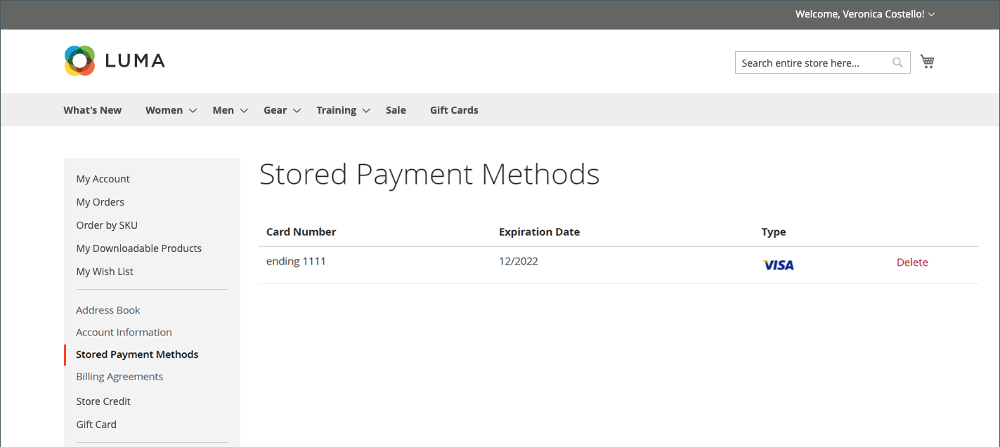

# 存储的支付方式

有权访问安全保险库以存储付款信息的客户无需每次都输入信用卡信息即可快速完成结账。 如果启用了[即时购买](checkout-instant-purchase.md)，则客户可以绕过两步结帐流程并从产品页面下订单。

需要支持安全保管库的付款方法，如[Braintree](braintree.md)。 当在支付方式配置中启用安全电子仓库时，客户可以选择在结账期间将其信用卡信息保存为存储的支付方式。 客户可以从其帐户信息板管理存储的支付方式。

{width="700" zoomable="yes"}

## 在结账时添加存储的付款方法

1. 从店面，客户进入产品的详细页面。

1. 将产品添加到购物车。

1. 进入结账页面。

1. 完成&#x200B;_送货_&#x200B;步骤。

1. 选择&#x200B;**[!UICONTROL Braintree Credit Card]**&#x200B;付款方式。

1. 填写信用卡数据。

1. 选中&#x200B;**[!UICONTROL Save for later use]**&#x200B;复选框。

1. 单击&#x200B;**[!UICONTROL Place Order]**。

然后，已保存的付款方法将显示在客户仪表板的&#x200B;_[!UICONTROL Stored Payment Methods]_&#x200B;选项卡中。

## 删除存储的支付方式

客户无法编辑任何以前添加的已存储支付方式，只能将其删除。 此操作无法撤消。

1. 在其帐户的侧边栏中，客户选择&#x200B;**[!UICONTROL Stored Payment Methods]**。

1. 查找要删除的付款方式条目。

1. 单击&#x200B;**[!UICONTROL Delete]**。

1. 要确认操作，请单击&#x200B;**[!UICONTROL OK]**。
