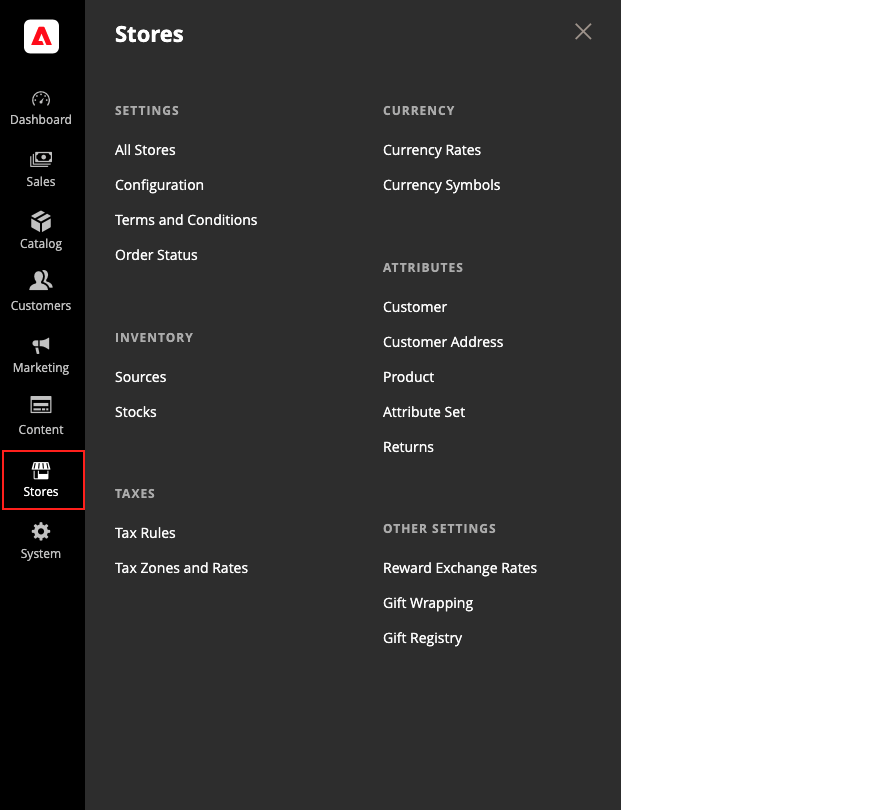

# [!UICONTROL Stores]菜单

通过&#x200B;_[!UICONTROL Stores]_&#x200B;菜单，您可以访问不太常使用，但在Adobe Commerce或Magento Open Source安装过程中被引用的设置。 这些功能包括设置商店层次结构、配置、销售和订单设置、税和货币、产品属性、产品审核评级以及客户组。

>[!BEGINTABS]

>[!TAB Adobe Commerce]

仅[!BADGE PaaS]{type=Informative url="https://experienceleague.adobe.com/zh-hans/docs/commerce/user-guides/product-solutions" tooltip="仅适用于云项目(Adobe管理的PaaS基础架构)和内部部署项目上的Adobe Commerce 。"}

{width="500" zoomable="yes"}

>[!TAB Adobe Commerce as a Cloud Service]

仅[!BADGE SaaS]{type=Positive url="https://experienceleague.adobe.com/zh-hans/docs/commerce/user-guides/product-solutions" tooltip="仅适用于Adobe Commerce as a Cloud Service和Adobe Commerce Optimizer项目(Adobe管理的SaaS基础架构)。"}

{width="500" zoomable="yes"}

>[!ENDTABS]

## 显示[!UICONTROL Stores]菜单

在&#x200B;_管理员_&#x200B;侧边栏上，单击&#x200B;**[!UICONTROL Stores]**。

## 主要部分

### [!UICONTROL Settings]

在Adobe Commerce或Magento Open Source安装中管理[网站、商店和商店视图](stores.md#store-and-site-structure)的层次结构，以及所有[配置设置](../configuration-reference/guide-overview.md)。 此外，您还可以设置销售的[条款和条件](terms-and-conditions.md)，并管理[订单状态设置](order-status.md#custom-order-status)。

### [!UICONTROL Inventory]

[管理和创建库存](../inventory-management/introduction.md)以将您的销售渠道或网站链接到[来源](../inventory-management/sources-manage.md)。 库存提供汇总的可销售产品数量。 单个Source商户使用默认股票，而多Source商户使用其他自定义股票。

### [!UICONTROL Taxes]

管理您商店中所有类型的[税务功能](taxes.md)，设置商店的税则，定义客户和产品税分类，以及管理税区和税率。 您也可以将税率数据导入您的商店。

### [!UICONTROL Currency]

管理在您的商店中接受作为付款的[货币](currency.md)的汇率，并自定义出现在产品价格和销售文档中的货币符号。

### [!UICONTROL Attributes]

管理用于[客户](../customers/attribute-properties.md)或[产品信息](../catalog/attribute-product-create.md)、退货和产品分级的属性。 您可以创建属性、编辑现有属性和管理[属性集](../catalog/attribute-sets.md)。

### [!UICONTROL Other Settings]

管理[奖励汇率](../merchandising-promotions/reward-exchange-rates.md)、[礼品包装](cart-configuration.md#gift-wrap)和[礼品注册表](../merchandising-promotions/gift-registries.md)的其他设置。
