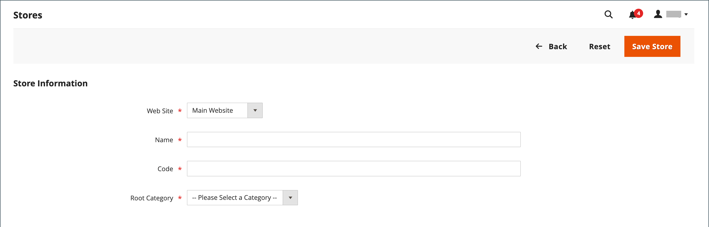

# 存储和站点结构

安装Adobe Commerce或Magento Open Source后，将创建包含主网站、商店和商店视图的层次结构。 您可以根据需要创建其他网站、商店和商店视图。 例如，除了您的主网站之外，您还可能有其他网站具有不同的域。 在每个网站中，您可以拥有多个商店，并在每个商店中，查看不同的商店。 许多安装都有一个网站和一个商店，但提供了多个商店视图来支持不同的语言。

在开始之前，请提前规划您的商店目录层次结构，因为它会在整个配置中引用。 每个商店可以有单独的[根类别](../catalog/category-root.md)，这样每个商店就可以有完全不同的主菜单选项集。

{width="550"}

## 添加商店

Adobe Commerce或Magento Open Source的单次安装可以有多个共享管理员的存储区。 位于同一网站下的商店具有相同的IP地址和域，使用相同的安全证书，并共享单个结账过程。

要了解的重要事项是，这些商店使用相同的代码并共享管理员。 每个商店可以有一个单独的目录，或者商店可以共享一个目录。 每个商店可以有单独的[根类别](../catalog/category-root.md)，这样每个商店就可以有不同的主菜单。 商店也可以有不同的品牌、展示和内容。 在开始之前，请花一些时间来规划您的商店层次结构，以考虑未来的增长，因为它会在整个配置中使用。

{width="550"}

以下是如何为多个存储配置URL的一些示例：

| URL | 描述 |
| --- | ----------- |
| `yourdomain.com/store1` `yourdomain.com/store2` | 每个商店都有不同的路径，但共享一个域。 |
| `store1.yourdomain.com` `store2.yourdomain.com` | 每个存储区都具有主域的不同子域。 |

必须从管理员和服务器的命令行配置Adobe Commerce的多存储安装。 Adobe Commerce [配置指南](https://experienceleague.adobe.com/docs/commerce-operations/configuration-guide/multi-sites/ms-overview.html)提供了有关配置服务器环境的详细说明。

### 步骤1：选择存储域

第一步是选择要如何放置存储。 这些商店应该共享域、各自具有子域，还是具有截然不同的域？ 对于每个商店，执行以下操作之一：

- 要将存储放在主域下的一个级别，您无需执行任何操作。
- 设置主域的子域。
- 设置其他主域。

### 第2步：创建存储

1. 在&#x200B;_管理员_&#x200B;侧边栏上，转到&#x200B;**[!UICONTROL Stores]** > _[!UICONTROL Settings]_>**[!UICONTROL All Stores]**。

1. 单击&#x200B;**[!UICONTROL Create Store]**&#x200B;并为新存储设置选项：

   - **[!UICONTROL Web Site]** — 选择要作为新商店父级的网站。 如果安装只有一个网站，请接受默认值(`Main Website`)。

   - **[!UICONTROL Name]** — 输入新存储的名称。 该名称仅供内部引用。

   - **[!UICONTROL Code]** — 输入小写字符代码以标识存储。 例如： `mainstore`。

   - **[!UICONTROL Root Category]** — 设置为定义新存储的主菜单的类别结构的[根类别](../catalog/category-root.md)。 如果已为存储创建了特定的根类别，请选择它。 否则，请选择`Default Category`。 您可以稍后返回并更新设置。

   {width="600" zoomable="yes"}

1. 单击&#x200B;**[!UICONTROL Save Store]**。

### 步骤3：创建默认存储视图

1. 单击&#x200B;**[!UICONTROL Create Store View]**&#x200B;并设置商店视图选项：

   - **[!UICONTROL Store]** — 设置为您创建的新存储。

   - **[!UICONTROL Name]** — 输入视图的名称。 例如，`English`。

   - **[!UICONTROL Code]** — 输入视图的代码（小写字符）。

   - **[!UICONTROL Status]** — 设置为`Enabled`。

   - **[!UICONTROL Sort Order]** — 输入一个数字，以确定与其他商店一起列出时商店的位置。

1. 单击&#x200B;**[!UICONTROL Save Store View]**。

   如果以编辑模式打开商店，则可以看到它现在具有默认视图。

   {width="600" zoomable="yes"}

### 步骤4：配置商店URL

1. 在&#x200B;_管理员_&#x200B;侧边栏中，单击&#x200B;**[!UICONTROL Stores]** > _[!UICONTROL Settings]_>**[!UICONTROL Configuration]**。

1. 在左侧面板中的&#x200B;_[!UICONTROL General]_&#x200B;下，选择&#x200B;**[!UICONTROL Web]**。

1. 在左上角，将&#x200B;**[!UICONTROL Store View]**&#x200B;设置为您为新商店创建的视图。

1. 提示确认[范围](../getting-started/websites-stores-views.md#scope-settings)切换时，单击&#x200B;**[!UICONTROL OK]**。

   {width="600" zoomable="yes"}

1. 展开&#x200B;**[!UICONTROL Base URLs]**&#x200B;部分的并输入商店的基本URL。

   如果需要，请清除&#x200B;**[!UICONTROL Use system value]**&#x200B;复选框以更改设置。

   {width="600" zoomable="yes"}

1. 展开 **[!UICONTROL Secure Base URLs]**&#x200B;部分，如果要配置存储[安全URL](store-urls.md)，请重复上一步。

1. 单击&#x200B;**[!UICONTROL Save Config]**。

### 步骤5：配置服务器

若要将服务器配置为支持多个网站，请参阅&#x200B;_配置指南_&#x200B;中的[多个网站或商店](https://experienceleague.adobe.com/docs/commerce-operations/configuration-guide/multi-sites/ms-overview.html)。

有关配置Web服务器的帮助，请参阅以下资源：

- [使用NGNX设置多个网站](https://experienceleague.adobe.com/docs/commerce-operations/configuration-guide/multi-sites/ms-nginx.html)
- [使用Apache设置多个网站](https://experienceleague.adobe.com/docs/commerce-operations/configuration-guide/multi-sites/ms-apache.html)

对于云基础架构上的Adobe Commerce，请参阅[设置多个网站或商店](https://experienceleague.adobe.com/docs/commerce-cloud-service/user-guide/configure-store/multiple-sites.html)。

## 添加网站

可以从单个Adobe Commerce或具有相同域或不同域的Magento Open Source安装设置多个网站。 默认情况下，位于同一网站下的商店具有相同的IP地址和域，使用相同的安全证书，并共享单个结账过程。 如果您希望每个存储在其自己的域下具有专用签出流程，则每个存储都必须具有不同的IP地址和单独的安全证书。

必须从管理员以及服务器的命令行中配置Adobe Commerce或Magento Open Source的多站点安装。 Commerce [配置指南](https://experienceleague.adobe.com/docs/commerce-operations/configuration-guide/multi-sites/ms-overview.html)提供了有关配置服务器环境的详细说明。

{width="550"}

### 步骤1：创建网站

1. 在&#x200B;_管理员_&#x200B;侧边栏上，转到&#x200B;**[!UICONTROL Stores]** > _[!UICONTROL Settings]_>**[!UICONTROL All Stores]**。

1. 单击右上角的&#x200B;**[!UICONTROL Create Website]**。

1. 设置&#x200B;**[!UICONTROL Web Site Information]**&#x200B;选项：

   {width="600" zoomable="yes"}

   - **[!UICONTROL Name]** — 输入新网站的域。 例如，`domain.com`。

   - **[!UICONTROL Code]** — 输入服务器上用于指向域的代码。

     代码必须以小写(a-z)字母开头，并且可以包含字母(a-z)、数字(0-9)和下划线(_)符号的任意组合。

   - **[!UICONTROL Sort Order]** — _（可选）_&#x200B;输入一个数字以确定此站点与其他站点一起列出的顺序。 要使此网站显示在列表顶部，请输入零(`0`)。

1. 单击&#x200B;**[!UICONTROL Save Web Site]**。

1. 设置新网站所需的每个[商店](#add-stores)和[商店视图](store-views.md)。

   然后，您可以在编辑模式下打开网站以设置默认商店。

### 步骤2：配置商店URL

要配置[存储URL](store-urls.md)，请按照说明操作。

### 步骤3：配置服务器

若要将服务器配置为支持多个网站，请参阅&#x200B;_配置指南_&#x200B;中的[多个网站或商店](https://experienceleague.adobe.com/docs/commerce-operations/configuration-guide/multi-sites/ms-overview.html)。

有关配置Web服务器的帮助，请参阅以下教程：

- [使用NGNX设置多个网站](https://experienceleague.adobe.com/docs/commerce-operations/configuration-guide/multi-sites/ms-nginx.html)
- [使用Apache设置多个网站](https://experienceleague.adobe.com/docs/commerce-operations/configuration-guide/multi-sites/ms-apache.html)

对于云基础架构上的Adobe Commerce，请参阅[设置多个网站或商店](https://experienceleague.adobe.com/docs/commerce-cloud-service/user-guide/configure-store/multiple-sites.html)。
